# Exam Topics Questions

@thatonecodes

## Exam SC-300 topic 1 question 1 discussion

Actual exam question from

Microsoft's
SC-300

Question #: 1
Topic #: 1

[All SC-300 Questions]

You have an Azure Active Directory (Azure AD) tenant that contains the following objects:✑ A device named Device1✑ Users named User1, User2, User3, User4, and User5✑ Groups named Group1, Group2, Group3, Group4, and Group5The groups are configured as shown in the following table.To which groups can you assign a Microsoft Office 365 Enterprise E5 license directly? 
Suggested Answer: B 🗳️ 

A. Group1 and Group4 only

B. Group1, Group2, Group3, Group4, and Group5

C. Group1 and Group2 only

D. Group1 only

E. Group1, Group2, Group4, and Group5 only

**Answer: B**

**Timestamp: May 2, 2021, 1:22 a.m.**

[View on ExamTopics](https://www.examtopics.com/discussions/microsoft/view/51472-exam-sc-300-topic-1-question-1-discussion/)

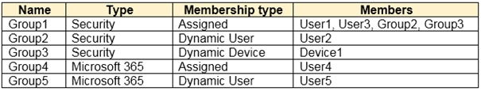

----------------------------------------

## Exam SC-300 topic 1 question 2 discussion

Actual exam question from

Microsoft's
SC-300

Question #: 2
Topic #: 1

[All SC-300 Questions]

You have a Microsoft Exchange organization that uses an SMTP address space of contoso.com.Several users use their contoso.com email address for self-service sign-up to Azure Active Directory (Azure AD).You gain global administrator privileges to the Azure AD tenant that contains the self-signed users.You need to prevent the users from creating user accounts in the contoso.com Azure AD tenant for self-service sign-up to Microsoft 365 services.Which PowerShell cmdlet should you run? 
Suggested Answer: A 🗳️ 

A. Set-MsolCompanySettings

B. Set-MsolDomainFederationSettings

C. Update-MsolfederatedDomain

D. Set-MsolDomain

**Answer: A**

**Timestamp: May 2, 2021, 11:37 p.m.**

[View on ExamTopics](https://www.examtopics.com/discussions/microsoft/view/51607-exam-sc-300-topic-1-question-2-discussion/)

----------------------------------------

## Exam SC-300 topic 1 question 3 discussion

Actual exam question from

Microsoft's
SC-300

Question #: 3
Topic #: 1

[All SC-300 Questions]

You have a Microsoft 365 tenant that uses the domain named fabrikam.com. The Guest invite settings for Azure Active Directory (Azure AD) are configured as shown in the exhibit. (Click the Exhibit tab.)A user named [email protected] shares a Microsoft SharePoint Online document library to the users shown in the following table.Which users will be emailed a passcode? 
Suggested Answer: A 🗳️ 

A. User2 only

B. User1 only

C. User1 and User2 only

D. User1, User2, and User3

**Answer: A**

**Timestamp: May 2, 2021, 11:40 p.m.**

[View on ExamTopics](https://www.examtopics.com/discussions/microsoft/view/51608-exam-sc-300-topic-1-question-3-discussion/)

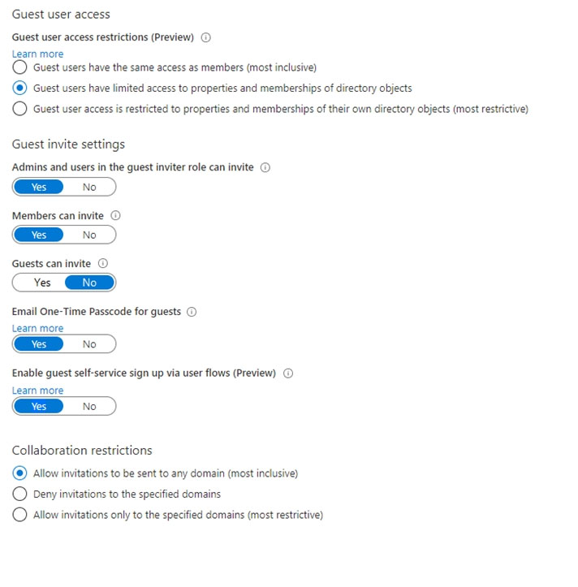
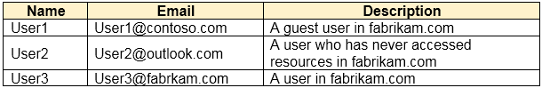

----------------------------------------

## Exam SC-300 topic 1 question 4 discussion

Actual exam question from

Microsoft's
SC-300

Question #: 4
Topic #: 1

[All SC-300 Questions]

You have 2,500 users who are assigned Microsoft Office 365 Enterprise E3 licenses. The licenses are assigned to individual users.From the Groups blade in the Azure Active Directory admin center, you assign Microsoft 365 Enterprise E5 licenses to the users.You need to remove the Office 365 Enterprise E3 licenses from the users by using the least amount of administrative effort.What should you use? 
Suggested Answer: C 🗳️ 

A. the Identity Governance blade in the Azure Active Directory admin center

B. the Set-AzureAdUser cmdlet

C. the Licenses blade in the Azure Active Directory admin center

D. the Set-WindowsProductKey cmdlet

**Answer: C**

**Timestamp: May 2, 2021, 11:47 p.m.**

[View on ExamTopics](https://www.examtopics.com/discussions/microsoft/view/51609-exam-sc-300-topic-1-question-4-discussion/)

----------------------------------------

## Exam SC-300 topic 1 question 5 discussion

Actual exam question from

Microsoft's
SC-300

Question #: 5
Topic #: 1

[All SC-300 Questions]

HOTSPOT -You have a Microsoft 365 tenant named contoso.com.Guest user access is enabled.Users are invited to collaborate with contoso.com as shown in the following table.From the External collaboration settings in the Azure Active Directory admin center, you configure the Collaboration restrictions settings as shown in the following exhibit.From a Microsoft SharePoint Online site, a user invites [email protected] to the site.For each of the following statements, select Yes if the statement is true. Otherwise, select No.NOTE: Each correct selection is worth one point.Hot Area: 
Suggested Answer: Box 1: Yes -Invitations can only be sent to outlook.com. Therefore, User1 can accept the invitation and access the application.Box 2. Yes -Invitations can only be sent to outlook.com. However, User2 has already received and accepted an invitation so User2 can access the application.Box 3. No -Invitations can only be sent to outlook.com. Therefore, User3 will not receive an invitation. 

**Answer: **

**Timestamp: May 2, 2021, 11:49 p.m.**

[View on ExamTopics](https://www.examtopics.com/discussions/microsoft/view/51610-exam-sc-300-topic-1-question-5-discussion/)

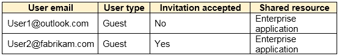
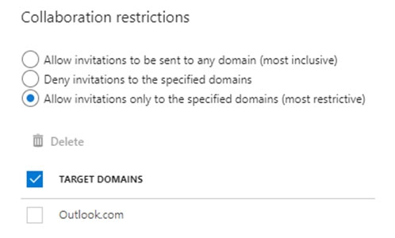
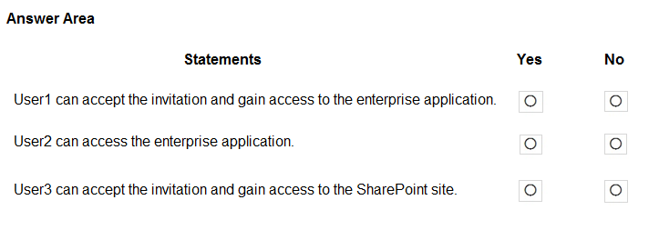
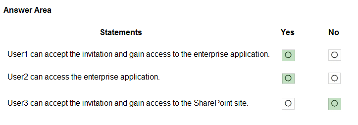

----------------------------------------

## Exam SC-300 topic 1 question 6 discussion

Actual exam question from

Microsoft's
SC-300

Question #: 6
Topic #: 1

[All SC-300 Questions]

You have an Azure Active Directory (Azure AD) tenant named contoso.com.You plan to bulk invite Azure AD business-to-business (B2B) collaboration users.Which two parameters must you include when you create the bulk invite? Each correct answer presents part of the solution.NOTE: Each correct selection is worth one point. 
Suggested Answer: AB 🗳️ 

A. email address

B. redirection URL

C. username

D. shared key

E. password

**Answer: A**

**Timestamp: May 1, 2021, 1:37 p.m.**

[View on ExamTopics](https://www.examtopics.com/discussions/microsoft/view/51395-exam-sc-300-topic-1-question-6-discussion/)

----------------------------------------

## Exam SC-300 topic 1 question 7 discussion

Actual exam question from

Microsoft's
SC-300

Question #: 7
Topic #: 1

[All SC-300 Questions]

You have an Azure Active Directory (Azure AD) tenant that contains the objects shown in the following table.Which objects can you add as members to Group3? 
Suggested Answer: E 🗳️ 

A. User2 and Group2 only

B. User2, Group1, and Group2 only

C. User1, User2, Group1 and Group2

D. User1 and User2 only

E. User2 only

**Answer: E**

**Timestamp: May 4, 2021, 1:05 p.m.**

[View on ExamTopics](https://www.examtopics.com/discussions/microsoft/view/51784-exam-sc-300-topic-1-question-7-discussion/)

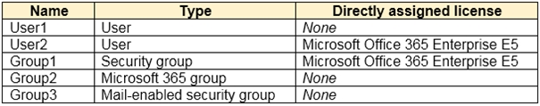

----------------------------------------

## Exam SC-300 topic 1 question 8 discussion

Actual exam question from

Microsoft's
SC-300

Question #: 8
Topic #: 1

[All SC-300 Questions]

DRAG DROP -You have an on-premises Microsoft Exchange organization that uses an SMTP address space of contoso.com.You discover that users use their email address for self-service sign-up to Microsoft 365 services.You need to gain global administrator privileges to the Azure Active Directory (Azure AD) tenant that contains the self-signed users.Which four actions should you perform in sequence? To answer, move the appropriate actions from the list of actions to the answer area and arrange them in the correct order.Select and Place: 
Suggested Answer: Reference:https://docs.microsoft.com/en-us/azure/active-directory/enterprise-users/domains-admin-takeover 

**Answer: **

**Timestamp: May 2, 2021, 11:57 p.m.**

[View on ExamTopics](https://www.examtopics.com/discussions/microsoft/view/51611-exam-sc-300-topic-1-question-8-discussion/)

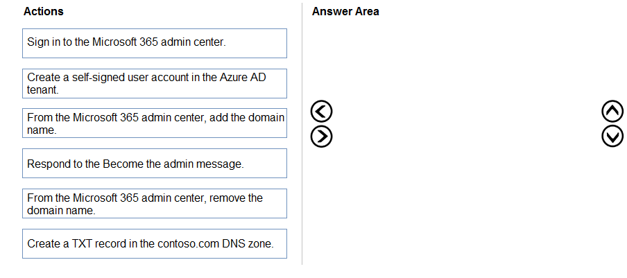
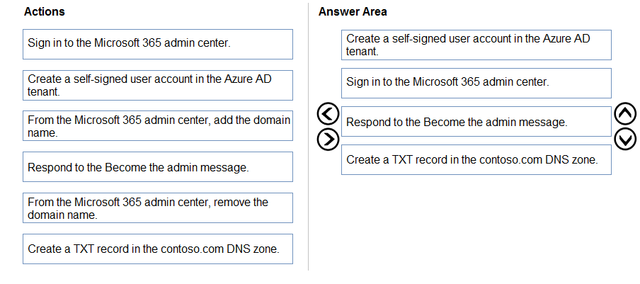

----------------------------------------

## Exam SC-300 topic 1 question 9 discussion

Actual exam question from

Microsoft's
SC-300

Question #: 9
Topic #: 1

[All SC-300 Questions]

HOTSPOT -You have an Azure Active Directory (Azure AD) tenant that contains a user named User1 and the groups shown in the following table.In the tenant, you create the groups shown in the following table.Which members can you add to GroupA and GroupB? To answer, select the appropriate options in the answer area.NOTE: Each correct selection is worth one point.Hot Area: 
Suggested Answer: Reference:https://bitsizedbytes.wordpress.com/2018/12/10/distribution-security-and-office-365-groups-nesting/ 

**Answer: **

**Timestamp: May 3, 2021, 5:15 p.m.**

[View on ExamTopics](https://www.examtopics.com/discussions/microsoft/view/51697-exam-sc-300-topic-1-question-9-discussion/)

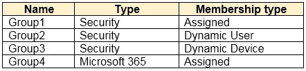

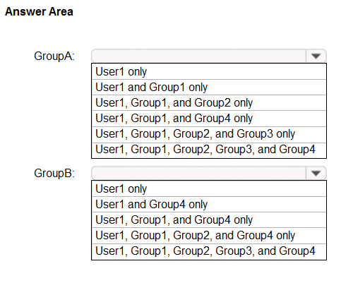
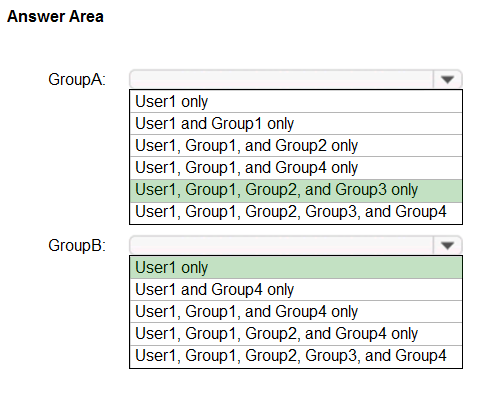

----------------------------------------

## Exam SC-300 topic 1 question 10 discussion

Actual exam question from

Microsoft's
SC-300

Question #: 10
Topic #: 1

[All SC-300 Questions]

Note: This question is part of a series of questions that present the same scenario. Each question in the series contains a unique solution that might meet the stated goals. Some question sets might have more than one correct solution, while others might not have a correct solution.After you answer a question in this section, you will NOT be able to return to it. As a result, these questions will not appear in the review screen.You have an Active Directory forest that syncs to an Azure Active Directory (Azure AD) tenant.You discover that when a user account is disabled in Active Directory, the disabled user can still authenticate to Azure AD for up to 30 minutes.You need to ensure that when a user account is disabled in Active Directory, the user account is immediately prevented from authenticating to Azure AD.Solution: You configure password writeback.Does this meet the goal? 
Suggested Answer: B 🗳️ 

A. Yes

B. No

**Answer: B**

**Timestamp: July 13, 2021, 8:32 p.m.**

[View on ExamTopics](https://www.examtopics.com/discussions/microsoft/view/57801-exam-sc-300-topic-1-question-10-discussion/)

----------------------------------------

## Exam SC-300 topic 1 question 11 discussion

Actual exam question from

Microsoft's
SC-300

Question #: 11
Topic #: 1

[All SC-300 Questions]

Note: This question is part of a series of questions that present the same scenario. Each question in the series contains a unique solution that might meet the stated goals. Some question sets might have more than one correct solution, while others might not have a correct solution.After you answer a question in this section, you will NOT be able to return to it. As a result, these questions will not appear in the review screen.You have an Active Directory forest that syncs to an Azure Active Directory (Azure AD) tenant.You discover that when a user account is disabled in Active Directory, the disabled user can still authenticate to Azure AD for up to 30 minutes.You need to ensure that when a user account is disabled in Active Directory, the user account is immediately prevented from authenticating to Azure AD.Solution: You configure pass-through authentication.Does this meet the goal? 
Suggested Answer: A 🗳️ 

A. Yes

B. No

**Answer: A**

**Timestamp: July 13, 2021, 8:36 p.m.**

[View on ExamTopics](https://www.examtopics.com/discussions/microsoft/view/57802-exam-sc-300-topic-1-question-11-discussion/)

----------------------------------------

## Exam SC-300 topic 1 question 12 discussion

Actual exam question from

Microsoft's
SC-300

Question #: 12
Topic #: 1

[All SC-300 Questions]

Note: This question is part of a series of questions that present the same scenario. Each question in the series contains a unique solution that might meet the stated goals. Some question sets might have more than one correct solution, while others might not have a correct solution.After you answer a question in this section, you will NOT be able to return to it. As a result, these questions will not appear in the review screen.You have an Azure Active Directory (Azure AD) tenant that syncs to an Active Directory forest.You discover that when a user account is disabled in Active Directory, the disabled user can still authenticate to Azure AD for up to 30 minutes.You need to ensure that when a user account is disabled in Active Directory, the user account is immediately prevented from authenticating to Azure AD.Solution: You configure conditional access policies.Does this meet the goal? 
Suggested Answer: B 🗳️ 

A. Yes

B. No

**Answer: B**

**Timestamp: May 16, 2021, 5:28 a.m.**

[View on ExamTopics](https://www.examtopics.com/discussions/microsoft/view/52843-exam-sc-300-topic-1-question-12-discussion/)

----------------------------------------

## Exam SC-300 topic 1 question 13 discussion

Actual exam question from

Microsoft's
SC-300

Question #: 13
Topic #: 1

[All SC-300 Questions]

You have an Azure Active Directory (Azure AD) tenant that contains the following objects.✑ A device named Device1✑ Users named User1, User2, User3, User4, and User5Five groups named Group1, Group2, Group3, Group4, and Group5The groups are configured as shown in the following table.How many licenses are used if you assign the Microsoft 365 Enterprise E5 license to Group1? 
Suggested Answer: B 🗳️ 

A. 0

B. 2

C. 3

D. 4

**Answer: B**

**Timestamp: June 2, 2021, 10:56 a.m.**

[View on ExamTopics](https://www.examtopics.com/discussions/microsoft/view/54199-exam-sc-300-topic-1-question-13-discussion/)

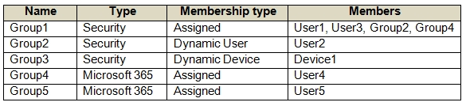

----------------------------------------

## Exam SC-300 topic 1 question 14 discussion

Actual exam question from

Microsoft's
SC-300

Question #: 14
Topic #: 1

[All SC-300 Questions]

You have an Azure Active Directory (Azure AD) tenant named contoso.com that contains an Azure AD enterprise application named App1.A contractor uses the credentials of [email protected].You need to ensure that you can provide the contractor with access to App1. The contractor must be able to authenticate as [email protected].What should you do? 
Suggested Answer: D 🗳️ 

A. Run the New-AzADUser cmdlet.

B. Configure the External collaboration settings.

C. Add a WS-Fed identity provider.

D. Create a guest user account in contoso.com.

**Answer: D**

**Timestamp: June 7, 2021, 12:03 p.m.**

[View on ExamTopics](https://www.examtopics.com/discussions/microsoft/view/54783-exam-sc-300-topic-1-question-14-discussion/)

----------------------------------------

## Exam SC-300 topic 1 question 15 discussion

Actual exam question from

Microsoft's
SC-300

Question #: 15
Topic #: 1

[All SC-300 Questions]

Your network contains an Active Directory forest named contoso.com that is linked to an Azure Active Directory (Azure AD) tenant named contoso.com by usingAzure AD Connect.You need to prevent the synchronization of users who have the extensionAttribute15 attribute set to NoSync.What should you do in Azure AD Connect? 
Suggested Answer: C 🗳️ 

A. Create an inbound synchronization rule for the Windows Azure Active Directory connector.

B. Configure a Full Import run profile.

C. Create an inbound synchronization rule for the Active Directory Domain Services connector.

D. Configure an Export run profile.

**Answer: C**

**Timestamp: June 9, 2021, 11:12 a.m.**

[View on ExamTopics](https://www.examtopics.com/discussions/microsoft/view/54958-exam-sc-300-topic-1-question-15-discussion/)

----------------------------------------

## Exam SC-300 topic 1 question 16 discussion

Actual exam question from

Microsoft's
SC-300

Question #: 16
Topic #: 1

[All SC-300 Questions]

Your network contains an on-premises Active Directory domain that syncs to an Azure Active Directory (Azure AD) tenant. The tenant contains the users shown in the following table.All the users work remotely.Azure AD Connect is configured in Azure AD as shown in the following exhibit.Connectivity from the on-premises domain to the internet is lost.Which users can sign in to Azure AD? 
Suggested Answer: A 🗳️ 

A. User1 and User3 only

B. User1 only

C. User1, User2, and User3

D. User1 and User2 only

**Answer: A**

**Timestamp: June 7, 2021, 12:10 p.m.**

[View on ExamTopics](https://www.examtopics.com/discussions/microsoft/view/54785-exam-sc-300-topic-1-question-16-discussion/)

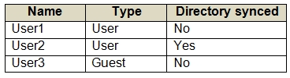
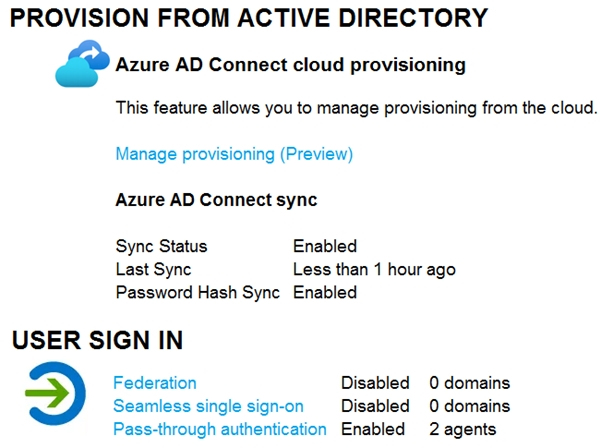

----------------------------------------

## Exam SC-300 topic 1 question 17 discussion

Actual exam question from

Microsoft's
SC-300

Question #: 17
Topic #: 1

[All SC-300 Questions]

Note: This question is part of a series of questions that present the same scenario. Each question in the series contains a unique solution that might meet the stated goals. Some question sets might have more than one correct solution, while others might not have a correct solution.After you answer a question in this section, you will NOT be able to return to it. As a result, these questions will not appear in the review screen.You have an Active Directory forest that syncs to an Azure Active Directory (Azure AD) tenant.You discover that when a user account is disabled in Active Directory, the disabled user can still authenticate to Azure AD for up to 30 minutes.You need to ensure that when a user account is disabled in Active Directory, the user account is immediately prevented from authenticating to Azure AD.Solution: You configure Azure AD Password Protection.Does this meet the goal? 
Suggested Answer: B 🗳️ 

A. Yes

B. No

**Answer: B**

**Timestamp: June 21, 2021, 10:55 p.m.**

[View on ExamTopics](https://www.examtopics.com/discussions/microsoft/view/55796-exam-sc-300-topic-1-question-17-discussion/)

----------------------------------------

## Exam SC-300 topic 1 question 18 discussion

Actual exam question from

Microsoft's
SC-300

Question #: 18
Topic #: 1

[All SC-300 Questions]

HOTSPOT -Your network contains an on-premises Active Directory domain named contoso.com. The domain contains the objects shown in the following table.You install Azure AD Connect. You configure the Domain and OU filtering settings as shown in the Domain and OU Filtering exhibit. (Click the Domain and OUFiltering tab.)You configure the Filter users and devices settings as shown in the Filter Users and Devices exhibit. (Click the Filter Users and Devices tab.)For each of the following statements, select Yes if the statement is true. Otherwise, select No.NOTE: Each correct selection is worth one point.Hot Area: 
Suggested Answer: Only direct members of Group1 are synced. Group2 will sync as it is a direct member of Group1 but the members of Group2 will not sync.Reference:https://docs.microsoft.com/en-us/azure/active-directory/hybrid/how-to-connect-install-custom 

**Answer: **

**Timestamp: Oct. 9, 2021, 4:08 a.m.**

[View on ExamTopics](https://www.examtopics.com/discussions/microsoft/view/63837-exam-sc-300-topic-1-question-18-discussion/)

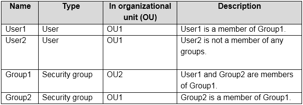
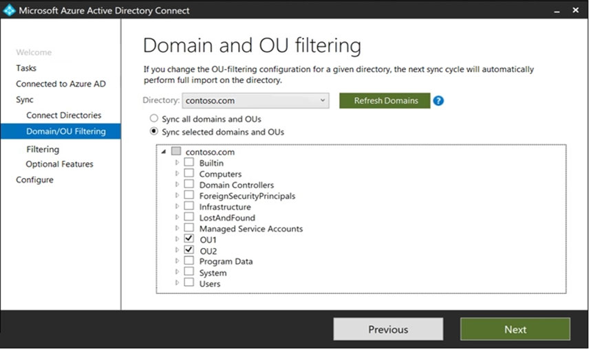
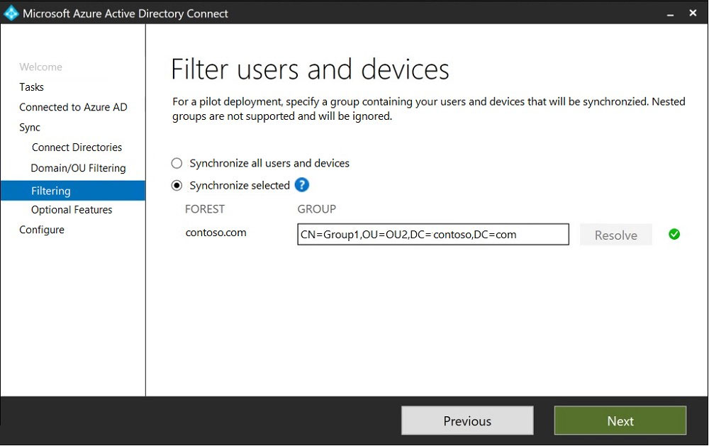
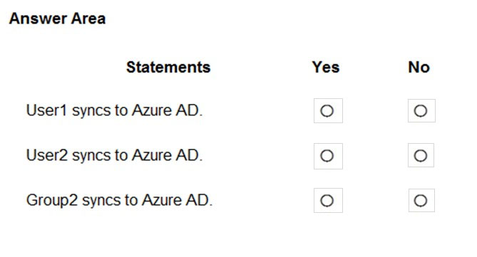
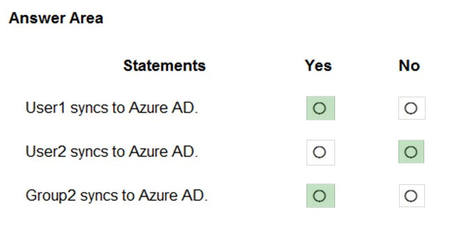

----------------------------------------

## Exam SC-300 topic 1 question 19 discussion

Actual exam question from

Microsoft's
SC-300

Question #: 19
Topic #: 1

[All SC-300 Questions]

You have an Azure Active Directory (Azure AD) tenant named contoso.com.You need to ensure that Azure AD External Identities pricing is based on monthly active users (MAU).What should you configure? 
Suggested Answer: C 🗳️ 

A. a user flow

B. the terms of use

C. a linked subscription

D. an access review

**Answer: C**

**Timestamp: Sept. 2, 2021, 7:35 p.m.**

[View on ExamTopics](https://www.examtopics.com/discussions/microsoft/view/61417-exam-sc-300-topic-1-question-19-discussion/)

----------------------------------------

## Exam SC-300 topic 1 question 20 discussion

Actual exam question from

Microsoft's
SC-300

Question #: 20
Topic #: 1

[All SC-300 Questions]

DRAG DROP -You have a new Microsoft 365 tenant that uses a domain name of contoso.onmicrosoft.com.You register the name contoso.com with a domain registrar.You need to use contoso.com as the default domain name for new Microsoft 365 users.Which four actions should you perform in sequence? To answer, move the appropriate actions from the list of actions to the answer area and arrange them in the correct order.Select and Place: 
Suggested Answer: Reference:https://practical365.com/configure-a-custom-domain-in-office-365/ 

**Answer: **

**Timestamp: Oct. 22, 2021, 7 p.m.**

[View on ExamTopics](https://www.examtopics.com/discussions/microsoft/view/64533-exam-sc-300-topic-1-question-20-discussion/)

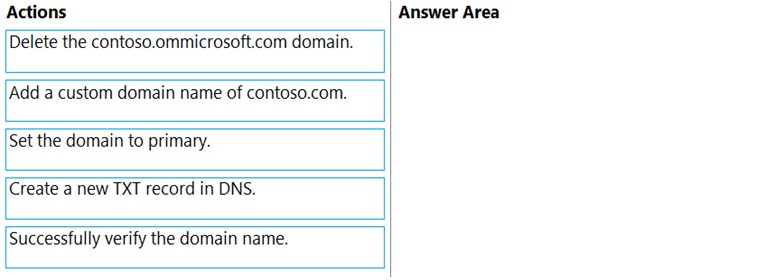
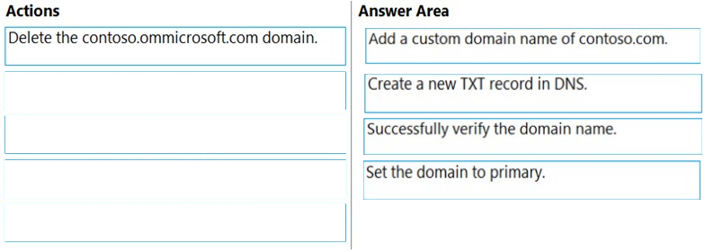

----------------------------------------

## Exam SC-300 topic 1 question 21 discussion

Actual exam question from

Microsoft's
SC-300

Question #: 21
Topic #: 1

[All SC-300 Questions]

You have a Microsoft 365 subscription.You need to ensure that when users access the Microsoft 365 portal from Microsoft Edge and have their browser language set to Spanish, they are presented with a Spanish sign-in form.What should you do in the Microsoft Entra admin center? 
Suggested Answer: C 🗳️ 

A. From Settings for the users, configure the Usage location setting.

B. From Global Secure Access, configure the Session management settings.

C. Configure the Company branding settings.

D. Create a Conditional Access policy.

**Answer: C**

**Timestamp: Dec. 28, 2024, 1:01 a.m.**

[View on ExamTopics](https://www.examtopics.com/discussions/microsoft/view/153528-exam-sc-300-topic-1-question-21-discussion/)

----------------------------------------

## Exam SC-300 topic 1 question 22 discussion

Actual exam question from

Microsoft's
SC-300

Question #: 22
Topic #: 1

[All SC-300 Questions]

DRAG DROP -You have a Microsoft 365 E5 subscription that contains three users named User1, User2, and User3.You need to configure the users as shown in the following table.Which portal should you use to configure each user? To answer, drag the appropriate portals to the correct users. Each portal may be used once, more than once, or not at all. You may need to drag the split bar between panes or scroll to view content.NOTE: Each correct selection is worth one point.Select and Place: 
Suggested Answer: 

**Answer: **

**Timestamp: April 21, 2022, 12:34 p.m.**

[View on ExamTopics](https://www.examtopics.com/discussions/microsoft/view/74007-exam-sc-300-topic-1-question-22-discussion/)

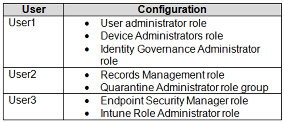
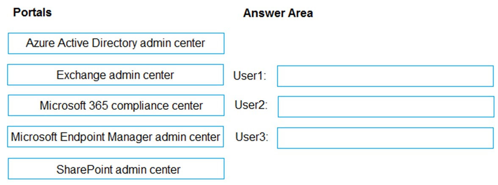
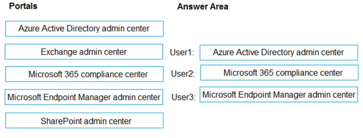

----------------------------------------

## Exam SC-300 topic 1 question 23 discussion

Actual exam question from

Microsoft's
SC-300

Question #: 23
Topic #: 1

[All SC-300 Questions]

You have an Active Directory forest that syncs to an Azure Active Directory (Azure AD) tenant. The tenant uses pass-through authentication.A corporate security policy states the following:✑ Domain controllers must never communicate directly to the internet.✑ Only required software must be installed on servers.The Active Directory domain contains the on-premises servers shown in the following table.You need to ensure that users can authenticate to Azure AD if a server fails.On which server should you install an additional pass-through authentication agent? 
Suggested Answer: A 🗳️ 

A. Server4

B. Server2

C. Server1

D. Server3

**Answer: A**

**Timestamp: April 22, 2022, 9:41 a.m.**

[View on ExamTopics](https://www.examtopics.com/discussions/microsoft/view/74097-exam-sc-300-topic-1-question-23-discussion/)

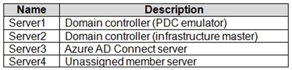

----------------------------------------

## Exam SC-300 topic 1 question 24 discussion

Actual exam question from

Microsoft's
SC-300

Question #: 24
Topic #: 1

[All SC-300 Questions]

You have an Azure Active Directory (Azure AD) tenant named contoso.com that contains an Azure AD enterprise application named App1.A contractor uses the credentials of [email protected].You need to ensure that you can provide the contractor with access to App1. The contractor must be able to authenticate as [email protected].What should you do? 
Suggested Answer: A 🗳️ 

A. Run the New-AzureADMSInvitation cmdlet.

B. Configure the External collaboration settings.

C. Add a WS-Fed identity provider.

D. Implement Azure AD Connect.

**Answer: A**

**Timestamp: April 25, 2022, 1:09 p.m.**

[View on ExamTopics](https://www.examtopics.com/discussions/microsoft/view/74442-exam-sc-300-topic-1-question-24-discussion/)

----------------------------------------

## Exam SC-300 topic 1 question 25 discussion

Actual exam question from

Microsoft's
SC-300

Question #: 25
Topic #: 1

[All SC-300 Questions]

You have a Microsoft Entra tenant named contoso.com that contains an enterprise application named App1.A contractor uses the credentials of [email protected].You need to ensure that you can provide the contractor with access to App1. The contractor must be able to authenticate as [email protected].What should you do? 
Suggested Answer: D 🗳️ 

A. Implement Microsoft Entra Connect sync.

B. Add a custom domain name to contoso.com.

C. Implement Microsoft Entra Application Proxy.

D. Run the New-MgInvitation cmdlet.

**Answer: D**

**Timestamp: Jan. 6, 2025, 1:07 p.m.**

[View on ExamTopics](https://www.examtopics.com/discussions/microsoft/view/153945-exam-sc-300-topic-1-question-25-discussion/)

----------------------------------------

## Exam SC-300 topic 1 question 26 discussion

Actual exam question from

Microsoft's
SC-300

Question #: 26
Topic #: 1

[All SC-300 Questions]

HOTSPOT -You have an Azure Active Directory (Azure AD) tenant and an Azure web app named App1.You need to provide guest users with self-service sign-up for App1. The solution must meet the following requirements:✑ Guest users must be able to sign up by using a one-time password.✑ The users must provide their first name, last name, city, and email address during the sign-up process.What should you configure in the Azure Active Directory admin center for each requirement? To answer, select the appropriate options in the answer area.NOTE: Each correct selection is worth one point.Hot Area: 
Suggested Answer: Reference:https://docs.microsoft.com/en-us/azure/active-directory/external-identities/identity-providers https://docs.microsoft.com/en-us/azure/active-directory/external-identities/self-service-sign-up-overview 

**Answer: **

**Timestamp: Sept. 16, 2022, 12:52 p.m.**

[View on ExamTopics](https://www.examtopics.com/discussions/microsoft/view/82409-exam-sc-300-topic-1-question-26-discussion/)

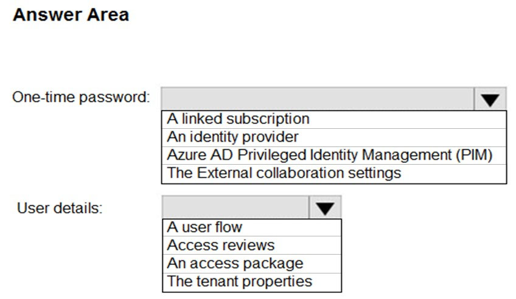
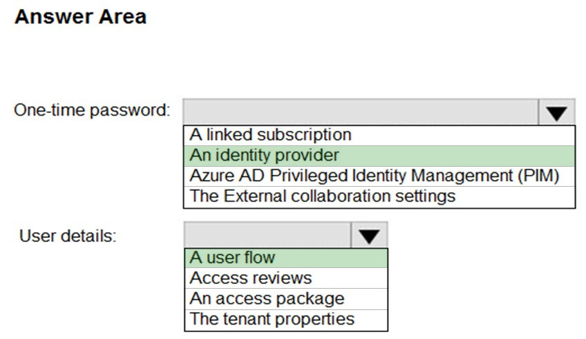

----------------------------------------

## Exam SC-300 topic 1 question 27 discussion

Actual exam question from

Microsoft's
SC-300

Question #: 27
Topic #: 1

[All SC-300 Questions]

You have an Azure Active Directory (Azure AD) Azure AD tenant.You need to bulk create 25 new user accounts by uploading a template file.Which properties are required in the template file? 
Suggested Answer: C 🗳️ 

A. displayName, identityIssuer, usageLocation, and userType

B. accountEnabled, givenName, surname, and userPrincipalName

C. accountEnabled, displayName, userPrincipalName, and passwordProfile

D. accountEnabled, passwordProfile, usageLocation, and userPrincipalName

**Answer: C**

**Timestamp: Aug. 31, 2022, 3:46 p.m.**

[View on ExamTopics](https://www.examtopics.com/discussions/microsoft/view/78714-exam-sc-300-topic-1-question-27-discussion/)

----------------------------------------

## Exam SC-300 topic 1 question 28 discussion

Actual exam question from

Microsoft's
SC-300

Question #: 28
Topic #: 1

[All SC-300 Questions]

HOTSPOT -Your on-premises network contains an Active Directory Domain Services (AD DS) domain. The domain contains computers that run Windows 11.You have a Microsoft 365 E5 subscription.You plan to enable hybrid join and enroll the computers in Microsoft Intune.You need to recommend the software that should be deployed to the domain, and the actions that should be performed in Intune.What should you include in the recommendation? To answer, select the appropriate options in the answer area.NOTE: Each correct selection is worth one point. 
Suggested Answer: 

**Answer: **

**Timestamp: Jan. 17, 2025, 11:49 p.m.**

[View on ExamTopics](https://www.examtopics.com/discussions/microsoft/view/154822-exam-sc-300-topic-1-question-28-discussion/)

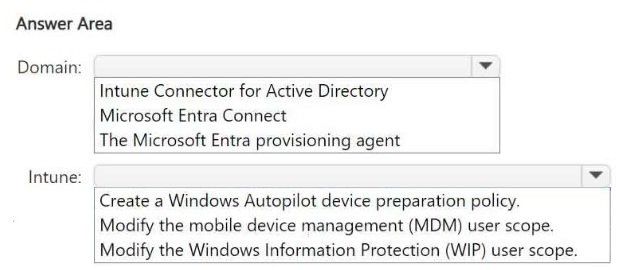
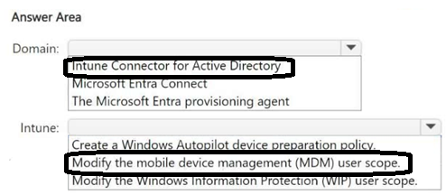

----------------------------------------

## Exam SC-300 topic 1 question 29 discussion

Actual exam question from

Microsoft's
SC-300

Question #: 29
Topic #: 1

[All SC-300 Questions]

DRAG DROP -You need to resolve the recent security incident issues.What should you configure for each incident? To answer, drag the appropriate policy types to the correct issues. Each policy type may be used once, more than once, or not at all. You may need to drag the split bar between panes or scroll to view content.NOTE: Each correct selection is worth one point.Select and Place: 
Suggested Answer: Box 1: A user risk policy -User-linked detections include:Leaked credentials: This risk detection type indicates that the user's valid credentials have been leaked. When cybercriminals compromise valid passwords of legitimate users, they often share those credentials.User risk policy.Identity Protection can calculate what it believes is normal for a user's behavior and use that to base decisions for their risk. User risk is a calculation of probability that an identity has been compromised. Administrators can make a decision based on this risk score signal to enforce organizational requirements. Administrators can choose to block access, allow access, or allow access but require a password change using Azure AD self-service password reset.Box 2: A sign-in risk policy -Suspicious browser: Suspicious browser detection indicates anomalous behavior based on suspicious sign-in activity across multiple tenants from different countries in the same browser.Box 3: A sign-in risk policy -A sign-in risks include activity from anonymous IP address: This detection is discovered by Microsoft Defender for Cloud Apps. This detection identifies that users were active from an IP address that has been identified as an anonymous proxy IP address.Note: The following three policies are available in Azure AD Identity Protection to protect users and respond to suspicious activity. You can choose to turn the policy enforcement on or off, select users or groups for the policy to apply to, and decide if you want to block access at sign-in or prompt for additional action.* User risk policyIdentifies and responds to user accounts that may have compromised credentials. Can prompt the user to create a new password.* Sign in risk policyIdentifies and responds to suspicious sign-in attempts. Can prompt the user to provide additional forms of verification using Azure AD Multi-Factor Authentication.* MFA registration policyMakes sure users are registered for Azure AD Multi-Factor Authentication. If a sign-in risk policy prompts for MFA, the user must already be registered for AzureAD Multi-Factor Authentication.Reference:https://docs.microsoft.com/en-us/azure/active-directory/identity-protection/concept-identity-protection-policies 

**Answer: **

**Timestamp: Sept. 22, 2022, 3:23 p.m.**

[View on ExamTopics](https://www.examtopics.com/discussions/microsoft/view/83194-exam-sc-300-topic-1-question-29-discussion/)

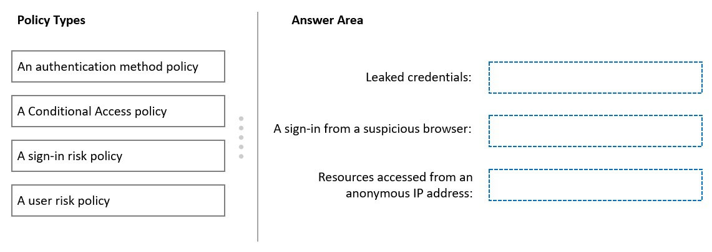
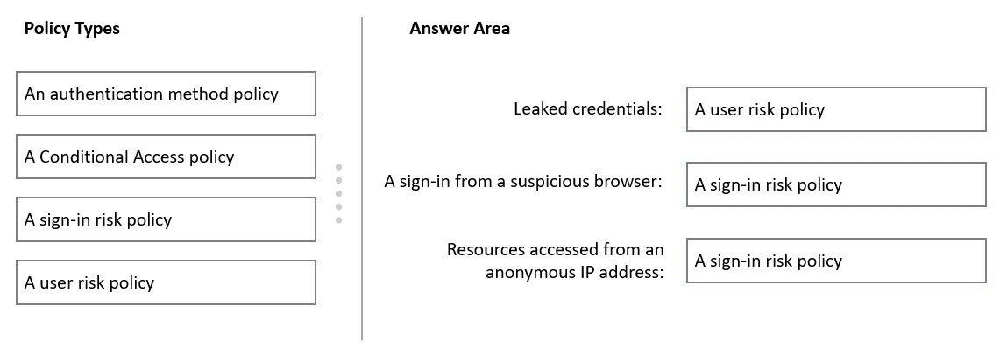

----------------------------------------

## Exam SC-300 topic 1 question 30 discussion

Actual exam question from

Microsoft's
SC-300

Question #: 30
Topic #: 1

[All SC-300 Questions]

HOTSPOT -You have an Azure Active Directory (Azure AD) tenant that contains the users shown in the following table.For which users can you configure the Job title property and the Usage location property in Azure AD? To answer, select the appropriate options in the answer area.NOTE: Each correct selection is worth one point.Hot Area: 
Suggested Answer: 

**Answer: **

**Timestamp: Aug. 30, 2022, 11:29 p.m.**

[View on ExamTopics](https://www.examtopics.com/discussions/microsoft/view/78513-exam-sc-300-topic-1-question-30-discussion/)

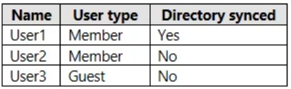
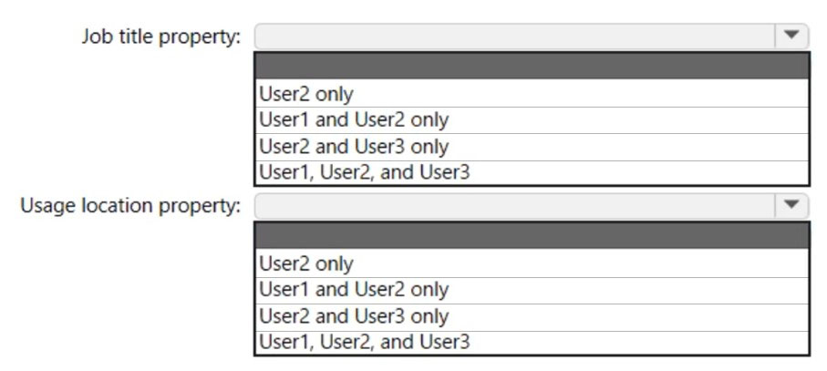
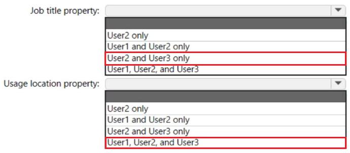

----------------------------------------

## Exam SC-300 topic 1 question 31 discussion

Actual exam question from

Microsoft's
SC-300

Question #: 31
Topic #: 1

[All SC-300 Questions]

You have an Azure Active Directory (Azure AD) tenant that: contains a user named User1.You need to ensure that User1 can create new catalogs and add1 resources to the catalogs they own.What should you do? 
Suggested Answer: C 🗳️ 

A. From the Roles and administrators blade, modify the Groups administrator role.

B. From the Roles and administrators blade, modify the Service support administrator role.

C. From the Identity Governance blade, modify the Entitlement management settings.

D. From the Identity Governance blade, modify the roles and administrators for the General catalog.

**Answer: C**

**Timestamp: Aug. 30, 2022, 11:27 p.m.**

[View on ExamTopics](https://www.examtopics.com/discussions/microsoft/view/78511-exam-sc-300-topic-1-question-31-discussion/)

----------------------------------------

## Exam SC-300 topic 1 question 32 discussion

Actual exam question from

Microsoft's
SC-300

Question #: 32
Topic #: 1

[All SC-300 Questions]

Your network contains an on-premises Active Directory domain that syncs to an Azure Active Directory (Azure AD) tenant.Users sign in to computers that run Windows 10 and are joined to the domain.You plan to implement Azure AD Seamless Single Sign-On (Azure AD Seamless SSO).You need to configure the Windows 10 computers to support Azure AD Seamless SSO.What should you do? 
Suggested Answer: C 🗳️ 

A. Configure Sign-in options from the Settings app.

B. Enable Enterprise State Roaming.

C. Modify the Local intranet Zone settings.

D. Install the Azure AD Connect Authentication Agent.

**Answer: C**

**Timestamp: Sept. 1, 2022, 6:06 a.m.**

[View on ExamTopics](https://www.examtopics.com/discussions/microsoft/view/78892-exam-sc-300-topic-1-question-32-discussion/)

----------------------------------------

## Exam SC-300 topic 1 question 33 discussion

Actual exam question from

Microsoft's
SC-300

Question #: 33
Topic #: 1

[All SC-300 Questions]

Your company has two divisions named Contoso East and Contoso West. The Microsoft 365 identity architecture for both divisions is shown in the following exhibit.You need to assign users from the Contoso East division access to Microsoft SharePoint Online sites in the Contoso West tenant. The solution must not require additional Microsoft 365 licenses.What should you do? 
Suggested Answer: B 🗳️ 

A. Configure Azure AD Application Proxy in the Contoso West tenant.

B. Invite the Contoso East users as guests in the Contoso West tenant.

C. Deploy a second Azure AD Connect server to Contoso East and configure the server to sync the Contoso East Active Directory forest to the Contoso West tenant.

D. Configure the existing Azure AD Connect server in Contoso East to sync the Contoso East Active Directory forest to the Contoso West tenant.

**Answer: B**

**Timestamp: Sept. 17, 2022, 2:48 a.m.**

[View on ExamTopics](https://www.examtopics.com/discussions/microsoft/view/82467-exam-sc-300-topic-1-question-33-discussion/)

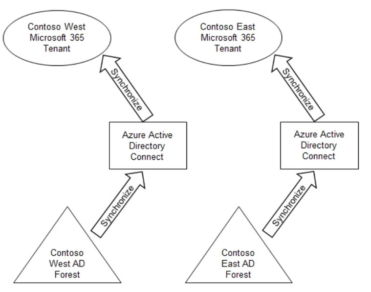

----------------------------------------

## Exam SC-300 topic 1 question 34 discussion

Actual exam question from

Microsoft's
SC-300

Question #: 34
Topic #: 1

[All SC-300 Questions]

DRAG DROP -You have a Microsoft 365 E5 subscription that contains two users named User1 and User2.You need to ensure that User1 can create access reviews for groups, and that User2 can review the history report for all the completed access reviews. The solution must use the principle of least privilege.Which role should you assign to each user? To answer, drag the appropriate roles to the correct users. Each role may be used once, more than once, or not at all. You may need to drag the split bar between panes or scroll to view content.NOTE: Each correct selection is worth one point. 
Suggested Answer: 

**Answer: **

**Timestamp: Jan. 17, 2023, 6:54 p.m.**

[View on ExamTopics](https://www.examtopics.com/discussions/microsoft/view/95723-exam-sc-300-topic-1-question-34-discussion/)

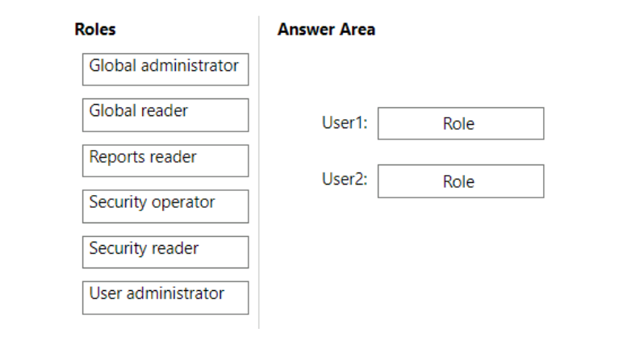
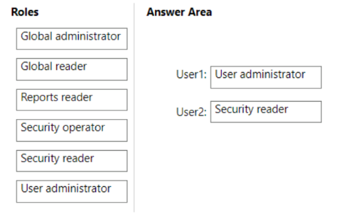

----------------------------------------

## Exam SC-300 topic 1 question 35 discussion

Actual exam question from

Microsoft's
SC-300

Question #: 35
Topic #: 1

[All SC-300 Questions]

HOTSPOT -You have an Azure subscription.You need to create two custom roles named Role1 and Role2. The solution must meet the following requirements:• Users that are assigned Role1 can create or delete instances of Azure Container Apps.• Users that are assigned Role2 can enforce adaptive network hardening rules.Which resource provider permissions are required for each role? To answer, select the appropriate options in the answer area.NOTE: Each correct selection is worth one point. 
Suggested Answer: 

**Answer: **

**Timestamp: Jan. 17, 2023, 7:03 p.m.**

[View on ExamTopics](https://www.examtopics.com/discussions/microsoft/view/95724-exam-sc-300-topic-1-question-35-discussion/)

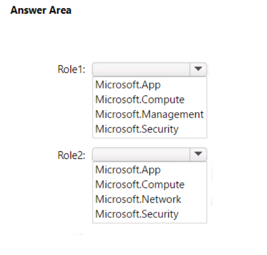
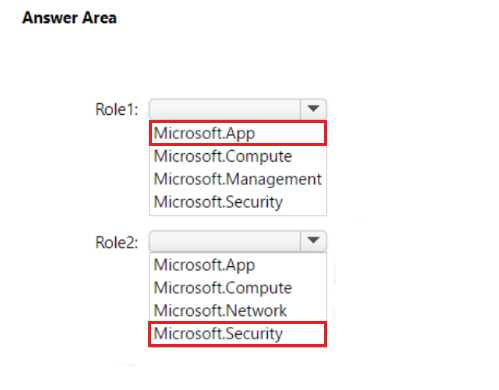

----------------------------------------

## Exam SC-300 topic 1 question 36 discussion

Actual exam question from

Microsoft's
SC-300

Question #: 36
Topic #: 1

[All SC-300 Questions]

HOTSPOT -You have a Microsoft 365 tenant that has 5,000 users. One hundred of the users are executives. The executives have a dedicated support team.You need to ensure that the support team can reset passwords and manage multi-factor authentication (MFA) settings for only the executives. The solution must use the principle of least privilege.Which object type and Azure Active Directory (Azure AD) role should you use? To answer, select the appropriate options in the answer area.NOTE: Each correct selection is worth one point. 
Suggested Answer: 

**Answer: **

**Timestamp: Jan. 16, 2023, 6:30 p.m.**

[View on ExamTopics](https://www.examtopics.com/discussions/microsoft/view/95601-exam-sc-300-topic-1-question-36-discussion/)

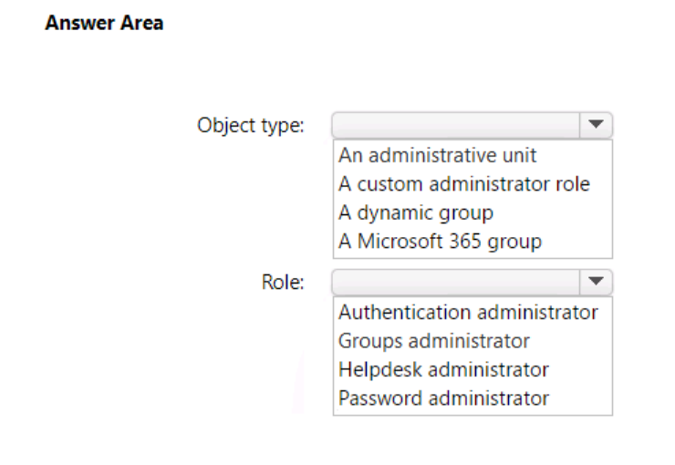
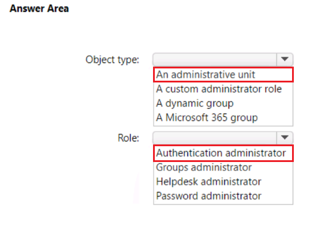

----------------------------------------

## Exam SC-300 topic 1 question 37 discussion

Actual exam question from

Microsoft's
SC-300

Question #: 37
Topic #: 1

[All SC-300 Questions]

You have an Azure Active Directory (Azure AD) tenant that contains the users shown in the following table.You have an administrative unit named Au1. Group1, User2, and User3 are members of Au1.User5 is assigned the User administrator role for Au1.For which users can User5 reset passwords? 
Suggested Answer: D 🗳️ 

A. User1, User2, and User3

B. User1 and User2 only

C. User3 and User4 only

D. User2 and User3 only

**Answer: D**

**Timestamp: Jan. 17, 2023, 7:51 a.m.**

[View on ExamTopics](https://www.examtopics.com/discussions/microsoft/view/95662-exam-sc-300-topic-1-question-37-discussion/)

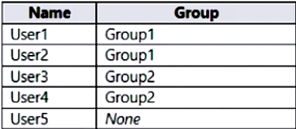

----------------------------------------

## Exam SC-300 topic 1 question 38 discussion

Actual exam question from

Microsoft's
SC-300

Question #: 38
Topic #: 1

[All SC-300 Questions]

You have an Azure Active Directory (Azure AD) tenant that contains the users shown in the following table.You create a dynamic user group and configure the following rule syntax.user.usageLocation -in ["US","AU"] -and (user.department -eq "Sales") -and -not (user.jobTitle -eq "Manager") –or (user. jobTitle -eq "SalesRep")Which users will be added to the group? 
Suggested Answer: D 🗳️ 

A. User1 only

B. User2 only

C. User3 only

D. User1 and User2 only

E. User1 and User3 only

F. User1, User2, and User3

**Answer: D**

**Timestamp: Jan. 16, 2023, 1:10 p.m.**

[View on ExamTopics](https://www.examtopics.com/discussions/microsoft/view/95525-exam-sc-300-topic-1-question-38-discussion/)

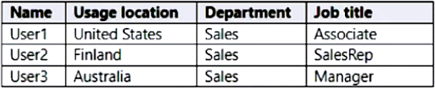

----------------------------------------

## Exam SC-300 topic 1 question 39 discussion

Actual exam question from

Microsoft's
SC-300

Question #: 39
Topic #: 1

[All SC-300 Questions]

You have an Azure AD tenant that contains a user named User1.User1 needs to manage license assignments and reset user passwords.Which role should you assign to User1? 
Suggested Answer: D 🗳️ 

A. Helpdesk administrator

B. Billing administrator

C. License administrator

D. User administrator

**Answer: D**

**Timestamp: Jan. 17, 2023, 1:24 p.m.**

[View on ExamTopics](https://www.examtopics.com/discussions/microsoft/view/95696-exam-sc-300-topic-1-question-39-discussion/)

----------------------------------------

## Exam SC-300 topic 1 question 40 discussion

Actual exam question from

Microsoft's
SC-300

Question #: 40
Topic #: 1

[All SC-300 Questions]

HOTSPOT -You have a Microsoft Entra tenant that contains a user named User1.An administrator deletes User1.You need to identify the following:• What is the maximum number of days for which you have the option to restore the User1 account?• Which is the least privileged role that can be used to restore User1?To answer, select the appropriate options in the answer area.NOTE: Each correct selection is worth one point. 
Suggested Answer: 

**Answer: **

**Timestamp: March 8, 2025, 9:21 a.m.**

[View on ExamTopics](https://www.examtopics.com/discussions/microsoft/view/157752-exam-sc-300-topic-1-question-40-discussion/)

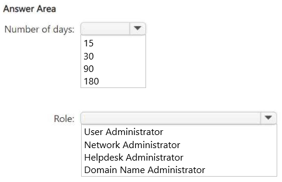
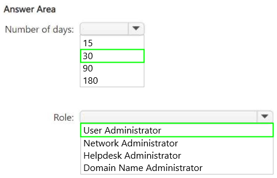

----------------------------------------

## Exam SC-300 topic 1 question 41 discussion

Actual exam question from

Microsoft's
SC-300

Question #: 41
Topic #: 1

[All SC-300 Questions]

You have a Microsoft Entra tenant named contoso.com that contains an enterprise application named App1.A contractor uses the credentials of [email protected].You need to ensure that you can provide the contractor with access to App1. The contractor must be able to authenticate as [email protected].What should you do? 
Suggested Answer: B 🗳️ 

A. Run the New-MgUser cmdlet.

B. Run the New-MgInvitation cmdlet.

C. Configure the External collaboration settings.

D. Implement Microsoft Entra Connect sync.

**Answer: B**

**Timestamp: Feb. 6, 2025, 6:37 a.m.**

[View on ExamTopics](https://www.examtopics.com/discussions/microsoft/view/156014-exam-sc-300-topic-1-question-41-discussion/)

----------------------------------------

## Exam SC-300 topic 1 question 42 discussion

Actual exam question from

Microsoft's
SC-300

Question #: 42
Topic #: 1

[All SC-300 Questions]

HOTSPOT -Your on-premises network contains an Active Directory domain that uses Azure AD Connect to sync with an Azure AD tenant.You need to configure Azure AD Connect to meet the following requirements:• User sign-ins to Azure AD must be authenticated by an Active Directory domain controller.• Active Directory domain users must be able to use Azure AD self-service password reset (SSPR).What should you use for each requirement? To answer, select the appropriate options in the answer area.NOTE: Each correct selection is worth one point. 
Suggested Answer: 

**Answer: **

**Timestamp: Jan. 17, 2023, 7:13 p.m.**

[View on ExamTopics](https://www.examtopics.com/discussions/microsoft/view/95727-exam-sc-300-topic-1-question-42-discussion/)

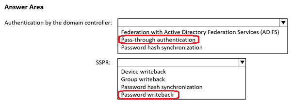

----------------------------------------

## Exam SC-300 topic 1 question 43 discussion

Actual exam question from

Microsoft's
SC-300

Question #: 43
Topic #: 1

[All SC-300 Questions]

You have 2,500 users who are assigned Microsoft Office 365 Enterprise E3 licenses. The licenses are assigned to individual users.From the Groups blade in the Azure Active Directory admin center, you assign Microsoft Office 365 Enterprise E5 licenses to a group that includes all users.You needed to remove the Office 365 Enterprise E3 licenses from the users by using the least amount of administrative effort.What should you use? 
Suggested Answer: D 🗳️ 

A. the Groups blade in the Azure Active Directory admin center

B. the Set-AzureADGroup cmdlet

C. the Identity Governance blade in the Azure Active Directory admin center

D. the Set-MsolUserLicense cmdlet

**Answer: D**

**Timestamp: May 14, 2023, 1:17 p.m.**

[View on ExamTopics](https://www.examtopics.com/discussions/microsoft/view/109230-exam-sc-300-topic-1-question-43-discussion/)

----------------------------------------

## Exam SC-300 topic 1 question 44 discussion

Actual exam question from

Microsoft's
SC-300

Question #: 44
Topic #: 1

[All SC-300 Questions]

Note: This question is part of a series of questions that present the same scenario. Each question in the series contains a unique solution that might meet the stated goals. Some question sets might have more than one correct solution, while others might not have a correct solution.After you answer a question in this section, you will NOT be able to return to it. As a result, these questions will not appear in the review screen.You have an Active Directory forest that syncs to an Azure AD tenant.You discover that when a user account is disabled in Active Directory, the disabled user can still authenticate to Azure AD for up to 30 minutes.You need to ensure that when a user account is disabled in Active Directory, the user account is immediately prevented from authenticating to Azure AD.Solution: You configure conditional access policies.Does this meet the goal? 
Suggested Answer: B 🗳️ 

A. Yes

B. No

**Answer: B**

**Timestamp: May 4, 2023, 12:12 a.m.**

[View on ExamTopics](https://www.examtopics.com/discussions/microsoft/view/108457-exam-sc-300-topic-1-question-44-discussion/)

----------------------------------------

## Exam SC-300 topic 1 question 45 discussion

Actual exam question from

Microsoft's
SC-300

Question #: 45
Topic #: 1

[All SC-300 Questions]

Note: This question is part of a series of questions that present the same scenario. Each question in the series contains a unique solution that might meet the stated goals. Some question sets might have more than one correct solution, while others might not have a correct solution.After you answer a question in this section, you will NOT be able to return to it. As a result, these questions will not appear in the review screen.You have a Microsoft 365 E5 subscription.You create a user named User1.You need to ensure that User1 can update the status of Identity Secure Score improvement actions.Solution: You assign the Exchange Administrator role to User1.Does this meet the goal? 
Suggested Answer: B 🗳️ 

A. Yes

B. No

**Answer: B**

**Timestamp: April 4, 2023, 9:15 p.m.**

[View on ExamTopics](https://www.examtopics.com/discussions/microsoft/view/105207-exam-sc-300-topic-1-question-45-discussion/)

----------------------------------------

## Exam SC-300 topic 1 question 46 discussion

Actual exam question from

Microsoft's
SC-300

Question #: 46
Topic #: 1

[All SC-300 Questions]

Note: This question is part of a series of questions that present the same scenario. Each question in the series contains a unique solution that might meet the stated goals. Some question sets might have more than one correct solution, while others might not have a correct solution.After you answer a question in this section, you will NOT be able to return to it. As a result, these questions will not appear in the review screen.You have a Microsoft 365 E5 subscription.You create a user named User1.You need to ensure that User1 can update the status of Identity Secure Score improvement actions.Solution: You assign the User Administrator role to User1.Does this meet the goal? 
Suggested Answer: A 🗳️ 

A. Yes

B. No

**Answer: A**

**Timestamp: April 8, 2023, 4:29 a.m.**

[View on ExamTopics](https://www.examtopics.com/discussions/microsoft/view/105559-exam-sc-300-topic-1-question-46-discussion/)

----------------------------------------

## Exam SC-300 topic 1 question 47 discussion

Actual exam question from

Microsoft's
SC-300

Question #: 47
Topic #: 1

[All SC-300 Questions]

HOTSPOT -Case Study -Overview -Contoso, Ltd. is a consulting company that has a main office in Montreal and branch offices in London and Seattle.Contoso has a partnership with a company named Fabrikam, Inc. Fabrikam has an Azure Active Directory (Azure AD) tenant named fabrikam.com.Existing Environment. Existing EnvironmentThe on-premises network of Contoso contains an Active Directory domain named contoso.com. The domain contains an organizational unit (OU) named Contoso_Resources. The Contoso_Resources OU contains all users and computers.The contoso.com Active Directory domain contains the relevant users shown in the following table.Contoso also includes a marketing department that has users in each office.Existing Environment. Microsoft 365/Azure EnvironmentContoso has an Azure AD tenant named contoso.com that has the following associated licenses:• Microsoft Office 365 Enterprise E5• Enterprise Mobility + Security E5• Windows 10 Enterprise E3• Project Plan 3Azure AD Connect is configured between Azure AD and Active Directory Domain Services (AD DS). Only the Contoso_Resources OU is synced.Helpdesk administrators routinely use the Microsoft 365 admin center to manage user settings.User administrators currently use the Microsoft 365 admin center to manually assign licenses. All users have all licenses assigned besides the following exceptions:• The users in the London office have the Microsoft 365 Phone System license unassigned.• The users in the Seattle office have the Yammer Enterprise license unassigned.Security defaults are disabled for contoso.com.Contoso uses Azure AD Privileged Identity Management (PIM) to protect administrative roles.Existing Environment. Problem StatementsContoso identifies the following issues:• Currently, all the helpdesk administrators can manage user licenses throughout the entire Microsoft 365 tenant.• The user administrators report that it is tedious to manually configure the different license requirements for each Contoso office.• The helpdesk administrators spend too much time provisioning internal and guest access to the required Microsoft 365 services and apps.• Currently, the helpdesk administrators can perform tasks by using the User administrator role without justification or approval.• When the Logs node is selected in Azure AD, an error message appears stating that Log Analytics integration is not enabled.Requirements. Planned Changes -Contoso plans to implement the following changes:• Implement self-service password reset (SSPR).• Analyze Azure audit activity logs by using Azure Monitor.• Simplify license allocation for new users added to the tenant.• Collaborate with the users at Fabrikam on a joint marketing campaign.• Configure the User administrator role to require justification and approval to activate.• Implement a custom line-of-business Azure web app named App1. App1 will be accessible from the internet and authenticated by using Azure AD accounts.• For new users in the marketing department, implement an automated approval workflow to provide access to a Microsoft SharePoint Online site, group, and app.Contoso plans to acquire a company named ADatum Corporation. One hundred new ADatum users will be created in an Active Directory OU named Adatum. The users will be located in London and Seattle.Requirements. Technical RequirementsContoso identifies the following technical requirements:• All users must be synced from AD DS to the contoso.com Azure AD tenant.• App1 must have a redirect URI pointed to https://contoso.com/auth-response.• License allocation for new users must be assigned automatically based on the location of the user.• Fabrikam users must have access to the marketing department’s SharePoint site for a maximum of 90 days.• Administrative actions performed in Azure AD must be audited. Audit logs must be retained for one year.• The helpdesk administrators must be able to manage licenses for only the users in their respective office.• Users must be forced to change their password if there is a probability that the users’ identity was compromised.You need to meet the technical requirements for license management by the help desk administrators.What should you create first, and which tool should you use? To answer, select the appropriate options in the answer area.NOTE: Each correct selection is worth one point. 
Suggested Answer: 

**Answer: **

**Timestamp: July 20, 2023, 1:57 p.m.**

[View on ExamTopics](https://www.examtopics.com/discussions/microsoft/view/115858-exam-sc-300-topic-1-question-47-discussion/)

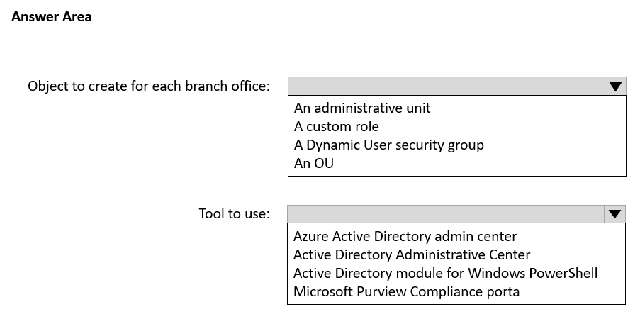
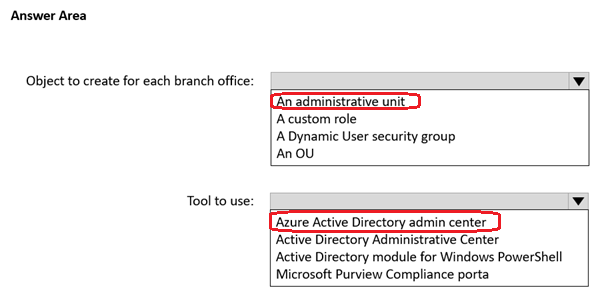

----------------------------------------

## Exam SC-300 topic 1 question 48 discussion

Actual exam question from

Microsoft's
SC-300

Question #: 48
Topic #: 1

[All SC-300 Questions]

Case Study -Overview -ADatum Corporation is a consulting company in Montreal.ADatum recently acquired a Vancouver-based company named Litware, Inc.Existing Environment. ADatum EnvironmentThe on-premises network of ADatum contains an Active Directory Domain Services (AD DS) forest named adatum.com.ADatum has a Microsoft 365 E5 subscription. The subscription contains a verified domain that syncs with the adatum.com AD DS domain by using Azure AD Connect.ADatum has an Azure Active Directory (Azure AD) tenant named adatum.com. The tenant has Security defaults disabled.The tenant contains the users shown in the following table.The tenant contains the groups shown in the following table.Existing Environment. Litware EnvironmentLitware has an AD DS forest named litware.comExisting Environment. Problem StatementsADatum identifies the following issues:• Multiple users in the sales department have up to five devices. The sales department users report that sometimes they must contact the support department to join their devices to the Azure AD tenant because they have reached their device limit.• A recent security incident reveals that several users leaked their credentials, a suspicious browser was used for a sign-in, and resources were accessed from an anonymous IP address.• When you attempt to assign the Device Administrators role to IT_Group1, the group does NOT appear in the selection list.• Anyone in the organization can invite guest users, including other guests and non-administrators.• The helpdesk spends too much time resetting user passwords.• Users currently use only passwords for authentication.Requirements. Planned Changes -ADatum plans to implement the following changes:• Configure self-service password reset (SSPR).• Configure multi-factor authentication (MFA) for all users.• Configure an access review for an access package named Package1.• Require admin approval for application access to organizational data.• Sync the AD DS users and groups of litware.com with the Azure AD tenant.• Ensure that only users that are assigned specific admin roles can invite guest users.• Increase the maximum number of devices that can be joined or registered to Azure AD to 10.Requirements. Technical RequirementsADatum identifies the following technical requirements:• Users assigned the User administrator role must be able to request permission to use the role when needed for up to one year.• Users must be prompted to register for MFA and provided with an option to bypass the registration for a grace period.• Users must provide one authentication method to reset their password by using SSPR. Available methods must include:- Email- Phone- Security questions- The Microsoft Authenticator app• Trust relationships must NOT be established between the adatum.com and litware.com AD DS domains.• The principle of least privilege must be used.You need to resolve the issue of the sales department users.What should you configure for the Azure AD tenant? 
Suggested Answer: A 🗳️ 

A. the Device settings

B. the User settings

C. the Access reviews settings

D. Security defaults

**Answer: A**

**Timestamp: July 24, 2023, 12:59 p.m.**

[View on ExamTopics](https://www.examtopics.com/discussions/microsoft/view/116294-exam-sc-300-topic-1-question-48-discussion/)

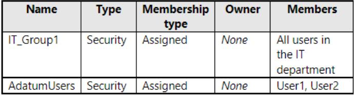

----------------------------------------

## Exam SC-300 topic 1 question 49 discussion

Actual exam question from

Microsoft's
SC-300

Question #: 49
Topic #: 1

[All SC-300 Questions]

Case Study -Overview -ADatum Corporation is a consulting company in Montreal.ADatum recently acquired a Vancouver-based company named Litware, Inc.Existing Environment. ADatum EnvironmentThe on-premises network of ADatum contains an Active Directory Domain Services (AD DS) forest named adatum.com.ADatum has a Microsoft 365 E5 subscription. The subscription contains a verified domain that syncs with the adatum.com AD DS domain by using Azure AD Connect.ADatum has an Azure Active Directory (Azure AD) tenant named adatum.com. The tenant has Security defaults disabled.The tenant contains the users shown in the following table.The tenant contains the groups shown in the following table.Existing Environment. Litware EnvironmentLitware has an AD DS forest named litware.comExisting Environment. Problem StatementsADatum identifies the following issues:• Multiple users in the sales department have up to five devices. The sales department users report that sometimes they must contact the support department to join their devices to the Azure AD tenant because they have reached their device limit.• A recent security incident reveals that several users leaked their credentials, a suspicious browser was used for a sign-in, and resources were accessed from an anonymous IP address.• When you attempt to assign the Device Administrators role to IT_Group1, the group does NOT appear in the selection list.• Anyone in the organization can invite guest users, including other guests and non-administrators.• The helpdesk spends too much time resetting user passwords.• Users currently use only passwords for authentication.Requirements. Planned Changes -ADatum plans to implement the following changes:• Configure self-service password reset (SSPR).• Configure multi-factor authentication (MFA) for all users.• Configure an access review for an access package named Package1.• Require admin approval for application access to organizational data.• Sync the AD DS users and groups of litware.com with the Azure AD tenant.• Ensure that only users that are assigned specific admin roles can invite guest users.• Increase the maximum number of devices that can be joined or registered to Azure AD to 10.Requirements. Technical RequirementsADatum identifies the following technical requirements:• Users assigned the User administrator role must be able to request permission to use the role when needed for up to one year.• Users must be prompted to register for MFA and provided with an option to bypass the registration for a grace period.• Users must provide one authentication method to reset their password by using SSPR. Available methods must include:- Email- Phone- Security questions- The Microsoft Authenticator app• Trust relationships must NOT be established between the adatum.com and litware.com AD DS domains.• The principle of least privilege must be used.You need to resolve the issue of IT_Group1.What should you do first? 
Suggested Answer: B 🗳️ 

A. Change Membership type of IT_Group1 to Dynamic User.

B. Recreate the IT_Group1 group.

C. Change Membership type of IT Group1 to Dynamic Device.

D. Add an owner to IT_Group1.

**Answer: B**

**Timestamp: July 23, 2023, 5:52 p.m.**

[View on ExamTopics](https://www.examtopics.com/discussions/microsoft/view/116214-exam-sc-300-topic-1-question-49-discussion/)

----------------------------------------

## Exam SC-300 topic 1 question 50 discussion

Actual exam question from

Microsoft's
SC-300

Question #: 50
Topic #: 1

[All SC-300 Questions]

Case Study -Overview -ADatum Corporation is a consulting company in Montreal.ADatum recently acquired a Vancouver-based company named Litware, Inc.Existing Environment. ADatum EnvironmentThe on-premises network of ADatum contains an Active Directory Domain Services (AD DS) forest named adatum.com.ADatum has a Microsoft 365 E5 subscription. The subscription contains a verified domain that syncs with the adatum.com AD DS domain by using Azure AD Connect.ADatum has an Azure Active Directory (Azure AD) tenant named adatum.com. The tenant has Security defaults disabled.The tenant contains the users shown in the following table.The tenant contains the groups shown in the following table.Existing Environment. Litware EnvironmentLitware has an AD DS forest named litware.comExisting Environment. Problem StatementsADatum identifies the following issues:• Multiple users in the sales department have up to five devices. The sales department users report that sometimes they must contact the support department to join their devices to the Azure AD tenant because they have reached their device limit.• A recent security incident reveals that several users leaked their credentials, a suspicious browser was used for a sign-in, and resources were accessed from an anonymous IP address.• When you attempt to assign the Device Administrators role to IT_Group1, the group does NOT appear in the selection list.• Anyone in the organization can invite guest users, including other guests and non-administrators.• The helpdesk spends too much time resetting user passwords.• Users currently use only passwords for authentication.Requirements. Planned Changes -ADatum plans to implement the following changes:• Configure self-service password reset (SSPR).• Configure multi-factor authentication (MFA) for all users.• Configure an access review for an access package named Package1.• Require admin approval for application access to organizational data.• Sync the AD DS users and groups of litware.com with the Azure AD tenant.• Ensure that only users that are assigned specific admin roles can invite guest users.• Increase the maximum number of devices that can be joined or registered to Azure AD to 10.Requirements. Technical RequirementsADatum identifies the following technical requirements:• Users assigned the User administrator role must be able to request permission to use the role when needed for up to one year.• Users must be prompted to register for MFA and provided with an option to bypass the registration for a grace period.• Users must provide one authentication method to reset their password by using SSPR. Available methods must include:- Email- Phone- Security questions- The Microsoft Authenticator app• Trust relationships must NOT be established between the adatum.com and litware.com AD DS domains.• The principle of least privilege must be used.You need to implement the planned changes for litware.com.What should you configure? 
Suggested Answer: A 🗳️ 

A. Azure AD Connect cloud sync between the Azure AD tenant and litware.com

B. Azure AD Connect to include the litware.com domain

C. staging mode in Azure AD Connect for the litware.com domain

**Answer: A**

**Timestamp: July 24, 2023, 7:48 a.m.**

[View on ExamTopics](https://www.examtopics.com/discussions/microsoft/view/116265-exam-sc-300-topic-1-question-50-discussion/)

----------------------------------------

## Exam SC-300 topic 1 question 51 discussion

Actual exam question from

Microsoft's
SC-300

Question #: 51
Topic #: 1

[All SC-300 Questions]

You have the Azure resources shown in the following table.To which identities can you assign the Contributor role for RG1? 
Suggested Answer: E 🗳️ 

A. User1 only

B. User1 and Group1 only

C. User1 and VM1 only

D. User1, VM1, and App1 only

E. User1, Group1, VM1, and App1

**Answer: E**

**Timestamp: Aug. 9, 2023, 4:59 p.m.**

[View on ExamTopics](https://www.examtopics.com/discussions/microsoft/view/117676-exam-sc-300-topic-1-question-51-discussion/)

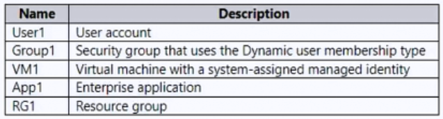

----------------------------------------

## Exam SC-300 topic 1 question 52 discussion

Actual exam question from

Microsoft's
SC-300

Question #: 52
Topic #: 1

[All SC-300 Questions]

HOTSPOT -You have an Azure AD tenant that contains a user named User1. User1 is assigned the User Administrator role.You need to configure External collaboration settings for the tenant to meet the following requirements:• Guest users must be prevented from querying staff email addresses.• Guest users must be able to access the tenant only if they are invited by User1.Which three settings should you configure? To answer, select the appropriate settings in the answer area.NOTE: Each correct selection is worth one point. 
Suggested Answer: 

**Answer: **

**Timestamp: Aug. 14, 2023, 7:13 a.m.**

[View on ExamTopics](https://www.examtopics.com/discussions/microsoft/view/118070-exam-sc-300-topic-1-question-52-discussion/)

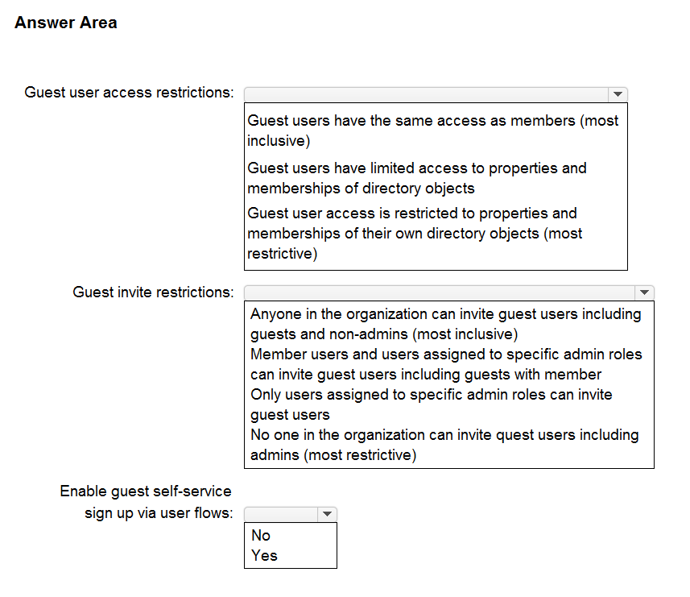
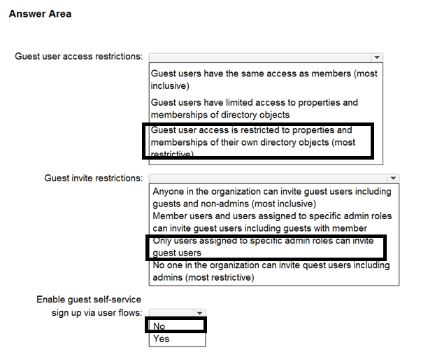

----------------------------------------

## Exam SC-300 topic 1 question 53 discussion

Actual exam question from

Microsoft's
SC-300

Question #: 53
Topic #: 1

[All SC-300 Questions]

You have 2,500 users who are assigned Microsoft Office 365 Enterprise E3 licenses. The licenses are assigned to individual users.From the Groups blade in the Azure Active Directory admin center, you assign Microsoft Office 365 Enterprise E5 licenses to a group that includes all users.You needed to remove the Office 365 Enterprise E3 licenses from the users by using the least amount of administrative effort.What should you use? 
Suggested Answer: D 🗳️ 

A. the Groups blade in the Azure Active Directory admin center

B. the Set-AzureAdUser cmdlet

C. the Identity Governance blade in the Azure Active Directory admin center

D. the Licenses blade in the Azure Active Directory admin center

**Answer: D**

**Timestamp: Aug. 12, 2023, 5:20 a.m.**

[View on ExamTopics](https://www.examtopics.com/discussions/microsoft/view/117935-exam-sc-300-topic-1-question-53-discussion/)

----------------------------------------

## Exam SC-300 topic 1 question 54 discussion

Actual exam question from

Microsoft's
SC-300

Question #: 54
Topic #: 1

[All SC-300 Questions]

Note: This question is part of a series of questions that present the same scenario. Each question in the series contains a unique solution that might meet the stated goals. Some question sets might have more than one correct solution, while others might not have a correct solution.After you answer a question in this section, you will NOT be able to return to it. As a result, these questions will not appear in the review screen.You have a Microsoft 365 E5 subscription.You create a user named User1.You need to ensure that User1 can update the status of Identity Secure Score improvement actions.Solution: You assign the Security Operator role to User1.Does this meet the goal? 
Suggested Answer: B 🗳️ 

A. Yes

B. No

**Answer: B**

**Timestamp: Aug. 2, 2023, 6:35 a.m.**

[View on ExamTopics](https://www.examtopics.com/discussions/microsoft/view/117050-exam-sc-300-topic-1-question-54-discussion/)

----------------------------------------

## Exam SC-300 topic 1 question 55 discussion

Actual exam question from

Microsoft's
SC-300

Question #: 55
Topic #: 1

[All SC-300 Questions]

Note: This question is part of a series of questions that present the same scenario. Each question in the series contains a unique solution that might meet the stated goals. Some question sets might have more than one correct solution, while others might not have a correct solution.After you answer a question in this section, you will NOT be able to return to it. As a result, these questions will not appear in the review screen.You have a Microsoft 365 E5 subscription.You create a user named User1.You need to ensure that User1 can update the status of Identity Secure Score improvement actions.Solution: You assign the SharePoint Administrator role to User1.Does this meet the goal? 
Suggested Answer: A 🗳️ 

A. Yes

B. No

**Answer: A**

**Timestamp: Aug. 1, 2023, 3:21 p.m.**

[View on ExamTopics](https://www.examtopics.com/discussions/microsoft/view/116987-exam-sc-300-topic-1-question-55-discussion/)

----------------------------------------

## Exam SC-300 topic 1 question 56 discussion

Actual exam question from

Microsoft's
SC-300

Question #: 56
Topic #: 1

[All SC-300 Questions]

You have an Azure AD tenant that contains a user named Admin1.You need to ensure that Admin1 can perform only the following tasks:• From the Microsoft 365 admin center, create and manage service requests.• From the Microsoft 365 admin center, read and configure service health.• From the Azure portal, create and manage support tickets.The solution must minimize administrative effort.What should you do? 
Suggested Answer: D 🗳️ 

A. Create an administrative unit and add Admin1.

B. Enable Azure AD Privileged Identity Management (PIM) for Admin1.

C. Assign Admin1 the Helpdesk Administrator role.

D. Create a custom role and assign the role to Admin1.

**Answer: D**

**Timestamp: Aug. 1, 2023, 9:37 a.m.**

[View on ExamTopics](https://www.examtopics.com/discussions/microsoft/view/116963-exam-sc-300-topic-1-question-56-discussion/)

----------------------------------------

## Exam SC-300 topic 1 question 57 discussion

Actual exam question from

Microsoft's
SC-300

Question #: 57
Topic #: 1

[All SC-300 Questions]

HOTSPOT -Your network contains an on-premises Active Directory Domain Services (AD DS) domain that syncs with an Azure AD tenant.You need to ensure that user authentication always occurs by validating passwords against the AD DS domain.What should you configure, and what should you use? To answer, select the appropriate options in the answer area.NOTE: Each correct selection is worth one point. 
Suggested Answer: 

**Answer: **

**Timestamp: Aug. 5, 2023, 11:46 a.m.**

[View on ExamTopics](https://www.examtopics.com/discussions/microsoft/view/117406-exam-sc-300-topic-1-question-57-discussion/)

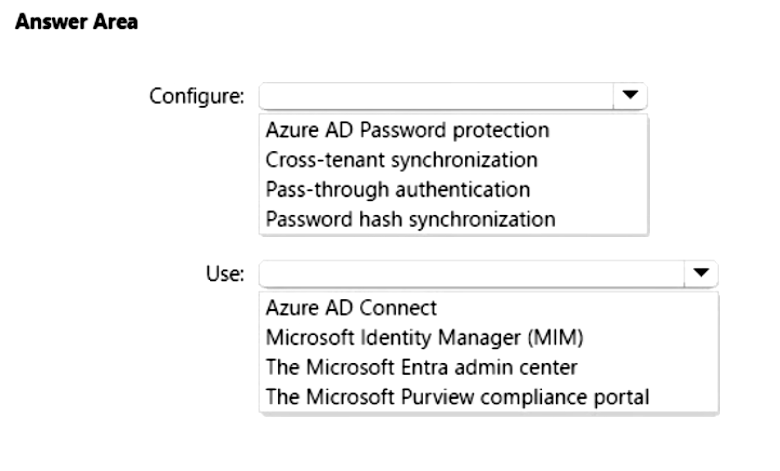
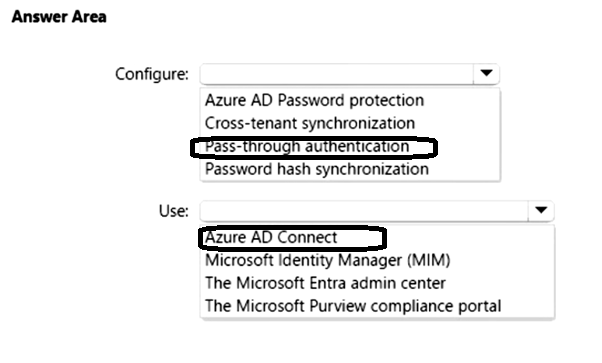

----------------------------------------

## Exam SC-300 topic 1 question 58 discussion

Actual exam question from

Microsoft's
SC-300

Question #: 58
Topic #: 1

[All SC-300 Questions]

You have a Microsoft 365 tenant that uses the domain named fabrikam.com. The Guest invite settings for Azure Active Directory (Azure AD) are configured as shown in the exhibit. (Click the Exhibit tab.)A user named [email protected] shares a Microsoft SharePoint Online document library to the users shown in the following table.Which users will be emailed a passcode? 
Suggested Answer: A 🗳️ 

A. User2 only

B. User1 only

C. User1 and User2 only

D. User1, User2, and User3

**Answer: A**

**Timestamp: Aug. 10, 2023, 1:29 p.m.**

[View on ExamTopics](https://www.examtopics.com/discussions/microsoft/view/117792-exam-sc-300-topic-1-question-58-discussion/)

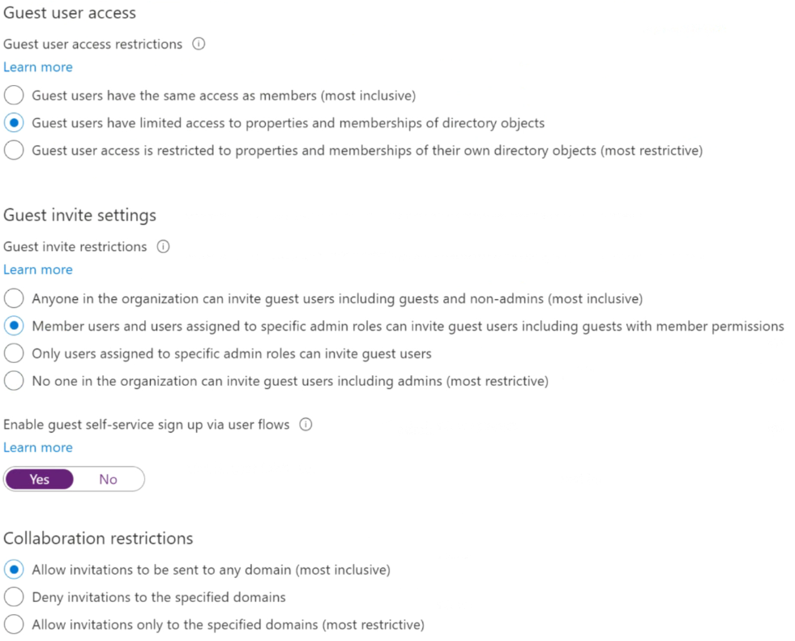

----------------------------------------

## Exam SC-300 topic 1 question 60 discussion

Actual exam question from

Microsoft's
SC-300

Question #: 60
Topic #: 1

[All SC-300 Questions]

HOTSPOT -Your network contains an on-premises Active Directory Domain Services (AD DS) domain that syncs with Azure AD and contains the users shown in the following table.In Azure AD Connect, Domain/OU Filtering is configured as shown in the following exhibit.Azure AD Connect is configured as shown in the following exhibit.For each of the following statements, select Yes if the statement is true. Otherwise, select No.NOTE: Each correct selection is worth one point. 
Suggested Answer: 

**Answer: **

**Timestamp: Oct. 9, 2023, 6:36 p.m.**

[View on ExamTopics](https://www.examtopics.com/discussions/microsoft/view/123017-exam-sc-300-topic-1-question-60-discussion/)

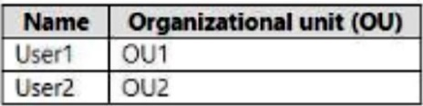
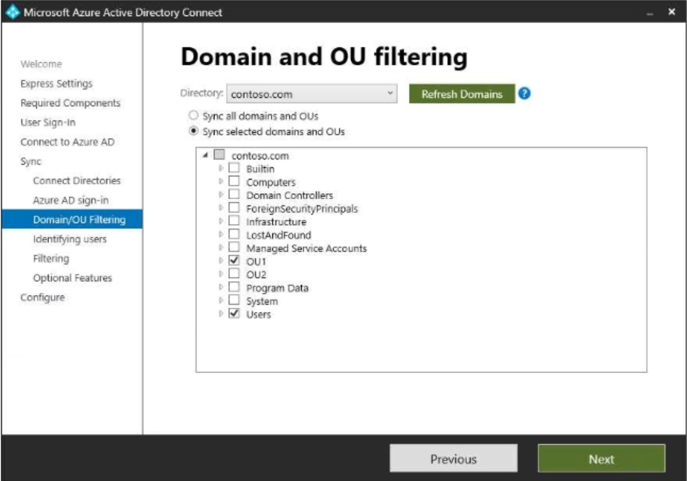
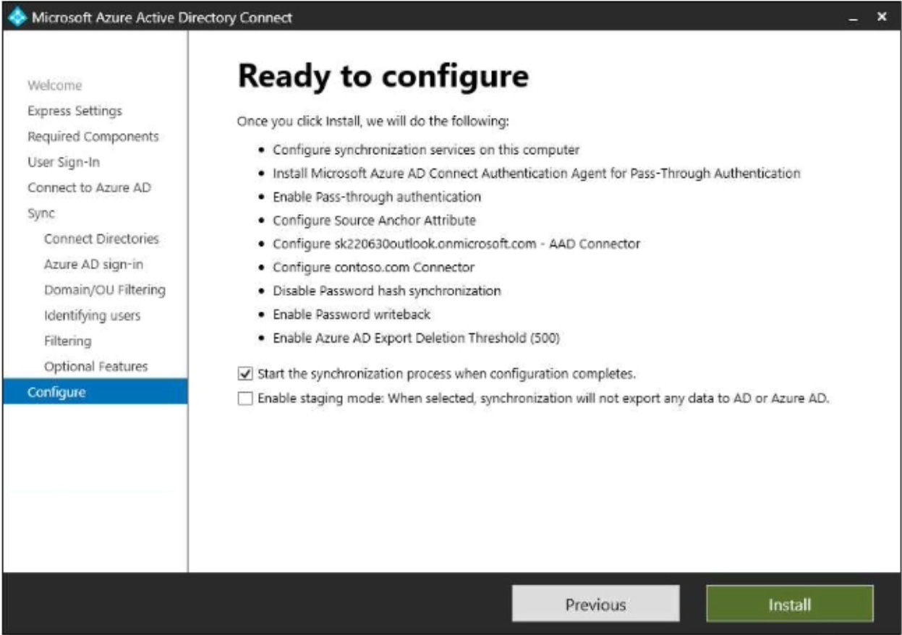
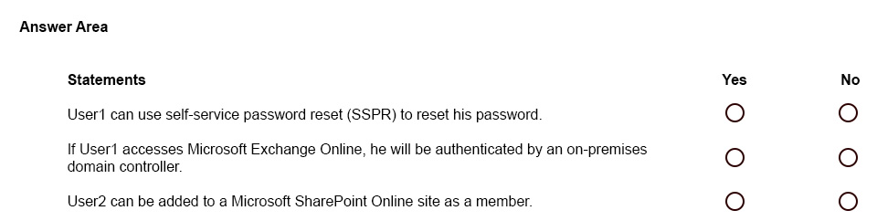
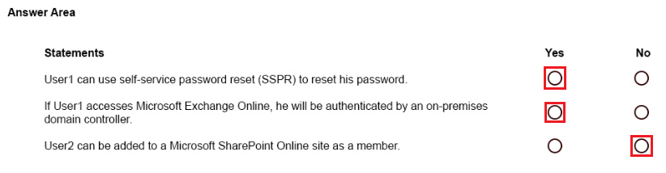

----------------------------------------

## Exam SC-300 topic 1 question 61 discussion

Actual exam question from

Microsoft's
SC-300

Question #: 61
Topic #: 1

[All SC-300 Questions]

You have 2,500 users who are assigned Microsoft Office 365 Enterprise E3 licenses. The licenses are assigned to individual users.From the Groups blade in the Azure Active Directory admin center, you assign Microsoft Office 365 Enterprise E5 licenses to a group that includes all users.You need to remove the Office 365 Enterprise E3 licenses from the users by using the least amount of administrative effort.What should you use? 
Suggested Answer: B 🗳️ 

A. the Update-MgGroup cmdlet

B. the Licenses blade in the Azure Active Directory admin center

C. the Set-WindowsProductKey cmdlet

D. the Administrative units blade in the Azure Active Directory admin center

**Answer: B**

**Timestamp: Oct. 29, 2023, 3:59 p.m.**

[View on ExamTopics](https://www.examtopics.com/discussions/microsoft/view/124887-exam-sc-300-topic-1-question-61-discussion/)

----------------------------------------

## Exam SC-300 topic 1 question 62 discussion

Actual exam question from

Microsoft's
SC-300

Question #: 62
Topic #: 1

[All SC-300 Questions]

You have an Azure AD tenant that contains the users shown in the following table.You need to compare the role permissions of each user. The solution must minimize administrative effort.What should you use? 
Suggested Answer: B 🗳️ 

A. the Microsoft 365 Defender portal

B. the Microsoft 365 admin center

C. the Microsoft Entra admin center

D. the Microsoft Purview compliance portal

**Answer: B**

**Timestamp: Oct. 3, 2023, 2:40 a.m.**

[View on ExamTopics](https://www.examtopics.com/discussions/microsoft/view/122192-exam-sc-300-topic-1-question-62-discussion/)

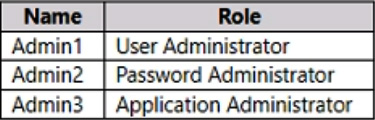

----------------------------------------

## Exam SC-300 topic 1 question 63 discussion

Actual exam question from

Microsoft's
SC-300

Question #: 63
Topic #: 1

[All SC-300 Questions]

You have a Microsoft Exchange organization that uses an SMTP address space of contoso.com.Several users use their contoso.com email address for self-service sign-up to Azure AD.You gain global administrator privileges to the Azure AD tenant that contains the self-signed users.You need to prevent the users from creating user accounts in the contoso.com Azure AD tenant for self-service sign-up to Microsoft 365 services.Which PowerShell cmdlet should you run? 
Suggested Answer: A 🗳️ 

A. Update-MgOrganization

B. Update-MgPolicyPermissionGrantPolicyExclude

C. Update-MgDomain

D. Update-MgDomainFederationConfiguration

**Answer: A**

**Timestamp: Oct. 29, 2023, 4:19 p.m.**

[View on ExamTopics](https://www.examtopics.com/discussions/microsoft/view/124889-exam-sc-300-topic-1-question-63-discussion/)

----------------------------------------

## Exam SC-300 topic 1 question 64 discussion

Actual exam question from

Microsoft's
SC-300

Question #: 64
Topic #: 1

[All SC-300 Questions]

HOTSPOT -You have an Azure AD tenant.You need to configure the following External Identities features:• B2B collaboration• Monthly active users (MAU)-based pricingWhich two settings should you configure? To answer, select the settings in the answer area.NOTE: Each correct selection is worth one point. 
Suggested Answer: 

**Answer: **

**Timestamp: Nov. 3, 2023, 8:48 a.m.**

[View on ExamTopics](https://www.examtopics.com/discussions/microsoft/view/125245-exam-sc-300-topic-1-question-64-discussion/)

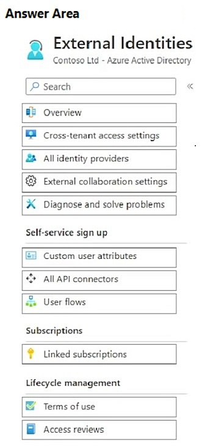
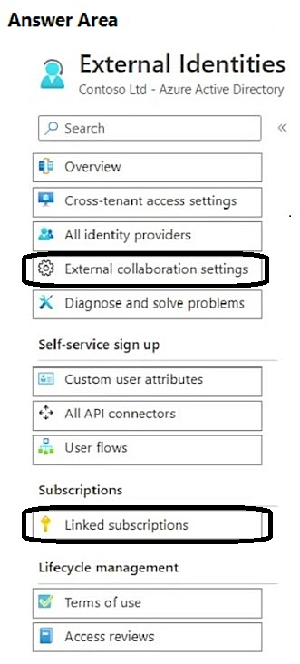

----------------------------------------

## Exam SC-300 topic 1 question 65 discussion

Actual exam question from

Microsoft's
SC-300

Question #: 65
Topic #: 1

[All SC-300 Questions]

You have an Azure AD tenant that contains the external user shown in the following exhibit.You update the email address of the user.You need to ensure that the user can authenticate by using the updated email address.What should you do for the user? 
Suggested Answer: D 🗳️ 

A. Modify the Authentication methods settings.

B. Reset the password.

C. Revoke the active sessions.

D. Reset the redemption status.

**Answer: D**

**Timestamp: Nov. 8, 2023, 6:33 p.m.**

[View on ExamTopics](https://www.examtopics.com/discussions/microsoft/view/125636-exam-sc-300-topic-1-question-65-discussion/)

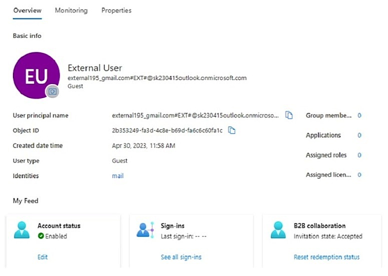

----------------------------------------

## Exam SC-300 topic 1 question 66 discussion

Actual exam question from

Microsoft's
SC-300

Question #: 66
Topic #: 1

[All SC-300 Questions]

You have an Azure AD tenant.You need to ensure that only users from specific external domains can be invited as guests to the tenant.Which settings should you configure? 
Suggested Answer: A 🗳️ 

A. External collaboration settings

B. All identity providers

C. Cross-tenant access settings

D. Linked subscriptions

**Answer: A**

**Timestamp: Nov. 7, 2023, 4:03 p.m.**

[View on ExamTopics](https://www.examtopics.com/discussions/microsoft/view/125592-exam-sc-300-topic-1-question-66-discussion/)

----------------------------------------

## Exam SC-300 topic 1 question 67 discussion

Actual exam question from

Microsoft's
SC-300

Question #: 67
Topic #: 1

[All SC-300 Questions]

You have an Azure AD tenant that contains a user named User1 and a Microsoft 365 group named Group1. User1 is the owner of Group1.You need to ensure that User1 is notified every three months to validate the guest membership of Group1.What should you do? 
Suggested Answer: B 🗳️ 

A. Configure the External collaboration settings.

B. Create an access review.

C. Configure an access package.

D. Create a group expiration policy.

**Answer: B**

**Timestamp: Nov. 2, 2023, 8:45 p.m.**

[View on ExamTopics](https://www.examtopics.com/discussions/microsoft/view/125210-exam-sc-300-topic-1-question-67-discussion/)

----------------------------------------

## Exam SC-300 topic 1 question 68 discussion

Actual exam question from

Microsoft's
SC-300

Question #: 68
Topic #: 1

[All SC-300 Questions]

HOTSPOT -You have a Microsoft Entra tenant that contains a group named Group3 and an administrative unit named Department1.Department1 has the users shown in the Users exhibit. (Click the Users tab.)Department1 has the groups shown in the Groups exhibit. (Click the Groups tab.)The User Administrator role assignments are shown in the Assignments exhibit (Click the Assignments tab.)The members of Group2 are shown in the Group2 exhibit. (Click the Group2 tab.)For each of the following statements, select Yes if the statement is true. Otherwise, select No.NOTE: Each correct selection is worth one point. 
Suggested Answer: 

**Answer: **

**Timestamp: Jan. 23, 2024, 2 p.m.**

[View on ExamTopics](https://www.examtopics.com/discussions/microsoft/view/131887-exam-sc-300-topic-1-question-68-discussion/)

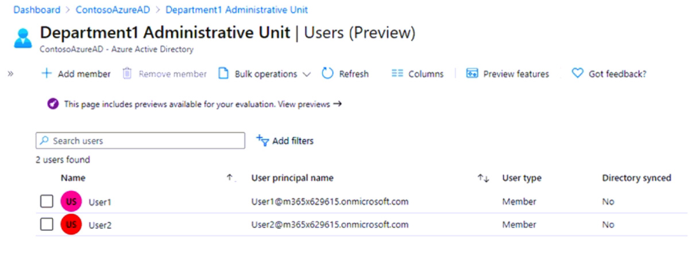
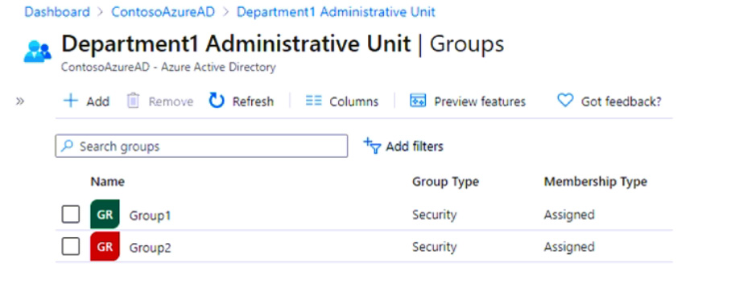
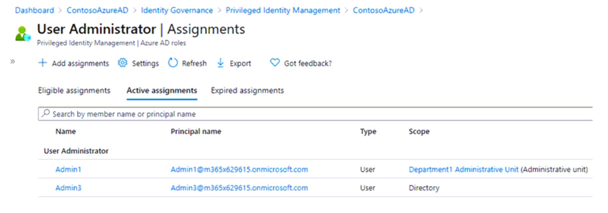
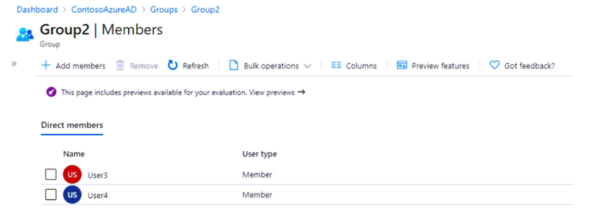
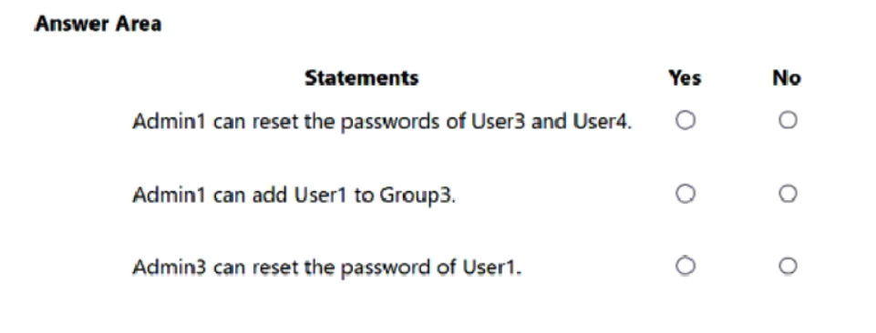
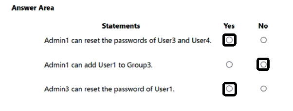

----------------------------------------

## Exam SC-300 topic 1 question 69 discussion

Actual exam question from

Microsoft's
SC-300

Question #: 69
Topic #: 1

[All SC-300 Questions]

HOTSPOT -Your network contains an on-premises Active Directory Domain Services (AD DS) domain named fabrikam.com. The domain contains an Active Directory Federation Services (AD FS) instance and a member server named Server1 that runs Windows Server. The domain contains the users shown in the following table.You have a Microsoft Entra tenant named contoso.com that is linked to a Microsoft 365 subscription.You establish federation between fabrikam.com and contoso.com by using a Microsoft Entra Connect instance that is configured as shown in the following exhibit.You perform the following tasks in contoso.com:• Create a group named Group1.• Disable User2.• Enable User3.For each of the following statements, select Yes if the statement is true. Otherwise, select No.NOTE: Each correct selection is worth one point. 
Suggested Answer: 

**Answer: **

**Timestamp: Jan. 26, 2024, 3:24 a.m.**

[View on ExamTopics](https://www.examtopics.com/discussions/microsoft/view/132194-exam-sc-300-topic-1-question-69-discussion/)

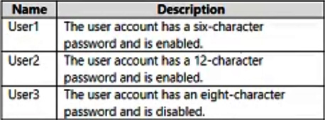
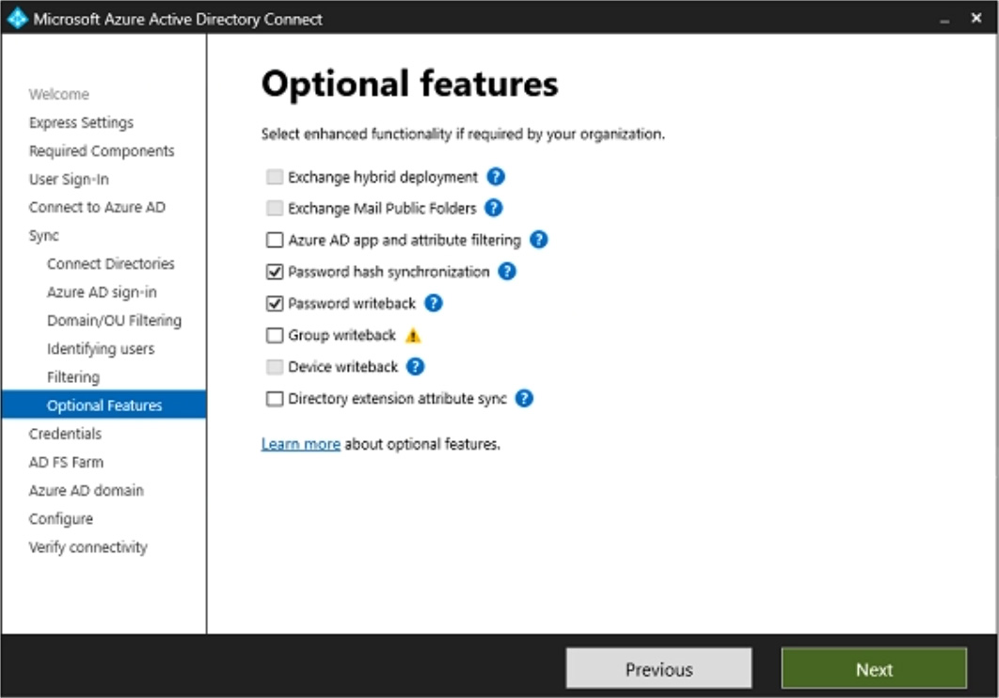
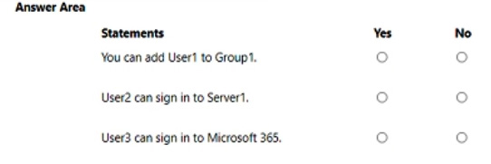
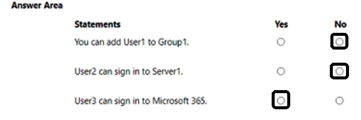

----------------------------------------

## Exam SC-300 topic 1 question 70 discussion

Actual exam question from

Microsoft's
SC-300

Question #: 70
Topic #: 1

[All SC-300 Questions]

HOTSPOT -You have a Microsoft Entra tenant that has a Microsoft Entra ID P2 service plan. The tenant contains the users shown in the following table.You have the Device settings shown in the following exhibit.User1 has the devices shown in the following table.For each of the following statements, select Yes if the statement is true. Otherwise. select No.NOTE: Each correct selection is worth one point. 
Suggested Answer: 

**Answer: **

**Timestamp: Jan. 25, 2024, 10:04 p.m.**

[View on ExamTopics](https://www.examtopics.com/discussions/microsoft/view/132162-exam-sc-300-topic-1-question-70-discussion/)

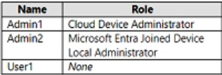
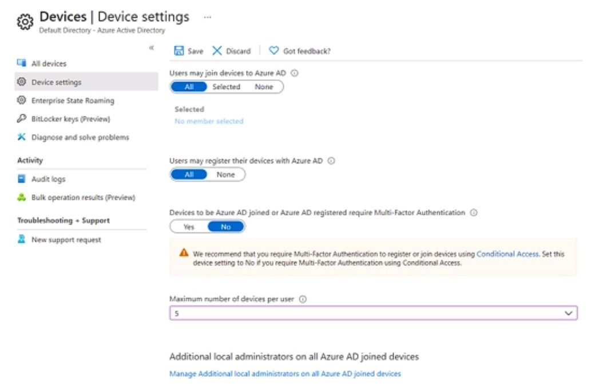
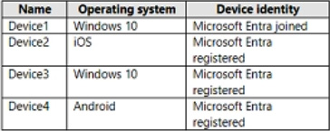
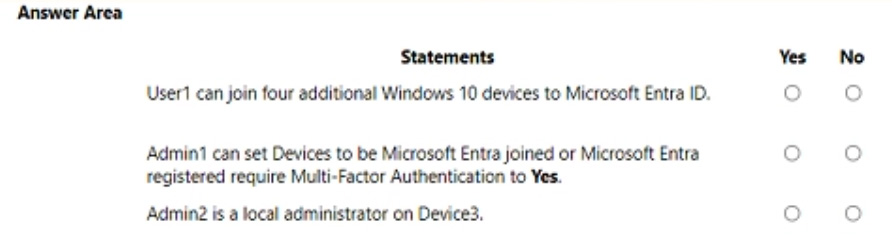
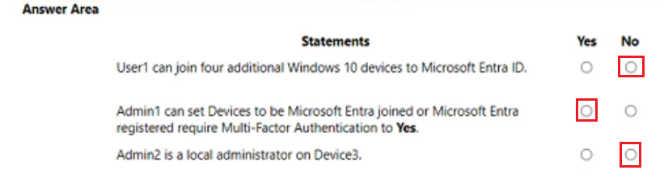

----------------------------------------

## Exam SC-300 topic 1 question 71 discussion

Actual exam question from

Microsoft's
SC-300

Question #: 71
Topic #: 1

[All SC-300 Questions]

You have an Azure subscription named Sub1 that contains a user named User1.You need to ensure that User1 can purchase a Microsoft Entra Permissions Management license for Sub1. The solution must follow the principle of least privilege.Which role should you assign to User1? 
Suggested Answer: B 🗳️ 

A. Global Administrator

B. Billing Administrator

C. Permissions Management Administrator

D. User Access Administrator

**Answer: B**

**Timestamp: Jan. 24, 2024, 12:55 a.m.**

[View on ExamTopics](https://www.examtopics.com/discussions/microsoft/view/131922-exam-sc-300-topic-1-question-71-discussion/)

----------------------------------------

## Exam SC-300 topic 1 question 72 discussion

Actual exam question from

Microsoft's
SC-300

Question #: 72
Topic #: 1

[All SC-300 Questions]

You have an Azure subscription that contains a user named User1 and two resource groups named RG1 and RG2.You need to ensure that User1 can perform the following tasks:• View all resources.• Restart virtual machines.• Create virtual machines in RG1 only.• Create storage accounts in RG1 only.What is the minimum number of role-based access control (RBAC) role assignments required? 
Suggested Answer: C 🗳️ 

A. 1

B. 2

C. 3

D. 4

**Answer: C**

**Timestamp: Jan. 24, 2024, 8:59 a.m.**

[View on ExamTopics](https://www.examtopics.com/discussions/microsoft/view/131993-exam-sc-300-topic-1-question-72-discussion/)

----------------------------------------

## Exam SC-300 topic 1 question 73 discussion

Actual exam question from

Microsoft's
SC-300

Question #: 73
Topic #: 1

[All SC-300 Questions]

You work for a company named Contoso, Ltd. that has a Microsoft Entra tenant named contoso.com.Contoso is working on a project with the following two partner companies:• A company named A. Datum Corporation that has a Microsoft Entra tenant named adatum.com.• A company named Fabrikam, Inc. that has a Microsoft Entra tenant named fabrikam.com.When you attempt to invite a new guest user from adatum.com to contoso.com, you receive an error message.You can successfully invite a new guest user from fabnkam.com to contoso.com.You need to be able to invite new guest users from adatum.com to contoso.com.What should you configure? 
Suggested Answer: D 🗳️ 

A. Guest invite settings

B. Verifiable credentials

C. Named locations

D. Collaboration restrictions

**Answer: D**

**Timestamp: Jan. 30, 2024, 11:21 a.m.**

[View on ExamTopics](https://www.examtopics.com/discussions/microsoft/view/132434-exam-sc-300-topic-1-question-73-discussion/)

----------------------------------------

## Exam SC-300 topic 1 question 74 discussion

Actual exam question from

Microsoft's
SC-300

Question #: 74
Topic #: 1

[All SC-300 Questions]

You have an Azure subscription that contains a user-assigned managed identity named Managed1 in the East US Azure region. The subscription contains the resources shown in the following table.Which resources can use Managed1 as their identity? 
Suggested Answer: C 🗳️ 

A. WebApp1 only

B. storage1 and WebApp1 only

C. VM1 and WebApp1 only

D. VM1, storage1, and WebApp1

**Answer: C**

**Timestamp: March 29, 2024, 10:25 p.m.**

[View on ExamTopics](https://www.examtopics.com/discussions/microsoft/view/137498-exam-sc-300-topic-1-question-74-discussion/)

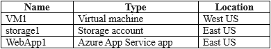

----------------------------------------

## Exam SC-300 topic 1 question 75 discussion

Actual exam question from

Microsoft's
SC-300

Question #: 75
Topic #: 1

[All SC-300 Questions]

DRAG DROP -Your network contains an on-premises Active Directory domain named contoso.com that syncs with Microsoft Entra ID by using Microsoft Entra Connect. The domain contains the users shown in the following table.From Active Directory Users and Computers, you add the following user:• Name: User3• UPN: [email protected]• Proxy addresses: smtp: [email protected], smtp: [email protected]From Active Directory Users and Computers, you update the proxyAddresses attribute for each user as shown in the following table.You trigger a manual synchronization.Which sync status will Microsoft Entra Connect sync return for each user? To answer, drag the appropriate status to the correct users. Each status may be used once, more than once, or not at all. You may need to drag the split bar between panes or scroll to view content.NOTE: Each correct selection is worth one point. 
Suggested Answer: 

**Answer: **

**Timestamp: March 29, 2024, 10:36 p.m.**

[View on ExamTopics](https://www.examtopics.com/discussions/microsoft/view/137499-exam-sc-300-topic-1-question-75-discussion/)

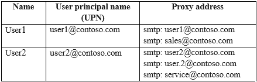
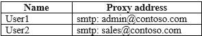

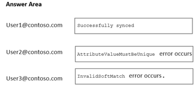

----------------------------------------

## Exam SC-300 topic 1 question 76 discussion

Actual exam question from

Microsoft's
SC-300

Question #: 76
Topic #: 1

[All SC-300 Questions]

You have a Microsoft 365 tenant that uses the domain name fabrikam.com.The External collaboration settings are configured as shown in the Collaboration exhibit. (Click the Collaboration tab.)The Email one-time passcode for guests setting is enabled for the tenant.A user named [email protected] shares a Microsoft SharePoint Online document library to the users shown in the following table.Which users will be emailed a passcode? 
Suggested Answer: B 🗳️ 

A. User1 only

B. User2 only

C. User1 and User2 only

D. User1, User2, and User3

**Answer: B**

**Timestamp: April 4, 2024, 8:45 p.m.**

[View on ExamTopics](https://www.examtopics.com/discussions/microsoft/view/137912-exam-sc-300-topic-1-question-76-discussion/)

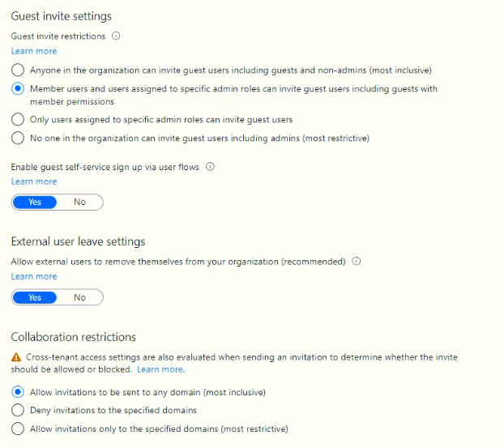
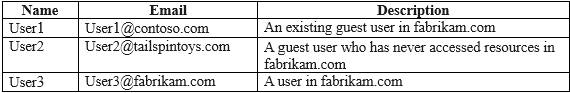

----------------------------------------

## Exam SC-300 topic 1 question 77 discussion

Actual exam question from

Microsoft's
SC-300

Question #: 77
Topic #: 1

[All SC-300 Questions]

You have an Azure subscription named Sub1 that contains a virtual machine named VM1.You need to enable Microsoft Entra login for VM1 and configure VM1 to access the resources in Sub1.Which type of identity should you assign to VM1? 
Suggested Answer: D 🗳️ 

A. Microsoft Entra user account

B. user-assigned managed identity

C. Azure Automation account

D. system-assigned managed identity

**Answer: D**

**Timestamp: March 29, 2024, 10:57 p.m.**

[View on ExamTopics](https://www.examtopics.com/discussions/microsoft/view/137500-exam-sc-300-topic-1-question-77-discussion/)

----------------------------------------

## Exam SC-300 topic 1 question 78 discussion

Actual exam question from

Microsoft's
SC-300

Question #: 78
Topic #: 1

[All SC-300 Questions]

You have 2,500 users who are assigned Microsoft Office 365 Enterprise E3 licenses. The licenses are assigned to individual users.From the Groups blade in the Microsoft Entra admin center, you assign Microsoft Office 365 Enterprise E5 licenses to a group that includes all users.You need to remove the Office 365 Enterprise E3 licenses from the users by using the least amount of administrative effort.What should you use? 
Suggested Answer: C 🗳️ 

A. the Set-WindowsProductKey cmdlet

B. the Update-MgGroup cmdlet

C. the Set-MgUserLicense cmdlet

D. the Update-MgUser cmdlet

**Answer: C**

**Timestamp: March 30, 2024, 8:52 a.m.**

[View on ExamTopics](https://www.examtopics.com/discussions/microsoft/view/137520-exam-sc-300-topic-1-question-78-discussion/)

----------------------------------------

## Exam SC-300 topic 1 question 79 discussion

Actual exam question from

Microsoft's
SC-300

Question #: 79
Topic #: 1

[All SC-300 Questions]

You have 2,500 users who are assigned Microsoft Office 365 Enterprise E3 licenses. The licenses are assigned to individual users.From the Groups blade in the Microsoft Entra admin center, you assign Microsoft Office 365 Enterprise E5 licenses to a group that includes all users.You need to remove the Office 365 Enterprise E3 licenses from the users by using the least amount of administrative effort.What should you use? 
Suggested Answer: A 🗳️ 

A. the Licenses blade in the Microsoft Entra admin center

B. the Administrative units blade in the Microsoft Entra admin center

C. the Identity Governance blade in the Microsoft Entra admin center

D. the Update-MgUser cmdlet

**Answer: A**

**Timestamp: March 30, 2024, 8:53 a.m.**

[View on ExamTopics](https://www.examtopics.com/discussions/microsoft/view/137521-exam-sc-300-topic-1-question-79-discussion/)

----------------------------------------

## Exam SC-300 topic 1 question 80 discussion

Actual exam question from

Microsoft's
SC-300

Question #: 80
Topic #: 1

[All SC-300 Questions]

You have 2,500 users who are assigned Microsoft Office 365 Enterprise E3 licenses. The licenses are assigned to individual users.From the Groups blade in the Microsoft Entra admin center, you assign Microsoft Office 365 Enterprise E5 licenses to a group that includes all users.You need to remove the Office 365 Enterprise E3 licenses from the users by using the least amount of administrative effort.What should you use? 
Suggested Answer: C 🗳️ 

A. the Identity Governance blade in the Microsoft Entra admin center

B. the Update-MgGroup cmdlet

C. the Set-MgUserLicense cmdlet

D. the Administrative units blade in the Microsoft Entra admin center

**Answer: C**

**Timestamp: Jan. 20, 2025, 11:11 a.m.**

[View on ExamTopics](https://www.examtopics.com/discussions/microsoft/view/154976-exam-sc-300-topic-1-question-80-discussion/)

----------------------------------------

## Exam SC-300 topic 1 question 81 discussion

Actual exam question from

Microsoft's
SC-300

Question #: 81
Topic #: 1

[All SC-300 Questions]

SIMULATION -Use the following login credentials as needed:To enter your username, place your cursor in the Sign in box and click on the username below.To enter your password, place your cursor in the Enter password box and click on the password below.Microsoft 365 Username:[email protected]Microsoft 365 Password: =1122334455667788If the Microsoft 365 portal does not load successfully in the browser, press CTRL-K to reload the portal in a new browser tab.The following information is for technical support purposes only:Lab Instance: 99999999 -You need to ensure the owner of each Microsoft 365 group is notified to renew their group every 180 days. Groups that are NOT renewed must be deleted. For groups without an owner, the notifications must be sent to Allan Deyoung.To complete this task, sign in to the appropriate admin center. 
Suggested Answer: 

**Answer: **

**Timestamp: Jan. 20, 2025, 4:52 p.m.**

[View on ExamTopics](https://www.examtopics.com/discussions/microsoft/view/155003-exam-sc-300-topic-1-question-81-discussion/)

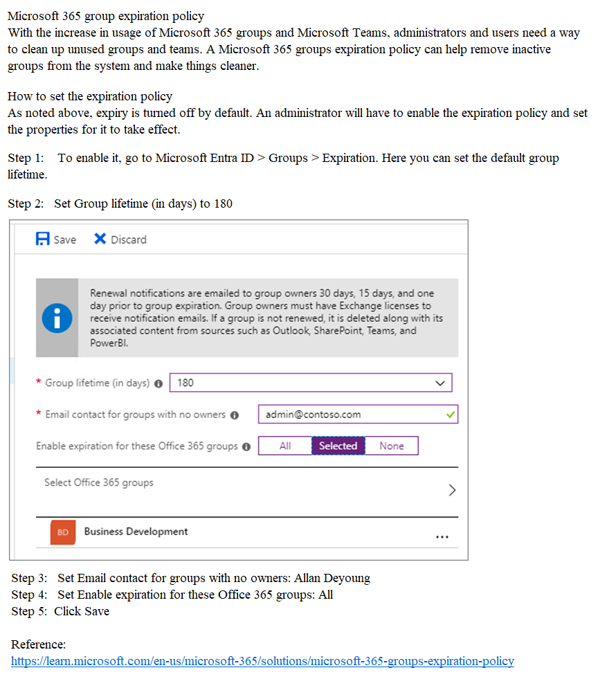

----------------------------------------

## Exam SC-300 topic 1 question 82 discussion

Actual exam question from

Microsoft's
SC-300

Question #: 82
Topic #: 1

[All SC-300 Questions]

SIMULATION -Use the following login credentials as needed:To enter your username, place your cursor in the Sign in box and click on the username below.To enter your password, place your cursor in the Enter password box and click on the password below.Microsoft 365 Username:[email protected]Microsoft 365 Password: =1122334455667788If the Microsoft 365 portal does not load successfully in the browser, press CTRL-K to reload the portal in a new browser tab.The following information is for technical support purposes only:Lab Instance: 99999999 -You need to prevent all users from using passwords that are variations of the word Falcon.To complete this task, sign in to the appropriate admin center. 
Suggested Answer: 

**Answer: **

**Timestamp: Jan. 20, 2025, 5:06 p.m.**

[View on ExamTopics](https://www.examtopics.com/discussions/microsoft/view/155008-exam-sc-300-topic-1-question-82-discussion/)

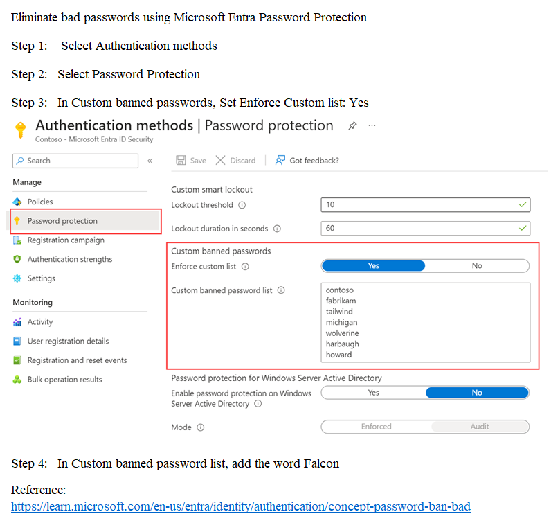

----------------------------------------

## Exam SC-300 topic 1 question 83 discussion

Actual exam question from

Microsoft's
SC-300

Question #: 83
Topic #: 1

[All SC-300 Questions]

SIMULATION -Use the following login credentials as needed:To enter your username, place your cursor in the Sign in box and click on the username below.To enter your password, place your cursor in the Enter password box and click on the password below.Microsoft 365 Username:[email protected]Microsoft 365 Password: =1122334455667788If the Microsoft 365 portal does not load successfully in the browser, press CTRL-K to reload the portal in a new browser tab.The following information is for technical support purposes only:Lab Instance: 99999999 -You need to assign a Windows 10/11 Enterprise E3 license to the sg-Retail group.To complete this task, sign in to the appropriate admin center. 
Suggested Answer: 

**Answer: **

**Timestamp: Jan. 20, 2025, 5:09 p.m.**

[View on ExamTopics](https://www.examtopics.com/discussions/microsoft/view/155009-exam-sc-300-topic-1-question-83-discussion/)

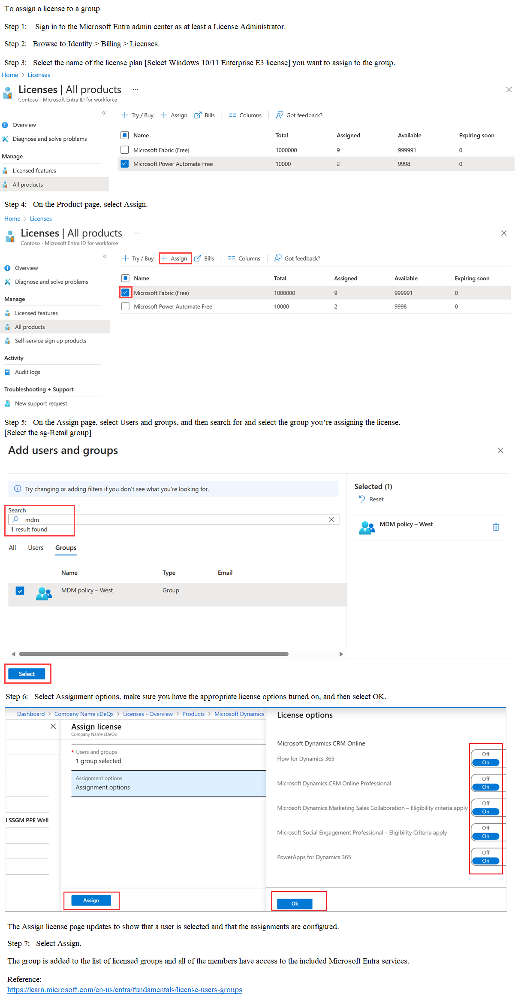

----------------------------------------

## Exam SC-300 topic 1 question 84 discussion

Actual exam question from

Microsoft's
SC-300

Question #: 84
Topic #: 1

[All SC-300 Questions]

SIMULATION -Use the following login credentials as needed:To enter your username, place your cursor in the Sign in box and click on the username below.To enter your password, place your cursor in the Enter password box and click on the password below.Microsoft 365 Username:[email protected]Microsoft 365 Password: =1122334455667788If the Microsoft 365 portal does not load successfully in the browser, press CTRL-K to reload the portal in a new browser tab.The following information is for technical support purposes only:Lab Instance: 99999999 -You need to create a group named Audit. The solution must ensure that the members of Audit can activate the Security Reader role.To complete this task, sign in to the appropriate admin center. 
Suggested Answer: 

**Answer: **

**Timestamp: Jan. 20, 2025, 5:11 p.m.**

[View on ExamTopics](https://www.examtopics.com/discussions/microsoft/view/155010-exam-sc-300-topic-1-question-84-discussion/)

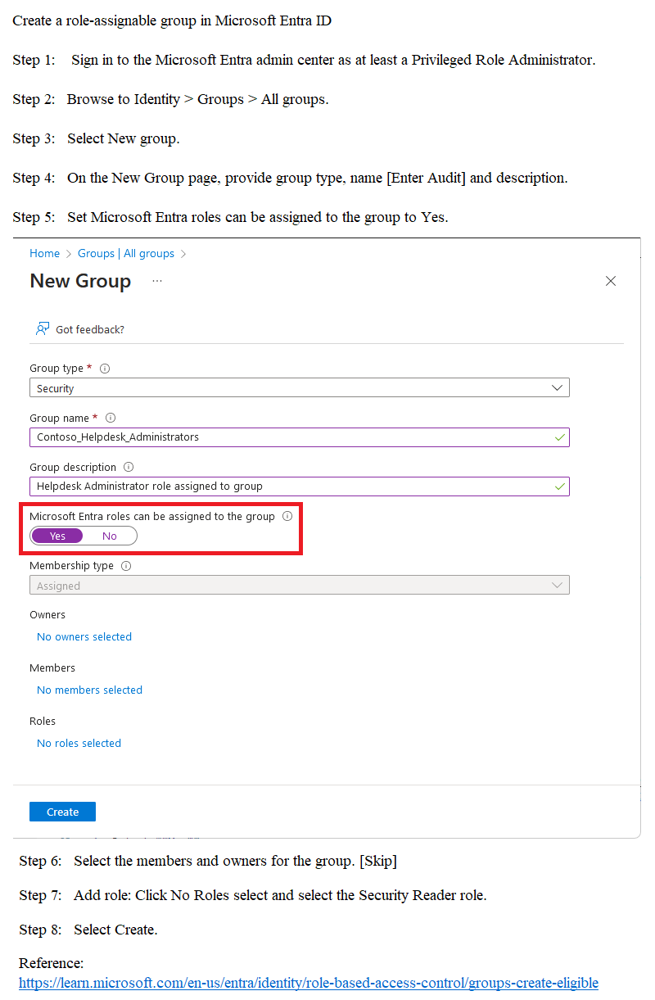

----------------------------------------

## Exam SC-300 topic 1 question 85 discussion

Actual exam question from

Microsoft's
SC-300

Question #: 85
Topic #: 1

[All SC-300 Questions]

HOTSPOT -You have a Microsoft Entra tenant named contoso.com that contains an administrative unit named AU1 and two users named User1 and User2. User1 is a member of AU1.You need to perform the following role assignments:• User1: Security Administrator• User2: User AdministratorFor which scopes can each user be assigned the role? To answer, select the appropriate options in the answer area.NOTE: Each correct selection is worth one point. 
Suggested Answer: 

**Answer: **

**Timestamp: Jan. 26, 2025, 1:18 a.m.**

[View on ExamTopics](https://www.examtopics.com/discussions/microsoft/view/155403-exam-sc-300-topic-1-question-85-discussion/)

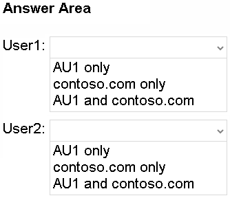
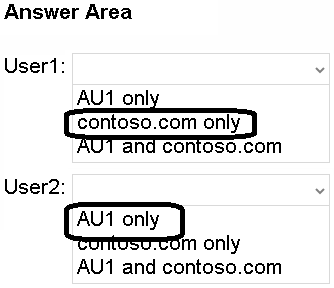

----------------------------------------

## Exam SC-300 topic 1 question 86 discussion

Actual exam question from

Microsoft's
SC-300

Question #: 86
Topic #: 1

[All SC-300 Questions]

You have 2,500 users who are assigned Microsoft Office 365 Enterprise E3 licenses. The licenses are assigned to individual users.From the Groups blade in the Microsoft Entra admin center, you assign Microsoft Office 365 Enterprise E5 licenses to a group that includes all users.You need to remove the Office 365 Enterprise E3 licenses from the users by using the least amount of administrative effort.What should you use? 
Suggested Answer: A 🗳️ 

A. the Set-MgUserLicense cmdlet

B. the Identity Governance blade in the Microsoft Entra admin center

C. the Groups blade in the Microsoft Entra admin center

D. the Update-MgGroup cmdlet

**Answer: A**

**Timestamp: Jan. 20, 2025, 12:30 p.m.**

[View on ExamTopics](https://www.examtopics.com/discussions/microsoft/view/154981-exam-sc-300-topic-1-question-86-discussion/)

----------------------------------------

## Exam SC-300 topic 1 question 87 discussion

Actual exam question from

Microsoft's
SC-300

Question #: 87
Topic #: 1

[All SC-300 Questions]

You have an Azure subscription that contains a storage account named storage1.You plan to deploy an app named App1 that will be hosted on multiple virtual machines. The virtual machines will authenticate to a third-party API by using secrets.You need to recommend an authentication solution for the virtual machines. The solution must meet the following requirements:• Securely store secrets.• Ensure that credentials do NOT need to be stored in the App1 code.• Ensure that the virtual machines can access Azure resources by using Microsoft Entra authentication• Minimize administrative effort.What should you include in the recommendation? 
Suggested Answer: B 🗳️ 

A. user accounts and Storage Service Encryption

B. user-assigned managed identities and Azure Key Vault

C. user accounts and Azure Key Vault

D. system assigned managed identities and Storage Service Encryption

**Answer: B**

**Timestamp: Dec. 29, 2024, 11:51 p.m.**

[View on ExamTopics](https://www.examtopics.com/discussions/microsoft/view/153624-exam-sc-300-topic-1-question-87-discussion/)

----------------------------------------

## Exam SC-300 topic 1 question 88 discussion

Actual exam question from

Microsoft's
SC-300

Question #: 88
Topic #: 1

[All SC-300 Questions]

HOTSPOT -You have an Azure subscription named Sub1 that contains the resources shown in the following table.Sub1 contains the managed identities shown in the following table.Sub1 has the role-based access control (RBAC) role assignments shown in the following table.For each of the following statements, select Yes if the statement is true. Otherwise, select No.NOTE: Each correct selection is worth one point. 
Suggested Answer: 

**Answer: **

**Timestamp: Jan. 20, 2025, 4:49 p.m.**

[View on ExamTopics](https://www.examtopics.com/discussions/microsoft/view/155002-exam-sc-300-topic-1-question-88-discussion/)

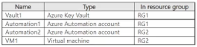
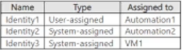
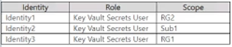
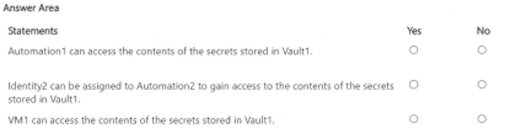
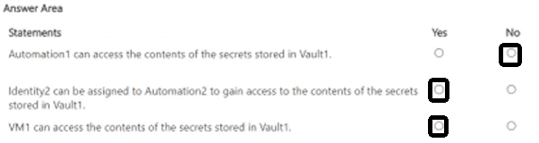

----------------------------------------

## Exam SC-300 topic 1 question 89 discussion

Actual exam question from

Microsoft's
SC-300

Question #: 89
Topic #: 1

[All SC-300 Questions]

You have an Azure subscription that contains an Azure Automation account named Automation1.You need to grant Automation1 access to Azure resources. The solution must meet the following requirements:• Ensure that any permissions granted to Automation1 are removed when the account is deleted.• Minimize administrative effort.What should you use? 
Suggested Answer: B 🗳️ 

A. a client secret

B. a system-assigned managed identity

C. a certificate

D. user-assigned managed identity

**Answer: B**

**Timestamp: Jan. 9, 2025, 1:08 p.m.**

[View on ExamTopics](https://www.examtopics.com/discussions/microsoft/view/154153-exam-sc-300-topic-1-question-89-discussion/)

----------------------------------------

## Exam SC-300 topic 1 question 90 discussion

Actual exam question from

Microsoft's
SC-300

Question #: 90
Topic #: 1

[All SC-300 Questions]

You have a Microsoft Entra tenant named contoso.com that contains an enterprise application named App1.A contractor uses the credentials of [email protected].You need to ensure that you can provide the contractor with access to App1. The contractor must be able to authenticate as [email protected].What should you do? 
Suggested Answer: C 🗳️ 

A. Add a custom domain name to contoso.com.

B. Configure the External collaboration settings.

C. Create a guest user account in contoso.com.

D. Add a WS-Fed identity provider.

**Answer: C**

**Timestamp: Jan. 9, 2025, 1:09 p.m.**

[View on ExamTopics](https://www.examtopics.com/discussions/microsoft/view/154154-exam-sc-300-topic-1-question-90-discussion/)

----------------------------------------

## Exam SC-300 topic 1 question 91 discussion

Actual exam question from

Microsoft's
SC-300

Question #: 91
Topic #: 1

[All SC-300 Questions]

HOTSPOT -You have two Microsoft Entra tenants named contoso.com and fabrikam.com.Contoso.com contains the users shown in the following table.Contoso.com contains the groups shown in the following table.You configure cross-tenant synchronization from contoso.com to fabrikam.com and enable cross-tenant synchronization for User3 and Group2.For each of the following statements, select Yes if the statement is true. Otherwise, select No.NOTE: Each correct selection is worth one point. 
Suggested Answer: 

**Answer: **

**Timestamp: Feb. 19, 2025, 8:44 p.m.**

[View on ExamTopics](https://www.examtopics.com/discussions/microsoft/view/156822-exam-sc-300-topic-1-question-91-discussion/)

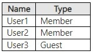
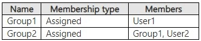
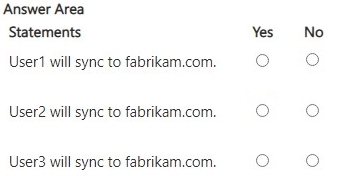
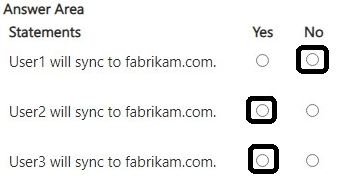

----------------------------------------

## Exam SC-300 topic 1 question 92 discussion

Actual exam question from

Microsoft's
SC-300

Question #: 92
Topic #: 1

[All SC-300 Questions]

You have a Microsoft Exchange organization that uses an SMTP address space of contoso.com.Several users use their contoso.com email address for self-service sign-up to Microsoft Entra.You gain global administrator privileges to the Microsoft Entra tenant that contains the self-signed users.You need to prevent the users from creating user accounts in the contoso.com Microsoft Entra tenant for self-service sign-up to Microsoft 365 services.Which PowerShell cmdlet should you run? 
Suggested Answer: A 🗳️ 

A. Update-MgPolicyAuthorizationPolicy

B. Update-MgDomain

C. Update-MgPolicyPermissionGrantPolicyExclude

D. Update-MgDomainFederationConfiguration

**Answer: A**

**Timestamp: Dec. 21, 2024, 6:29 p.m.**

[View on ExamTopics](https://www.examtopics.com/discussions/microsoft/view/153301-exam-sc-300-topic-1-question-92-discussion/)

----------------------------------------

## Exam SC-300 topic 1 question 93 discussion

Actual exam question from

Microsoft's
SC-300

Question #: 93
Topic #: 1

[All SC-300 Questions]

You have a Microsoft Entra tenant that contains the users shown in the following table.You add an enterprise application named App1 and configure the following Self-service settings:• Allow users to request access to this application: Yes• To which group should assigned users be added: Group1• Require approval before granting access to this application: Yes• Who is allowed to approve access to this application: User2Which users can request access to App1? 
Suggested Answer: D 🗳️ 

A. User3 only

B. User2 and User3 only

C. User1 and User3 only

D. User1, User2, and User3

**Answer: D**

**Timestamp: Dec. 24, 2024, 8:23 p.m.**

[View on ExamTopics](https://www.examtopics.com/discussions/microsoft/view/153397-exam-sc-300-topic-1-question-93-discussion/)

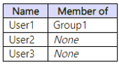

----------------------------------------

## Exam SC-300 topic 1 question 94 discussion

Actual exam question from

Microsoft's
SC-300

Question #: 94
Topic #: 1

[All SC-300 Questions]

HOTSPOT -You have a Microsoft Entra tenant that contains the users shown in the following table.The tenant contains the identities shown in the following table.Which users can create custom security attributes, and to which identities can the attributes be assigned? To answer, select the appropriate options in the answer area.NOTE: Each correct selection is worth one point. 
Suggested Answer: 

**Answer: **

**Timestamp: Feb. 6, 2025, 10:56 a.m.**

[View on ExamTopics](https://www.examtopics.com/discussions/microsoft/view/156023-exam-sc-300-topic-1-question-94-discussion/)

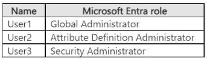
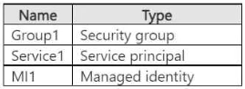
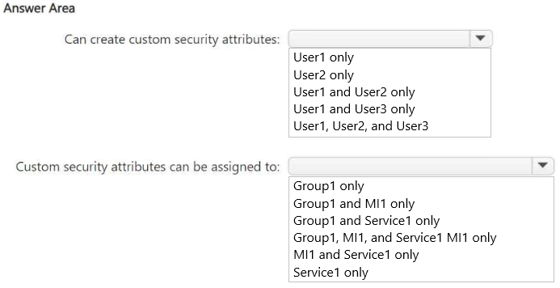
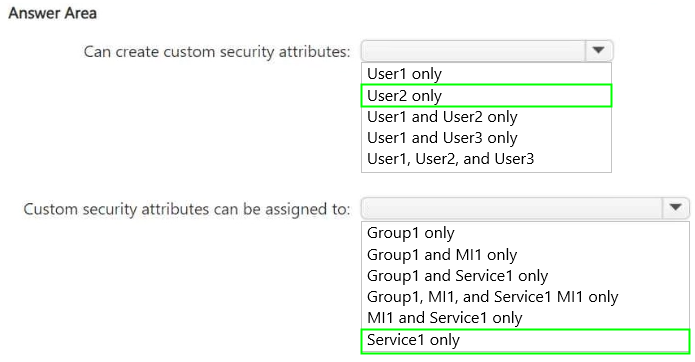

----------------------------------------

## Exam SC-300 topic 1 question 95 discussion

Actual exam question from

Microsoft's
SC-300

Question #: 95
Topic #: 1

[All SC-300 Questions]

You have a Microsoft Entra tenant named contoso.com that contains an enterprise application named App1.A contractor uses the credentials of [email protected].You need to ensure that you can provide the contractor with access to App1. The contractor must be able to authenticate as [email protected].What should you do? 
Suggested Answer: B 🗳️ 

A. Implement Microsoft Entra Connect sync.

B. Create a guest user account in contoso.com.

C. Configure the External collaboration settings.

D. Run the New-MgUser cmdlet.

**Answer: B**

**Timestamp: Feb. 15, 2025, 10:24 a.m.**

[View on ExamTopics](https://www.examtopics.com/discussions/microsoft/view/156541-exam-sc-300-topic-1-question-95-discussion/)

----------------------------------------

## Exam SC-300 topic 1 question 95 discussion

Actual exam question from

Microsoft's
SC-300

Question #: 59
Topic #: 1

[All SC-300 Questions]

You have two Microsoft Entra tenants named contoso.com and fabrikam.com. Contoso.com contains the identities shown in the following table.You configure cross-tenant synchronization from contoso.com to fabrikam.com.Which identities will sync with fabrikam.com? 
Suggested Answer: A 🗳️ 

A. User1 only

B. User1 and Group1 only

C. User1 and Group2 only

D. User1, Group1, and Group2

**Answer: A**

**Timestamp: Dec. 25, 2024, 1:56 p.m.**

[View on ExamTopics](https://www.examtopics.com/discussions/microsoft/view/153437-exam-sc-300-topic-1-question-95-discussion/)

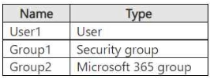

----------------------------------------

## Exam SC-300 topic 1 question 96 discussion

Actual exam question from

Microsoft's
SC-300

Question #: 96
Topic #: 1

[All SC-300 Questions]

HOTSPOT -You have a Microsoft 365 E5 subscription that contains two groups named Group1 and Group2 and the users shown in the following table.Group2 is a member of Group1.You configure cross-tenant synchronization with a partner organization named fabrikam.com by using the following configurations:• Provisioning status: On• Users and groups: Group1• Prevent accidental deletion: 500• Scope: Sync only assigned users and groups• Scoping filter: Department EQUALS MarketingFrom the Cross-tenant synchronization settings, you set Provisioning Mode to Automatic.For each of the following statements, select Yes if the statement is true. Otherwise, select No.NOTE: Each correct selection is worth one point. 
Suggested Answer: 

**Answer: **

**Timestamp: Feb. 15, 2025, 10:32 a.m.**

[View on ExamTopics](https://www.examtopics.com/discussions/microsoft/view/156542-exam-sc-300-topic-1-question-96-discussion/)

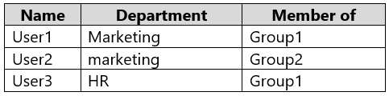
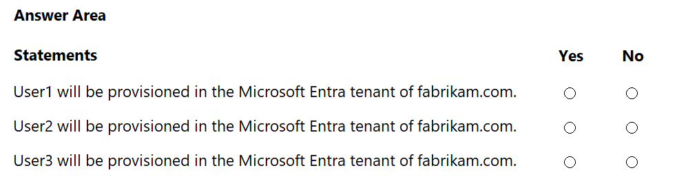
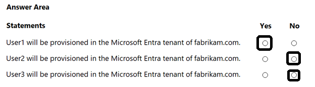

----------------------------------------

## Exam SC-300 topic 1 question 97 discussion

Actual exam question from

Microsoft's
SC-300

Question #: 97
Topic #: 1

[All SC-300 Questions]

HOTSPOT -Your network contains an on-premises Active Directory Domain Services (AD DS) domain named contoso.com. Contoso.com contains the identities shown in the following table.You have a Microsoft Entra tenant that contains a user named User1.You deploy Microsoft Entra Cloud Sync and configure a scoping filter by using the following string:CN=Group1,OU=OU1,DC=contoso,DC=com.For each of the following statements, select Yes if the statement is true. Otherwise, select No.NOTE: Each correct selection is worth one point. 
Suggested Answer: 

**Answer: **

**Timestamp: June 11, 2025, 1:41 p.m.**

[View on ExamTopics](https://www.examtopics.com/discussions/microsoft/view/304695-exam-sc-300-topic-1-question-97-discussion/)

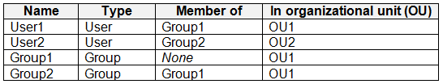
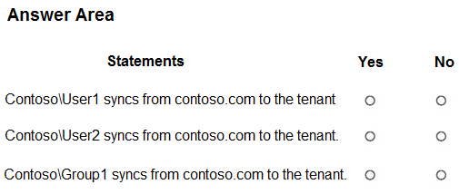
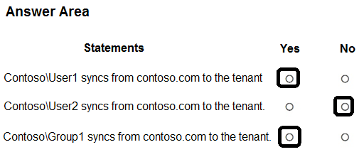

----------------------------------------

## Exam SC-300 topic 1 question 98 discussion

Actual exam question from

Microsoft's
SC-300

Question #: 98
Topic #: 1

[All SC-300 Questions]

You have a Microsoft 365 E5 subscription that contains a Microsoft SharePoint Online site named Site1 and a Microsoft Teams team named Team1. The subscription contains five security groups named Group1, Group2, Group3, Group4, and Group5.You need to implement access packages for Site1 and Team1. The solution must meet the following requirements:• Members of Group3 must be able to request access to Site1 only.• Members of Group1 must be able to request access to Site1 and Team1.• Members of Group4 must be able to request access to Site1 and Team1.• Only members of Group2 must be able to approve access package requests from Group1 members.• Only members of Group5 must be able to approve access package requests from Group3 and Group4 members.What is the minimum number of access packages you should create? 
Suggested Answer: B 🗳️ 

A. 2

B. 3

C. 4

D. 5

**Answer: B**

**Timestamp: June 11, 2025, 8:48 a.m.**

[View on ExamTopics](https://www.examtopics.com/discussions/microsoft/view/304686-exam-sc-300-topic-1-question-98-discussion/)

----------------------------------------

## Exam SC-300 topic 1 question 99 discussion

Actual exam question from

Microsoft's
SC-300

Question #: 99
Topic #: 1

[All SC-300 Questions]

HOTSPOT -You have a Microsoft 365 E5 subscription that contains the groups shown in the following table.You plan to manage the lifecycles of the groups.Which groups can be set to expire, and what is the shortest group lifetime you can set? To answer, select the appropriate options in the answer area.NOTE: Each correct selection is worth one point. 
Suggested Answer: 

**Answer: **

**Timestamp: June 26, 2025, 5 p.m.**

[View on ExamTopics](https://www.examtopics.com/discussions/microsoft/view/305403-exam-sc-300-topic-1-question-99-discussion/)

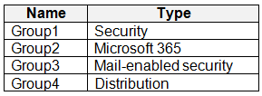
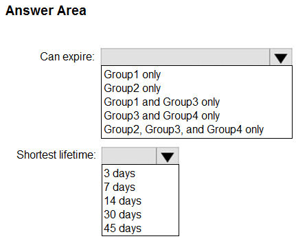
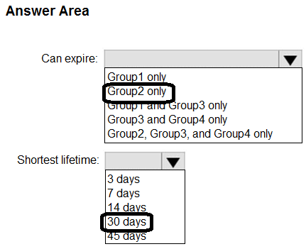

----------------------------------------

## Exam SC-300 topic 1 question 100 discussion

Actual exam question from

Microsoft's
SC-300

Question #: 100
Topic #: 1

[All SC-300 Questions]

HOTSPOT -You have two Microsoft Entra tenants named contoso.com and fabrikam.com. Contoso.com contains the users shown in the following table.You configure cross-tenant synchronization from contoso.com to fabrikam.com by using the following settings:• Users and groups: Group1• Provisioning Mode: Automatic• Attribute Mappingso Source Object Scope: Filter1, Filter2Filter1 is configured as shown in the following table.Filter2 is configured as shown in the following table.For each of the following statements, select Yes if the statement is true. Otherwise, select No.NOTE: Each correct selection is worth one point. 
Suggested Answer: 

**Answer: **

**Timestamp: June 11, 2025, 2:17 p.m.**

[View on ExamTopics](https://www.examtopics.com/discussions/microsoft/view/304697-exam-sc-300-topic-1-question-100-discussion/)

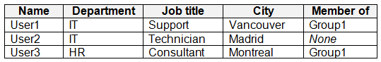
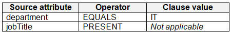
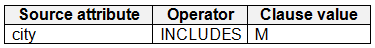
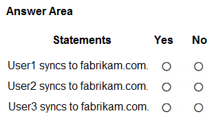
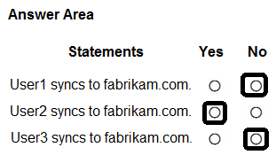

----------------------------------------

## Exam SC-300 topic 1 question 101 discussion

Actual exam question from

Microsoft's
SC-300

Question #: 101
Topic #: 1

[All SC-300 Questions]

You have a Microsoft Entra tenant.You have the end-user desktop environments shown in the following table.You need to deploy Global Secure Access.In which environments can you install the Global Secure Access client? 
Suggested Answer: D 🗳️ 

A. Contractors, Developers, Frontline workers, Office staff, and Senior managers

B. Frontline workers and Senior managers only

C. Contractors and Office staff only

D. Developers, Office staff, and Senior managers only

**Answer: D**

**Timestamp: June 11, 2025, 9 a.m.**

[View on ExamTopics](https://www.examtopics.com/discussions/microsoft/view/304689-exam-sc-300-topic-1-question-101-discussion/)

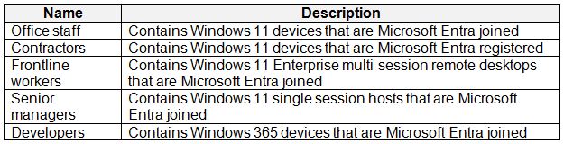

----------------------------------------

## Exam SC-300 topic 1 question 102 discussion

Actual exam question from

Microsoft's
SC-300

Question #: 102
Topic #: 1

[All SC-300 Questions]

HOTSPOT -You have a Microsoft Entra tenant that contains an administrative unit named AU1. AU1 is configured for assigned membership.The tenant contains the users shown in the following table.The tenant contains the groups shown in the following table.For AU1, you update the following configurations:• Membership type: Dynamic User• Dynamic membership rule: (user.department -eq "hr")For each of the following statements, select Yes if the statement is true. Otherwise, select No.NOTE: Each correct selection is worth one point. 
Suggested Answer: 

**Answer: **

**Timestamp: Feb. 5, 2026, 6:50 a.m.**

[View on ExamTopics](https://www.examtopics.com/discussions/microsoft/view/383256-exam-sc-300-topic-1-question-102-discussion/)

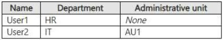
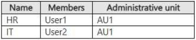
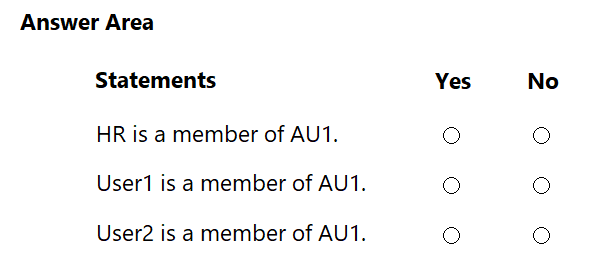
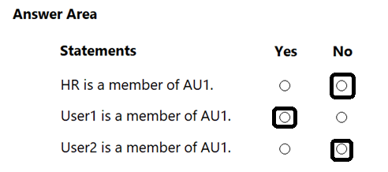

----------------------------------------

## Exam SC-300 topic 1 question 104 discussion

Actual exam question from

Microsoft's
SC-300

Question #: 104
Topic #: 1

[All SC-300 Questions]

You have a Microsoft Entra tenant.You need to add the Facebook social identity provider to the tenant. What should you do first? 
Suggested Answer: D 🗳️ 

A. Add a custom domain

B. Add a WS-Fed identity provider.

C. Add a SAML identity provider.

D. Set Enable guest self-service sign up via user flows to Yes.

**Answer: D**

**Timestamp: Feb. 5, 2026, 6:50 a.m.**

[View on ExamTopics](https://www.examtopics.com/discussions/microsoft/view/383261-exam-sc-300-topic-1-question-104-discussion/)

----------------------------------------

## Exam SC-300 topic 1 question 106 discussion

Actual exam question from

Microsoft's
SC-300

Question #: 106
Topic #: 1

[All SC-300 Questions]

You have a Microsoft Entra tenant.You create an enterprise application collection named HR Apps that has the following settings:• Applications: App1, App2, App3• Owners: Admin1• Users and groups: HRUsersAll three apps have the following Properties settings:• Enabled for users to sign in: Yes• User assignment required: Yes• Visible to users: YesUsers report that they only see App1 and App2 in the My Apps portal.You need to ensure that the users can also see App3.What should you do from App3? 
Suggested Answer: C 🗳️ 

A. From Single sign-on, configure a sign-on method.

B. From Permissions, review the User consent permissions.

C. From Users and groups, add HRUsers.

D. From Properties, change User assignment required to No.

**Answer: C**

**Timestamp: Feb. 5, 2026, 6:51 a.m.**

[View on ExamTopics](https://www.examtopics.com/discussions/microsoft/view/383269-exam-sc-300-topic-1-question-106-discussion/)

----------------------------------------

## Exam SC-300 topic 1 question 107 discussion

Actual exam question from

Microsoft's
SC-300

Question #: 107
Topic #: 1

[All SC-300 Questions]

You have 2,500 users who are assigned Microsoft 365 E3 licenses. The licenses are assigned to individual users.You assign Microsoft 365 E5 licenses to a group that includes all users.You need to remove the Microsoft 365 E3 licenses from the users by using the least amount of administrative effort.What should you use? 
Suggested Answer: D 🗳️ 

A. the Update-MgGroup cmdlet

B. the Set-WindowsProductKey cmdlet

C. the Set-MgUserLicense cmdlet

D. the Licenses blade in the Microsoft Entra admin center

**Answer: D**

**Timestamp: Feb. 5, 2026, 6:51 a.m.**

[View on ExamTopics](https://www.examtopics.com/discussions/microsoft/view/383271-exam-sc-300-topic-1-question-107-discussion/)

----------------------------------------

## Exam SC-300 topic 1 question 108 discussion

Actual exam question from

Microsoft's
SC-300

Question #: 108
Topic #: 1

[All SC-300 Questions]

HOTSPOT -You have a Microsoft Entra tenant that contains the users shown in the following table.The tenant contains the administrative units shown in the following table.The tenant contains the groups shown in the following table.You perform the following actions:• Assign User1 the User Administrator role for AU2.• Assign User3 the Groups Administrator role for AU1.• Assign User5 the Authentication Administrator role for AU3.For each of the following statements, select Yes if the statement is true. Otherwise, select No.NOTE: Each correct selection is worth one point. 
Suggested Answer: 

**Answer: **

**Timestamp: Feb. 5, 2026, 6:51 a.m.**

[View on ExamTopics](https://www.examtopics.com/discussions/microsoft/view/383274-exam-sc-300-topic-1-question-108-discussion/)

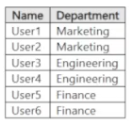
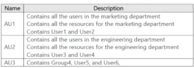
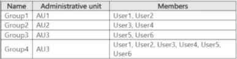
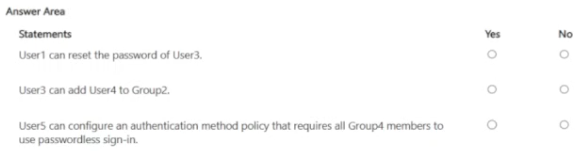
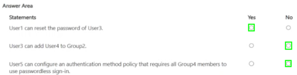

----------------------------------------

## Exam SC-300 topic 2 question 1 discussion

Actual exam question from

Microsoft's
SC-300

Question #: 1
Topic #: 2

[All SC-300 Questions]

You have a Microsoft 365 E5 subscription that contains the users shown in the following table.You configure Microsoft Entra Internet Access.Which users can manage Microsoft Entra Internet Access? 
Suggested Answer: D 🗳️ 

A. User1 only

B. User2 only

C. User3 only

D. User1 and User2 only

E. User1, User2, and User3

**Answer: D**

**Timestamp: Dec. 27, 2024, 9:23 p.m.**

[View on ExamTopics](https://www.examtopics.com/discussions/microsoft/view/153521-exam-sc-300-topic-2-question-1-discussion/)

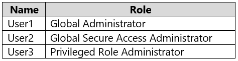

----------------------------------------

## Exam SC-300 topic 2 question 2 discussion

Actual exam question from

Microsoft's
SC-300

Question #: 2
Topic #: 2

[All SC-300 Questions]

Your company has a Microsoft 365 tenant.The company has a call center that contains 300 users. In the call center, the users share desktop computers and might use a different computer every day. The call center computers are NOT configured for biometric identification.The users are prohibited from having a mobile phone in the call center.You need to require multi-factor authentication (MFA) for the call center users when they access Microsoft 365 services.What should you include in the solution? 
Suggested Answer: D 🗳️ 

A. a named network location

B. the Microsoft Authenticator app

C. Windows Hello for Business authentication

D. FIDO2 tokens

**Answer: D**

**Timestamp: May 3, 2021, 12:21 a.m.**

[View on ExamTopics](https://www.examtopics.com/discussions/microsoft/view/51617-exam-sc-300-topic-2-question-2-discussion/)

----------------------------------------

## Exam SC-300 topic 2 question 3 discussion

Actual exam question from

Microsoft's
SC-300

Question #: 3
Topic #: 2

[All SC-300 Questions]

You have an Azure Active Directory (Azure AD) tenant named contoso.com.All users who run applications registered in Azure AD are subject to conditional access policies.You need to prevent the users from using legacy authentication.What should you include in the conditional access policies to filter out legacy authentication attempts? 
Suggested Answer: C 🗳️ 

A. a cloud apps or actions condition

B. a user risk condition

C. a client apps condition

D. a sign-in risk condition

**Answer: C**

**Timestamp: May 5, 2021, 8:55 p.m.**

[View on ExamTopics](https://www.examtopics.com/discussions/microsoft/view/51924-exam-sc-300-topic-2-question-3-discussion/)

----------------------------------------

## Exam SC-300 topic 2 question 4 discussion

Actual exam question from

Microsoft's
SC-300

Question #: 4
Topic #: 2

[All SC-300 Questions]

You have a Microsoft Entra tenant that contains the users shown in the following table.The tenant has the authentication methods shown in the following table.Which users will sign in to cloud apps by using number matching? 
Suggested Answer: A 🗳️ 

A. User1 only

B. User2 only

C. User3 only

D. User1 and User2 only

E. User2 and User3 only

**Answer: A**

**Timestamp: Jan. 14, 2025, 7:10 p.m.**

[View on ExamTopics](https://www.examtopics.com/discussions/microsoft/view/154509-exam-sc-300-topic-2-question-4-discussion/)

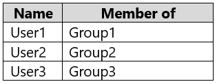
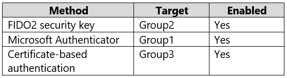

----------------------------------------

## Exam SC-300 topic 2 question 5 discussion

Actual exam question from

Microsoft's
SC-300

Question #: 5
Topic #: 2

[All SC-300 Questions]

You have a Microsoft 365 tenant.All users have computers that run Windows 10. Most computers are company-owned and joined to Azure Active Directory (Azure AD). Some computers are user- owned and are only registered in Azure AD.You need to prevent users who connect to Microsoft SharePoint Online on their user-owned computer from downloading or syncing files. Other users must NOT be restricted.Which policy type should you create? 
Suggested Answer: B 🗳️ 

A. a Microsoft Cloud App Security activity policy that has Microsoft Office 365 governance actions configured

B. an Azure AD conditional access policy that has session controls configured

C. an Azure AD conditional access policy that has client apps conditions configured

D. a Microsoft Cloud App Security app discovery policy that has governance actions configured

**Answer: B**

**Timestamp: May 5, 2021, 12:37 p.m.**

[View on ExamTopics](https://www.examtopics.com/discussions/microsoft/view/51889-exam-sc-300-topic-2-question-5-discussion/)

----------------------------------------

## Exam SC-300 topic 2 question 6 discussion

Actual exam question from

Microsoft's
SC-300

Question #: 6
Topic #: 2

[All SC-300 Questions]

You have an Active Directory domain that syncs to an Azure Active Directory (Azure AD) tenant.The on-premises network contains a VPN server that authenticates to the on-premises Active Directory domain. The VPN server does NOT support Azure Multi-Factor Authentication (MFA).You need to recommend a solution to provide Azure MFA for VPN connections.What should you include in the recommendation? 
Suggested Answer: C 🗳️ 

A. Azure AD Application Proxy

B. an Azure AD Password Protection proxy

C. Network Policy Server (NPS)

D. a pass-through authentication proxy

**Answer: C**

**Timestamp: Nov. 11, 2021, 6:29 p.m.**

[View on ExamTopics](https://www.examtopics.com/discussions/microsoft/view/65843-exam-sc-300-topic-2-question-6-discussion/)

----------------------------------------

## Exam SC-300 topic 2 question 7 discussion

Actual exam question from

Microsoft's
SC-300

Question #: 7
Topic #: 2

[All SC-300 Questions]

You have a Microsoft Entra tenant.You have the devices shown in the following table.You configure Microsoft Entra Internet Access for the tenant.On which devices can you use Global Secure Access? 
Suggested Answer: B 🗳️ 

A. Device1 only

B. Device3 only

C. Device1 and Device2 only

D. Device1, Device3, and Device4 only

E. Device1, Device2, Device3, and Device4

**Answer: B**

**Timestamp: Jan. 7, 2025, 8:46 p.m.**

[View on ExamTopics](https://www.examtopics.com/discussions/microsoft/view/154097-exam-sc-300-topic-2-question-7-discussion/)

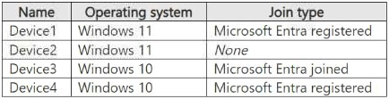

----------------------------------------

## Exam SC-300 topic 2 question 8 discussion

Actual exam question from

Microsoft's
SC-300

Question #: 8
Topic #: 2

[All SC-300 Questions]

DRAG DROP -You have a Microsoft 365 E5 tenant.You purchase a cloud app named App1.You need to enable real-time session-level monitoring of App1 by using Microsoft Cloud App Security.In which order should you perform the actions? To answer, move the appropriate actions from the list of actions to the answer area and arrange them in the correct order.Select and Place: 
Suggested Answer: 

**Answer: **

**Timestamp: June 8, 2021, 10:32 a.m.**

[View on ExamTopics](https://www.examtopics.com/discussions/microsoft/view/54874-exam-sc-300-topic-2-question-8-discussion/)

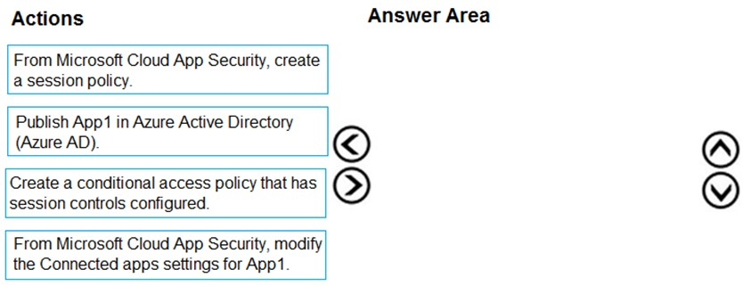
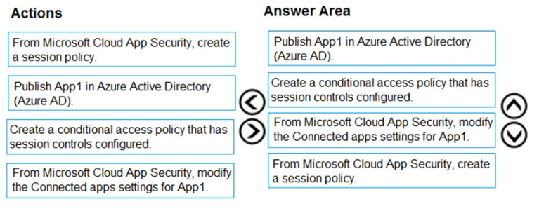

----------------------------------------

## Exam SC-300 topic 2 question 9 discussion

Actual exam question from

Microsoft's
SC-300

Question #: 9
Topic #: 2

[All SC-300 Questions]

You have a Microsoft 365 tenant.All users have mobile phones and laptops.The users frequently work from remote locations that do not have Wi-Fi access or mobile phone connectivity. While working from the remote locations, the users connect their laptop to a wired network that has internet access.You plan to implement multi-factor authentication (MFA).Which MFA authentication method can the users use from the remote location? 
Suggested Answer: C 🗳️ 

A. a notification through the Microsoft Authenticator app

B. an app password

C. Windows Hello for Business

D. SMS

**Answer: C**

**Timestamp: Aug. 29, 2021, 6:16 p.m.**

[View on ExamTopics](https://www.examtopics.com/discussions/microsoft/view/60965-exam-sc-300-topic-2-question-9-discussion/)

----------------------------------------

## Exam SC-300 topic 2 question 10 discussion

Actual exam question from

Microsoft's
SC-300

Question #: 10
Topic #: 2

[All SC-300 Questions]

Note: This question is part of a series of questions that present the same scenario. Each question in the series contains a unique solution that might meet the stated goals. Some question sets might have more than one correct solution, while others might not have a correct solution.After you answer a question in this section, you will NOT be able to return to it. As a result, these questions will not appear in the review screen.You have a Microsoft 365 tenant.All users must use the Microsoft Authenticator app for multi-factor authentication (MFA) when accessing Microsoft 365 services.Some users report that they received an MFA prompt on their Microsoft Authenticator app without initiating a sign-in request.You need to block the users automatically when they report an MFA request that they did not initiate.Solution: From the Azure portal, you configure the Notifications settings for multi-factor authentication (MFA).Does this meet the goal? 
Suggested Answer: B 🗳️ 

A. Yes

B. No

**Answer: B**

**Timestamp: Nov. 24, 2021, 10:05 p.m.**

[View on ExamTopics](https://www.examtopics.com/discussions/microsoft/view/66664-exam-sc-300-topic-2-question-10-discussion/)

----------------------------------------

## Exam SC-300 topic 2 question 11 discussion

Actual exam question from

Microsoft's
SC-300

Question #: 11
Topic #: 2

[All SC-300 Questions]

Note: This question is part of a series of questions that present the same scenario. Each question in the series contains a unique solution that might meet the stated goals. Some question sets might have more than one correct solution, while others might not have a correct solution.After you answer a question in this section, you will NOT be able to return to it. As a result, these questions will not appear in the review screen.You have a Microsoft 365 tenant.All users must use the Microsoft Authenticator app for multi-factor authentication (MFA) when accessing Microsoft 365 services.Some users report that they received an MFA prompt on their Microsoft Authenticator app without initiating a sign-in request.You need to block the users automatically when they report an MFA request that they did not initiate.Solution: From the Azure portal, you configure the Account lockout settings for multi-factor authentication (MFA).Does this meet the goal? 
Suggested Answer: B 🗳️ 

A. Yes

B. No

**Answer: B**

**Timestamp: Nov. 2, 2021, 8:18 p.m.**

[View on ExamTopics](https://www.examtopics.com/discussions/microsoft/view/65346-exam-sc-300-topic-2-question-11-discussion/)

----------------------------------------

## Exam SC-300 topic 2 question 12 discussion

Actual exam question from

Microsoft's
SC-300

Question #: 12
Topic #: 2

[All SC-300 Questions]

Note: This question is part of a series of questions that present the same scenario. Each question in the series contains a unique solution that might meet the stated goals. Some question sets might have more than one correct solution, while others might not have a correct solution.After you answer a question in this section, you will NOT be able to return to it. As a result, these questions will not appear in the review screen.You have a Microsoft 365 tenant.All users must use the Microsoft Authenticator app for multi-factor authentication (MFA) when accessing Microsoft 365 services.Some users report that they received an MFA prompt on their Microsoft Authenticator app without initiating a sign-in request.You need to block the users automatically when they report an MFA request that they did not initiate.Solution: From the Azure portal, you configure the Block/unblock users settings for multi-factor authentication (MFA).Does this meet the goal? 
Suggested Answer: B 🗳️ 

A. Yes

B. No

**Answer: B**

**Timestamp: Nov. 10, 2021, 9:36 p.m.**

[View on ExamTopics](https://www.examtopics.com/discussions/microsoft/view/65810-exam-sc-300-topic-2-question-12-discussion/)

----------------------------------------

## Exam SC-300 topic 2 question 13 discussion

Actual exam question from

Microsoft's
SC-300

Question #: 13
Topic #: 2

[All SC-300 Questions]

HOTSPOT -You have a Microsoft 365 tenant.You need to identify users who have leaked credentials. The solution must meet the following requirements:✑ Identify sign-ins by users who are suspected of having leaked credentials.✑ Flag the sign-ins as a high-risk event.✑ Immediately enforce a control to mitigate the risk, while still allowing the user to access applications.What should you use? To answer, select the appropriate options in the answer area.NOTE: Each correct selection is worth one point.Hot Area: 
Suggested Answer: Reference:https://docs.microsoft.com/en-us/azure/active-directory/identity-protection/concept-identity-protection-risks 

**Answer: **

**Timestamp: Aug. 26, 2021, 7:55 p.m.**

[View on ExamTopics](https://www.examtopics.com/discussions/microsoft/view/60782-exam-sc-300-topic-2-question-13-discussion/)

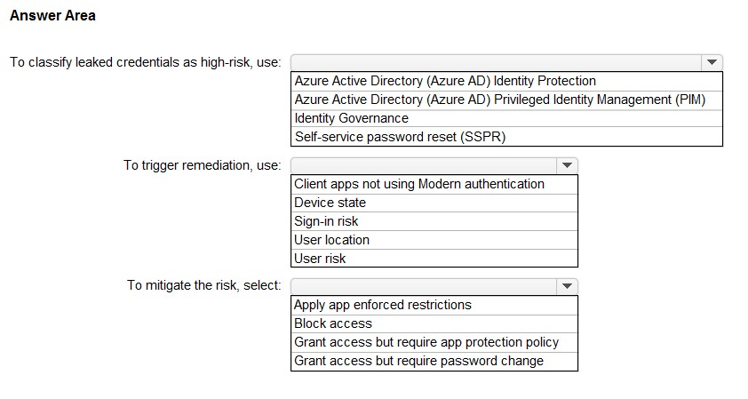
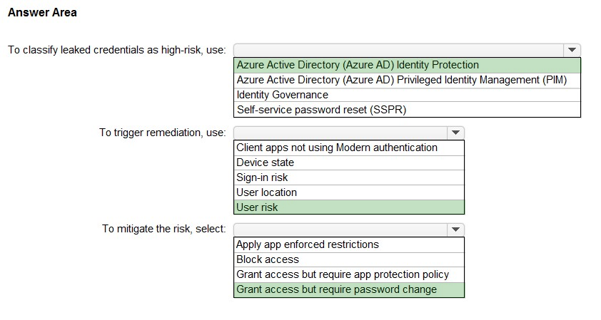

----------------------------------------

## Exam SC-300 topic 2 question 14 discussion

Actual exam question from

Microsoft's
SC-300

Question #: 14
Topic #: 2

[All SC-300 Questions]

HOTSPOT -You have an Azure Active Directory (Azure AD) tenant that contains the users shown in the following table.You plan to implement Azure AD Identity Protection.Which users can configure the user risk policy, and which users can view the risky users report? To answer, select the appropriate options in the answer area.NOTE: Each correct selection is worth one point.Hot Area: 
Suggested Answer: Reference:https://docs.microsoft.com/en-us/azure/active-directory/identity-protection/overview-identity-protection 

**Answer: **

**Timestamp: Aug. 25, 2021, 9:44 a.m.**

[View on ExamTopics](https://www.examtopics.com/discussions/microsoft/view/60594-exam-sc-300-topic-2-question-14-discussion/)

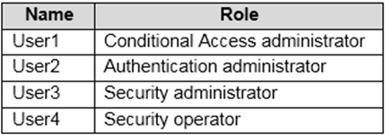
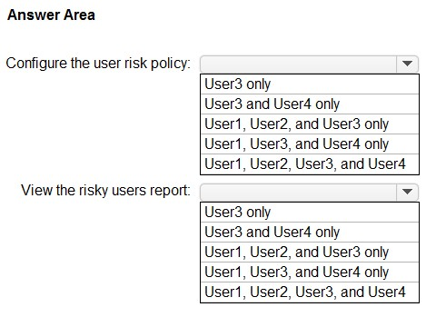
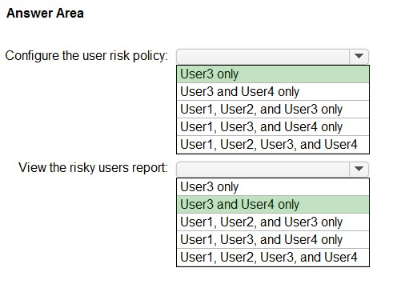

----------------------------------------

## Exam SC-300 topic 2 question 15 discussion

Actual exam question from

Microsoft's
SC-300

Question #: 15
Topic #: 2

[All SC-300 Questions]

HOTSPOT -You have an Azure Active Directory (Azure AD) tenant that contains a group named Group3 and an administrative unit named Department1.Department1 has the users shown in the Users exhibit. (Click the Users tab.)Department1 has the groups shown in the Groups exhibit. (Click the Groups tab.)Department1 has the user administrator assignments shown in the Assignments exhibit. (Click the Assignments tab.)The members of Group2 are shown in the Group2 exhibit. (Click the Group2 tab.)For each of the following statements, select Yes if the statement is true. Otherwise, select No.NOTE: Each correct selection is worth one point.Hot Area: 
Suggested Answer: 

**Answer: **

**Timestamp: May 3, 2021, 12:07 a.m.**

[View on ExamTopics](https://www.examtopics.com/discussions/microsoft/view/51613-exam-sc-300-topic-2-question-15-discussion/)

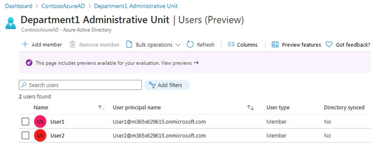
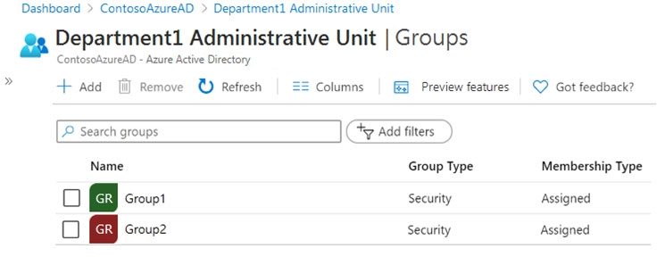
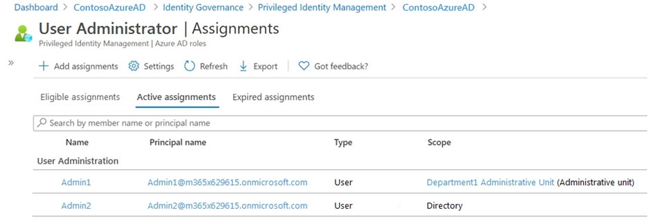
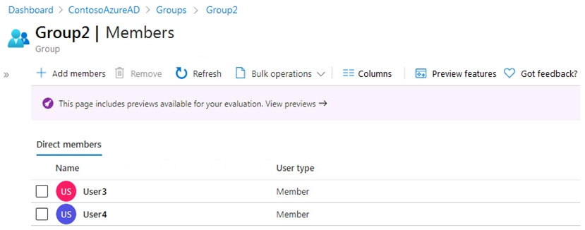
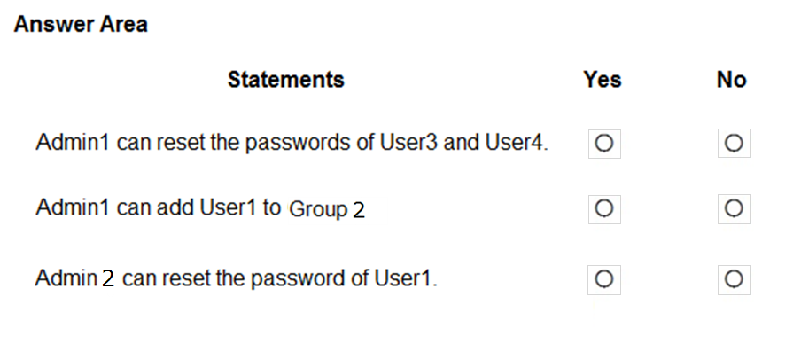
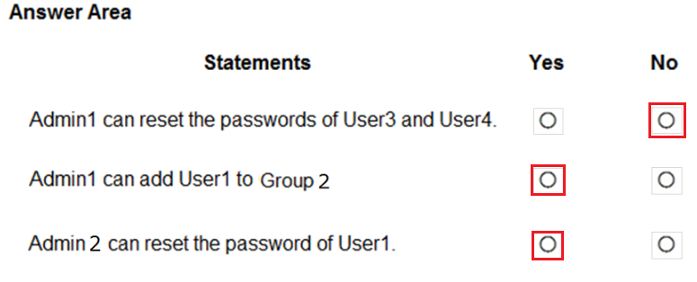

----------------------------------------

## Exam SC-300 topic 2 question 16 discussion

Actual exam question from

Microsoft's
SC-300

Question #: 16
Topic #: 2

[All SC-300 Questions]

Note: This question is part of a series of questions that present the same scenario. Each question in the series contains a unique solution that might meet the stated goals. Some question sets might have more than one correct solution, while others might not have a correct solution.After you answer a question in this section, you will NOT be able to return to it. As a result, these questions will not appear in the review screen.You have a Microsoft 365 tenant.All users must use the Microsoft Authenticator app for multi-factor authentication (MFA) when accessing Microsoft 365 services.Some users report that they received an MFA prompt on their Microsoft Authenticator app without initiating a sign-in request.You need to block the users automatically when they report an MFA request that they did not initiate.Solution: From the Azure portal, you configure the Fraud alert settings for multi-factor authentication (MFA).Does this meet the goal? 
Suggested Answer: A 🗳️ 

A. Yes

B. No

**Answer: A**

**Timestamp: Dec. 16, 2021, 5:57 p.m.**

[View on ExamTopics](https://www.examtopics.com/discussions/microsoft/view/68139-exam-sc-300-topic-2-question-16-discussion/)

----------------------------------------

## Exam SC-300 topic 2 question 17 discussion

Actual exam question from

Microsoft's
SC-300

Question #: 17
Topic #: 2

[All SC-300 Questions]

You have a Microsoft 365 tenant.All users have mobile phones and laptops.The users frequently work from remote locations that do not have Wi-Fi access or mobile phone connectivity. While working from the remote locations, the users connect their laptop to a wired network that has internet access.You plan to implement multi-factor authentication (MFA).Which MFA authentication method can the users use from the remote location? 
Suggested Answer: D 🗳️ 

A. a notification through the Microsoft Authenticator app

B. email

C. security questions

D. a verification code from the Microsoft Authenticator app

**Answer: D**

**Timestamp: April 28, 2022, 11:46 a.m.**

[View on ExamTopics](https://www.examtopics.com/discussions/microsoft/view/74747-exam-sc-300-topic-2-question-17-discussion/)

----------------------------------------

## Exam SC-300 topic 2 question 18 discussion

Actual exam question from

Microsoft's
SC-300

Question #: 18
Topic #: 2

[All SC-300 Questions]

HOTSPOT -You have a Microsoft 365 tenant.You create a named location named HighRiskCountries that contains a list of high-risk countries.You need to limit the amount of time a user can stay authenticated when connecting from a high-risk country.What should you configure in a conditional access policy? To answer, select the appropriate options in the answer area.NOTE: Each correct selection is worth one point.Hot Area: 
Suggested Answer: Reference:https://docs.microsoft.com/en-us/azure/active-directory/conditional-access/location-condition https://docs.microsoft.com/en-us/azure/active-directory/conditional-access/concept-conditional-access-session 

**Answer: **

**Timestamp: May 25, 2022, 5:42 p.m.**

[View on ExamTopics](https://www.examtopics.com/discussions/microsoft/view/76283-exam-sc-300-topic-2-question-18-discussion/)

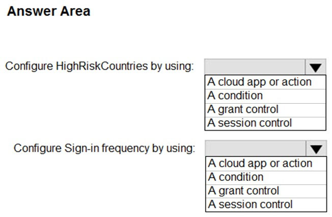
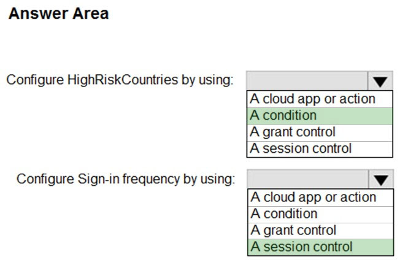

----------------------------------------

## Exam SC-300 topic 2 question 19 discussion

Actual exam question from

Microsoft's
SC-300

Question #: 19
Topic #: 2

[All SC-300 Questions]

HOTSPOT -A user named User1 attempts to sign in to the tenant by entering the following incorrect passwords:✑ Pa55w0rd12✑ Pa55w0rd12✑ Pa55w0rd12✑ Pa55w.rd12✑ Pa55w.rd123✑ Pa55w.rd123✑ Pa55w.rd123✑ Pa55word12✑ Pa55word12✑ Pa55word12✑ Pa55w.rd12You need to identify how many sign-in attempts were tracked for User1, and how User1 can unlock her account before the 300-second lockout duration expires.What should identify? To answer, select the appropriateNOTE: Each correct selection is worth one point.Hot Area: 
Suggested Answer: Reference:https://docs.microsoft.com/en-us/azure/active-directory/authentication/howto-sspr-deployment 

**Answer: **

**Timestamp: April 21, 2022, 2:56 p.m.**

[View on ExamTopics](https://www.examtopics.com/discussions/microsoft/view/74019-exam-sc-300-topic-2-question-19-discussion/)

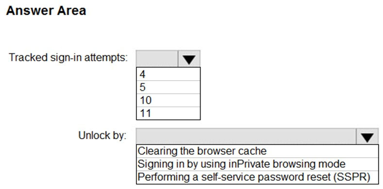
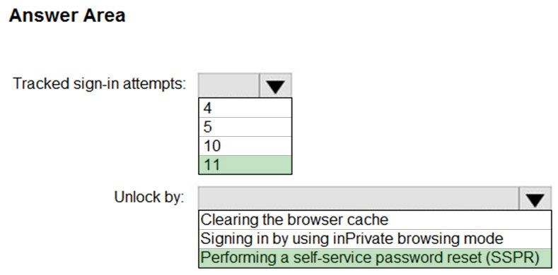

----------------------------------------

## Exam SC-300 topic 2 question 20 discussion

Actual exam question from

Microsoft's
SC-300

Question #: 20
Topic #: 2

[All SC-300 Questions]

HOTSPOT -You have an Azure Active Directory (Azure AD) tenant that has Security defaults disabled.You are creating a conditional access policy as shown in the following exhibit.Use the drop-down menus to select the answer choice that completes each statement based on the information presented in the graphic.NOTE: Each correct selection is worth one point.Hot Area: 
Suggested Answer: Reference:https://docs.microsoft.com/en-us/azure/active-directory/conditional-access/howto-conditional-access-policy-all-users-mfa 

**Answer: **

**Timestamp: May 16, 2021, 5:33 a.m.**

[View on ExamTopics](https://www.examtopics.com/discussions/microsoft/view/52844-exam-sc-300-topic-2-question-20-discussion/)

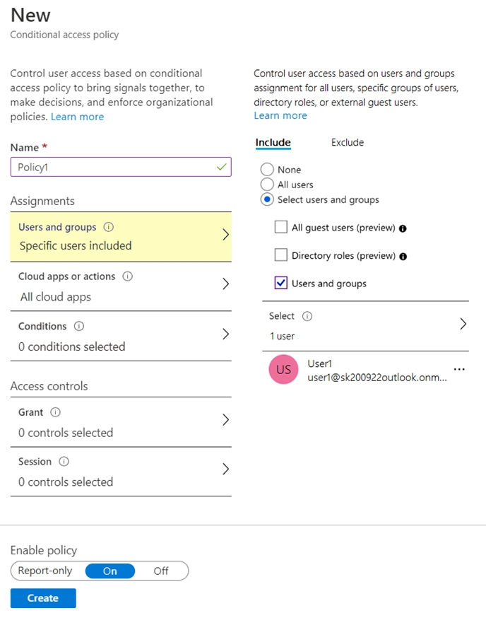
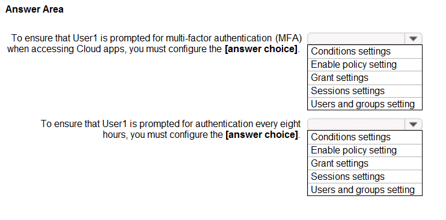
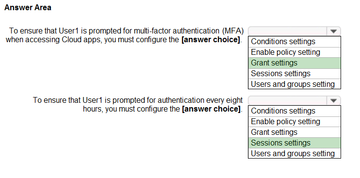

----------------------------------------

## Exam SC-300 topic 2 question 21 discussion

Actual exam question from

Microsoft's
SC-300

Question #: 21
Topic #: 2

[All SC-300 Questions]

You have an Azure Active Directory (Azure AD) tenant that contains a user named SecAdmin1. SecAdmin1 is assigned the Security administrator role.SecAdmin1 reports that she cannot reset passwords from the Azure AD Identity Protection portal.You need to ensure that SecAdmin1 can manage passwords and invalidate sessions on behalf of non-administrative users. The solution must use the principle of least privilege.Which role should you assign to SecAdmin1? 
Suggested Answer: B 🗳️ 

A. Authentication administrator

B. Helpdesk administrator

C. Privileged authentication administrator

D. Security operator

**Answer: B**

**Timestamp: May 1, 2021, 6:08 p.m.**

[View on ExamTopics](https://www.examtopics.com/discussions/microsoft/view/51430-exam-sc-300-topic-2-question-21-discussion/)

----------------------------------------

## Exam SC-300 topic 2 question 22 discussion

Actual exam question from

Microsoft's
SC-300

Question #: 22
Topic #: 2

[All SC-300 Questions]

You configure Azure Active Directory (Azure AD) Password Protection as shown in the exhibit. (Click the Exhibit tab.)You are evaluating the following passwords:✑ Pr0jectlitw@re✑ T@ilw1nd✑ C0nt0s0Which passwords will be blocked? 
Suggested Answer: C 🗳️ 

A. Pr0jectlitw@re and T@ilw1nd only

B. C0nt0s0 only

C. C0nt0s0, Pr0jectlitw@re, and T@ilw1nd

D. C0nt0s0 and T@ilw1nd only

E. C0nt0s0 and Pr0jectlitw@re only

**Answer: C**

**Timestamp: May 3, 2021, 12:15 a.m.**

[View on ExamTopics](https://www.examtopics.com/discussions/microsoft/view/51615-exam-sc-300-topic-2-question-22-discussion/)

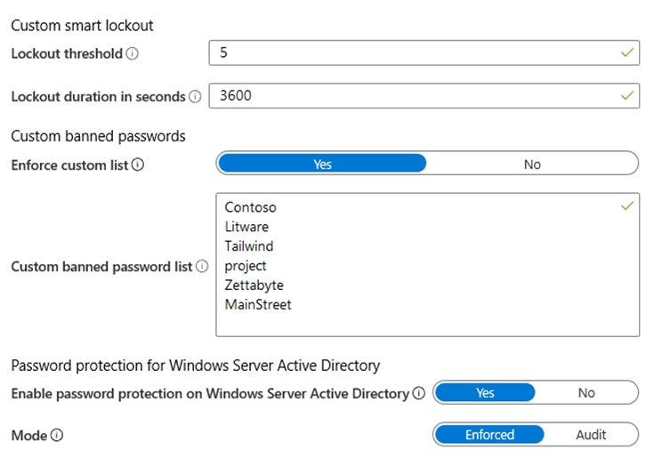

----------------------------------------

## Exam SC-300 topic 2 question 23 discussion

Actual exam question from

Microsoft's
SC-300

Question #: 23
Topic #: 2

[All SC-300 Questions]

You have a Microsoft 365 tenant.All users have mobile phones and laptops.The users frequently work from remote locations that do not have Wi-Fi access or mobile phone connectivity. While working from the remote locations, the users connect their laptop to a wired network that has internet access.You plan to implement multi-factor authentication (MFA).Which MFA authentication method can the users use from the remote location? 
Suggested Answer: A 🗳️ 

A. a verification code from the Microsoft Authenticator app

B. security questions

C. voice

D. SMS

**Answer: A**

**Timestamp: May 2, 2021, 2:21 p.m.**

[View on ExamTopics](https://www.examtopics.com/discussions/microsoft/view/51542-exam-sc-300-topic-2-question-23-discussion/)

----------------------------------------

## Exam SC-300 topic 2 question 24 discussion

Actual exam question from

Microsoft's
SC-300

Question #: 24
Topic #: 2

[All SC-300 Questions]

HOTSPOT -You have an Azure Active Directory (Azure AD) tenant that contains the users shown in the following table.User2 reports that he can only configure multi-factor authentication (MFA) to use the Microsoft Authenticator app.You need to ensure that User2 can configure alternate MFA methods.Which configuration is required, and which user should perform the configuration? To answer, select the appropriate options in the answer area.NOTE: Each correct selection is worth one point.Hot Area: 
Suggested Answer: Box 1: Modify security defaults.Privileged Authentication AdministratorUsers with this role can set or reset any authentication method (including passwords) for any user, including Global Administrators. Privileged AuthenticationAdministrators can force users to re-register against existing non-password credential (such as MFA or FIDO) and revoke 'remember MFA on the device', prompting for MFA on the next sign-in of all users.The Authentication Administrator role has permission to force re-registration and multifactor authentication for standard users and users with some admin roles.Box 2: User1 only.Security Administrator.Users with this role have permissions to manage security-related features in the Microsoft 365 Defender portal, Azure Active Directory Identity Protection, AzureActive Directory Authentication, Azure Information Protection, and Office 365 Security & Compliance Center.Incorrect:Not User3. Service Support Administrator.Users with this role can create and manage support requests with Microsoft for Azure and Microsoft 365 services, and view the service dashboard and message center in the Azure portal and Microsoft 365 admin center.Reference:https://docs.microsoft.com/en-us/azure/active-directory/roles/permissions-reference 

**Answer: **

**Timestamp: Sept. 21, 2022, 9:36 p.m.**

[View on ExamTopics](https://www.examtopics.com/discussions/microsoft/view/83133-exam-sc-300-topic-2-question-24-discussion/)

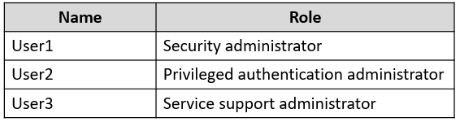
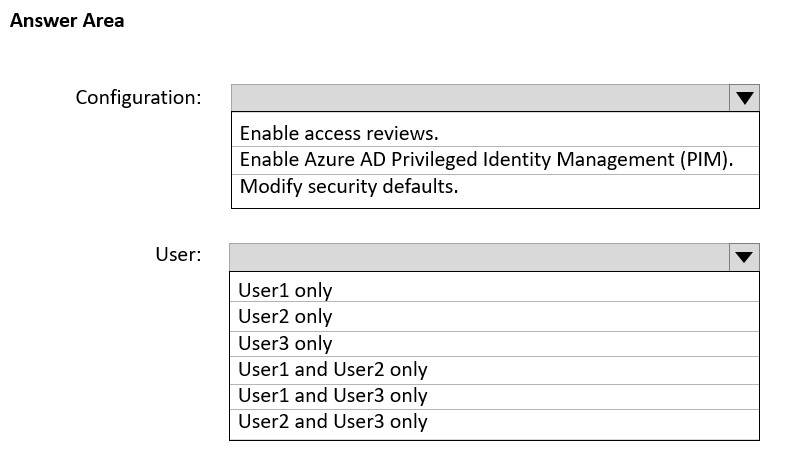
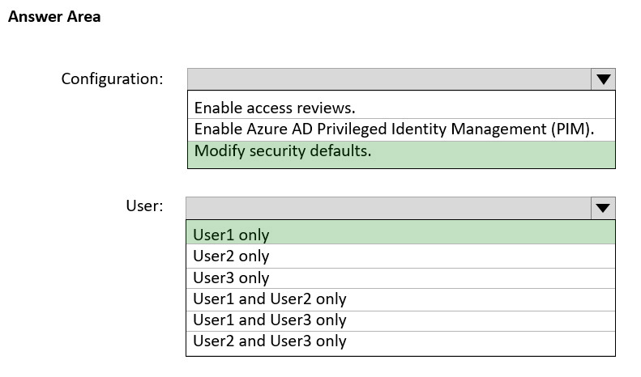
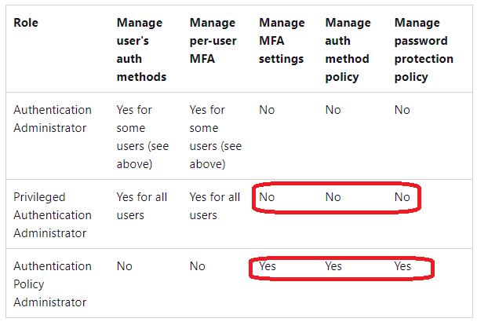

----------------------------------------

## Exam SC-300 topic 2 question 25 discussion

Actual exam question from

Microsoft's
SC-300

Question #: 25
Topic #: 2

[All SC-300 Questions]

You have an Azure Active Directory (Azure AD) tenant.You configure self-service password reset (SSPR) by using the following settings:✑ Require users to register when signing in: Yes✑ Number of methods required to reset: 1What is a valid authentication method available to users? 
Suggested Answer: C 🗳️ 

A. a Microsoft Teams chat

B. a mobile app notification

C. a mobile app code

D. an FIDO2 security token

**Answer: C**

**Timestamp: Sept. 21, 2022, 9:51 p.m.**

[View on ExamTopics](https://www.examtopics.com/discussions/microsoft/view/83134-exam-sc-300-topic-2-question-25-discussion/)

----------------------------------------

## Exam SC-300 topic 2 question 26 discussion

Actual exam question from

Microsoft's
SC-300

Question #: 26
Topic #: 2

[All SC-300 Questions]

You have an Azure Active Directory (Azure AD) tenant that uses Azure AD Identity Protection and contains the resources shown in the following table.Azure Multi-factor Authentication (MFA) is enabled for all users.User1 triggers a medium severity alert that requires additional investigation.You need to force User1 to reset his password the next time he signs in. The solution must minimize administrative effort.What should you do? 
Suggested Answer: B 🗳️ 

A. Reconfigure the user risk, policy to trigger on medium or low severity.

B. Mark User1 as compromised.

C. Reset the Azure MIFA registration for User1.

D. Configure a sign-in risk policy.

**Answer: B**

**Timestamp: Nov. 5, 2022, 12:01 p.m.**

[View on ExamTopics](https://www.examtopics.com/discussions/microsoft/view/87015-exam-sc-300-topic-2-question-26-discussion/)

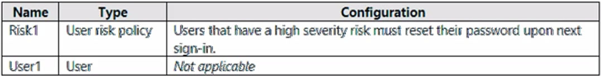

----------------------------------------

## Exam SC-300 topic 2 question 27 discussion

Actual exam question from

Microsoft's
SC-300

Question #: 27
Topic #: 2

[All SC-300 Questions]

HOTSPOT -You have an Azure Active Directory (Azure AD) tenant: that contains the users shown in the following table.In Azure. AD Identity Protection, you configure a user risk policy that has the following settings:✑ Assignments:- Users: Group1- User risk: Low and above✑ Controls:- Access: Block access✑ Enforce policy: OnIn Azure AD Identify Protection, you configure a sign-in risk policy that has the following settings:✑ Assignments:- Users: Group2- Sign-in risk: Low and above✑ Controls:- Access: Require multi-factor authentication✑ Enforce policy: OnFor each of the following statements, select Yes if the statement is true. Otherwise, select No.NOTE: Each correct selection is worth one point.Hot Area: 
Suggested Answer: 

**Answer: **

**Timestamp: Aug. 31, 2022, 3:14 p.m.**

[View on ExamTopics](https://www.examtopics.com/discussions/microsoft/view/78703-exam-sc-300-topic-2-question-27-discussion/)

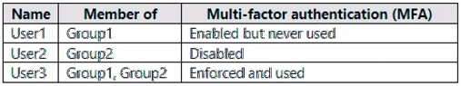
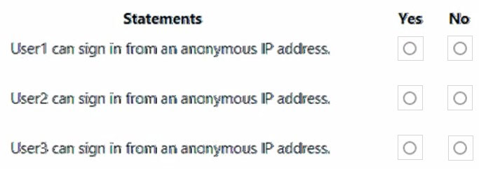
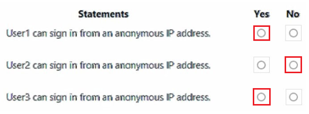

----------------------------------------

## Exam SC-300 topic 2 question 28 discussion

Actual exam question from

Microsoft's
SC-300

Question #: 28
Topic #: 2

[All SC-300 Questions]

You have an Azure Active Directory (Azure AD) tenant.You configure self-service password reset (SSPR) by using the following settings:✑ Require users to register when signing in: Yes✑ Number of methods required to reset: 1What is a valid authentication method available to users? 
Suggested Answer: A 🗳️ 

A. an email to an address outside your organization

B. a smartcard

C. an FID02 security token

D. a Microsoft Teams chat

**Answer: A**

**Timestamp: Oct. 10, 2022, 3:36 p.m.**

[View on ExamTopics](https://www.examtopics.com/discussions/microsoft/view/85023-exam-sc-300-topic-2-question-28-discussion/)

----------------------------------------

## Exam SC-300 topic 2 question 29 discussion

Actual exam question from

Microsoft's
SC-300

Question #: 29
Topic #: 2

[All SC-300 Questions]

You have an Azure Active Directory (Azure AD) tenant that contains the users shown in the following table.The tenant has the authentication methods shown in the following table.Which users will sign in to cloud apps by matching a number shown in the app with a number shown on their phone? 
Suggested Answer: A 🗳️ 

A. User1 only

B. User2 only

C. User3 only

D. User1 and User2 only

E. User2 and User3 only

**Answer: A**

**Timestamp: Sept. 21, 2022, 11:26 p.m.**

[View on ExamTopics](https://www.examtopics.com/discussions/microsoft/view/83139-exam-sc-300-topic-2-question-29-discussion/)

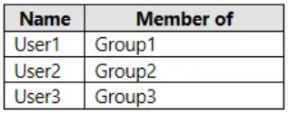
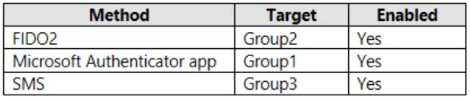

----------------------------------------

## Exam SC-300 topic 2 question 30 discussion

Actual exam question from

Microsoft's
SC-300

Question #: 30
Topic #: 2

[All SC-300 Questions]

You have an Azure Active Directory (Azure AD) tenant that contains a user named User1 and the conditional access policies shown in the following table.You need to evaluate which policies will be applied to User1 when User1 attempts to sign-in from various IP addresses.Which feature should you use? 
Suggested Answer: C 🗳️ 

A. Access reviews

B. Identity Secure Score

C. The What If tool

D. the Microsoft 365 network connectivity test tool

**Answer: C**

**Timestamp: Sept. 28, 2022, 11:48 p.m.**

[View on ExamTopics](https://www.examtopics.com/discussions/microsoft/view/83961-exam-sc-300-topic-2-question-30-discussion/)

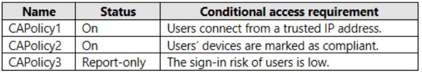

----------------------------------------

## Exam SC-300 topic 2 question 32 discussion

Actual exam question from

Microsoft's
SC-300

Question #: 32
Topic #: 2

[All SC-300 Questions]

You create a conditional access policy that blocks access when a user triggers a high-severity sign-in alert.You need to test the policy under the following conditions:✑ A user signs in from another country.✑ A user triggers a sign-in risk.What should you use to complete the test? 
Suggested Answer: A 🗳️ 

A. the Conditional Access What If tool

B. sign-ins logs in Azure Active Directory (Azure AD)

C. the activity logs in Microsoft Defender for Cloud Apps

D. access reviews in Azure Active Directory (Azure AD)

**Answer: A**

**Timestamp: Nov. 15, 2022, 2:31 a.m.**

[View on ExamTopics](https://www.examtopics.com/discussions/microsoft/view/87479-exam-sc-300-topic-2-question-32-discussion/)

----------------------------------------

## Exam SC-300 topic 2 question 33 discussion

Actual exam question from

Microsoft's
SC-300

Question #: 33
Topic #: 2

[All SC-300 Questions]

HOTSPOT -You have an Azure Active Directory (Azure AD) tenant that contains the users shown in the following table.You have the locations shown in the following table.The tenant contains a named location that has the following configurations:✑ Name: Location1✑ Mark as trusted location: EnabledIPv4 range: 10.10.0.0/16 -MFA has a trusted IP address range of 193.17.17.0/24.✑ Name: CAPolicy1✑ Assignments- Users or workload identities: Group1- Cloud apps or actions: All cloud apps✑ Conditions- Locations: All trusted locations✑ Access controls- Grant- Grant access: Require multi-factor authentication- Session: 0 controls selected✑ Enable policy: OnFor each of the following statements, select Yes if the statement is true. Otherwise, select No.NOTE: Each correct selection is worth one point.Hot Area: 
Suggested Answer: 

**Answer: **

**Timestamp: Aug. 31, 2022, 3:50 p.m.**

[View on ExamTopics](https://www.examtopics.com/discussions/microsoft/view/78715-exam-sc-300-topic-2-question-33-discussion/)

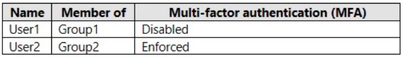
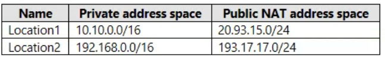

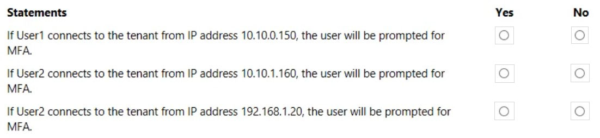
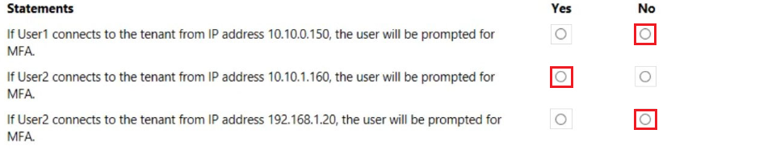

----------------------------------------

## Exam SC-300 topic 2 question 34 discussion

Actual exam question from

Microsoft's
SC-300

Question #: 34
Topic #: 2

[All SC-300 Questions]

HOTSPOT -You have an Azure Active Directory (Azure AD) tenant named contoso.com that has Email one-time passcode for guests set to Yes.You invite the guest users shown in the following table.Which users will receive a one-time passcode, and how long will the passcode be valid? To answer, select the appropriate options in the answer area.NOTE: Each correct selection is worth one point.Hot Area: 
Suggested Answer: Box 1: Guest3 only -When does a guest user get a one-time passcode?When a guest user redeems an invitation or uses a link to a resource that has been shared with them, they'll receive a one-time passcode if:They don't have an Azure AD accountThey don't have a Microsoft accountThe inviting tenant didn't set up federation with social (like Google) or other identity providers.Box 2: 30 minutes -One-time passcodes are valid for 30 minutes. After 30 minutes, that specific one-time passcode is no longer valid, and the user must request a new one. User sessions expire after 24 hours. After that time, the guest user receives a new passcode when they access the resource. Session expiration provides added security, especially when a guest user leaves their company or no longer needs access.Reference:https://docs.microsoft.com/en-us/azure/active-directory/external-identities/one-time-passcode 

**Answer: **

**Timestamp: Sept. 1, 2022, 6:20 a.m.**

[View on ExamTopics](https://www.examtopics.com/discussions/microsoft/view/78897-exam-sc-300-topic-2-question-34-discussion/)

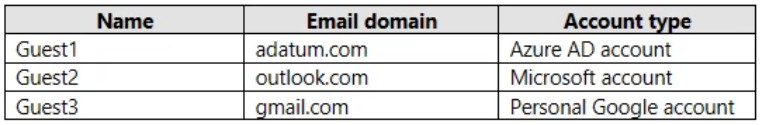
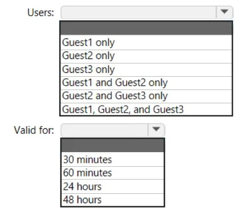
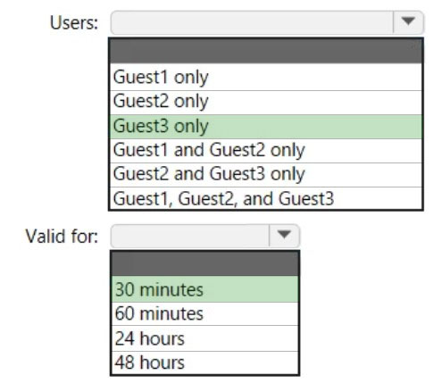

----------------------------------------

## Exam SC-300 topic 2 question 35 discussion

Actual exam question from

Microsoft's
SC-300

Question #: 35
Topic #: 2

[All SC-300 Questions]

You have a Microsoft Entra tenant that contains the devices shown in the following table.You plan to configure Microsoft Entra Private Access.You deploy the Global Secure Access client to compatible devices.From which devices can you use Private Access? 
Suggested Answer: C 🗳️ 

A. Device1 only

B. Device2 only

C. Device2 and Device4 only

D. Device1, Device2, and Device3 only

E. Device1, Device2, Device3, and Device4

**Answer: C**

**Timestamp: Dec. 26, 2024, 2:35 p.m.**

[View on ExamTopics](https://www.examtopics.com/discussions/microsoft/view/153463-exam-sc-300-topic-2-question-35-discussion/)

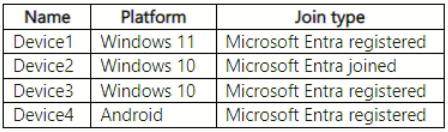

----------------------------------------

## Exam SC-300 topic 2 question 36 discussion

Actual exam question from

Microsoft's
SC-300

Question #: 36
Topic #: 2

[All SC-300 Questions]

You have an Azure subscription that contains an Azure SQL database named db1.You deploy an Azure App Service web app named App1 that provides product information to users that connect to App1 anonymously.You need to provide App1 with access to db1. The solution must meet the following requirements:• Credentials must only be available to App1.• Administrative effort must be minimized.Which type of credentials should you use? 
Suggested Answer: A 🗳️ 

A. a system-assigned managed identity

B. an Azure Active Directory (Azure AD) user account

C. a SQL Server account

D. a user-assigned managed identity

**Answer: A**

**Timestamp: Jan. 19, 2023, 5:40 p.m.**

[View on ExamTopics](https://www.examtopics.com/discussions/microsoft/view/96014-exam-sc-300-topic-2-question-36-discussion/)

----------------------------------------

## Exam SC-300 topic 2 question 37 discussion

Actual exam question from

Microsoft's
SC-300

Question #: 37
Topic #: 2

[All SC-300 Questions]

You have an Azure subscription that contains the custom roles shown in the following table.You need to create a custom Azure subscription role named Role3 by using the Azure portal. Role3 will use the baseline permissions of an existing role.Which roles can you clone to create Role3? 
Suggested Answer: C 🗳️ 

A. Role2 only

B. built-in Azure subscription roles only

C. built-in Azure subscription roles and Role2 only

D. built-in Azure subscription roles and built-in Azure AD roles only

E. Role1, Role2, built-in Azure subscription roles, and built-in Azure AD roles

**Answer: C**

**Timestamp: Jan. 19, 2023, 6:49 p.m.**

[View on ExamTopics](https://www.examtopics.com/discussions/microsoft/view/96030-exam-sc-300-topic-2-question-37-discussion/)

----------------------------------------

## Exam SC-300 topic 2 question 38 discussion

Actual exam question from

Microsoft's
SC-300

Question #: 38
Topic #: 2

[All SC-300 Questions]

HOTSPOT -Your on-premises network contains an Active Directory domain that uses Microsoft Entra Connect sync to sync with a Microsoft Entra tenant.You need to configure Microsoft Entra Connect sync to meet the following requirements:• Microsoft Entra sign-ins must be authenticated by an Active Directory domain controller.• Active Directory domain users must be able to use Microsoft Entra self-service password reset (SSPR).• Minimize administrative effort.What should you use for each requirement? To answer, select the appropriate options in the answer area.NOTE: Each correct selection is worth one point. 
Suggested Answer: 

**Answer: **

**Timestamp: Feb. 2, 2025, 6:46 p.m.**

[View on ExamTopics](https://www.examtopics.com/discussions/microsoft/view/155840-exam-sc-300-topic-2-question-38-discussion/)

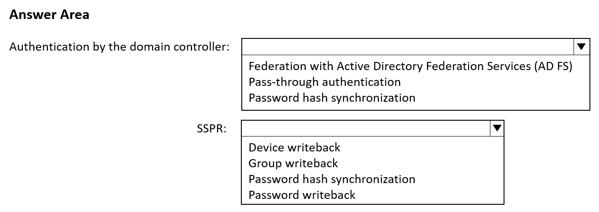
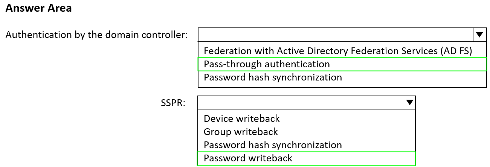

----------------------------------------

## Exam SC-300 topic 2 question 39 discussion

Actual exam question from

Microsoft's
SC-300

Question #: 39
Topic #: 2

[All SC-300 Questions]

HOTSPOT -You have an Azure subscription named Sub1 that is linked to a Microsoft Entra tenant. The tenant contains the users shown in the following table.Sub1 contains a resource group named RG1.The tenant contains the groups shown in the following table.You deploy a virtual machine named VM1 to RG1. VM1 runs Windows Server and has Microsoft Entra login enabled.For each of the following statements, select Yes if the statement is true. Otherwise, select No.NOTE: Each correct selection is worth one point. 
Suggested Answer: 

**Answer: **

**Timestamp: Jan. 21, 2025, 10:35 p.m.**

[View on ExamTopics](https://www.examtopics.com/discussions/microsoft/view/155132-exam-sc-300-topic-2-question-39-discussion/)

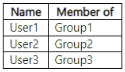
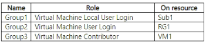
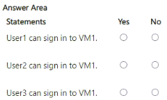
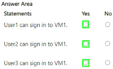

----------------------------------------

## Exam SC-300 topic 2 question 40 discussion

Actual exam question from

Microsoft's
SC-300

Question #: 40
Topic #: 2

[All SC-300 Questions]

HOTSPOT -You have an Azure subscription that contains the following virtual machine:• Name: V1• Azure region: East US• System-assigned managed identity: DisabledYou create the managed identities shown in the following table.You perform the following actions:• Assign Managed1 to V1.• Create a resource group named RG1 in the West US region.For each of the following statements, select Yes if the statement is true. Otherwise, select No.NOTE: Each correct selection is worth one point. 
Suggested Answer: 

**Answer: **

**Timestamp: Jan. 16, 2023, 2:31 p.m.**

[View on ExamTopics](https://www.examtopics.com/discussions/microsoft/view/95539-exam-sc-300-topic-2-question-40-discussion/)

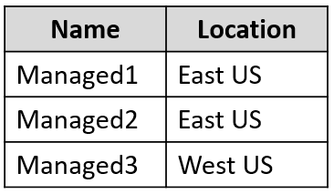
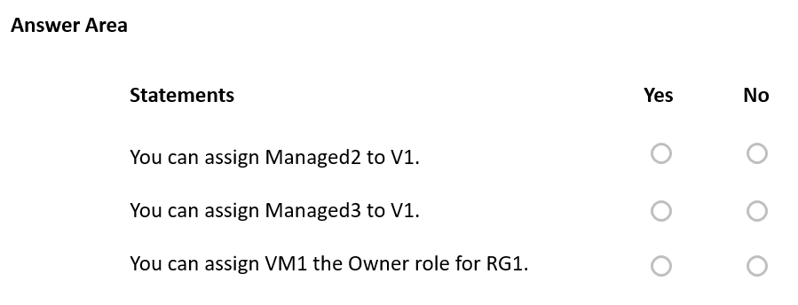
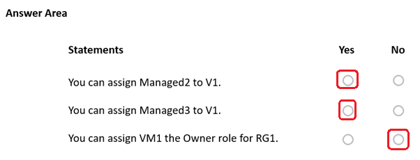

----------------------------------------

## Exam SC-300 topic 2 question 41 discussion

Actual exam question from

Microsoft's
SC-300

Question #: 41
Topic #: 2

[All SC-300 Questions]

HOTSPOT -You have an Azure subscription that contains the key vaults shown in the following table.The subscription contains the users shown in the following table.On June 1, Admin4 performs the following actions:• Deletes a certificate named Certificate1 from KeyVault1• Deletes a secret named Secret1 from KeyVault2For each of the following statements, select Yes if the statement is true. Otherwise, select No.NOTE: Each correct selection is worth one point. 
Suggested Answer: 

**Answer: **

**Timestamp: Jan. 18, 2023, 9:15 a.m.**

[View on ExamTopics](https://www.examtopics.com/discussions/microsoft/view/95792-exam-sc-300-topic-2-question-41-discussion/)

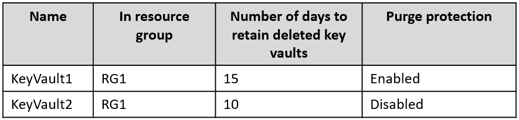
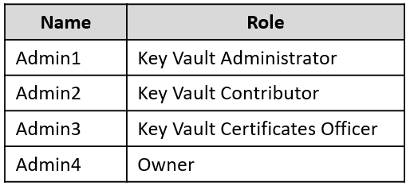
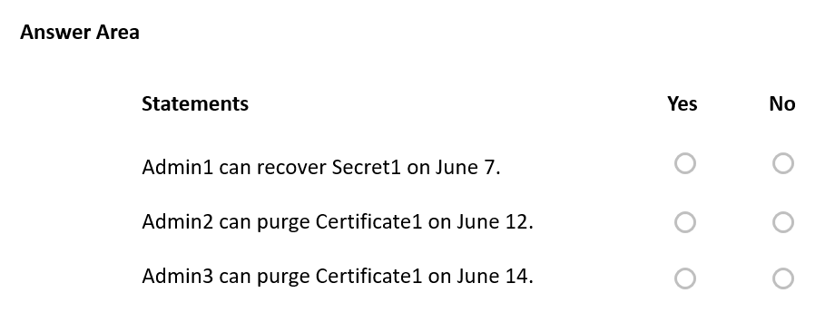
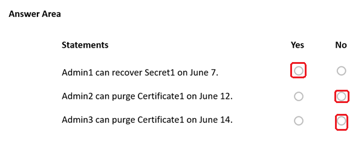

----------------------------------------

## Exam SC-300 topic 2 question 42 discussion

Actual exam question from

Microsoft's
SC-300

Question #: 42
Topic #: 2

[All SC-300 Questions]

You have a management group named Group1 that contains two Azure subscriptions named Sub1 and Sub2. The subscriptions are linked to a Microsoft Entra tenant that contains a user named User1.You need to ensure that User1 can onboard Sub1 to Permissions Management. The solution must follow the principle of least privilege.Which permission should you grant to User1? 
Suggested Answer: C 🗳️ 

A. Microsoft.Authorization/roleAssignments/read for Sub1

B. Microsoft.Authorization/roleAssignments/write for Group1

C. MicrosoftAuthorization/roleAssignments/write for Sub1

D. Microsoft.Authorization/roleAssignments/read for Group1

**Answer: C**

**Timestamp: Feb. 3, 2025, 9:50 a.m.**

[View on ExamTopics](https://www.examtopics.com/discussions/microsoft/view/155848-exam-sc-300-topic-2-question-42-discussion/)

----------------------------------------

## Exam SC-300 topic 2 question 43 discussion

Actual exam question from

Microsoft's
SC-300

Question #: 43
Topic #: 2

[All SC-300 Questions]

You have an Azure Active Directory (Azure AD) tenant.You configure self-service password reset (SSPR) by using the following settings:• Require users to register when signing in: Yes• Number of methods required to reset: 1What is a valid authentication method available to users? 
Suggested Answer: B 🗳️ 

A. a smartcard

B. a mobile app code

C. a mobile app notification

D. an email to an address outside your organization

**Answer: B**

**Timestamp: Jan. 19, 2023, 6:28 p.m.**

[View on ExamTopics](https://www.examtopics.com/discussions/microsoft/view/96023-exam-sc-300-topic-2-question-43-discussion/)

----------------------------------------

## Exam SC-300 topic 2 question 44 discussion

Actual exam question from

Microsoft's
SC-300

Question #: 44
Topic #: 2

[All SC-300 Questions]

You create a new Microsoft 365 E5 tenant.You need to ensure that when users connect to the Microsoft 365 portal from an anonymous IP address, they are prompted to use multi-factor authentication (MFA).What should you configure? 
Suggested Answer: A 🗳️ 

A. a sign-in risk policy

B. a user risk policy

C. an MFA registration policy

**Answer: A**

**Timestamp: Jan. 20, 2023, 11:07 a.m.**

[View on ExamTopics](https://www.examtopics.com/discussions/microsoft/view/96130-exam-sc-300-topic-2-question-44-discussion/)

----------------------------------------

## Exam SC-300 topic 2 question 45 discussion

Actual exam question from

Microsoft's
SC-300

Question #: 45
Topic #: 2

[All SC-300 Questions]

HOTSPOT -You have a Microsoft 365 tenant.You configure a conditional access policy as shown in the Conditional Access policy exhibit. (Click the Conditional Access policy tab.)You view the User administrator role settings as shown in the Role setting details exhibit. (Click the Role setting details tab.)You view the User administrator role assignments as shown in the Role assignments exhibit. (Click the Role assignments tab.)For each of the following statements, select Yes if the statement is true. Otherwise, select No.NOTE: Each correct selection is worth one point. 
Suggested Answer: 

**Answer: **

**Timestamp: Jan. 19, 2023, 6:29 p.m.**

[View on ExamTopics](https://www.examtopics.com/discussions/microsoft/view/96024-exam-sc-300-topic-2-question-45-discussion/)

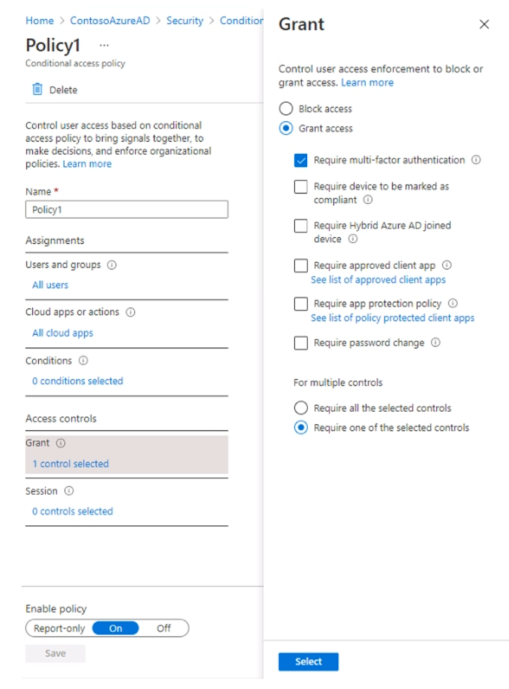
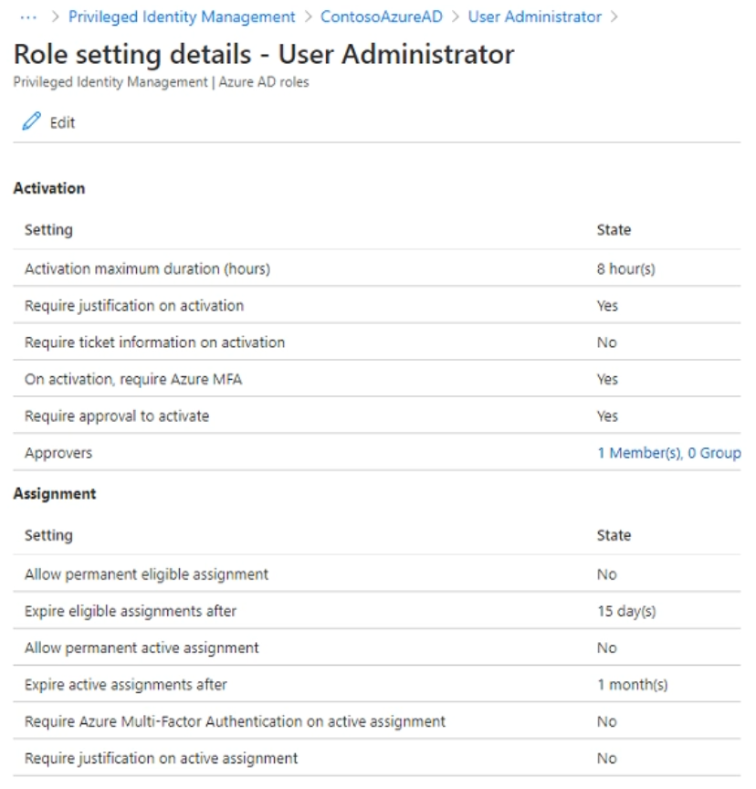
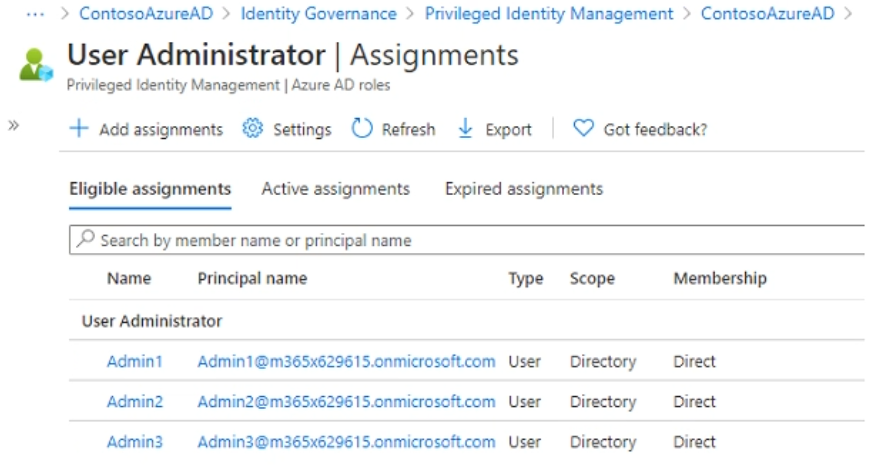
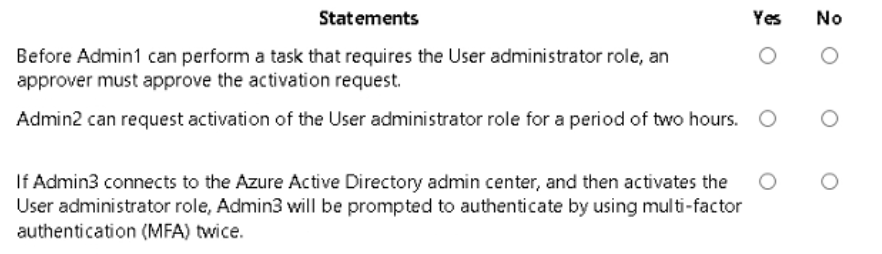
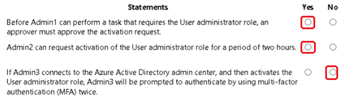

----------------------------------------

## Exam SC-300 topic 2 question 46 discussion

Actual exam question from

Microsoft's
SC-300

Question #: 46
Topic #: 2

[All SC-300 Questions]

HOTSPOT -You have an Azure AD tenant that contains the users shown in the following table.You have the Azure AD Identity Protection policies shown in the following table.You review the Risky users report and the Risky sign-ins report and perform actions for each user as shown in the following table.For each of the following statements, select Yes if the statement is true. Otherwise, select No.NOTE: Each correct selection is worth one point. 
Suggested Answer: 

**Answer: **

**Timestamp: Jan. 19, 2023, 6:33 p.m.**

[View on ExamTopics](https://www.examtopics.com/discussions/microsoft/view/96025-exam-sc-300-topic-2-question-46-discussion/)

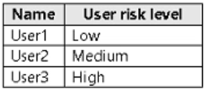
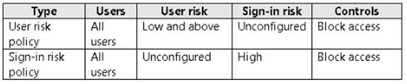
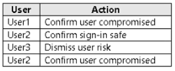
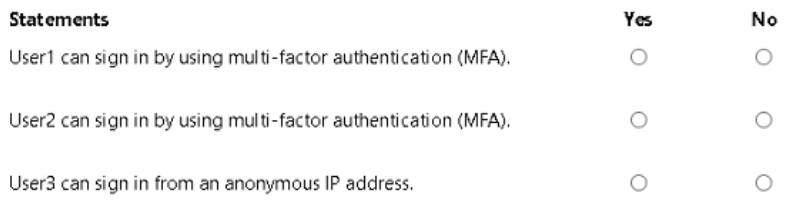
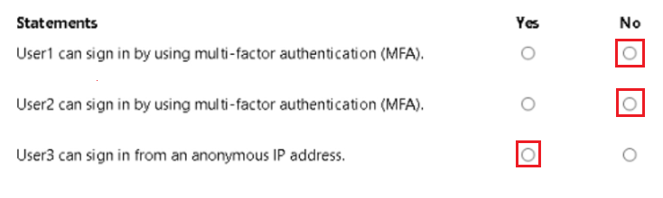

----------------------------------------

## Exam SC-300 topic 2 question 47 discussion

Actual exam question from

Microsoft's
SC-300

Question #: 47
Topic #: 2

[All SC-300 Questions]

You have an Azure subscription that contains a user named User1.You need to meet the following requirements:• Prevent User1 from being added as an owner of newly registered apps.• Ensure that User1 can manage the application proxy settings.• Ensure that User1 can register apps.• Use the principle of least privilege.Which role should you assign to User1? 
Suggested Answer: D 🗳️ 

A. Application developer

B. Cloud application administrator

C. Service support administrator

D. Application administrator

**Answer: D**

**Timestamp: Jan. 19, 2023, 6:35 p.m.**

[View on ExamTopics](https://www.examtopics.com/discussions/microsoft/view/96027-exam-sc-300-topic-2-question-47-discussion/)

----------------------------------------

## Exam SC-300 topic 2 question 48 discussion

Actual exam question from

Microsoft's
SC-300

Question #: 48
Topic #: 2

[All SC-300 Questions]

DRAG DROP -You have a Microsoft 365 E5 subscription and an Azure subscription.You need to meet the following requirements:• Ensure that users can sign in to Azure virtual machines by using their Microsoft 365 credentials.• Delegate the ability to create new virtual machines.What should you use for each requirement? To answer, drag the appropriate features to the correct requirements. Each feature may be used once, more than once, or not at all. You may need to drag the split bar between panes or scroll to view content.NOTE: Each correct selection is worth one point. 
Suggested Answer: 

**Answer: **

**Timestamp: Jan. 19, 2023, 6:37 p.m.**

[View on ExamTopics](https://www.examtopics.com/discussions/microsoft/view/96028-exam-sc-300-topic-2-question-48-discussion/)

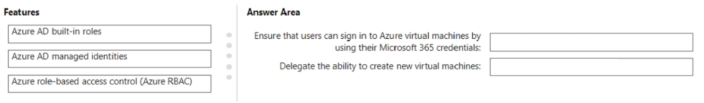
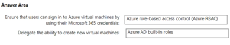

----------------------------------------

## Exam SC-300 topic 2 question 49 discussion

Actual exam question from

Microsoft's
SC-300

Question #: 49
Topic #: 2

[All SC-300 Questions]

You have a Microsoft 365 tenant.All users have mobile phones and Windows 10 laptops.The users frequently work from remote locations that do not have Wi-Fi access or mobile phone connectivity. While working from the remote locations, the users connect their laptop to a wired network that has internet access.You plan to implement multi-factor authentication (MFA).Which MFA authentication method can the users use from the remote location? 
Suggested Answer: A 🗳️ 

A. a verification code from the Microsoft Authenticator app

B. SMS

C. an app password

D. a notification through the Microsoft Authenticator app

**Answer: A**

**Timestamp: Feb. 15, 2025, 4:51 p.m.**

[View on ExamTopics](https://www.examtopics.com/discussions/microsoft/view/156563-exam-sc-300-topic-2-question-49-discussion/)

----------------------------------------

## Exam SC-300 topic 2 question 50 discussion

Actual exam question from

Microsoft's
SC-300

Question #: 50
Topic #: 2

[All SC-300 Questions]

HOTSPOT -Your network contains an on-premises Active Directory Domain Services (AD DS) domain that syncs with an Azure AD tenant. The AD DS domain contains the organizational units (OUs) shown in the following table.You need to create a break-glass account named BreakGlass.Where should you create BreakGlass, and which role should you assign to BreakGlass? To answer, select the appropriate options in the answer area.NOTE: Each correct selection is worth one point. 
Suggested Answer: 

**Answer: **

**Timestamp: April 4, 2023, 1:58 a.m.**

[View on ExamTopics](https://www.examtopics.com/discussions/microsoft/view/105037-exam-sc-300-topic-2-question-50-discussion/)

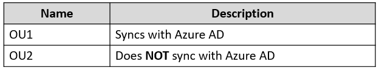
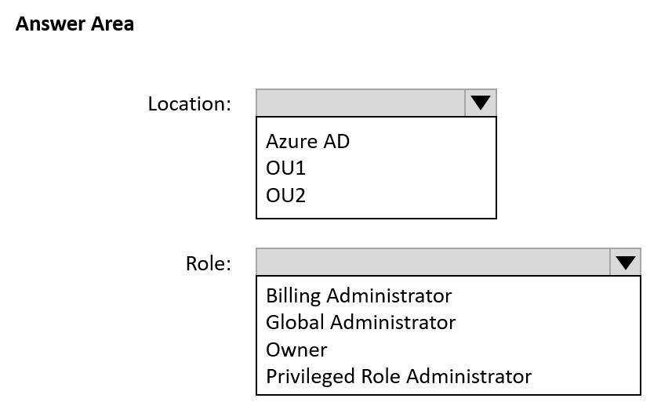
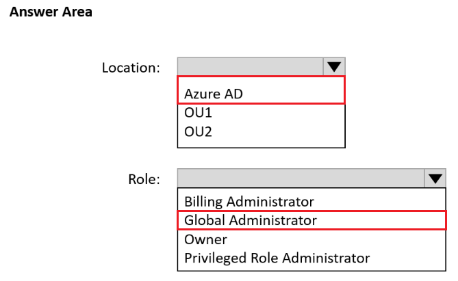

----------------------------------------

## Exam SC-300 topic 2 question 51 discussion

Actual exam question from

Microsoft's
SC-300

Question #: 51
Topic #: 2

[All SC-300 Questions]

You have a Microsoft 365 E5 subscription that contains a Microsoft SharePoint Online site named Site1.You need to ensure that users can request access to Site1. The solution must meet the following requirements:• Automatically approve requests from users based on their group membership.• Automatically remove the access after 30 days.What should you do? 
Suggested Answer: B 🗳️ 

A. Create a Conditional Access policy.

B. Create an access package.

C. Configure Role settings in Azure AD Privileged Identity Management.

D. Create a Microsoft Defender for Cloud Apps access policy.

**Answer: B**

**Timestamp: April 11, 2023, 7:25 p.m.**

[View on ExamTopics](https://www.examtopics.com/discussions/microsoft/view/105962-exam-sc-300-topic-2-question-51-discussion/)

----------------------------------------

## Exam SC-300 topic 2 question 52 discussion

Actual exam question from

Microsoft's
SC-300

Question #: 52
Topic #: 2

[All SC-300 Questions]

HOTSPOT -You have an Azure subscription.You need to create two custom roles named Role1 and Role2. The solution must meet the following requirements:• Users that are assigned Role1 can manage application security groups.• Users that are assigned Role2 can manage Azure Firewall.Which resource provider permissions are required for each role? To answer, select the appropriate options in the answer area.NOTE: Each correct selection is worth one point. 
Suggested Answer: 

**Answer: **

**Timestamp: April 6, 2023, 1:04 p.m.**

[View on ExamTopics](https://www.examtopics.com/discussions/microsoft/view/105394-exam-sc-300-topic-2-question-52-discussion/)

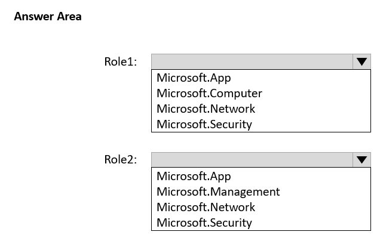
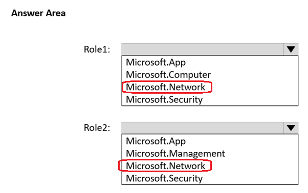

----------------------------------------

## Exam SC-300 topic 2 question 53 discussion

Actual exam question from

Microsoft's
SC-300

Question #: 53
Topic #: 2

[All SC-300 Questions]

You have an Azure subscription. The subscription contains 50 virtual machines that run Windows Server.You enable Microsoft Entra login for the virtual machines.Users report that they cannot sign in to the virtual machines by using their Microsoft Entra credentials.You need to ensure that the users can sign in to the virtual machines.What should you do first? 
Suggested Answer: D 🗳️ 

A. From the Microsoft Entra admin center, delete the device registrations of the virtual machines.

B. Revoke the primary refresh token.

C. Enable SSH client support for OpenSSH.

D. Ensure that the virtual machines can access https://enterpriseregistration.windows.net.

**Answer: D**

**Timestamp: Feb. 24, 2025, 9:45 p.m.**

[View on ExamTopics](https://www.examtopics.com/discussions/microsoft/view/157090-exam-sc-300-topic-2-question-53-discussion/)

----------------------------------------

## Exam SC-300 topic 2 question 54 discussion

Actual exam question from

Microsoft's
SC-300

Question #: 54
Topic #: 2

[All SC-300 Questions]

DRAG DROP -You have a Microsoft 365 E5 tenant.You purchase a cloud app named App1.You need to enable real-time session-level monitoring of App1 by using Microsoft Defender for Cloud Apps.In which order should you perform the actions? To answer, move the appropriate actions from the list of actions to the answer area and arrange them in the correct order. 
Suggested Answer: 

**Answer: **

**Timestamp: April 6, 2023, 1:11 p.m.**

[View on ExamTopics](https://www.examtopics.com/discussions/microsoft/view/105395-exam-sc-300-topic-2-question-54-discussion/)

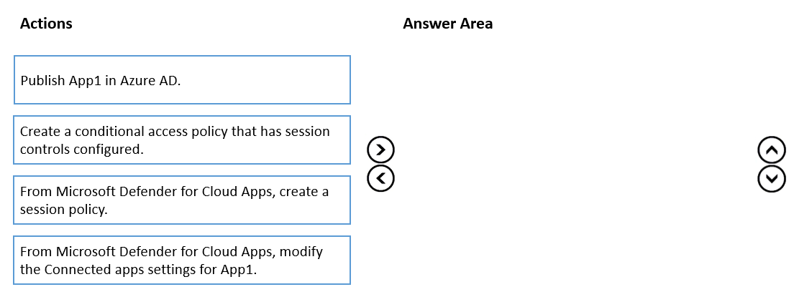
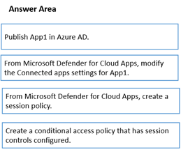

----------------------------------------

## Exam SC-300 topic 2 question 55 discussion

Actual exam question from

Microsoft's
SC-300

Question #: 55
Topic #: 2

[All SC-300 Questions]

HOTSPOT -Case Study -Overview -ADatum Corporation is a consulting company in Montreal.ADatum recently acquired a Vancouver-based company named Litware, Inc.Existing Environment. ADatum EnvironmentThe on-premises network of ADatum contains an Active Directory Domain Services (AD DS) forest named adatum.com.ADatum has a Microsoft 365 E5 subscription. The subscription contains a verified domain that syncs with the adatum.com AD DS domain by using Azure AD Connect.ADatum has an Azure Active Directory (Azure AD) tenant named adatum.com. The tenant has Security defaults disabled.The tenant contains the users shown in the following table.The tenant contains the groups shown in the following table.Existing Environment. Litware EnvironmentLitware has an AD DS forest named litware.comExisting Environment. Problem StatementsADatum identifies the following issues:• Multiple users in the sales department have up to five devices. The sales department users report that sometimes they must contact the support department to join their devices to the Azure AD tenant because they have reached their device limit.• A recent security incident reveals that several users leaked their credentials, a suspicious browser was used for a sign-in, and resources were accessed from an anonymous IP address.• When you attempt to assign the Device Administrators role to IT_Group1, the group does NOT appear in the selection list.• Anyone in the organization can invite guest users, including other guests and non-administrators.• The helpdesk spends too much time resetting user passwords.• Users currently use only passwords for authentication.Requirements. Planned Changes -ADatum plans to implement the following changes:• Configure self-service password reset (SSPR).• Configure multi-factor authentication (MFA) for all users.• Configure an access review for an access package named Package1.• Require admin approval for application access to organizational data.• Sync the AD DS users and groups of litware.com with the Azure AD tenant.• Ensure that only users that are assigned specific admin roles can invite guest users.• Increase the maximum number of devices that can be joined or registered to Azure AD to 10.Requirements. Technical RequirementsADatum identifies the following technical requirements:• Users assigned the User administrator role must be able to request permission to use the role when needed for up to one year.• Users must be prompted to register for MFA and provided with an option to bypass the registration for a grace period.• Users must provide one authentication method to reset their password by using SSPR. Available methods must include:- Email- Phone- Security questions- The Microsoft Authenticator app• Trust relationships must NOT be established between the adatum.com and litware.com AD DS domains.• The principle of least privilege must be used.You implement the planned changes for SSPR.What occurs when User3 attempts to use SSPR? To answer, select the appropriate options in the answer area.NOTE: Each correct selection is worth one point. 
Suggested Answer: 

**Answer: **

**Timestamp: July 22, 2023, 7:28 p.m.**

[View on ExamTopics](https://www.examtopics.com/discussions/microsoft/view/116106-exam-sc-300-topic-2-question-55-discussion/)

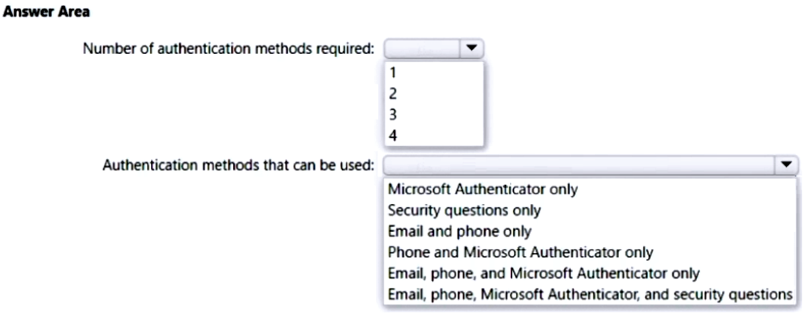
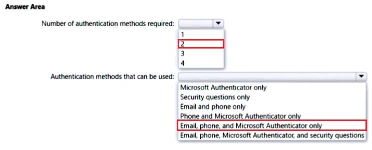

----------------------------------------

## Exam SC-300 topic 2 question 56 discussion

Actual exam question from

Microsoft's
SC-300

Question #: 56
Topic #: 2

[All SC-300 Questions]

HOTSPOT -Case Study -Overview -ADatum Corporation is a consulting company in Montreal.ADatum recently acquired a Vancouver-based company named Litware, Inc.Existing Environment. ADatum EnvironmentThe on-premises network of ADatum contains an Active Directory Domain Services (AD DS) forest named adatum.com.ADatum has a Microsoft 365 E5 subscription. The subscription contains a verified domain that syncs with the adatum.com AD DS domain by using Azure AD Connect.ADatum has an Azure Active Directory (Azure AD) tenant named adatum.com. The tenant has Security defaults disabled.The tenant contains the users shown in the following table.The tenant contains the groups shown in the following table.Existing Environment. Litware EnvironmentLitware has an AD DS forest named litware.comExisting Environment. Problem StatementsADatum identifies the following issues:• Multiple users in the sales department have up to five devices. The sales department users report that sometimes they must contact the support department to join their devices to the Azure AD tenant because they have reached their device limit.• A recent security incident reveals that several users leaked their credentials, a suspicious browser was used for a sign-in, and resources were accessed from an anonymous IP address.• When you attempt to assign the Device Administrators role to IT_Group1, the group does NOT appear in the selection list.• Anyone in the organization can invite guest users, including other guests and non-administrators.• The helpdesk spends too much time resetting user passwords.• Users currently use only passwords for authentication.Requirements. Planned Changes -ADatum plans to implement the following changes:• Configure self-service password reset (SSPR).• Configure multi-factor authentication (MFA) for all users.• Configure an access review for an access package named Package1.• Require admin approval for application access to organizational data.• Sync the AD DS users and groups of litware.com with the Azure AD tenant.• Ensure that only users that are assigned specific admin roles can invite guest users.• Increase the maximum number of devices that can be joined or registered to Azure AD to 10.Requirements. Technical RequirementsADatum identifies the following technical requirements:• Users assigned the User administrator role must be able to request permission to use the role when needed for up to one year.• Users must be prompted to register for MFA and provided with an option to bypass the registration for a grace period.• Users must provide one authentication method to reset their password by using SSPR. Available methods must include:- Email- Phone- Security questions- The Microsoft Authenticator app• Trust relationships must NOT be established between the adatum.com and litware.com AD DS domains.• The principle of least privilege must be used.You need to support the planned changes and meet the technical requirements for MFA.Which feature should you use, and how long before the users must complete the registration? To answer, select the appropriate options in the answer area.NOTE: Each correct selection is worth one point. 
Suggested Answer: 

**Answer: **

**Timestamp: July 22, 2023, 7:41 p.m.**

[View on ExamTopics](https://www.examtopics.com/discussions/microsoft/view/116107-exam-sc-300-topic-2-question-56-discussion/)

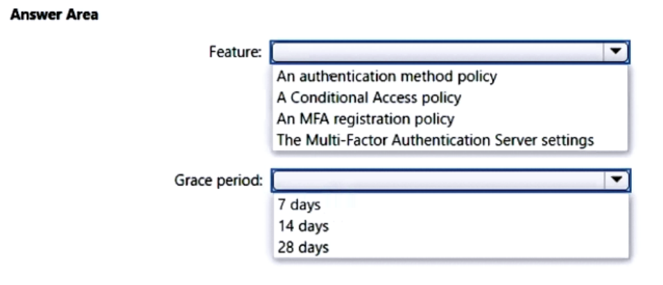
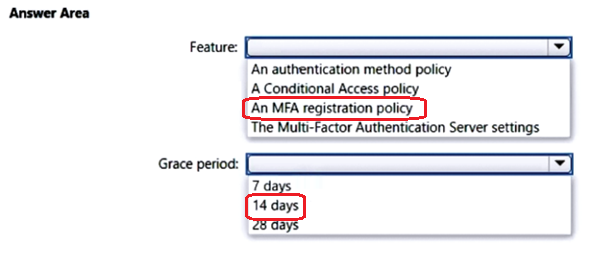

----------------------------------------

## Exam SC-300 topic 2 question 57 discussion

Actual exam question from

Microsoft's
SC-300

Question #: 57
Topic #: 2

[All SC-300 Questions]

DRAG DROP -Case Study -Overview -ADatum Corporation is a consulting company in Montreal.ADatum recently acquired a Vancouver-based company named Litware, Inc.Existing Environment. ADatum EnvironmentThe on-premises network of ADatum contains an Active Directory Domain Services (AD DS) forest named adatum.com.ADatum has a Microsoft 365 E5 subscription. The subscription contains a verified domain that syncs with the adatum.com AD DS domain by using Azure AD Connect.ADatum has an Azure Active Directory (Azure AD) tenant named adatum.com. The tenant has Security defaults disabled.The tenant contains the users shown in the following table.The tenant contains the groups shown in the following table.Existing Environment. Litware EnvironmentLitware has an AD DS forest named litware.comExisting Environment. Problem StatementsADatum identifies the following issues:• Multiple users in the sales department have up to five devices. The sales department users report that sometimes they must contact the support department to join their devices to the Azure AD tenant because they have reached their device limit.• A recent security incident reveals that several users leaked their credentials, a suspicious browser was used for a sign-in, and resources were accessed from an anonymous IP address.• When you attempt to assign the Device Administrators role to IT_Group1, the group does NOT appear in the selection list.• Anyone in the organization can invite guest users, including other guests and non-administrators.• The helpdesk spends too much time resetting user passwords.• Users currently use only passwords for authentication.Requirements. Planned Changes -ADatum plans to implement the following changes:• Configure self-service password reset (SSPR).• Configure multi-factor authentication (MFA) for all users.• Configure an access review for an access package named Package1.• Require admin approval for application access to organizational data.• Sync the AD DS users and groups of litware.com with the Azure AD tenant.• Ensure that only users that are assigned specific admin roles can invite guest users.• Increase the maximum number of devices that can be joined or registered to Azure AD to 10.Requirements. Technical RequirementsADatum identifies the following technical requirements:• Users assigned the User administrator role must be able to request permission to use the role when needed for up to one year.• Users must be prompted to register for MFA and provided with an option to bypass the registration for a grace period.• Users must provide one authentication method to reset their password by using SSPR. Available methods must include:- Email- Phone- Security questions- The Microsoft Authenticator app• Trust relationships must NOT be established between the adatum.com and litware.com AD DS domains.• The principle of least privilege must be used.You need to resolve the recent security incident issues.What should you configure for each incident? To answer, drag the appropriate policy types to the correct issues. Each policy type may be used once, more than once, or not at all. You may need to drag the split bar between panes or scroll to view content.NOTE: Each correct selection is worth one point. 
Suggested Answer: 

**Answer: **

**Timestamp: July 26, 2023, 6:21 a.m.**

[View on ExamTopics](https://www.examtopics.com/discussions/microsoft/view/116459-exam-sc-300-topic-2-question-57-discussion/)

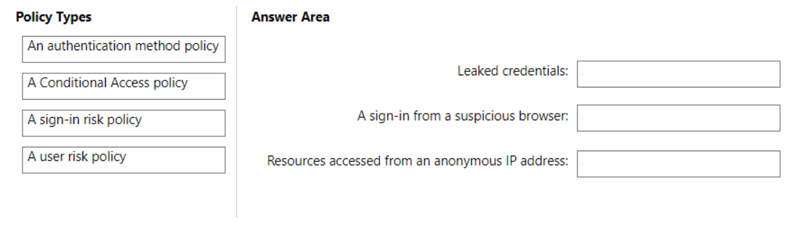
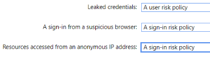

----------------------------------------

## Exam SC-300 topic 2 question 58 discussion

Actual exam question from

Microsoft's
SC-300

Question #: 58
Topic #: 2

[All SC-300 Questions]

A user named User1 receives an error message when attempting to access the Microsoft Defender for Cloud Apps portal.You need to identify the cause of the error. The solution must minimize administrative effort.What should you use? 
Suggested Answer: B 🗳️ 

A. Log Analytics

B. sign-in logs

C. audit logs

D. provisioning logs

**Answer: B**

**Timestamp: Aug. 29, 2023, 9:03 p.m.**

[View on ExamTopics](https://www.examtopics.com/discussions/microsoft/view/119321-exam-sc-300-topic-2-question-58-discussion/)

----------------------------------------

## Exam SC-300 topic 2 question 59 discussion

Actual exam question from

Microsoft's
SC-300

Question #: 59
Topic #: 2

[All SC-300 Questions]

You have a Microsoft 365 E5 subscription that uses Microsoft Defender for Cloud Apps and Yammer.You need prevent users from signing in to Yammer from high-risk locations.What should you do in the Microsoft Defender for Cloud Apps portal? 
Suggested Answer: A 🗳️ 

A. Create an access policy.

B. Create an activity policy.

C. Unsanction Yammer.

D. Create an anomaly detection policy.

**Answer: A**

**Timestamp: Aug. 2, 2023, 3:14 p.m.**

[View on ExamTopics](https://www.examtopics.com/discussions/microsoft/view/117124-exam-sc-300-topic-2-question-59-discussion/)

----------------------------------------

## Exam SC-300 topic 2 question 60 discussion

Actual exam question from

Microsoft's
SC-300

Question #: 60
Topic #: 2

[All SC-300 Questions]

HOTSPOT -You have an Azure subscription named Sub1 that contains three users named User1, User2, and User3. Sub1 has a storage account named storage1 that contains the resources shown in the following table.Sub1 contains the users shown in the following table.Which users can read File1, and which users can read File2? To answer, select the appropriate options in the answer area.NOTE: Each correct selection is worth one point. 
Suggested Answer: 

**Answer: **

**Timestamp: Jan. 31, 2025, 9:34 a.m.**

[View on ExamTopics](https://www.examtopics.com/discussions/microsoft/view/155740-exam-sc-300-topic-2-question-60-discussion/)

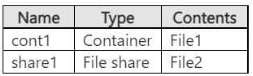
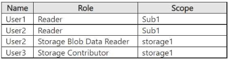
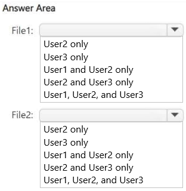
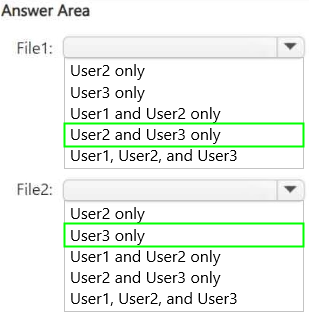

----------------------------------------

## Exam SC-300 topic 2 question 61 discussion

Actual exam question from

Microsoft's
SC-300

Question #: 61
Topic #: 2

[All SC-300 Questions]

You have an Azure Active Directory (Azure AD) tenant.You open the risk detections report.Which risk detection type is classified as a user risk? 
Suggested Answer: D 🗳️ 

A. impossible travel

B. anonymous IP address

C. malicious IP address

D. Azure AD threat intelligence

**Answer: D**

**Timestamp: Aug. 15, 2023, 6:15 a.m.**

[View on ExamTopics](https://www.examtopics.com/discussions/microsoft/view/118136-exam-sc-300-topic-2-question-61-discussion/)

----------------------------------------

## Exam SC-300 topic 2 question 63 discussion

Actual exam question from

Microsoft's
SC-300

Question #: 63
Topic #: 2

[All SC-300 Questions]

You have an Azure AD Tenant.You configure self-service password reset (SSPR) by using the following settings:• Require users to register when signing in: Yes• Number of methods required to reset: 1What is a valid authentication method available to users? 
Suggested Answer: B 🗳️ 

A. an FIDO2 security token

B. a mobile app code

C. a Microsoft Teams chat

D. a Windows Hello PIN

**Answer: B**

**Timestamp: Oct. 9, 2023, 8:38 p.m.**

[View on ExamTopics](https://www.examtopics.com/discussions/microsoft/view/123025-exam-sc-300-topic-2-question-63-discussion/)

----------------------------------------

## Exam SC-300 topic 2 question 64 discussion

Actual exam question from

Microsoft's
SC-300

Question #: 64
Topic #: 2

[All SC-300 Questions]

HOTSPOT -You have an Azure subscription.From Entitlement management, you plan to create a catalog named Catalog1 that will contain a custom extension.What should you create first, and what should you use to distribute Catalog1? To answer, select the appropriate options in the answer area.NOTE: Each correct selection is worth one point. 
Suggested Answer: 

**Answer: **

**Timestamp: Oct. 13, 2023, 6:56 p.m.**

[View on ExamTopics](https://www.examtopics.com/discussions/microsoft/view/123535-exam-sc-300-topic-2-question-64-discussion/)

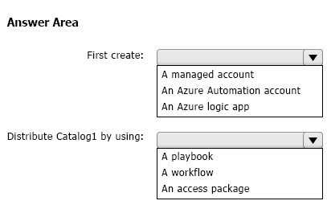
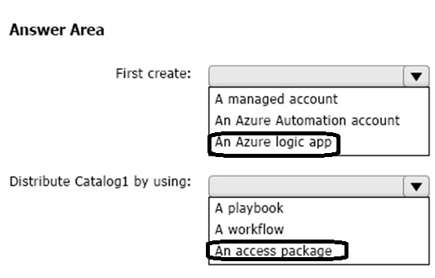

----------------------------------------

## Exam SC-300 topic 2 question 65 discussion

Actual exam question from

Microsoft's
SC-300

Question #: 65
Topic #: 2

[All SC-300 Questions]

You have an Azure AD tenant that contains the users shown in the following table.You enable self-service password reset (SSPR) for all the users and configure SSPR to require security questions as the only authentication method.Which users must use security questions when resetting their password? 
Suggested Answer: B 🗳️ 

A. User4 only

B. User3 and User4 only

C. User1 and User4 only

D. User1, User3, and User4 only

E. User1, User2, User3, and User4

**Answer: B**

**Timestamp: Oct. 4, 2023, 9:33 a.m.**

[View on ExamTopics](https://www.examtopics.com/discussions/microsoft/view/122352-exam-sc-300-topic-2-question-65-discussion/)

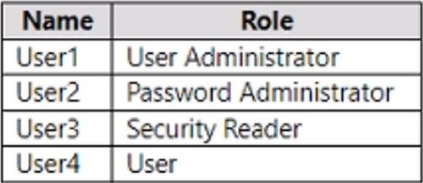

----------------------------------------

## Exam SC-300 topic 2 question 66 discussion

Actual exam question from

Microsoft's
SC-300

Question #: 66
Topic #: 2

[All SC-300 Questions]

You have an Azure AD tenant.You need to implement smart lockout with a lockout threshold of 10 failed sign-ins.What should you configure in the Azure AD admin center? 
Suggested Answer: B 🗳️ 

A. Authentication strengths

B. Password protection

C. User risk policy

D. Sign-in risk policy

**Answer: B**

**Timestamp: Oct. 8, 2023, 2:27 p.m.**

[View on ExamTopics](https://www.examtopics.com/discussions/microsoft/view/122846-exam-sc-300-topic-2-question-66-discussion/)

----------------------------------------

## Exam SC-300 topic 2 question 67 discussion

Actual exam question from

Microsoft's
SC-300

Question #: 67
Topic #: 2

[All SC-300 Questions]

You configure a new Microsoft 365 tenant to use a default domain name of contoso.com.You need to ensure that you can control access to Microsoft 365 resources by using conditional access policies.What should you do first? 
Suggested Answer: A 🗳️ 

A. Disable Security defaults.

B. Configure password protection for the Azure AD tenant.

C. Configure a multi-factor authentication (MFA) registration policy.

D. Disable the User consent settings.

**Answer: A**

**Timestamp: Oct. 21, 2023, 1:29 p.m.**

[View on ExamTopics](https://www.examtopics.com/discussions/microsoft/view/124186-exam-sc-300-topic-2-question-67-discussion/)

----------------------------------------

## Exam SC-300 topic 2 question 68 discussion

Actual exam question from

Microsoft's
SC-300

Question #: 68
Topic #: 2

[All SC-300 Questions]

You have a Microsoft 365 tenant.An on-premises Active Directory domain is configured to sync with the Azure AD tenant. The domain contains the servers shown in the following table.The domain controllers are prevented from communicating to the internet.You implement Azure AD Password Protection on Server1 and Server2.You deploy a new server named Server4 that runs Windows Server 2022.You need to ensure that Azure AD Password Protection will continue to work if a single server fails.What should you implement on Server4? 
Suggested Answer: D 🗳️ 

A. Azure AD Connect

B. Azure AD Application Proxy

C. Password Change Notification Service (PCNS)

D. the Azure AD Password Protection proxy service

**Answer: D**

**Timestamp: Oct. 24, 2023, 1:42 a.m.**

[View on ExamTopics](https://www.examtopics.com/discussions/microsoft/view/124491-exam-sc-300-topic-2-question-68-discussion/)

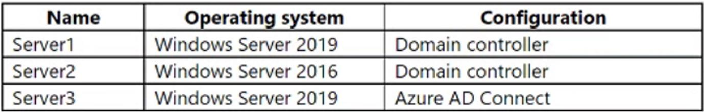

----------------------------------------

## Exam SC-300 topic 2 question 69 discussion

Actual exam question from

Microsoft's
SC-300

Question #: 69
Topic #: 2

[All SC-300 Questions]

You have an on-premises app named App1.You have a Microsoft Entra tenant.You plan to publish App1 by using Microsoft Entra Private Access.You need to enable the Private access profile.Which blade should you use in the Microsoft Entra admin center? 
Suggested Answer: B 🗳️ 

A. Remote networks

B. Traffic forwarding

C. Security profiles

D. Connectors

**Answer: B**

**Timestamp: Dec. 30, 2024, 9:47 a.m.**

[View on ExamTopics](https://www.examtopics.com/discussions/microsoft/view/153637-exam-sc-300-topic-2-question-69-discussion/)

----------------------------------------

## Exam SC-300 topic 2 question 70 discussion

Actual exam question from

Microsoft's
SC-300

Question #: 70
Topic #: 2

[All SC-300 Questions]

HOTSPOT -You have an Azure subscription that contains the resources shown in the following table.You need to configure access to Vault1. The solution must meet the following requirements:• Ensure that User1 can manage and create keys in Vault1.• Ensure that User2 can access a certificate stored in Vault1.• Use the principle of least privilege.Which role should you assign to each user? To answer select the appropriate options in the answer area.NOTE: Each correct selection is worth one point. 
Suggested Answer: 

**Answer: **

**Timestamp: Oct. 7, 2023, 2:55 p.m.**

[View on ExamTopics](https://www.examtopics.com/discussions/microsoft/view/122782-exam-sc-300-topic-2-question-70-discussion/)

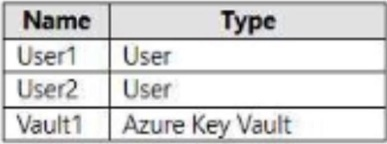
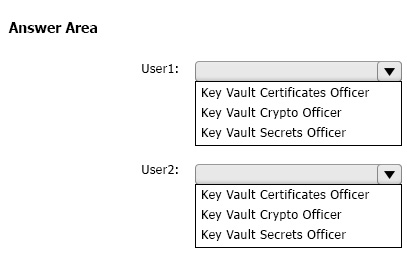
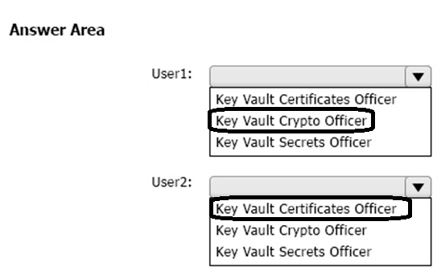

----------------------------------------

## Exam SC-300 topic 2 question 71 discussion

Actual exam question from

Microsoft's
SC-300

Question #: 71
Topic #: 2

[All SC-300 Questions]

You have an Azure AD tenant that has multi-factor authentication (MFA) enforced and self-service password reset (SSPR) enabled.You enable combined registration in interrupt mode.You create a new user named User1.Which two authentication methods can User1 use to complete the combined registration process? Each correct answer presents a complete solution.NOTE: Each correct selection is worth one point. 
Suggested Answer: CE 🗳️ 

A. a FIDO2 security key

B. a hardware token

C. a one-time passcode email

D. Windows Hello for Business

E. the Microsoft Authenticator app

**Answer: C**

**Timestamp: Oct. 5, 2023, 10:56 a.m.**

[View on ExamTopics](https://www.examtopics.com/discussions/microsoft/view/122493-exam-sc-300-topic-2-question-71-discussion/)

----------------------------------------

## Exam SC-300 topic 2 question 72 discussion

Actual exam question from

Microsoft's
SC-300

Question #: 72
Topic #: 2

[All SC-300 Questions]

DRAG DROP -You have an Azure AD tenant that contains a user named Admin1.Admin1 uses the Require password change for high-risk users policy template to create a new Conditional Access policy.Who is included and excluded by default in the policy assignment? To answer, drag the appropriate options to the correct target. Each option may be used once, more than once, or not at all. You may need to drag the split bar between panes or scroll to view content.NOTE: Each correct selection is worth one point 
Suggested Answer: 

**Answer: **

**Timestamp: Oct. 9, 2023, 11:01 a.m.**

[View on ExamTopics](https://www.examtopics.com/discussions/microsoft/view/122950-exam-sc-300-topic-2-question-72-discussion/)

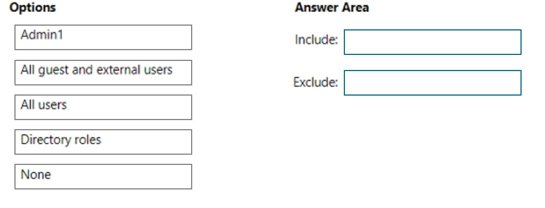
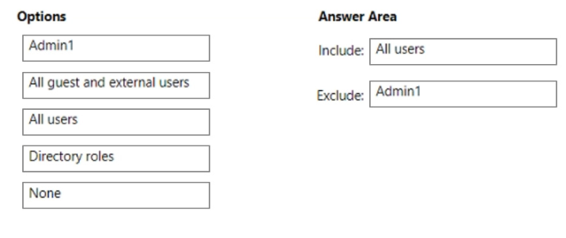

----------------------------------------

## Exam SC-300 topic 2 question 73 discussion

Actual exam question from

Microsoft's
SC-300

Question #: 73
Topic #: 2

[All SC-300 Questions]

DRAG DROP -You have a Microsoft 365 E5 subscription. The subscription contains 500 devices that run Windows.You deploy the Global Secure Access client to the devices.You need to prevent users from accessing https://contoso.com from the devices.Which three actions should you perform in sequence? To answer move the appropriate actions from the list of actions to the answer area and arrange them in the correct order. 
Suggested Answer: 

**Answer: **

**Timestamp: Feb. 12, 2025, 12:04 a.m.**

[View on ExamTopics](https://www.examtopics.com/discussions/microsoft/view/156377-exam-sc-300-topic-2-question-73-discussion/)

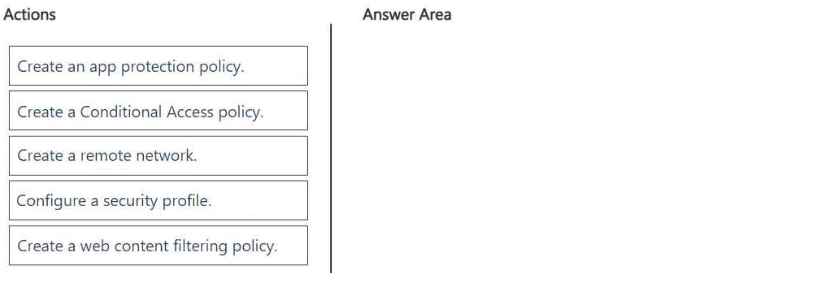
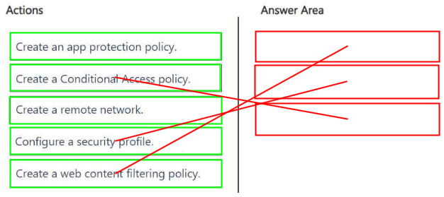

----------------------------------------

## Exam SC-300 topic 2 question 74 discussion

Actual exam question from

Microsoft's
SC-300

Question #: 74
Topic #: 2

[All SC-300 Questions]

You have a Microsoft 365 tenant.You currently allow email clients that use Basic authentication to connect to Microsoft Exchange Online.You need to ensure that users can connect to Exchange Online only from email clients that use Modern authentication protocols.What should you implement? 
Suggested Answer: A 🗳️ 

A. a conditional access policy in Azure AD

B. a compliance policy in Microsoft Intune

C. an OAuth policy in Microsoft Defender for Cloud Apps

D. an application control profile in Microsoft Intune

**Answer: A**

**Timestamp: Oct. 12, 2023, 3:19 p.m.**

[View on ExamTopics](https://www.examtopics.com/discussions/microsoft/view/123431-exam-sc-300-topic-2-question-74-discussion/)

----------------------------------------

## Exam SC-300 topic 2 question 75 discussion

Actual exam question from

Microsoft's
SC-300

Question #: 75
Topic #: 2

[All SC-300 Questions]

You plan to deploy a new Azure AD tenant.Which multifactor authentication (MFA) method will be enabled by default for the tenant? 
Suggested Answer: A 🗳️ 

A. Microsoft Authenticator

B. SMS

C. voice call

D. email OTP

**Answer: A**

**Timestamp: Oct. 10, 2023, 7:27 p.m.**

[View on ExamTopics](https://www.examtopics.com/discussions/microsoft/view/123125-exam-sc-300-topic-2-question-75-discussion/)

----------------------------------------

## Exam SC-300 topic 2 question 76 discussion

Actual exam question from

Microsoft's
SC-300

Question #: 76
Topic #: 2

[All SC-300 Questions]

HOTSPOT -You have a Microsoft 365 E5 subscription that contains a Microsoft SharePoint Online site named Site1 and the users shown in the following table.The users have the devices shown in the following table.You create the following two Conditional Access policies:• Name: CAPolicy1• Assignments o Users or workload identities: Group1 o Cloud apps or actions: Office 365 SharePoint Online o Conditions Filter for devices: Exclude filtered devices from the policy Rule syntax: device.displayName -startsWith “Device” o Access controls Grant: Block access Session: 0 controls selected o Enable policy: On• Name: CAPolicy2• Assignments o Users or workload identities: Group2 o Cloud apps or actions: Office 365 SharePoint Online o Conditions: 0 conditions selected• Access controls o Grant: Grant access Require multifactor authentication o Session: 0 controls selected• Enable policy: OnAll users confirm that they can successfully authenticate using MFA.For each of the following statements, select Yes if the statement is true. Otherwise, select No.NOTE: Each correct selection is worth one point. 
Suggested Answer: 

**Answer: **

**Timestamp: Oct. 9, 2023, 11:35 a.m.**

[View on ExamTopics](https://www.examtopics.com/discussions/microsoft/view/122961-exam-sc-300-topic-2-question-76-discussion/)

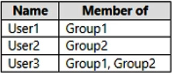
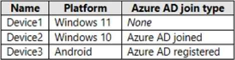
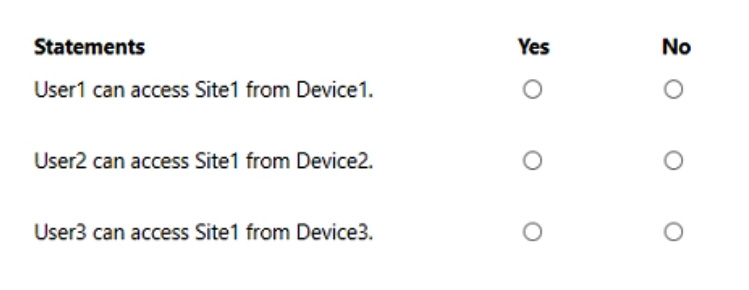
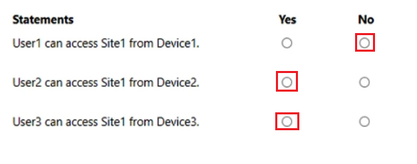

----------------------------------------

## Exam SC-300 topic 2 question 77 discussion

Actual exam question from

Microsoft's
SC-300

Question #: 77
Topic #: 2

[All SC-300 Questions]

You have a Microsoft 365 E5 subscription that contains three users named User1, User2, and User3 and a Microsoft SharePoint Online site named Site1.The subscription contains the devices shown in the following table.The users sign in to the devices as shown in the following table.You have a Conditional Access policy that has the following settings:• Name: CA1• Assignmentso Users and groups: User1, User2, User3o Cloud apps or actions: SharePoint - Site1• Access controlso Session: Use app enforced restrictionsFrom the SharePoint admin center, you configure Access control for unmanaged devices to allow limited, web-only access.Which users will have full access to Site1? 
Suggested Answer: B 🗳️ 

A. User1 only

B. User2 only

C. User3only

D. User1 and User2 only

E. User1, User2, and User3

**Answer: B**

**Timestamp: Oct. 18, 2023, 9:51 p.m.**

[View on ExamTopics](https://www.examtopics.com/discussions/microsoft/view/123989-exam-sc-300-topic-2-question-77-discussion/)

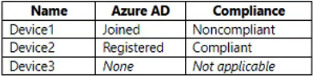
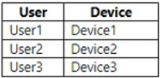

----------------------------------------

## Exam SC-300 topic 2 question 78 discussion

Actual exam question from

Microsoft's
SC-300

Question #: 78
Topic #: 2

[All SC-300 Questions]

You have an Azure AD tenant named contoso.com that contains the resources shown in the following table.You create a user named Admin1.You need to ensure that Admin1 can enable Security defaults for contoso.com.What should you do first? 
Suggested Answer: B 🗳️ 

A. Delete Package1.

B. Delete CAPolicy1.

C. Assign Admin1 the Authentication Administrator role for Au1.

D. Configure Identity Governance.

**Answer: B**

**Timestamp: Oct. 2, 2023, 7:08 p.m.**

[View on ExamTopics](https://www.examtopics.com/discussions/microsoft/view/122180-exam-sc-300-topic-2-question-78-discussion/)

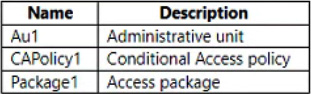

----------------------------------------

## Exam SC-300 topic 2 question 79 discussion

Actual exam question from

Microsoft's
SC-300

Question #: 79
Topic #: 2

[All SC-300 Questions]

DRAG DROP -You have an Azure subscription that is linked to an Azure AD tenant named contoso.com. The subscription contains a group named Group1 and a virtual machine named VM1.You need to meet the following requirements:• Enable a system-assigned managed identity for VM1.• Add VM1 to Group1.How should you complete the PowerShell script? To answer, drag the appropriate cmdlets to the correct targets. Each cmdlet may be used once, more than once or not at all. You may need to drag the split bar between panes or scroll to view content.NOTE: Each correct selection is worth one point. 
Suggested Answer: 

**Answer: **

**Timestamp: Oct. 9, 2023, 12:05 p.m.**

[View on ExamTopics](https://www.examtopics.com/discussions/microsoft/view/122964-exam-sc-300-topic-2-question-79-discussion/)

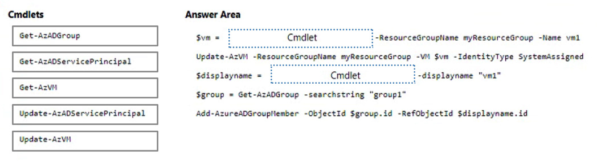
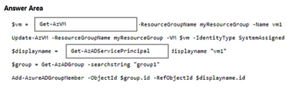

----------------------------------------

## Exam SC-300 topic 2 question 80 discussion

Actual exam question from

Microsoft's
SC-300

Question #: 80
Topic #: 2

[All SC-300 Questions]

You have an Azure AD tenant.You deploy a new enterprise application named App1.When users attempt to provide App1 with access to the tenant, the attempt fails.You need to ensure that the users can request admin consent for App1. The solution must follow the principle of least privilege.What should you do first? 
Suggested Answer: A 🗳️ 

A. Enable admin consent requests for the tenant.

B. Designate a reviewer of admin consent requests for the tenant.

C. From the Permissions settings of App1, grant App1 admin consent for the tenant.

D. Create a Conditional Access policy for App1.

**Answer: A**

**Timestamp: Nov. 6, 2023, 1:21 a.m.**

[View on ExamTopics](https://www.examtopics.com/discussions/microsoft/view/125483-exam-sc-300-topic-2-question-80-discussion/)

----------------------------------------

## Exam SC-300 topic 2 question 81 discussion

Actual exam question from

Microsoft's
SC-300

Question #: 81
Topic #: 2

[All SC-300 Questions]

Note: This question is part of a series of questions that present the same scenario. Each question in the series contains a unique solution that might meet the stated goals. Some question sets might have more than one correct solution, while others might not have a correct solution.After you answer a question in this section, you will NOT be able to return to it. As a result, these questions will not appear in the review screen.You have a Microsoft 365 tenant.All users must use the Microsoft Authenticator app for multi-factor authentication (MFA) when accessing Microsoft 365 services.Some users report that they received an MFA prompt on their Microsoft Authenticator app without initiating a sign-in request.You need to block the users automatically when they report an MFA request that they did not initiate.Solution: From the Azure Active Directory admin center, you configure the Block/unblock users settings for multi-factor authentication (MFA).Does this meet the goal? 
Suggested Answer: B 🗳️ 

A. Yes

B. No

**Answer: B**

**Timestamp: Nov. 6, 2023, 1:22 a.m.**

[View on ExamTopics](https://www.examtopics.com/discussions/microsoft/view/125484-exam-sc-300-topic-2-question-81-discussion/)

----------------------------------------

## Exam SC-300 topic 2 question 82 discussion

Actual exam question from

Microsoft's
SC-300

Question #: 82
Topic #: 2

[All SC-300 Questions]

You have a Microsoft 365 subscription that contains a Microsoft SharePoint Online site named Site1 and a Microsoft 365 group named Group1.You need to ensure that the members of Group1 can access Site1 for 90 days. The solution must minimize administrative effort.What should you use? 
Suggested Answer: A 🗳️ 

A. an access package

B. an access review

C. a lifecycle workflow

D. a Conditional Access policy

**Answer: A**

**Timestamp: Feb. 7, 2024, 10:51 a.m.**

[View on ExamTopics](https://www.examtopics.com/discussions/microsoft/view/133252-exam-sc-300-topic-2-question-82-discussion/)

----------------------------------------

## Exam SC-300 topic 2 question 83 discussion

Actual exam question from

Microsoft's
SC-300

Question #: 83
Topic #: 2

[All SC-300 Questions]

You have a Microsoft Entra tenant that contains the groups shown in the following table.You need to implement Privileged Identity Management (PIM) for the groups.Which groups can be managed by using PIM? 
Suggested Answer: C 🗳️ 

A. Group1 only

B. Group1 and Group2 only

C. Group1 and Group3 only

D. Group3 and Group4 only

E. Group1, Group2, Group3, and Group4

**Answer: C**

**Timestamp: March 31, 2024, 10:12 a.m.**

[View on ExamTopics](https://www.examtopics.com/discussions/microsoft/view/137583-exam-sc-300-topic-2-question-83-discussion/)

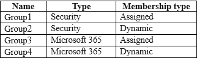

----------------------------------------

## Exam SC-300 topic 2 question 83 discussion

Actual exam question from

Microsoft's
SC-300

Question #: 62
Topic #: 2

[All SC-300 Questions]

You have a Microsoft Entra tenant.You need to query risky user activity for the tenant.How long will the logs of risky user activity be retained? 
Suggested Answer: C 🗳️ 

A. 30 days

B. 60 days

C. 90 days

D. 180 days

**Answer: C**

**Timestamp: Jan. 24, 2024, 9:06 a.m.**

[View on ExamTopics](https://www.examtopics.com/discussions/microsoft/view/131994-exam-sc-300-topic-2-question-83-discussion/)

----------------------------------------

## Exam SC-300 topic 2 question 84 discussion

Actual exam question from

Microsoft's
SC-300

Question #: 84
Topic #: 2

[All SC-300 Questions]

HOTSPOT -You have a Microsoft Entra tenant that contains the users shown in the following table.You have a user risk policy that has the following settings:• Assignments:o Include: Group1o Exclude: Group2• Sign-in risk: Medium and above• Access controls:o Grant access: Require password changeWhen the users attempt to sign in, user risk levels are detected as shown in the following table.For each of the following statements, select Yes if the statement is true. Otherwise, select No.NOTE: Each correct selection is worth one point. 
Suggested Answer: 

**Answer: **

**Timestamp: March 31, 2024, 10:20 a.m.**

[View on ExamTopics](https://www.examtopics.com/discussions/microsoft/view/137585-exam-sc-300-topic-2-question-84-discussion/)

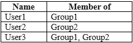
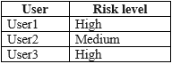
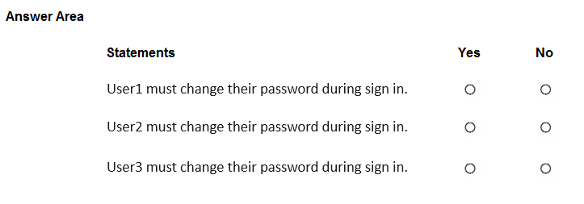
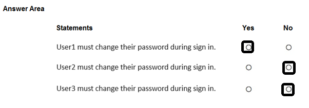

----------------------------------------

## Exam SC-300 topic 2 question 85 discussion

Actual exam question from

Microsoft's
SC-300

Question #: 85
Topic #: 2

[All SC-300 Questions]

You have an Azure subscription that contains a resource group named RG1 and four users named User1, User2, User3, and User4.You plan to assign the users the following roles for RG1:• User1: Reader• User2: Contributor• User3: Storage Blob Data Reader• User4: Virtual Machine ContributorYou are evaluating the use of attribute-based access control (ABAC).Which user's role will support the use of ABAC? 
Suggested Answer: C 🗳️ 

A. User1

B. User2

C. User3

D. User4

**Answer: C**

**Timestamp: March 30, 2024, 10:14 a.m.**

[View on ExamTopics](https://www.examtopics.com/discussions/microsoft/view/137530-exam-sc-300-topic-2-question-85-discussion/)

----------------------------------------

## Exam SC-300 topic 2 question 86 discussion

Actual exam question from

Microsoft's
SC-300

Question #: 86
Topic #: 2

[All SC-300 Questions]

You have an Azure subscription. The subscription contains a virtual machine named VM1 that runs Linux.You need to configure enhanced security for VM1. The solution must meet the following requirements:• Ensure that users can sign in to VM1 by using their Microsoft Entra credentials.• Ensure that users authenticate by using multi-factor out-of-band.• Prevent users from signing in to VM1 by using passwords.Which two authentication methods can you include in the solution? Each correct answer presents a complete solution.NOTE: Each correct selection is worth one point. 
Suggested Answer: AB 🗳️ 

A. the Microsoft Authenticator app

B. FIDO2 security keys

C. Temporary Access Pass

D. SMS

E. Windows Hello for Business

**Answer: A**

**Timestamp: Dec. 21, 2024, 12:53 a.m.**

[View on ExamTopics](https://www.examtopics.com/discussions/microsoft/view/153250-exam-sc-300-topic-2-question-86-discussion/)

----------------------------------------

## Exam SC-300 topic 2 question 87 discussion

Actual exam question from

Microsoft's
SC-300

Question #: 87
Topic #: 2

[All SC-300 Questions]

You have a Microsoft 365 E5 subscription.You create an access review named Review1. Review1 requires that every six months, Microsoft 365 group owners review guest user access to their groups.You need to ensure that if the group owners fail to review the membership of Review1, guest users are removed automatically.Which settings should you configure for Review1? 
Suggested Answer: B 🗳️ 

A. Scheduling

B. When completed

C. General

D. Reviewers

**Answer: B**

**Timestamp: Feb. 15, 2025, 9:29 p.m.**

[View on ExamTopics](https://www.examtopics.com/discussions/microsoft/view/156575-exam-sc-300-topic-2-question-87-discussion/)

----------------------------------------

## Exam SC-300 topic 2 question 89 discussion

Actual exam question from

Microsoft's
SC-300

Question #: 89
Topic #: 2

[All SC-300 Questions]

SIMULATION -Use the following login credentials as needed:To enter your username, place your cursor in the Sign in box and click on the username below.To enter your password, place your cursor in the Enter password box and click on the password below.Microsoft 365 Username:[email protected]Microsoft 365 Password: =1122334455667788If the Microsoft 365 portal does not load successfully in the browser, press CTRL-K to reload the portal in a new browser tab.The following information is for technical support purposes only:Lab Instance: 99999999 -You need to ensure that users in the sg-Legal group must reauthenticate every 12 hours when they access any cloud apps managed by the tenant.To complete this task, sign in to the appropriate admin center. 
Suggested Answer: 

**Answer: **

**Timestamp: May 22, 2025, 12:29 p.m.**

[View on ExamTopics](https://www.examtopics.com/discussions/microsoft/view/304037-exam-sc-300-topic-2-question-89-discussion/)

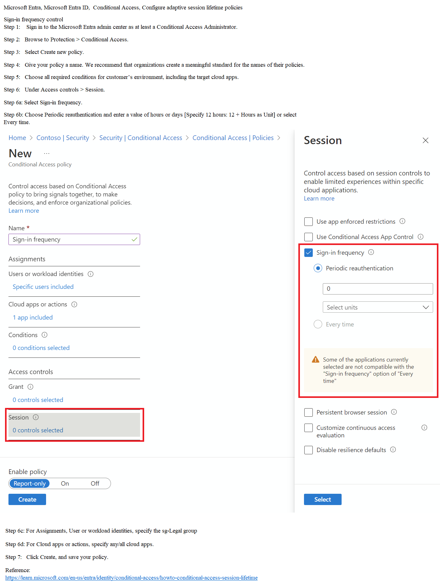

----------------------------------------

## Exam SC-300 topic 2 question 90 discussion

Actual exam question from

Microsoft's
SC-300

Question #: 90
Topic #: 2

[All SC-300 Questions]

SIMULATION -Use the following login credentials as needed:To enter your username, place your cursor in the Sign in box and click on the username below.To enter your password, place your cursor in the Enter password box and click on the password below.Microsoft 365 Username:[email protected]Microsoft 365 Password: =1122334455667788If the Microsoft 365 portal does not load successfully in the browser, press CTRL-K to reload the portal in a new browser tab.The following information is for technical support purposes only:Lab Instance: 99999999 -You need to configure Microsoft Entra Identity Protection to meet the following requirements:• Require multi-factor authentication (MFA) for any sign-ins at the high risk level.• Apply the configuration to all users except for Mod Administrator.To complete this task, sign in to the appropriate admin center. 
Suggested Answer: 

**Answer: **

**Timestamp: Feb. 4, 2025, 12:43 p.m.**

[View on ExamTopics](https://www.examtopics.com/discussions/microsoft/view/155926-exam-sc-300-topic-2-question-90-discussion/)

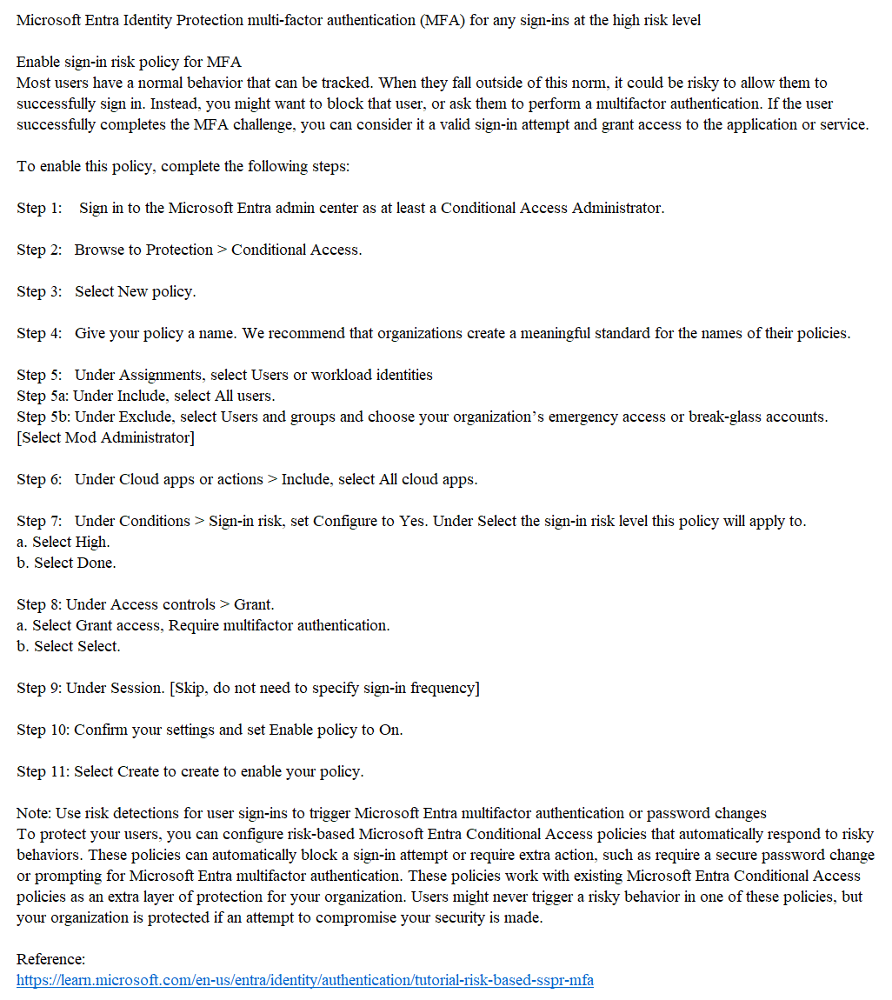

----------------------------------------

## Exam SC-300 topic 2 question 91 discussion

Actual exam question from

Microsoft's
SC-300

Question #: 91
Topic #: 2

[All SC-300 Questions]

SIMULATION -Use the following login credentials as needed:To enter your username, place your cursor in the Sign in box and click on the username below.To enter your password, place your cursor in the Enter password box and click on the password below.Microsoft 365 Username:[email protected]Microsoft 365 Password: =1122334455667788If the Microsoft 365 portal does not load successfully in the browser, press CTRL-K to reload the portal in a new browser tab.The following information is for technical support purposes only:Lab Instance: 99999999 -You need to deploy multi factor authentication (MFA). The solution must meet the following requirements:• Require MFA registration only for members of the sg-Finance group.• Exclude Debra Berger from having to register for MFA.• Implement the solution without using a Conditional Access policy.To complete this task, sign in to the appropriate admin center. 
Suggested Answer: 

**Answer: **

**Timestamp: May 22, 2025, 12:38 p.m.**

[View on ExamTopics](https://www.examtopics.com/discussions/microsoft/view/304039-exam-sc-300-topic-2-question-91-discussion/)

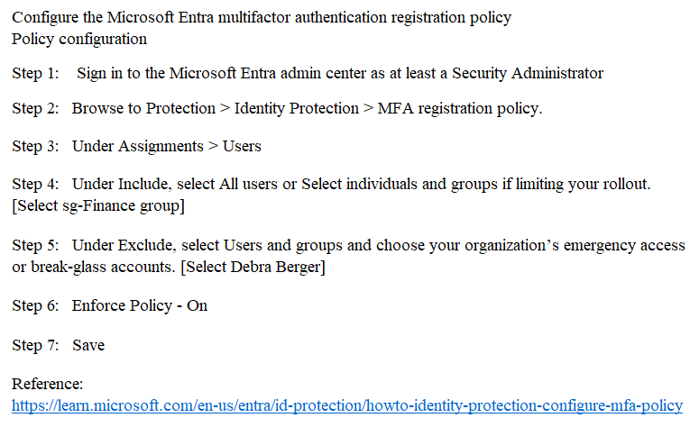

----------------------------------------

## Exam SC-300 topic 2 question 92 discussion

Actual exam question from

Microsoft's
SC-300

Question #: 92
Topic #: 2

[All SC-300 Questions]

SIMULATION -Use the following login credentials as needed:To enter your username, place your cursor in the Sign in box and click on the username below.To enter your password, place your cursor in the Enter password box and click on the password below.Microsoft 365 Username:[email protected]Microsoft 365 Password: =1122334455667788If the Microsoft 365 portal does not load successfully in the browser, press CTRL-K to reload the portal in a new browser tab.The following information is for technical support purposes only:Lab Instance: 99999999 -You need to implement a process to review guest users who have access to the Salesforce app. The review must meet the following requirements:• The reviews must occur monthly.• The manager of each guest user must review the access.• If the reviews are NOT completed within five days, access must be removed.• If the guest user does not have a manager, Megan Bowen must review the access.To complete this task, sign in to the appropriate admin center. 
Suggested Answer: 

**Answer: **

**Timestamp: Jan. 22, 2025, 4:22 p.m.**

[View on ExamTopics](https://www.examtopics.com/discussions/microsoft/view/155235-exam-sc-300-topic-2-question-92-discussion/)

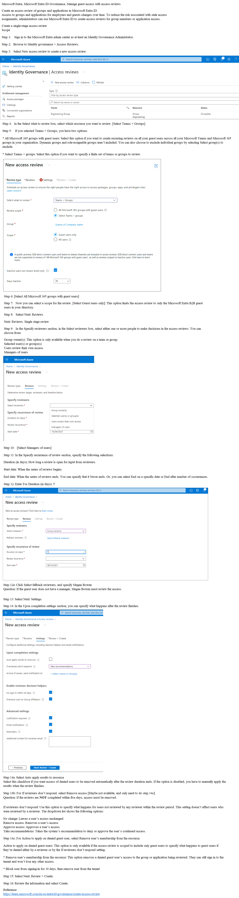

----------------------------------------

## Exam SC-300 topic 2 question 93 discussion

Actual exam question from

Microsoft's
SC-300

Question #: 93
Topic #: 2

[All SC-300 Questions]

SIMULATION -Use the following login credentials as needed:To enter your username, place your cursor in the Sign in box and click on the username below.To enter your password, place your cursor in the Enter password box and click on the password below.Microsoft 365 Username:[email protected]Microsoft 365 Password: =1122334455667788If the Microsoft 365 portal does not load successfully in the browser, press CTRL-K to reload the portal in a new browser tab.The following information is for technical support purposes only:Lab Instance: 99999999 -You need to add the LinkedIn application as a resource to the Sales and Marketing access package. The solution must NOT remove any other resources from the access package.To complete this task, sign in to the appropriate admin center. 
Suggested Answer: 

**Answer: **

**Timestamp: July 17, 2025, 9:29 a.m.**

[View on ExamTopics](https://www.examtopics.com/discussions/microsoft/view/306712-exam-sc-300-topic-2-question-93-discussion/)

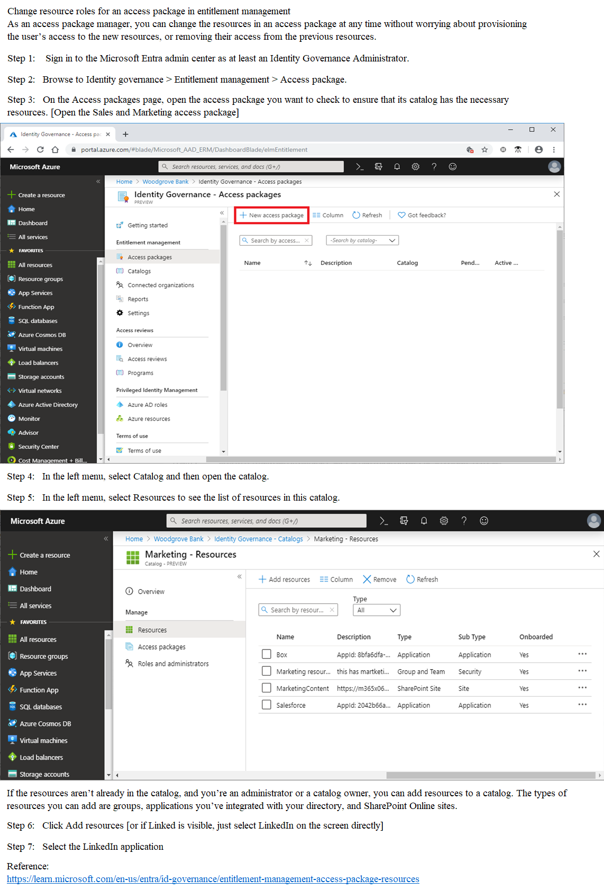

----------------------------------------

## Exam SC-300 topic 2 question 94 discussion

Actual exam question from

Microsoft's
SC-300

Question #: 94
Topic #: 2

[All SC-300 Questions]

SIMULATION -Use the following login credentials as needed:To enter your username, place your cursor in the Sign in box and click on the username below.To enter your password, place your cursor in the Enter password box and click on the password below.Microsoft 365 Username:[email protected]Microsoft 365 Password: =1122334455667788If the Microsoft 365 portal does not load successfully in the browser, press CTRL-K to reload the portal in a new browser tab.The following information is for technical support purposes only:Lab Instance: 99999999 -You need to implement additional security checks before the members of the sg-Executive can access any company apps. The members must meet one of the following conditions:• Connect by using a device that is marked as compliant by Microsoft Intune.• Connect by using client apps that are protected by app protection policies.To complete this task, sign in to the appropriate admin center. 
Suggested Answer: 

**Answer: **

**Timestamp: May 22, 2025, 1 p.m.**

[View on ExamTopics](https://www.examtopics.com/discussions/microsoft/view/304044-exam-sc-300-topic-2-question-94-discussion/)

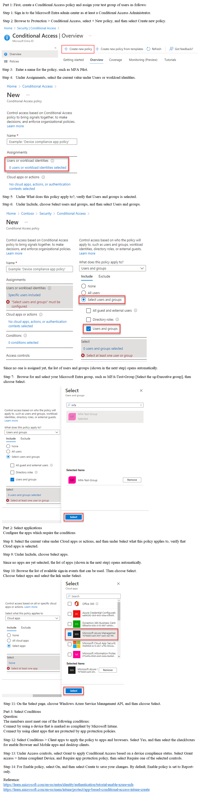

----------------------------------------

## Exam SC-300 topic 2 question 95 discussion

Actual exam question from

Microsoft's
SC-300

Question #: 95
Topic #: 2

[All SC-300 Questions]

SIMULATION -Use the following login credentials as needed:To enter your username, place your cursor in the Sign in box and click on the username below.To enter your password, place your cursor in the Enter password box and click on the password below.Microsoft 365 Username:[email protected]Microsoft 365 Password: =1122334455667788If the Microsoft 365 portal does not load successfully in the browser, press CTRL-K to reload the portal in a new browser tab.The following information is for technical support purposes only:Lab Instance: 99999999 -You need to lock out accounts for five minutes when they have 10 failed sign-in attempts.To complete this task, sign in to the appropriate admin center. 
Suggested Answer: 

**Answer: **

**Timestamp: May 22, 2025, 1:04 p.m.**

[View on ExamTopics](https://www.examtopics.com/discussions/microsoft/view/304045-exam-sc-300-topic-2-question-95-discussion/)

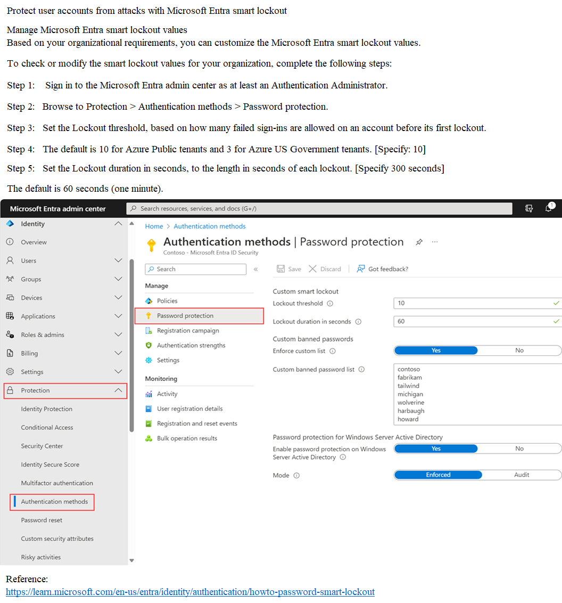

----------------------------------------

## Exam SC-300 topic 2 question 96 discussion

Actual exam question from

Microsoft's
SC-300

Question #: 96
Topic #: 2

[All SC-300 Questions]

SIMULATION -Use the following login credentials as needed:To enter your username, place your cursor in the Sign in box and click on the username below.To enter your password, place your cursor in the Enter password box and click on the password below.Microsoft 365 Username:[email protected]Microsoft 365 Password: =1122334455667788If the Microsoft 365 portal does not load successfully in the browser, press CTRL-K to reload the portal in a new browser tab.The following information is for technical support purposes only:Lab Instance: 99999999 -You need to prevent all users from using legacy authentication protocols when authenticating to Microsoft Entra ID.To complete this task, sign in to the appropriate admin center. 
Suggested Answer: 

**Answer: **

**Timestamp: Jan. 14, 2025, 5:38 p.m.**

[View on ExamTopics](https://www.examtopics.com/discussions/microsoft/view/154502-exam-sc-300-topic-2-question-96-discussion/)

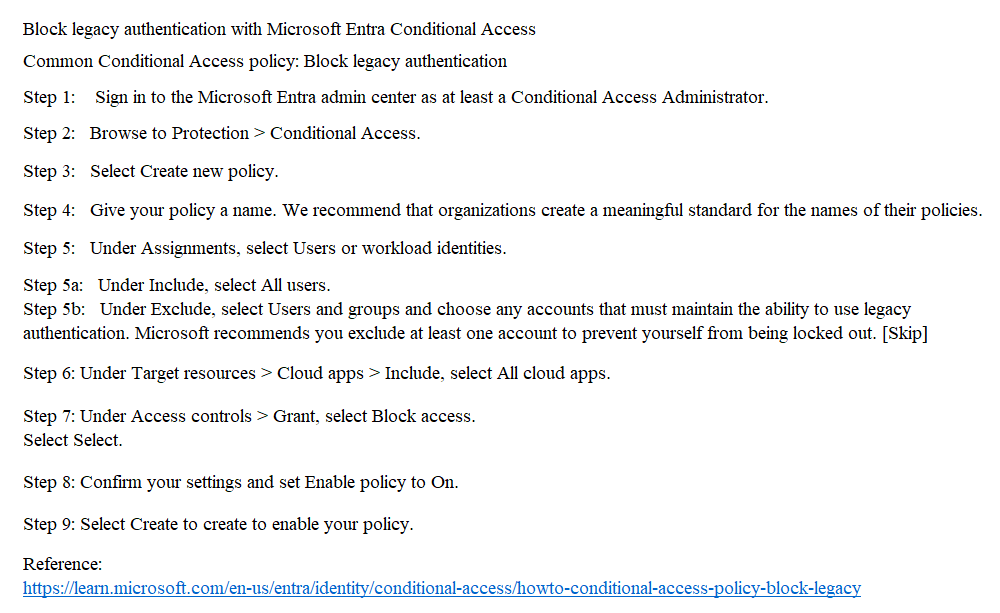

----------------------------------------

## Exam SC-300 topic 2 question 97 discussion

Actual exam question from

Microsoft's
SC-300

Question #: 97
Topic #: 2

[All SC-300 Questions]

You have a Microsoft Entra tenant that contains a terms of use (ToU) named Terms1.You create a Conditional Access policy named Policy1 to deploy Terms1.You need to configure Policy1 to require users to accept Terms1.Which settings should you configure for Policy1? 
Suggested Answer: C 🗳️ 

A. Conditions

B. Session

C. Grant

D. Target resources

**Answer: C**

**Timestamp: Dec. 26, 2024, 1:12 a.m.**

[View on ExamTopics](https://www.examtopics.com/discussions/microsoft/view/153442-exam-sc-300-topic-2-question-97-discussion/)

----------------------------------------

## Exam SC-300 topic 2 question 98 discussion

Actual exam question from

Microsoft's
SC-300

Question #: 98
Topic #: 2

[All SC-300 Questions]

You have an Azure subscription that contains a virtual machine named VM1 and an Azure key vault named Vault1. VM1 has a system-assigned managed identity.You need to ensure that VM1 can retrieve the values of secrets stored in Vault1. The solution must minimize administrative effort.What should you do first? 
Suggested Answer: D 🗳️ 

A. Configure the Resource access settings for Vault1.

B. Configure the permissions model for Vault1.

C. Add a user-assigned managed identity to VM1.

D. Assign an Azure role to VM1.

**Answer: D**

**Timestamp: Dec. 22, 2024, 7:44 a.m.**

[View on ExamTopics](https://www.examtopics.com/discussions/microsoft/view/153311-exam-sc-300-topic-2-question-98-discussion/)

----------------------------------------

## Exam SC-300 topic 2 question 99 discussion

Actual exam question from

Microsoft's
SC-300

Question #: 99
Topic #: 2

[All SC-300 Questions]

HOTSPOT -You have an Azure subscription named Sub1.You plan to use Microsoft Entra Permissions Management to manage Sub1.You need to ensure that Permissions Management can perform the following tasks:• Identify unused permissions assigned to applications and managed identities.• Provide users with recommendations about which permissions to remove.• Remove unused permissions.The solution must follow the principle of least privilege.Which role should you assign to the service principal of Permissions Management, and what should you use to provide recommendations and remove unused permissions? To answer, select the appropriate options in the answer area.NOTE: Each correct selection is worth one point. 
Suggested Answer: 

**Answer: **

**Timestamp: Jan. 14, 2025, 11:27 p.m.**

[View on ExamTopics](https://www.examtopics.com/discussions/microsoft/view/154516-exam-sc-300-topic-2-question-99-discussion/)

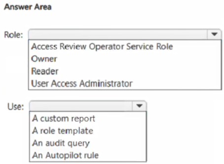
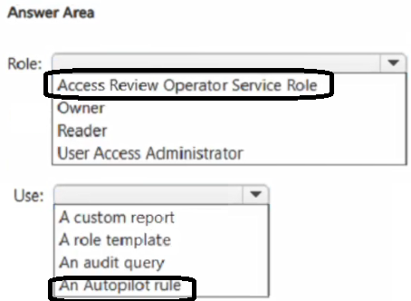

----------------------------------------

## Exam SC-300 topic 2 question 100 discussion

Actual exam question from

Microsoft's
SC-300

Question #: 100
Topic #: 2

[All SC-300 Questions]

HOTSPOT -You have a Microsoft 365 E5 subscription that contains two groups named Group1 and Group2. The subscription contains the users shown in the following table.You create the following Conditional Access policies:• Name: Policy1• Users: o Include: Group1 o Exclude: Group2• Target resources: o Include: All cloud apps• Grant: o Grant access: Require multi-factor authentication• Session: o Persistent browser session: Never persistent• Name: Policy2• Users: o Include: - Directory roles: Global Administrator - Users and groups: User3 o Exclude: Group2• Target resources: o Include: All cloud apps• Session: o Sign-in frequency: - Periodic authentication: 2 hoursFor each of the following statements, select Yes if the statement is true. Otherwise, select No.NOTE: Each correct selection is worth one point. 
Suggested Answer: 

**Answer: **

**Timestamp: Jan. 22, 2025, 12:46 p.m.**

[View on ExamTopics](https://www.examtopics.com/discussions/microsoft/view/155224-exam-sc-300-topic-2-question-100-discussion/)

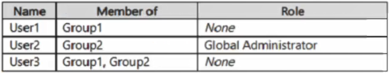
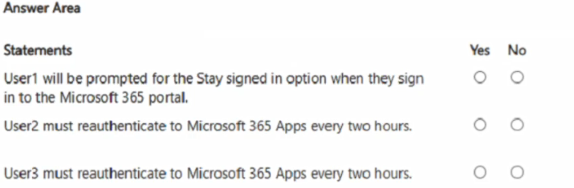
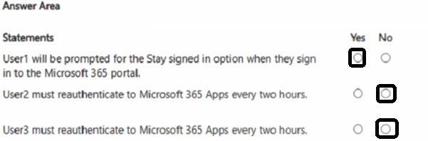

----------------------------------------

## Exam SC-300 topic 2 question 101 discussion

Actual exam question from

Microsoft's
SC-300

Question #: 101
Topic #: 2

[All SC-300 Questions]

You have a Microsoft 365 E5 subscription that contains a user named User1.You need to ensure that User1 can create access reviews for Microsoft Entra roles. The solution must use the principle of least privilege.Which role should you assign to User1? 
Suggested Answer: D 🗳️ 

A. Identity Governance Administrator

B. User Access Administrator

C. User Administrator

D. Privileged Role Administrator

**Answer: D**

**Timestamp: Dec. 22, 2024, 4:26 a.m.**

[View on ExamTopics](https://www.examtopics.com/discussions/microsoft/view/153308-exam-sc-300-topic-2-question-101-discussion/)

----------------------------------------

## Exam SC-300 topic 2 question 102 discussion

Actual exam question from

Microsoft's
SC-300

Question #: 102
Topic #: 2

[All SC-300 Questions]

You have a Microsoft Entra tenant that contains the users shown in the following table.Admin4 creates a Conditional Access policy named Policy1 by using the Require multifactor authentication for Azure management template.Which users will be required to use multi-factor authentication (MFA) the next time they sign in? 
Suggested Answer: C 🗳️ 

A. Admin2 and Admin3 only

B. Admin1 and Admin4 only

C. Admin1, Admin2, and Admin3 only

D. Admin1, Admin2, Admin3, and Admin4

**Answer: C**

**Timestamp: Feb. 12, 2025, 8:33 p.m.**

[View on ExamTopics](https://www.examtopics.com/discussions/microsoft/view/156413-exam-sc-300-topic-2-question-102-discussion/)

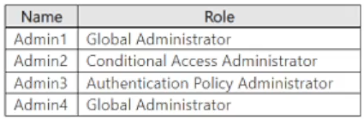

----------------------------------------

## Exam SC-300 topic 2 question 103 discussion

Actual exam question from

Microsoft's
SC-300

Question #: 103
Topic #: 2

[All SC-300 Questions]

HOTSPOT -You have a Microsoft 365 E5 subscription that contains a Microsoft Teams team named Team1 and two Microsoft 365 groups named Group1 and Group2. The subscription contains the users shown in the following table.You create an access package that has the following settings:• Name: Package1• Resource roles:o Team1: Owner• Users who can request access: For users in your directoryo Specific Users and Groups: Group1• Require approval: Yeso Require requestor justification: Noo How many stages: 1o First Approver: Team1, User3o Require approver justification: Yes• Enable new requests: Yes• Expiration:o Access package assignments expire: 7 dayso Users can request specific timeline: YesFor each of the following statements, select Yes if the statement is true. Otherwise, select No.NOTE: Each correct selection is worth one point. 
Suggested Answer: 

**Answer: **

**Timestamp: Feb. 26, 2025, 6:15 p.m.**

[View on ExamTopics](https://www.examtopics.com/discussions/microsoft/view/157148-exam-sc-300-topic-2-question-103-discussion/)

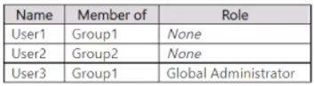
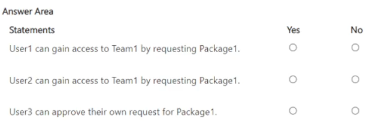
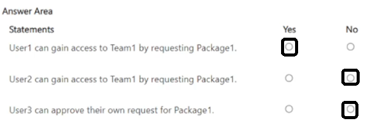

----------------------------------------

## Exam SC-300 topic 2 question 104 discussion

Actual exam question from

Microsoft's
SC-300

Question #: 104
Topic #: 2

[All SC-300 Questions]

You have a Microsoft 365 E5 subscription that contains a Microsoft SharePoint Online site named Site1 and a Microsoft Teams team named Team1. The subscription contains five security groups named Group1, Group2, Group3, Group4, and Group5.You need to implement access packages for Site1 and Team1. The solution must meet the following requirements:• Members of Group3 must be able to request access to Site1 only.• Members of Group1 must be able to request access to Site1 and Team1.• Members of Group4 must be able to request access to Site1 and Team1.• Only members of Group2 must be able to approve access package requests from Group1 members.• Only members of Groups must be able to approve access package requests from Group3 and Group4 members.What h the minimum number of access packages you should create? 
Suggested Answer: B 🗳️ 

A. 2

B. 3

C. 4

D. 5

**Answer: B**

**Timestamp: Dec. 21, 2024, 1:40 a.m.**

[View on ExamTopics](https://www.examtopics.com/discussions/microsoft/view/153251-exam-sc-300-topic-2-question-104-discussion/)

----------------------------------------

## Exam SC-300 topic 2 question 105 discussion

Actual exam question from

Microsoft's
SC-300

Question #: 105
Topic #: 2

[All SC-300 Questions]

You have a Microsoft Entra tenant.You open the risk detections report.Which risk detection type is classified as a user risk? 
Suggested Answer: D 🗳️ 

A. impossible travel

B. anonymous IP address

C. atypical travel

D. leaked credentials

**Answer: D**

**Timestamp: Feb. 15, 2025, 11:03 p.m.**

[View on ExamTopics](https://www.examtopics.com/discussions/microsoft/view/156578-exam-sc-300-topic-2-question-105-discussion/)

----------------------------------------

## Exam SC-300 topic 2 question 106 discussion

Actual exam question from

Microsoft's
SC-300

Question #: 106
Topic #: 2

[All SC-300 Questions]

You have a Microsoft 365 subscription that uses Microsoft Defender for Cloud Apps.You have multiple third-party apps that access the resources in the subscription.You need to monitor the access of the third-party apps.What should you create? 
Suggested Answer: C 🗳️ 

A. an access policy

B. an app permission policy

C. an OAuth app policy

D. an endpoint protection policy

**Answer: C**

**Timestamp: Jan. 22, 2025, 9:24 a.m.**

[View on ExamTopics](https://www.examtopics.com/discussions/microsoft/view/155218-exam-sc-300-topic-2-question-106-discussion/)

----------------------------------------

## Exam SC-300 topic 2 question 107 discussion

Actual exam question from

Microsoft's
SC-300

Question #: 107
Topic #: 2

[All SC-300 Questions]

You have an Azure subscription that contains a virtual machine named VM1. VM1 has the following configurations:• Private IP address: 172.16.1.5• Public IP address: 108.143.161.25• System-assigned managed identity status: OnYou install an app named App1 on VM1.You need to configure App1 to request a managed identity app-only access token.Which IP address should App1 use for the request? 
Suggested Answer: C 🗳️ 

A. 108.143.161.25

B. 127.0.0.1

C. 169.254.169.254

D. 172.16.1.5

**Answer: C**

**Timestamp: Jan. 6, 2025, 6:37 p.m.**

[View on ExamTopics](https://www.examtopics.com/discussions/microsoft/view/154008-exam-sc-300-topic-2-question-107-discussion/)

----------------------------------------

## Exam SC-300 topic 2 question 108 discussion

Actual exam question from

Microsoft's
SC-300

Question #: 108
Topic #: 2

[All SC-300 Questions]

You have a Microsoft Entra tenant.You need to create a Conditional Access policy to manage administrative access to the tenant. The solution must ensure that administrators are authenticated by using a phishing-resistant multi-factor authentication (MFA) method.Which three authentication methods should you include in the solution? Each correct answer presents a complete solution. 
Suggested Answer: ABC 🗳️ 

A. Windows Hello for Business

B. an FIDO2 security key

C. certificate-based authentication (multi-factor)

D. voice call

E. SMS

F. email OTP

G. certificate-based authentication (single-factor)

H. Microsoft Authenticator

**Answer: A**

**Timestamp: Dec. 30, 2024, 4:21 p.m.**

[View on ExamTopics](https://www.examtopics.com/discussions/microsoft/view/153646-exam-sc-300-topic-2-question-108-discussion/)

----------------------------------------

## Exam SC-300 topic 2 question 109 discussion

Actual exam question from

Microsoft's
SC-300

Question #: 109
Topic #: 2

[All SC-300 Questions]

You have a Microsoft Entra tenant.You configure self-service password reset (SSPR) by using the following settings:• Require users to register when signing in: Yes• Number of methods required to reset: 1What is a valid authentication method available to users? 
Suggested Answer: A 🗳️ 

A. an email to an address outside your organization

B. a mobile app notification

C. a smartcard

D. an email to an address in your organization

**Answer: A**

**Timestamp: Dec. 26, 2024, 6:12 a.m.**

[View on ExamTopics](https://www.examtopics.com/discussions/microsoft/view/153444-exam-sc-300-topic-2-question-109-discussion/)

----------------------------------------

## Exam SC-300 topic 2 question 110 discussion

Actual exam question from

Microsoft's
SC-300

Question #: 110
Topic #: 2

[All SC-300 Questions]

You have a Microsoft 365 E5 subscription.You need to be able to create a Microsoft Defender for Cloud Apps session policy.What should you do first? 
Suggested Answer: C 🗳️ 

A. From the Microsoft 365 Defender portal, select User monitoring.

B. From the Microsoft 365 Defender portal, select App onboarding/maintenance.

C. From the Microsoft Entra admin center, create a Conditional Access policy.

D. From the Microsoft 365 Defender portal, create a continuous report.

**Answer: C**

**Timestamp: Jan. 9, 2025, 3:40 a.m.**

[View on ExamTopics](https://www.examtopics.com/discussions/microsoft/view/154145-exam-sc-300-topic-2-question-110-discussion/)

----------------------------------------

## Exam SC-300 topic 2 question 111 discussion

Actual exam question from

Microsoft's
SC-300

Question #: 111
Topic #: 2

[All SC-300 Questions]

Your network contains an on-premises Active Directory Domain Services (AD DS) domain that syncs user accounts with a Microsoft 365 E5 subscription.You need to ensure that on-premises account lockout policies are applied to Microsoft Entra sign-ins.What should you configure? 
Suggested Answer: D 🗳️ 

A. Azure Active Directory Seamless Single Sign-on (Azure AD Seamless SSO)

B. Microsoft Entra Cloud Sync

C. password hash synchronization

D. pass-through authentication

**Answer: D**

**Timestamp: Jan. 22, 2025, 9:35 a.m.**

[View on ExamTopics](https://www.examtopics.com/discussions/microsoft/view/155220-exam-sc-300-topic-2-question-111-discussion/)

----------------------------------------

## Exam SC-300 topic 2 question 112 discussion

Actual exam question from

Microsoft's
SC-300

Question #: 112
Topic #: 2

[All SC-300 Questions]

You have a Microsoft Entra tenant.You open the risk detections report.Which risk detection type is classified as a user risk? 
Suggested Answer: D 🗳️ 

A. password spray

B. anonymous IP address

C. unfamiliar sign-in properties

D. Microsoft Entra threat intelligence

**Answer: D**

**Timestamp: Feb. 16, 2025, 12:09 a.m.**

[View on ExamTopics](https://www.examtopics.com/discussions/microsoft/view/156581-exam-sc-300-topic-2-question-112-discussion/)

----------------------------------------

## Exam SC-300 topic 2 question 113 discussion

Actual exam question from

Microsoft's
SC-300

Question #: 113
Topic #: 2

[All SC-300 Questions]

You have a Microsoft Entra tenant.You configure self-service password reset (SSPR) by using the following settings:• Require users to register when signing in: Yes• Number of methods required to reset: 1What is a valid authentication method available to users? 
Suggested Answer: D 🗳️ 

A. a mobile app notification

B. an FIDO2 security token

C. a Microsoft Teams chat

D. an email to an address outside your organization

**Answer: D**

**Timestamp: Jan. 21, 2025, 11:59 a.m.**

[View on ExamTopics](https://www.examtopics.com/discussions/microsoft/view/155076-exam-sc-300-topic-2-question-113-discussion/)

----------------------------------------

## Exam SC-300 topic 2 question 114 discussion

Actual exam question from

Microsoft's
SC-300

Question #: 114
Topic #: 2

[All SC-300 Questions]

You have a Microsoft 365 tenant.All users have mobile phones and Windows 10 laptops.The users frequently work from remote locations that do not have Wi-Fi access or mobile phone connectivity. While working from the remote locations, the users connect their laptop to a wired network that has internet access.You plan to implement multi-factor authentication (MFA).Which MFA authentication method can the users use from the remote location? 
Suggested Answer: A 🗳️ 

A. Windows Hello for Business

B. an app password

C. a notification through the Microsoft Authenticator app

D. security questions

**Answer: A**

**Timestamp: Feb. 16, 2025, 12:11 p.m.**

[View on ExamTopics](https://www.examtopics.com/discussions/microsoft/view/156597-exam-sc-300-topic-2-question-114-discussion/)

----------------------------------------

## Exam SC-300 topic 2 question 115 discussion

Actual exam question from

Microsoft's
SC-300

Question #: 115
Topic #: 2

[All SC-300 Questions]

HOTSPOT -You have an Azure subscription named Sub1 that contains two resource groups named RG1 and RG2. Sub1 contains the users shown in the following table.Sub1 contains the resources shown in the following table.You create the role-based access control (RBAQ role assignments shown in the following table.For each of the following statements, select Yes if the statement is true. Otherwise, select No.NOTE: Each correct selection is worth one point. 
Suggested Answer: 

**Answer: **

**Timestamp: Jan. 15, 2025, 4:53 a.m.**

[View on ExamTopics](https://www.examtopics.com/discussions/microsoft/view/154530-exam-sc-300-topic-2-question-115-discussion/)

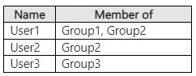
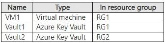
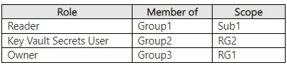
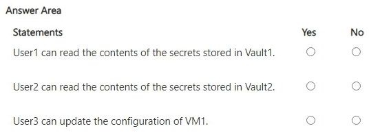
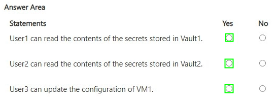

----------------------------------------

## Exam SC-300 topic 2 question 116 discussion

Actual exam question from

Microsoft's
SC-300

Question #: 116
Topic #: 2

[All SC-300 Questions]

HOTSPOT -You have an Azure subscription that contains a resource group named RG1. RG1 contains two virtual machines named VM1 and VM2 that have Microsoft Entra ID login enabled.The subscription contains the users shown in the following table.Which users can sign in to VM1, and which users can sign in to VM2? To answer, select the appropriate options in the answer area.NOTE: Each correct selection is worth one point. 
Suggested Answer: 

**Answer: **

**Timestamp: Feb. 26, 2025, 8:51 p.m.**

[View on ExamTopics](https://www.examtopics.com/discussions/microsoft/view/157165-exam-sc-300-topic-2-question-116-discussion/)

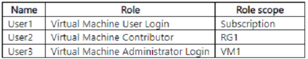
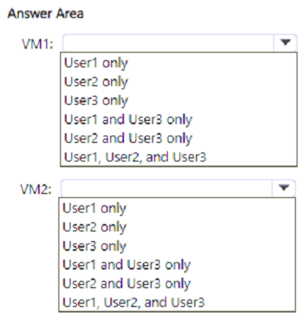
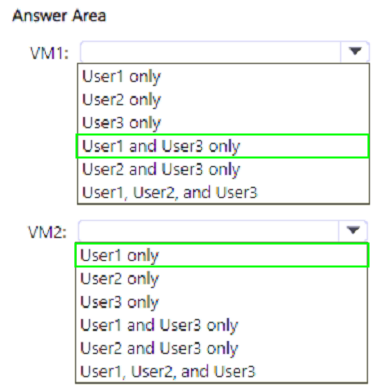

----------------------------------------

## Exam SC-300 topic 2 question 117 discussion

Actual exam question from

Microsoft's
SC-300

Question #: 117
Topic #: 2

[All SC-300 Questions]

You have a Microsoft Entra tenant.You configure self-service password reset (SSPR) by using the following settings:• Require users to register when signing in: Yes• Number of methods required to reset: 1What is a valid authentication method available to users? 
Suggested Answer: D 🗳️ 

A. a Windows Hello PIN

B. a smartcard

C. a mobile app notification

D. an email to an address outside your organization

**Answer: D**

**Timestamp: Dec. 24, 2024, 9:41 p.m.**

[View on ExamTopics](https://www.examtopics.com/discussions/microsoft/view/153400-exam-sc-300-topic-2-question-117-discussion/)

----------------------------------------

## Exam SC-300 topic 2 question 118 discussion

Actual exam question from

Microsoft's
SC-300

Question #: 118
Topic #: 2

[All SC-300 Questions]

HOTSPOT -You have a Microsoft 365 E5 subscription that contains two groups named Group1 and Group2 and the users shown in the following table.The subscription contains a Conditional Access policy that has the following settings:• Name: Policy1• Assignmentso Include - Users and Groups: Group1 - Directory roles: Global Administratoro Exclude - Users and Groups: Group2o Target resources - Include - All cloud apps - Access controls - Grant - Require multifactor authenticationFor each of the following statements, select Yes if the statement is true. Otherwise, select No.NOTE: Each correct selection is worth one point. 
Suggested Answer: 

**Answer: **

**Timestamp: Feb. 26, 2025, 9:09 p.m.**

[View on ExamTopics](https://www.examtopics.com/discussions/microsoft/view/157166-exam-sc-300-topic-2-question-118-discussion/)

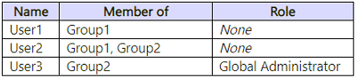
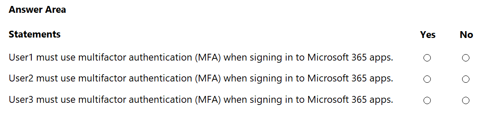
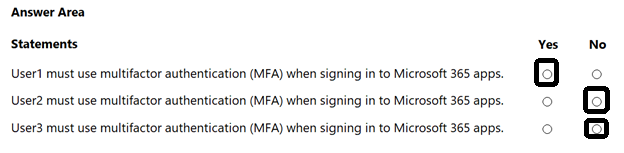

----------------------------------------

## Exam SC-300 topic 2 question 119 discussion

Actual exam question from

Microsoft's
SC-300

Question #: 119
Topic #: 2

[All SC-300 Questions]

DRAG DROP -Your on-premises network contains an Active Directory Domain Services (AD DS) domain. The domain contains a server named Server1 that runs Windows Server and hosts a shared folder named Share1. The domain contains 500 devices that run Windows 11.You have a Microsoft 365 E5 subscription that syncs with the domain.From Global Secure Access, you enable the Private access profile and deploy the Global Secure Access client to all the devices.You need to ensure that the devices can connect to Share1 remotely by using Global Secure Access.Which three actions should you perform in sequence? To answer move the appropriate actions from the list of actions to the answer area and arrange them in the correct order. 
Suggested Answer: 

**Answer: **

**Timestamp: Feb. 26, 2025, 9:33 p.m.**

[View on ExamTopics](https://www.examtopics.com/discussions/microsoft/view/157167-exam-sc-300-topic-2-question-119-discussion/)

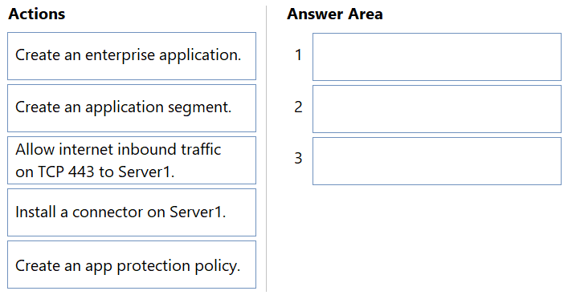
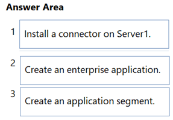

----------------------------------------

## Exam SC-300 topic 2 question 120 discussion

Actual exam question from

Microsoft's
SC-300

Question #: 120
Topic #: 2

[All SC-300 Questions]

You have a Microsoft 365 subscription.You have an Azure subscription that contains an Azure App Service web app named App1.You have multiple devices that run Windows and are enrolled in Microsoft Intune.You deploy the Global Secure Access client to the devices by using Intune.You need to configure private access to App1.What should you do next? 
Suggested Answer: C 🗳️ 

A. Create a remote network.

B. Configure a traffic forwarding profile.

C. Deploy a private network connector.

D. Create an application security group.

**Answer: C**

**Timestamp: Feb. 13, 2025, 3:58 p.m.**

[View on ExamTopics](https://www.examtopics.com/discussions/microsoft/view/156458-exam-sc-300-topic-2-question-120-discussion/)

----------------------------------------

## Exam SC-300 topic 2 question 121 discussion

Actual exam question from

Microsoft's
SC-300

Question #: 121
Topic #: 2

[All SC-300 Questions]

HOTSPOT -You have a Microsoft 365 subscription.You configure a Global Secure Access security profile named SecurityProfile1.You need to create a Conditional Access policy named CAPolicy1 that will use SecurityProfile1.Which two settings should you configure to ensure that CAPolicy1 uses SecurityProfile1? To answer, select the appropriate settings in the answer area.NOTE: Each correct selection is worth one point. 
Suggested Answer: 

**Answer: **

**Timestamp: Feb. 21, 2025, 10:14 p.m.**

[View on ExamTopics](https://www.examtopics.com/discussions/microsoft/view/156945-exam-sc-300-topic-2-question-121-discussion/)

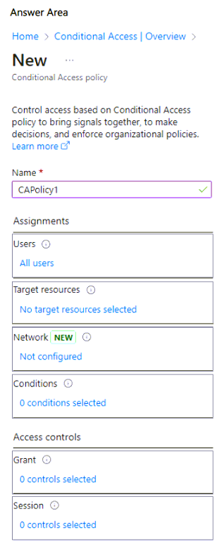
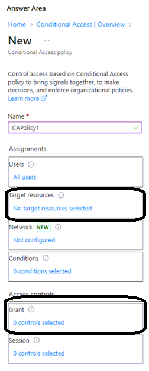

----------------------------------------

## Exam SC-300 topic 2 question 122 discussion

Actual exam question from

Microsoft's
SC-300

Question #: 122
Topic #: 2

[All SC-300 Questions]

HOTSPOT -You have an Azure subscription named Sub1 that contains a resource group named RG1. RG1 contains two Azure key vaults named KV1 and KV2 that use Azure role-based access control (Azure RBAC).The subscription contains the users shown in the following table.KV1 contains a secret named Secret1. KV2 contains a secret named Secret2.Which users can read the values of each secret? To answer, select the appropriate options in the answer area.NOTE: Each correct selection is worth one point. 
Suggested Answer: 

**Answer: **

**Timestamp: Feb. 13, 2025, 4:02 p.m.**

[View on ExamTopics](https://www.examtopics.com/discussions/microsoft/view/156459-exam-sc-300-topic-2-question-122-discussion/)

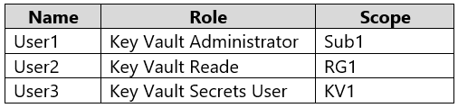
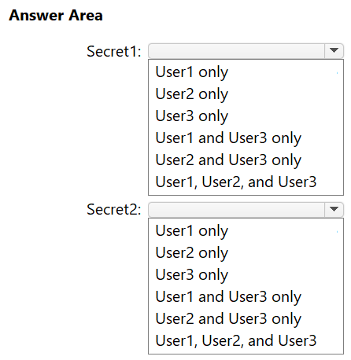
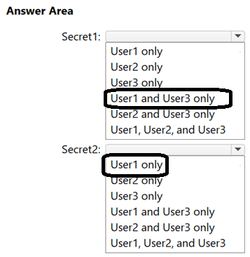

----------------------------------------

## Exam SC-300 topic 2 question 123 discussion

Actual exam question from

Microsoft's
SC-300

Question #: 123
Topic #: 2

[All SC-300 Questions]

HOTSPOT -You have a Microsoft 365 E5 subscription that has a Conditional Access policy named Policy1.You need to perform the following actions:• Create a Conditional Access App Control custom policy named Custom1.• Configure Policy1 to use Custom1.What should you use to create Custom1, and in which settings of Policy1 should you enable Conditional Access App Control? To answer, select the appropriate options in the answer area,NOTE: Each correct selection is worth one point. 
Suggested Answer: 

**Answer: **

**Timestamp: July 8, 2025, 2:21 p.m.**

[View on ExamTopics](https://www.examtopics.com/discussions/microsoft/view/305796-exam-sc-300-topic-2-question-123-discussion/)

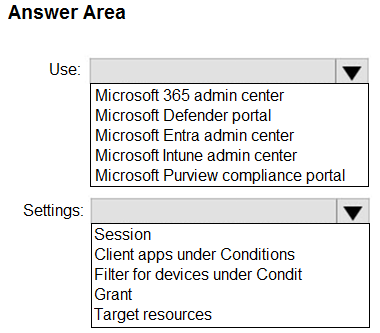
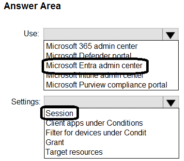

----------------------------------------

## Exam SC-300 topic 2 question 124 discussion

Actual exam question from

Microsoft's
SC-300

Question #: 124
Topic #: 2

[All SC-300 Questions]

You have multiple on-premises devices that run either Windows or Linux.You have a Microsoft 365 E5 subscription.You configure Microsoft Entra Internet Access.You need to ensure that all the on-premises devices access the internet by using Global Secure Access.What should you do in the Microsoft Entra admin center? 
Suggested Answer: A 🗳️ 

A. Create a remote network.

B. Create a named location.

C. Create an access package.

D. Deploy the Global Secure Access client.

**Answer: A**

**Timestamp: June 17, 2025, 12:37 p.m.**

[View on ExamTopics](https://www.examtopics.com/discussions/microsoft/view/305015-exam-sc-300-topic-2-question-124-discussion/)

----------------------------------------

## Exam SC-300 topic 2 question 125 discussion

Actual exam question from

Microsoft's
SC-300

Question #: 125
Topic #: 2

[All SC-300 Questions]

HOTSPOT -You have a Microsoft 365 subscription that contains three users named User1, User2, and User3 and an enterprise app named App1. The subscription contains the devices shown in the following table.The subscription contains the groups shown in the following table.You create two Conditional Access policies that have the following settings:• Name: Policy1• Users:o Include: Group1o Exclude: Group3• Target resources:o Include: All resources• Access controls: Block access• Name: Policy2• Users:o Include: Group2• Target resources:o Include: App1• Access controls: o Grant access: Require device to be marked as compliant.For each of the following statements, select Yes if the statement is true. Otherwise, select No.NOTE: Each correct selection is worth one point. 
Suggested Answer: 

**Answer: **

**Timestamp: June 23, 2025, 8:30 p.m.**

[View on ExamTopics](https://www.examtopics.com/discussions/microsoft/view/305243-exam-sc-300-topic-2-question-125-discussion/)

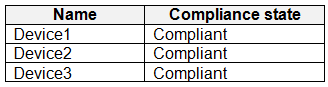
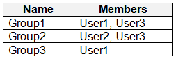
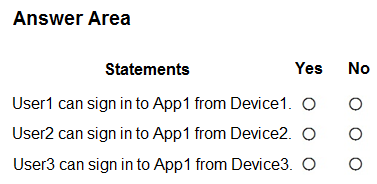
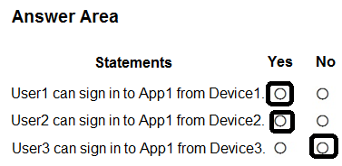

----------------------------------------

## Exam SC-300 topic 2 question 126 discussion

Actual exam question from

Microsoft's
SC-300

Question #: 126
Topic #: 2

[All SC-300 Questions]

HOTSPOT -You have a Microsoft 365 E5 subscription that contains three groups named Group1, Group2, and Group3, and the users shown in the following table.You create a Conditional Access policy named CA1 that has the following settings:• Users o Include - Users and groups: Group1 o Exclude - Users and groups: Group2 - Directory roles: Global Administrator o Target resources - Include: All cloud apps o Access controls - Grant: Require multifactor authenticationYou create a Conditional Access policy named CA2 that has the following settings:• Users o Include - Users and groups: Group2 o Exclude - Users and groups: Group3 o Target resources - Include: All cloud apps o Access controls - Grant: Block accessFor each of the following statements, select Yes if the statement is true. Otherwise, select No.NOTE: Each correct selection is worth one point. 
Suggested Answer: 

**Answer: **

**Timestamp: July 8, 2025, 3:05 p.m.**

[View on ExamTopics](https://www.examtopics.com/discussions/microsoft/view/305799-exam-sc-300-topic-2-question-126-discussion/)

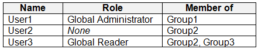
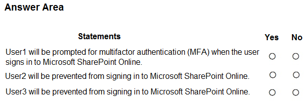
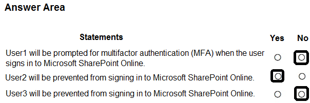

----------------------------------------

## Exam SC-300 topic 2 question 127 discussion

Actual exam question from

Microsoft's
SC-300

Question #: 31
Topic #: 2

[All SC-300 Questions]

You have a Microsoft 365 E5 subscription.You need to ensure that users can only access resources in the subscription from a device that has the Global Secure Access client connected.What should you do first? 
Suggested Answer: A 🗳️ 

A. Enable Global Secure Access signaling.

B. Enable tagging to enforce tenant restrictions.

C. Create a named location.

D. Create a remote network.

**Answer: A**

**Timestamp: Dec. 25, 2024, 4:34 p.m.**

[View on ExamTopics](https://www.examtopics.com/discussions/microsoft/view/153439-exam-sc-300-topic-2-question-127-discussion/)

----------------------------------------

## Exam SC-300 topic 2 question 127 discussion

Actual exam question from

Microsoft's
SC-300

Question #: 127
Topic #: 2

[All SC-300 Questions]

DRAG DROP -You have a Microsoft Entra tenant.You need to implement protected actions.Which three actions should you perform in sequence? To answer, move the appropriate actions from the list of actions to the answer area and arrange them in the correct order.NOTE: More than one order of answer choices is correct. You will receive credit for any of the correct orders you select. 
Suggested Answer: 

**Answer: **

**Timestamp: Aug. 8, 2025, 2:11 a.m.**

[View on ExamTopics](https://www.examtopics.com/discussions/microsoft/view/308963-exam-sc-300-topic-2-question-127-discussion/)

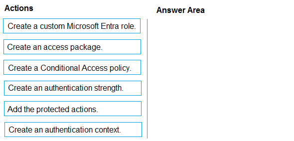
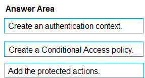

----------------------------------------

## Exam SC-300 topic 2 question 128 discussion

Actual exam question from

Microsoft's
SC-300

Question #: 128
Topic #: 2

[All SC-300 Questions]

HOTSPOT -You have an Azure subscription that is linked to a Microsoft Entra tenant. The tenant contains three users named User1, User2 and User3.You have the devices shown in the following table.You deploy a virtual machine that has the following configurations:• Name: VM1• Resource group: RG1• Operating system: Windows Server• Login with Microsoft Entra ID: EnabledYou have the Azure role assignments shown in the following table.For each of the following statements, select Yes if the statement is true. Otherwise, select No.NOTE: Each correct selection is worth one point. 
Suggested Answer: 

**Answer: **

**Timestamp: July 8, 2025, 3:25 p.m.**

[View on ExamTopics](https://www.examtopics.com/discussions/microsoft/view/305800-exam-sc-300-topic-2-question-128-discussion/)

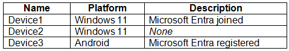
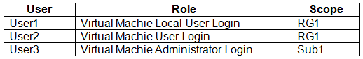
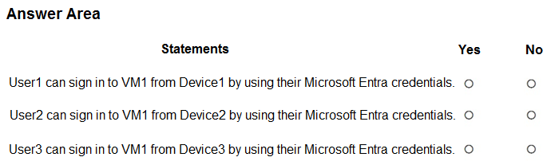
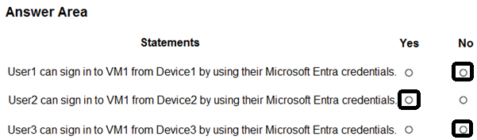

----------------------------------------

## Exam SC-300 topic 2 question 129 discussion

Actual exam question from

Microsoft's
SC-300

Question #: 129
Topic #: 2

[All SC-300 Questions]

HOTSPOT -You have an Azure subscription that contains two resource groups named RG1 and RG2, a storage account named storage1.You assign roles for the subscription as shown in the following table.You assign roles for RG1 as shown in the following table.You assign roles for storage1 as shown in the following exhibit.Roles are NOT assigned for other Azure resources.For each of the following statements, select Yes if the statement is true. Otherwise, select No.NOTE: Each correct selection is worth one point. 
Suggested Answer: 

**Answer: **

**Timestamp: Aug. 8, 2025, 2:11 a.m.**

[View on ExamTopics](https://www.examtopics.com/discussions/microsoft/view/308962-exam-sc-300-topic-2-question-129-discussion/)

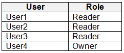
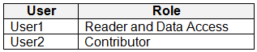
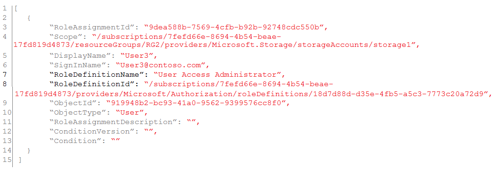
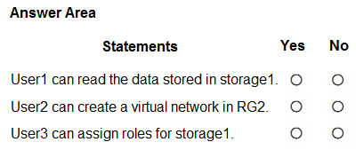
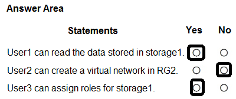

----------------------------------------

## Exam SC-300 topic 2 question 130 discussion

Actual exam question from

Microsoft's
SC-300

Question #: 130
Topic #: 2

[All SC-300 Questions]

You have a Microsoft Entra tenant that contains 1,000 users. The users are assigned Microsoft Entra Suite licenses.You are deploying Global Secure Access.You need to ensure that connections to www.microsoft.com are bypassed by Global Secure Access.Which profiles should you update? 
Suggested Answer: B 🗳️ 

A. Intemet access profile only

B. Microsoft traffic profile only

C. Microsoft traffic profile and Internet access profile only

D. Microsoft traffic profile, Private access profile, and Internet access profile

**Answer: B**

**Timestamp: June 17, 2025, 1:12 p.m.**

[View on ExamTopics](https://www.examtopics.com/discussions/microsoft/view/305019-exam-sc-300-topic-2-question-130-discussion/)

----------------------------------------

## Exam SC-300 topic 2 question 131 discussion

Actual exam question from

Microsoft's
SC-300

Question #: 131
Topic #: 2

[All SC-300 Questions]

You have a Microsoft 365 subscription.You need to ensure that users can grant enterprise applications access to their profile. The solution must ensure that the users can consent only to the User.Read and profile delegated permissions.What should you configure first? 
Suggested Answer: B 🗳️ 

A. Identity Protection settings

B. Permission classifications

C. Admin consent settings

D. Security defaults

**Answer: B**

**Timestamp: Jan. 14, 2026, 4:15 p.m.**

[View on ExamTopics](https://www.examtopics.com/discussions/microsoft/view/382459-exam-sc-300-topic-2-question-131-discussion/)

----------------------------------------

## Exam SC-300 topic 2 question 132 discussion

Actual exam question from

Microsoft's
SC-300

Question #: 132
Topic #: 2

[All SC-300 Questions]

You have a Microsoft 365 E5 subscription.You create an access review named Review1. Review1 requires that every six months, Microsoft 365 group owners review guest user access to their groups.You need to ensure that if the group owners fail to review the membership of Review1, guest users are removed automatically.Which settings should you configure for Review1? 
Suggested Answer: D 🗳️ 

A. Reviewers

B. General

C. Advanced settings

D. Upon completion settings

**Answer: D**

**Timestamp: Jan. 14, 2026, 4:16 p.m.**

[View on ExamTopics](https://www.examtopics.com/discussions/microsoft/view/382460-exam-sc-300-topic-2-question-132-discussion/)

----------------------------------------

## Exam SC-300 topic 2 question 133 discussion

Actual exam question from

Microsoft's
SC-300

Question #: 133
Topic #: 2

[All SC-300 Questions]

You have an Azure subscription that contains a user named User1 and an Azure key vault named Vault1.You need to ensure that User1 can read the metadata of certificates, keys, and secrets stored in Vault1. The solution must follow the principle of least privilege.Which role should you assign to User1? 
Suggested Answer: C 🗳️ 

A. Key Vault Secrets User

B. Key Vault Crypto User

C. Key Vault Reader

D. Key Vault Crypto Officer

**Answer: C**

**Timestamp: Jan. 14, 2026, 4:17 p.m.**

[View on ExamTopics](https://www.examtopics.com/discussions/microsoft/view/382461-exam-sc-300-topic-2-question-133-discussion/)

----------------------------------------

## Exam SC-300 topic 2 question 134 discussion

Actual exam question from

Microsoft's
SC-300

Question #: 134
Topic #: 2

[All SC-300 Questions]

You have on-premises Linux devices.You have a Microsoft 365 E5 subscription.You plan to configure Global Secure Access Internet Access.You need to ensure that the devices can connect to Global Secure Access.What should you do? 
Suggested Answer: C 🗳️ 

A. Configure the Adaptive Access settings.

B. Install the Azure Connected Machine agent on the devices.

C. Create a remote network.

D. Deploy a private network connector.

**Answer: C**

**Timestamp: Feb. 1, 2026, 9:33 a.m.**

[View on ExamTopics](https://www.examtopics.com/discussions/microsoft/view/382865-exam-sc-300-topic-2-question-134-discussion/)

----------------------------------------

## Exam SC-300 topic 2 question 140 discussion

Actual exam question from

Microsoft's
SC-300

Question #: 140
Topic #: 2

[All SC-300 Questions]

You have a Microsoft Entra tenant.You have 500 devices that run either Windows 11, macOS, iOS, or Android and are enrolled in Microsoft Intune.You plan to deploy the Global Secure Access client.From the Microsoft Entra admin center, you download the Global Secure Access client for each operating system.You need to deploy the client to the macOS devices by using Intune.Which file extension should you use when uploading the client to Intune? 
Suggested Answer: D 🗳️ 

A. .ipa

B. .apk

C. .intunewin

D. .pkg

**Answer: D**

**Timestamp: Feb. 1, 2026, 4:40 p.m.**

[View on ExamTopics](https://www.examtopics.com/discussions/microsoft/view/382873-exam-sc-300-topic-2-question-140-discussion/)

----------------------------------------

## Exam SC-300 topic 3 question 1 discussion

Actual exam question from

Microsoft's
SC-300

Question #: 1
Topic #: 3

[All SC-300 Questions]

HOTSPOT -You have a Microsoft 365 tenant and an Active Directory domain named adatum.com.You deploy Azure AD Connect by using the Express Settings.You need to configure self-service password reset (SSPR) to meet the following requirements:✑ When users reset their password, they must be prompted to respond to a mobile app notification or answer three predefined security questions.✑ Passwords must be synced between the tenant and the domain regardless of where the password was reset.What should you do? To answer, select the appropriate options in the answer area.NOTE: Each correct selection is worth one point.Hot Area: 
Suggested Answer: Reference:https://docs.microsoft.com/en-us/azure/active-directory/authentication/howto-sspr-deployment https://docs.microsoft.com/en-us/azure/active-directory/authentication/concept-authentication-security-questions 

**Answer: **

**Timestamp: June 7, 2021, 8:54 p.m.**

[View on ExamTopics](https://www.examtopics.com/discussions/microsoft/view/54839-exam-sc-300-topic-3-question-1-discussion/)

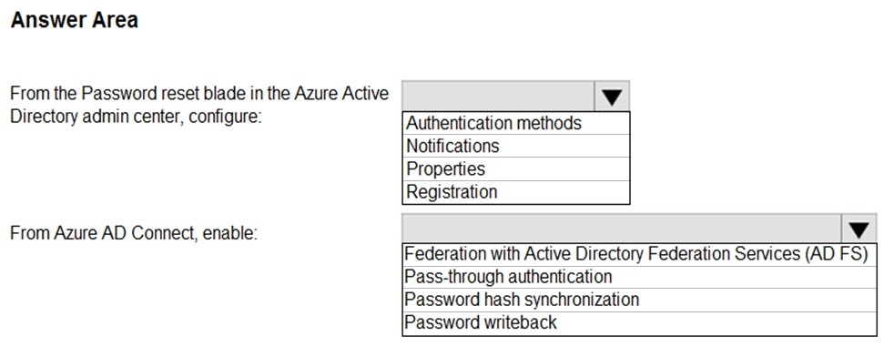
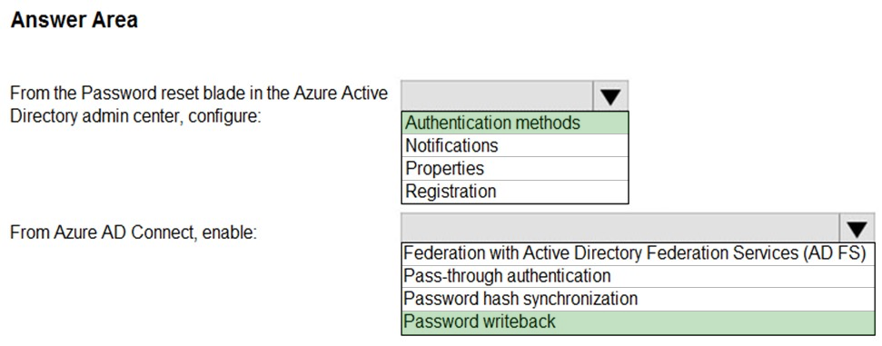

----------------------------------------

## Exam SC-300 topic 3 question 2 discussion

Actual exam question from

Microsoft's
SC-300

Question #: 2
Topic #: 3

[All SC-300 Questions]

You have an Azure subscription that contains an Azure Automation account named Automation1 and an Azure key vault named Vault1. Vault1 contains a secret named Secret1.You enable a system-assigned managed identity for Automation1.You need to ensure that Automation1 can read the contents of Secret1. The solution must meet the following requirements:• Prevent Automation1 from accessing other secrets stored in Vault1.• Follow the principle of least privilege.What should you do? 
Suggested Answer: D 🗳️ 

A. From Vault1, configure the Access control (IAM) settings.

B. From Automation1, configure the Identity settings.

C. From Automation1, configure the Run as accounts settings.

D. From Secret1, configure the Access control (IAM) settings.

**Answer: D**

**Timestamp: Jan. 29, 2024, 7:36 a.m.**

[View on ExamTopics](https://www.examtopics.com/discussions/microsoft/view/132371-exam-sc-300-topic-3-question-2-discussion/)

----------------------------------------

## Exam SC-300 topic 3 question 3 discussion

Actual exam question from

Microsoft's
SC-300

Question #: 3
Topic #: 3

[All SC-300 Questions]

You have a Microsoft 365 tenant.The Azure Active Directory (Azure AD) tenant syncs to an on-premises Active Directory domain.Users connect to the internet by using a hardware firewall at your company. The users authenticate to the firewall by using their Active Directory credentials.You plan to manage access to external applications by using Azure AD.You need to use the firewall logs to create a list of unmanaged external applications and the users who access them.What should you use to gather the information? 
Suggested Answer: C 🗳️ 

A. Application Insights in Azure Monitor

B. access reviews in Azure AD

C. Cloud App Discovery in Microsoft Cloud App Security

D. enterprise applications in Azure AD

**Answer: C**

**Timestamp: May 11, 2021, 3:38 a.m.**

[View on ExamTopics](https://www.examtopics.com/discussions/microsoft/view/52344-exam-sc-300-topic-3-question-3-discussion/)

----------------------------------------

## Exam SC-300 topic 3 question 4 discussion

Actual exam question from

Microsoft's
SC-300

Question #: 4
Topic #: 3

[All SC-300 Questions]

HOTSPOT -You have an on-premises datacenter that contains the hosts shown in the following table.The Active Directory forest syncs to an Azure Active Directory (Azure AD) tenant. Multi-factor authentication (MFA) is enforced for Azure AD.You need to ensure that you can publish App1 to Azure AD users.What should you configure on Server4 and Firewall1? To answer, select the appropriate options in the answer area.NOTE: Each correct selection is worth one point.Hot Area: 
Suggested Answer: Reference:https://docs.microsoft.com/en-us/azure/active-directory/manage-apps/application-proxy 

**Answer: **

**Timestamp: May 11, 2022, 6:24 p.m.**

[View on ExamTopics](https://www.examtopics.com/discussions/microsoft/view/75479-exam-sc-300-topic-3-question-4-discussion/)

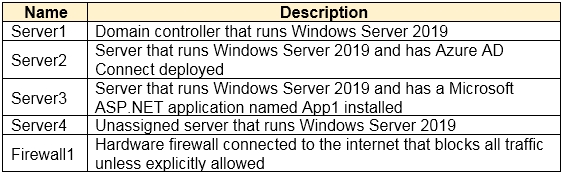
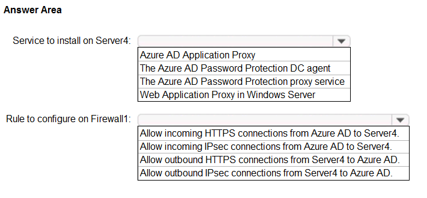
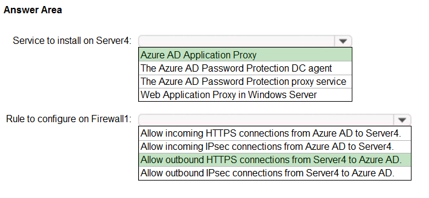

----------------------------------------

## Exam SC-300 topic 3 question 5 discussion

Actual exam question from

Microsoft's
SC-300

Question #: 5
Topic #: 3

[All SC-300 Questions]

HOTSPOT -You have an Azure Active Directory (Azure AD) tenant that has the default App registrations settings. The tenant contains the users shown in the following table.You purchase two cloud apps named App1 and App2. The global administrator registers App1 in Azure AD.You need to identify who can assign users to App1, and who can register App2 in Azure AD.What should you identify? To answer, select the appropriate options in the answer area.NOTE: Each correct selection is worth one point.Hot Area: 
Suggested Answer: Reference:https://docs.microsoft.com/en-us/azure/active-directory/manage-apps/add-application-portal-assign-users https://docs.microsoft.com/en-us/azure/active-directory/develop/active-directory-how-applications-are-added 

**Answer: **

**Timestamp: May 10, 2021, 10:56 p.m.**

[View on ExamTopics](https://www.examtopics.com/discussions/microsoft/view/52331-exam-sc-300-topic-3-question-5-discussion/)

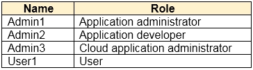
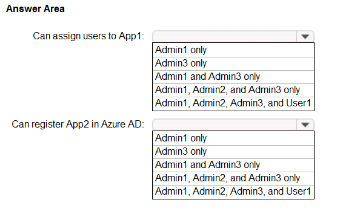
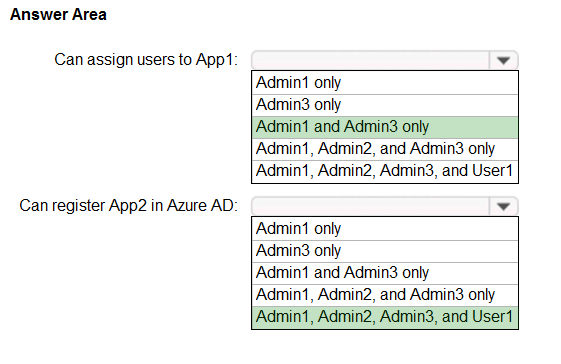

----------------------------------------

## Exam SC-300 topic 3 question 6 discussion

Actual exam question from

Microsoft's
SC-300

Question #: 6
Topic #: 3

[All SC-300 Questions]

HOTSPOT -You have a custom cloud app named App1 that is registered in Azure Active Directory (Azure AD).App1 is configured as shown in the following exhibit.Use the drop-down menus to select the answer choice that completes each statement based on the information presented in the graphic.NOTE: Each correct selection is worth one point.Hot Area: 
Suggested Answer: 

**Answer: **

**Timestamp: May 3, 2021, 8:51 a.m.**

[View on ExamTopics](https://www.examtopics.com/discussions/microsoft/view/51649-exam-sc-300-topic-3-question-6-discussion/)

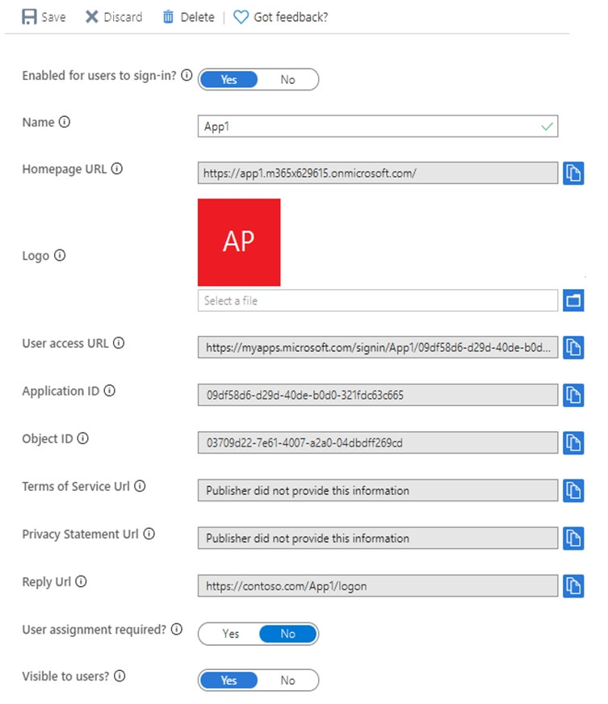
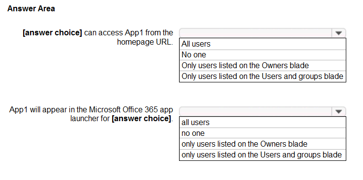
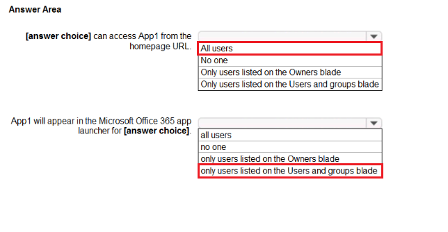

----------------------------------------

## Exam SC-300 topic 3 question 7 discussion

Actual exam question from

Microsoft's
SC-300

Question #: 7
Topic #: 3

[All SC-300 Questions]

You have an Azure Active Directory (Azure AD) tenant.You create an enterprise application collection named HR Apps that has the following settings:✑ Applications: App1, App2, App3✑ Owners: Admin1✑ Users and groups: HRUsersAll three apps have the following Properties settings:✑ Enabled for users to sign in: Yes✑ User assignment required: YesVisible to users: Yes -Users report that when they go to the My Apps portal, they only see App1 and App2.You need to ensure that the users can also see App3.What should you do from App3? 
Suggested Answer: A 🗳️ 

A. From Users and groups, add HRUsers.

B. From Single sign-on, configure a sign-on method.

C. From Properties, change User assignment required to No.

D. From Permissions, review the User consent permissions.

**Answer: A**

**Timestamp: June 18, 2021, 8:44 p.m.**

[View on ExamTopics](https://www.examtopics.com/discussions/microsoft/view/55583-exam-sc-300-topic-3-question-7-discussion/)

----------------------------------------

## Exam SC-300 topic 3 question 8 discussion

Actual exam question from

Microsoft's
SC-300

Question #: 8
Topic #: 3

[All SC-300 Questions]

You have an Azure Active Directory (Azure AD) tenant.For the tenant, Users can register applications is set to No.A user named Admin1 must deploy a new cloud app named App1.You need to ensure that Admin1 can register App1 in Azure AD. The solution must use the principle of least privilege.Which role should you assign to Admin1? 
Suggested Answer: B 🗳️ 

A. Managed Application Contributor for Subscription1.

B. Application developer in Azure AD.

C. Cloud application administrator in Azure AD.

D. App Configuration Data Owner for Subscription1.

**Answer: B**

**Timestamp: June 3, 2021, 4:41 p.m.**

[View on ExamTopics](https://www.examtopics.com/discussions/microsoft/view/54421-exam-sc-300-topic-3-question-8-discussion/)

----------------------------------------

## Exam SC-300 topic 3 question 9 discussion

Actual exam question from

Microsoft's
SC-300

Question #: 9
Topic #: 3

[All SC-300 Questions]

HOTSPOT -You have a Microsoft 365 tenant that contains a group named Group1 as shown in the Group1 exhibit. (Click the Group1 tab.)You create an enterprise application named App1 as shown in the App1 Properties exhibit. (Click the App1 Properties tab.)You configure self-service for App1 as shown in the App1 Self-service exhibit. (Click the App1 Self-service tab.)For each of the following statements, select Yes if the statement is true. Otherwise, select No.NOTE: Each correct selection is worth one point.Hot Area: 
Suggested Answer: 

**Answer: **

**Timestamp: June 1, 2021, 2:14 p.m.**

[View on ExamTopics](https://www.examtopics.com/discussions/microsoft/view/54076-exam-sc-300-topic-3-question-9-discussion/)

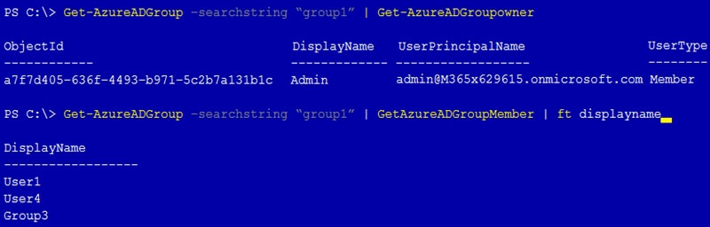
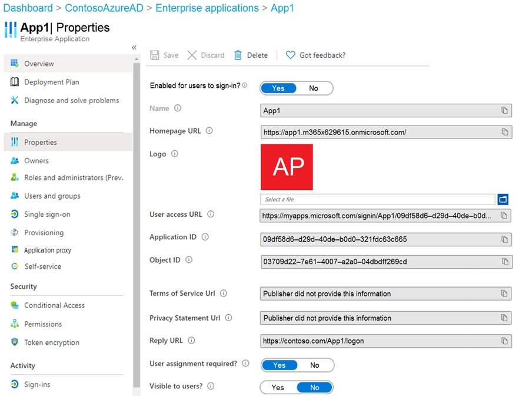
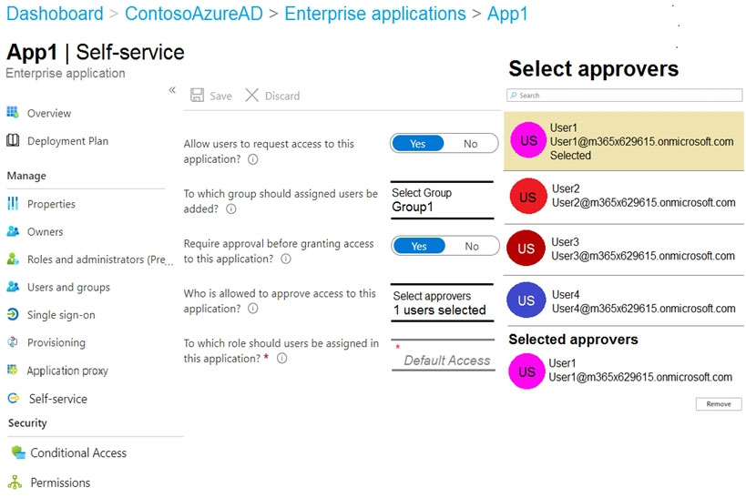
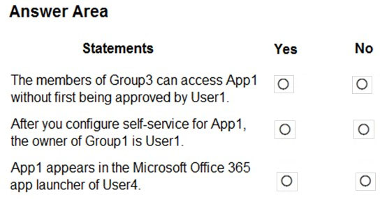
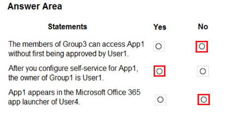

----------------------------------------

## Exam SC-300 topic 3 question 10 discussion

Actual exam question from

Microsoft's
SC-300

Question #: 10
Topic #: 3

[All SC-300 Questions]

You have an Azure Active Directory (Azure AD) tenant named contoso.com that has Azure AD Identity Protection enabled.You need to implement a sign-in risk remediation policy without blocking user access.What should you do first? 
Suggested Answer: D 🗳️ 

A. Configure access reviews in Azure AD.

B. Enforce Azure AD Password Protection.

C. Configure self-service password reset (SSPR) for all users.

D. Implement multi-factor authentication (MFA) for all users.

**Answer: D**

**Timestamp: June 7, 2021, 12:42 p.m.**

[View on ExamTopics](https://www.examtopics.com/discussions/microsoft/view/54791-exam-sc-300-topic-3-question-10-discussion/)

----------------------------------------

## Exam SC-300 topic 3 question 11 discussion

Actual exam question from

Microsoft's
SC-300

Question #: 11
Topic #: 3

[All SC-300 Questions]

HOTSPOT -Your company has a Microsoft 365 tenant.All users have computers that run Windows 10 and are joined to the Azure Active Directory (Azure AD) tenant.The company subscribes to a third-party cloud service named Service1. Service1 supports Azure AD authentication and authorization based on OAuth. Service1 is published to the Azure AD gallery.You need to recommend a solution to ensure that the users can connect to Service1 without being prompted for authentication. The solution must ensure that the users can access Service1 only from Azure AD-joined computers. The solution must minimize administrative effort.What should you recommend for each requirement? To answer, select the appropriate options in the answer area.NOTE: Each correct selection is worth one point.Hot Area: 
Suggested Answer: Reference:https://docs.microsoft.com/en-us/azure/active-directory/develop/active-directory-how-applications-are-added https://docs.microsoft.com/en-us/azure/active-directory/conditional-access/require-managed-devices 

**Answer: **

**Timestamp: Sept. 10, 2021, 10:28 p.m.**

[View on ExamTopics](https://www.examtopics.com/discussions/microsoft/view/61821-exam-sc-300-topic-3-question-11-discussion/)

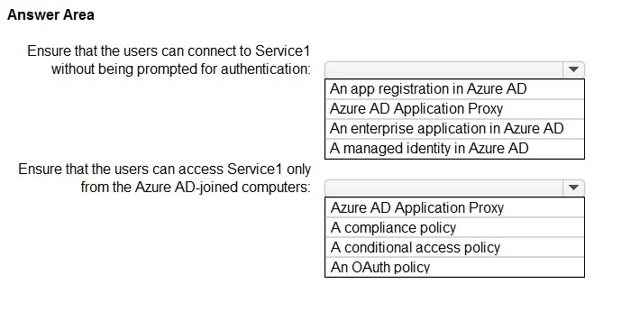
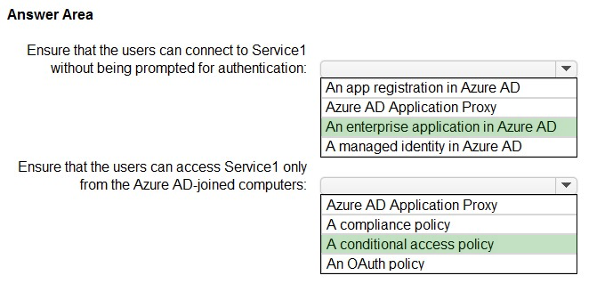

----------------------------------------

## Exam SC-300 topic 3 question 12 discussion

Actual exam question from

Microsoft's
SC-300

Question #: 12
Topic #: 3

[All SC-300 Questions]

Your company requires that users request access before they can access corporate applications.You register a new enterprise application named MyApp1 in Azure Active Directory (Azure AD) and configure single sign-on (SSO) for MyApp1.Which settings should you configure next for MyApp1? 
Suggested Answer: A 🗳️ 

A. Self-service

B. Provisioning

C. Application proxy

D. Roles and administrators

**Answer: A**

**Timestamp: Nov. 30, 2021, 5:13 p.m.**

[View on ExamTopics](https://www.examtopics.com/discussions/microsoft/view/66985-exam-sc-300-topic-3-question-12-discussion/)

----------------------------------------

## Exam SC-300 topic 3 question 13 discussion

Actual exam question from

Microsoft's
SC-300

Question #: 13
Topic #: 3

[All SC-300 Questions]

DRAG DROP -Your company has an Azure Active Directory (Azure AD) tenant named contoso.com.The company is developing a web service named App1.You need to ensure that App1 can use Microsoft Graph to read directory data in contoso.com.Which three actions should you perform in sequence? To answer, move the appropriate actions from the list of actions to the answer area and arrange then in the correct order.Select and Place: 
Suggested Answer: 

**Answer: **

**Timestamp: Oct. 19, 2021, 9:21 p.m.**

[View on ExamTopics](https://www.examtopics.com/discussions/microsoft/view/64367-exam-sc-300-topic-3-question-13-discussion/)

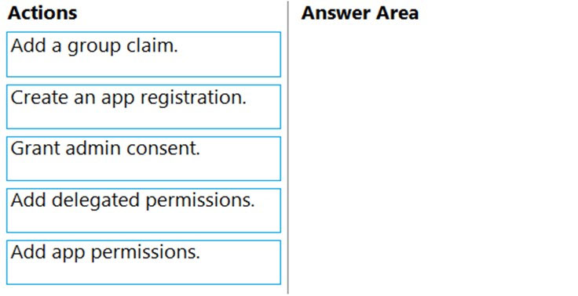
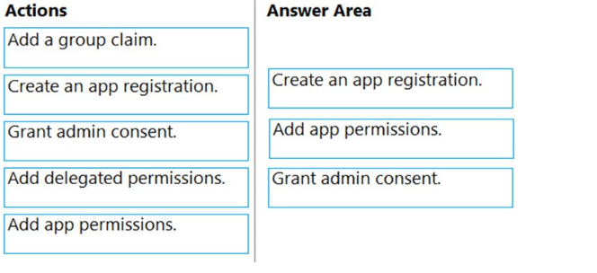

----------------------------------------

## Exam SC-300 topic 3 question 14 discussion

Actual exam question from

Microsoft's
SC-300

Question #: 14
Topic #: 3

[All SC-300 Questions]

You have an Azure Active Directory (Azure AD) tenant that contains cloud-based enterprise apps.You need to group related apps into categories in the My Apps portal.What should you create? 
Suggested Answer: B 🗳️ 

A. tags

B. collections

C. naming policies

D. dynamic groups

**Answer: B**

**Timestamp: May 12, 2022, 8:25 p.m.**

[View on ExamTopics](https://www.examtopics.com/discussions/microsoft/view/75532-exam-sc-300-topic-3-question-14-discussion/)

----------------------------------------

## Exam SC-300 topic 3 question 15 discussion

Actual exam question from

Microsoft's
SC-300

Question #: 15
Topic #: 3

[All SC-300 Questions]

The Azure Active Directory (Azure AD) tenant contains the groups shown in the following table.In Azure AD, you add a new enterprise application named App1.Which groups can you assign to App1? 
Suggested Answer: E 🗳️ 

A. Group1 only

B. Group2 only

C. Group3 only

D. Group1 and Group4

E. Group1 and Group3

**Answer: E**

**Timestamp: Sept. 8, 2022, 7:50 a.m.**

[View on ExamTopics](https://www.examtopics.com/discussions/microsoft/view/81101-exam-sc-300-topic-3-question-15-discussion/)

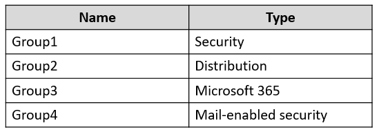

----------------------------------------

## Exam SC-300 topic 3 question 16 discussion

Actual exam question from

Microsoft's
SC-300

Question #: 16
Topic #: 3

[All SC-300 Questions]

You have an Azure Active Directory (Azure AD) tenant that contains the users shown in, the following table.The User settings for enterprise applications have the following configurations:✑ Users can consent to apps accessing company data on their behalf: No✑ Users can consent to apps accessing company data for the groups they own: No✑ Users can request admin consent to apps they are unable to consent to: YesWho can review admin consent requests: Admin2, User2User1 attempts, to add an app that requires consent to access company data.Which user can provide consent? 
Suggested Answer: C 🗳️ 

A. User1

B. User2

C. Admin1

D. Admin2

**Answer: C**

**Timestamp: Sept. 1, 2022, 6:25 a.m.**

[View on ExamTopics](https://www.examtopics.com/discussions/microsoft/view/78901-exam-sc-300-topic-3-question-16-discussion/)

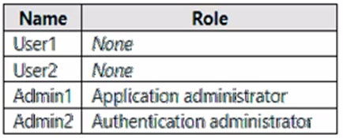

----------------------------------------

## Exam SC-300 topic 3 question 17 discussion

Actual exam question from

Microsoft's
SC-300

Question #: 17
Topic #: 3

[All SC-300 Questions]

You have a Microsoft 365 subscription. The subscription contains users that use Microsoft Outlook 2016 and Outlook 2013 clients.You need to implement tenant restrictions. The solution must minimize administrative effort.What should you do first? 
Suggested Answer: A 🗳️ 

A. Configure the Outlook 2013 clients to use modern authentication.

B. Upgrade the Outlook 2013 clients to Outlook 2016.

C. From the Exchange admin center, configure Organization Sharing.

D. Upgrade all the Outlook clients to Outlook 2019.

**Answer: A**

**Timestamp: Sept. 21, 2022, 11:06 p.m.**

[View on ExamTopics](https://www.examtopics.com/discussions/microsoft/view/83138-exam-sc-300-topic-3-question-17-discussion/)

----------------------------------------

## Exam SC-300 topic 3 question 18 discussion

Actual exam question from

Microsoft's
SC-300

Question #: 18
Topic #: 3

[All SC-300 Questions]

You have a Microsoft 365 E5 subscription and an Azure subscription.You plan to analyze Microsoft Entra sign-in logs by using Azure Monitor.You need to configure diagnostic settings for Microsoft Entra.Which destination should you configure for the sign-in logs? 
Suggested Answer: C 🗳️ 

A. an Azure event hub

B. an Azure SQL database

C. a Log Analytics workspace

D. an Azure Storage account

**Answer: C**

**Timestamp: Feb. 13, 2025, 8:40 p.m.**

[View on ExamTopics](https://www.examtopics.com/discussions/microsoft/view/156469-exam-sc-300-topic-3-question-18-discussion/)

----------------------------------------

## Exam SC-300 topic 3 question 19 discussion

Actual exam question from

Microsoft's
SC-300

Question #: 19
Topic #: 3

[All SC-300 Questions]

You have an Azure Active Directory (Azure AD) tenant that contains the users shown in the following table.You add an enterprise application named App1 to Azure AD and set User1 as the owner of App1. App1 requires admin consent to access Azure AD before the app can be used.You configure the Admin consent requests settings as shown in the following exhibit.Admin1, Admin2, Admin3, and User’ are added as reviewers.Which users can review and approve the admin consent requests? 
Suggested Answer: D 🗳️ 

A. Admin1 only

B. Admin1, Admin2 and Admin3 only

C. Admin1, Admin2, and User1 only

D. Admin1 and Admin2 only

E. Admin1, Admin2, Admin3, and User1

**Answer: D**

**Timestamp: Jan. 22, 2023, 4:05 p.m.**

[View on ExamTopics](https://www.examtopics.com/discussions/microsoft/view/96496-exam-sc-300-topic-3-question-19-discussion/)

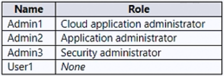
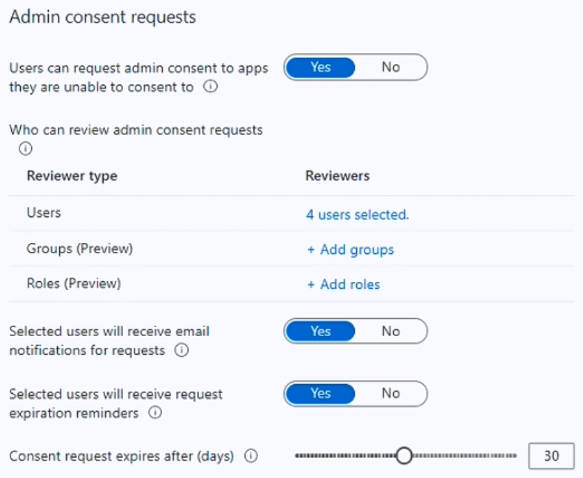

----------------------------------------

## Exam SC-300 topic 3 question 20 discussion

Actual exam question from

Microsoft's
SC-300

Question #: 20
Topic #: 3

[All SC-300 Questions]

You have a Microsoft 365 E5 subscription that contains a Microsoft SharePoint Online site named Site1.You need to be notified if a user downloads more than 50 files in one minute from Site1.Which type of policy should you create in the Microsoft Defender for Cloud Apps portal? 
Suggested Answer: B 🗳️ 

A. session policy

B. activity policy

C. file policy

D. anomaly detection policy

**Answer: B**

**Timestamp: Jan. 21, 2023, 7:48 a.m.**

[View on ExamTopics](https://www.examtopics.com/discussions/microsoft/view/96267-exam-sc-300-topic-3-question-20-discussion/)

----------------------------------------

## Exam SC-300 topic 3 question 21 discussion

Actual exam question from

Microsoft's
SC-300

Question #: 21
Topic #: 3

[All SC-300 Questions]

You have a Microsoft 365 E5 subscription that contains a Microsoft SharePoint Online site named Site1. Site1 hosts PDF files.You need to prevent users from printing the files directly from Site1.Which type of policy should you create in the Microsoft Defender for Cloud Apps portal? 
Suggested Answer: D 🗳️ 

A. activity policy

B. access policy

C. file policy

D. session policy

**Answer: D**

**Timestamp: Jan. 22, 2023, 4:12 p.m.**

[View on ExamTopics](https://www.examtopics.com/discussions/microsoft/view/96498-exam-sc-300-topic-3-question-21-discussion/)

----------------------------------------

## Exam SC-300 topic 3 question 22 discussion

Actual exam question from

Microsoft's
SC-300

Question #: 22
Topic #: 3

[All SC-300 Questions]

You have a Microsoft 365 E5 subscription that uses Microsoft Defender for Cloud Apps and Conditional Access policies.You need to block access to cloud apps when a user is assessed as high risk.Which type of policy should you create in the Microsoft Defender for Cloud Apps portal? 
Suggested Answer: A 🗳️ 

A. access policy

B. OAuth app policy

C. anomaly detection policy

D. activity policy

**Answer: A**

**Timestamp: Feb. 23, 2023, 5:29 a.m.**

[View on ExamTopics](https://www.examtopics.com/discussions/microsoft/view/100464-exam-sc-300-topic-3-question-22-discussion/)

----------------------------------------

## Exam SC-300 topic 3 question 23 discussion

Actual exam question from

Microsoft's
SC-300

Question #: 23
Topic #: 3

[All SC-300 Questions]

You have a Microsoft 365 E5 subscription.Users authorize third-party cloud apps to access their data.You need to configure an alert that will be triggered when an app requires high permissions and is authorized by more than 20 users.Which type of policy should you create in the Microsoft Defender for Cloud Apps portal? 
Suggested Answer: B 🗳️ 

A. anomaly detection policy

B. OAuth app policy

C. access policy

D. activity policy

**Answer: B**

**Timestamp: Jan. 19, 2023, 11:23 p.m.**

[View on ExamTopics](https://www.examtopics.com/discussions/microsoft/view/96063-exam-sc-300-topic-3-question-23-discussion/)

----------------------------------------

## Exam SC-300 topic 3 question 24 discussion

Actual exam question from

Microsoft's
SC-300

Question #: 24
Topic #: 3

[All SC-300 Questions]

Your company has an Azure AD tenant that contains the users shown in the following table.You have the app registrations shown in the following table.A company policy prevents changes to user permissions.Which user can create appointments in the calendar of each user at the company? 
Suggested Answer: B 🗳️ 

A. User1

B. User2

C. User3

D. User4

**Answer: B**

**Timestamp: Jan. 22, 2023, 4:14 p.m.**

[View on ExamTopics](https://www.examtopics.com/discussions/microsoft/view/96499-exam-sc-300-topic-3-question-24-discussion/)

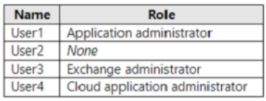
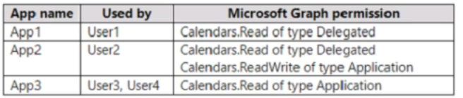

----------------------------------------

## Exam SC-300 topic 3 question 25 discussion

Actual exam question from

Microsoft's
SC-300

Question #: 25
Topic #: 3

[All SC-300 Questions]

You have an Azure AD tenant that contains a user named User1 and a registered app named App1.User1 deletes the app registration of App1.You need to restore the app registration.What is the maximum number of days you have to restore the app registration from when it was deleted? 
Suggested Answer: B 🗳️ 

A. 14

B. 30

C. 60

D. 180

**Answer: B**

**Timestamp: April 11, 2023, 10:03 p.m.**

[View on ExamTopics](https://www.examtopics.com/discussions/microsoft/view/105977-exam-sc-300-topic-3-question-25-discussion/)

----------------------------------------

## Exam SC-300 topic 3 question 26 discussion

Actual exam question from

Microsoft's
SC-300

Question #: 26
Topic #: 3

[All SC-300 Questions]

HOTSPOT -You have a Microsoft 365 tenant.Sometimes, users use external, third-party applications that require limited access to the Microsoft 365 data of the respective user. The users register the applications in Azure AD.You need to receive an alert if a registered application gains read and write access to the users’ email. What should you do? To answer, select the appropriate options in the answer area.NOTE: Each correct selection is worth one point. 
Suggested Answer: 

**Answer: **

**Timestamp: April 11, 2023, 10:08 p.m.**

[View on ExamTopics](https://www.examtopics.com/discussions/microsoft/view/105978-exam-sc-300-topic-3-question-26-discussion/)

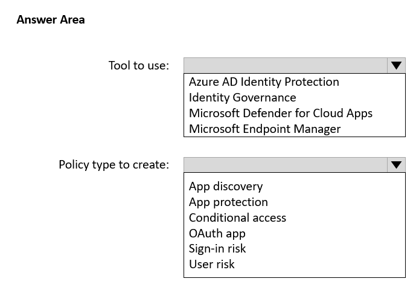
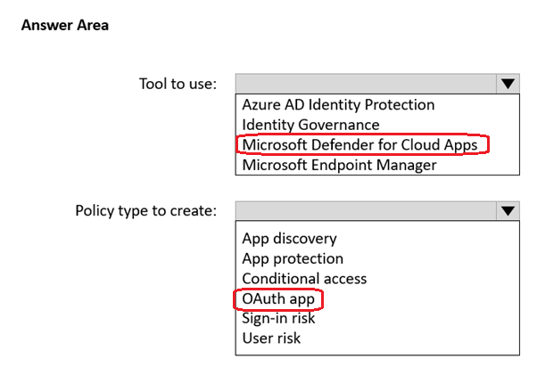

----------------------------------------

## Exam SC-300 topic 3 question 27 discussion

Actual exam question from

Microsoft's
SC-300

Question #: 27
Topic #: 3

[All SC-300 Questions]

Case Study -Overview -ADatum Corporation is a consulting company in Montreal.ADatum recently acquired a Vancouver-based company named Litware, Inc.Existing Environment. ADatum EnvironmentThe on-premises network of ADatum contains an Active Directory Domain Services (AD DS) forest named adatum.com.ADatum has a Microsoft 365 E5 subscription. The subscription contains a verified domain that syncs with the adatum.com AD DS domain by using Azure AD Connect.ADatum has an Azure Active Directory (Azure AD) tenant named adatum.com. The tenant has Security defaults disabled.The tenant contains the users shown in the following table.The tenant contains the groups shown in the following table.Existing Environment. Litware EnvironmentLitware has an AD DS forest named litware.comExisting Environment. Problem StatementsADatum identifies the following issues:• Multiple users in the sales department have up to five devices. The sales department users report that sometimes they must contact the support department to join their devices to the Azure AD tenant because they have reached their device limit.• A recent security incident reveals that several users leaked their credentials, a suspicious browser was used for a sign-in, and resources were accessed from an anonymous IP address.• When you attempt to assign the Device Administrators role to IT_Group1, the group does NOT appear in the selection list.• Anyone in the organization can invite guest users, including other guests and non-administrators.• The helpdesk spends too much time resetting user passwords.• Users currently use only passwords for authentication.Requirements. Planned Changes -ADatum plans to implement the following changes:• Configure self-service password reset (SSPR).• Configure multi-factor authentication (MFA) for all users.• Configure an access review for an access package named Package1.• Require admin approval for application access to organizational data.• Sync the AD DS users and groups of litware.com with the Azure AD tenant.• Ensure that only users that are assigned specific admin roles can invite guest users.• Increase the maximum number of devices that can be joined or registered to Azure AD to 10.Requirements. Technical RequirementsADatum identifies the following technical requirements:• Users assigned the User administrator role must be able to request permission to use the role when needed for up to one year.• Users must be prompted to register for MFA and provided with an option to bypass the registration for a grace period.• Users must provide one authentication method to reset their password by using SSPR. Available methods must include:- Email- Phone- Security questions- The Microsoft Authenticator app• Trust relationships must NOT be established between the adatum.com and litware.com AD DS domains.• The principle of least privilege must be used.You need implement the planned changes for application access to organizational data.What should you configure? 
Suggested Answer: B 🗳️ 

A. authentication methods

B. the User consent settings

C. access packages

D. an application proxy

**Answer: B**

**Timestamp: July 31, 2023, 10:26 a.m.**

[View on ExamTopics](https://www.examtopics.com/discussions/microsoft/view/116883-exam-sc-300-topic-3-question-27-discussion/)

----------------------------------------

## Exam SC-300 topic 3 question 28 discussion

Actual exam question from

Microsoft's
SC-300

Question #: 28
Topic #: 3

[All SC-300 Questions]

You have an Azure AD tenant.You configure User consent settings to allow users to provide consent to apps from verified publishers.You need to ensure that the users can only provide consent to apps that require low impact permissions.What should you do? 
Suggested Answer: D 🗳️ 

A. Create an enterprise application collection.

B. Create an access review.

C. Create an access package.

D. Configure permission classifications.

**Answer: D**

**Timestamp: Aug. 1, 2023, 8:43 p.m.**

[View on ExamTopics](https://www.examtopics.com/discussions/microsoft/view/117005-exam-sc-300-topic-3-question-28-discussion/)

----------------------------------------

## Exam SC-300 topic 3 question 29 discussion

Actual exam question from

Microsoft's
SC-300

Question #: 29
Topic #: 3

[All SC-300 Questions]

HOTSPOT -You have a Microsoft 365 E5 subscription that contains a user named User1.You configure app governance integration.User1 needs to view the App governance dashboard. The solution must use the principle of the least privilege.Which role should you assign to User1, and which portal should User1 use to view the dashboard? To answer, select the appropriate options in the answer area.NOTE: Each correct selection is worth one point. 
Suggested Answer: 

**Answer: **

**Timestamp: Aug. 2, 2023, 8:24 a.m.**

[View on ExamTopics](https://www.examtopics.com/discussions/microsoft/view/117057-exam-sc-300-topic-3-question-29-discussion/)

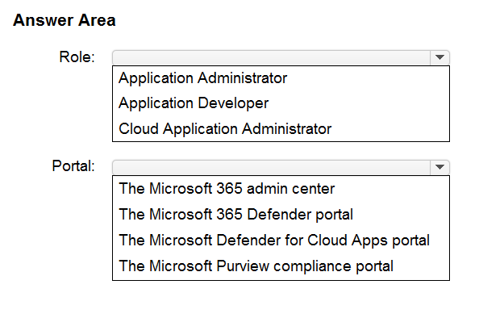
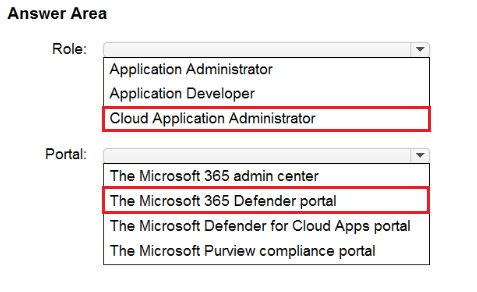

----------------------------------------

## Exam SC-300 topic 3 question 30 discussion

Actual exam question from

Microsoft's
SC-300

Question #: 30
Topic #: 3

[All SC-300 Questions]

You have an Azure subscription.You are evaluating enterprise software as a service (SaaS) apps.You need to ensure that the apps support automatic provisioning of Azure AD users.Which specification should the apps support? 
Suggested Answer: C 🗳️ 

A. OAuth 2.0

B. WS-Fed

C. SCIM 2.0

D. LDAP 3

**Answer: C**

**Timestamp: Aug. 2, 2023, 8:26 a.m.**

[View on ExamTopics](https://www.examtopics.com/discussions/microsoft/view/117058-exam-sc-300-topic-3-question-30-discussion/)

----------------------------------------

## Exam SC-300 topic 3 question 31 discussion

Actual exam question from

Microsoft's
SC-300

Question #: 31
Topic #: 3

[All SC-300 Questions]

You have an Azure AD tenant and a .NET web app named App1.You need to register App1 for Azure AD authentication.What should you configure for App1? 
Suggested Answer: D 🗳️ 

A. the executable name

B. the bundle ID

C. the package name

D. the redirect URI

**Answer: D**

**Timestamp: Oct. 3, 2023, 4:21 a.m.**

[View on ExamTopics](https://www.examtopics.com/discussions/microsoft/view/122193-exam-sc-300-topic-3-question-31-discussion/)

----------------------------------------

## Exam SC-300 topic 3 question 32 discussion

Actual exam question from

Microsoft's
SC-300

Question #: 32
Topic #: 3

[All SC-300 Questions]

You have a Microsoft 365 subscription.You plan to deploy an app named App1 that will have the following configurations:• Will be registered in Microsoft Entra• Will run as a service without user interaction• Will collect audit logs associated with user sign-ins• Will access resources by using the Microsoft Graph APIYou need to ensure that App1 can access Microsoft Graph.What should you use? 
Suggested Answer: C 🗳️ 

A. a built-in role-based access control (RBAC) role

B. a custom role-based access control (RBAC) role

C. application permissions

D. delegated permissions

**Answer: C**

**Timestamp: Jan. 15, 2025, 3:25 a.m.**

[View on ExamTopics](https://www.examtopics.com/discussions/microsoft/view/154522-exam-sc-300-topic-3-question-32-discussion/)

----------------------------------------

## Exam SC-300 topic 3 question 33 discussion

Actual exam question from

Microsoft's
SC-300

Question #: 33
Topic #: 3

[All SC-300 Questions]

You have an Azure AD tenant.You discover that a large number of new apps were added to the tenant.You need to implement an approval process for new enterprise applications.What should you do? 
Suggested Answer: B 🗳️ 

A. From the Microsoft Defender for Cloud Apps portal, create a Cloud Discovery anomaly detection policy.

B. From the Microsoft Entra admin center, configure the Admin consent settings.

C. From the Microsoft Defender for Cloud Apps portal, configure an app connector.

D. From the Microsoft Entra admin center, configure an access review.

**Answer: B**

**Timestamp: Oct. 3, 2023, 4:32 a.m.**

[View on ExamTopics](https://www.examtopics.com/discussions/microsoft/view/122195-exam-sc-300-topic-3-question-33-discussion/)

----------------------------------------

## Exam SC-300 topic 3 question 34 discussion

Actual exam question from

Microsoft's
SC-300

Question #: 34
Topic #: 3

[All SC-300 Questions]

You have a Microsoft 365 E5 subscription.You purchase the app governance add-on license.You need to enable app governance integration.Which portal should you use? 
Suggested Answer: C 🗳️ 

A. the Microsoft Defender for Cloud Apps portal

B. the Microsoft 365 admin center

C. Microsoft 365 Defender

D. the Azure Active Directory admin center

E. the Microsoft Purview compliance portal

**Answer: C**

**Timestamp: Oct. 3, 2023, 4:36 a.m.**

[View on ExamTopics](https://www.examtopics.com/discussions/microsoft/view/122196-exam-sc-300-topic-3-question-34-discussion/)

----------------------------------------

## Exam SC-300 topic 3 question 35 discussion

Actual exam question from

Microsoft's
SC-300

Question #: 35
Topic #: 3

[All SC-300 Questions]

Your company purchases a new Microsoft 365 E5 subscription and an app named App1.You need to create a Microsoft Defender for Cloud Apps access policy for App1.What should you do you first? 
Suggested Answer: D 🗳️ 

A. Configure a Conditional Access policy to use app-enforced restrictions.

B. Configure a Token configuration for App1.

C. Add an API permission for App1.

D. Configure a Conditional Access policy to use Conditional Access App Control.

**Answer: D**

**Timestamp: Oct. 4, 2023, 3:20 a.m.**

[View on ExamTopics](https://www.examtopics.com/discussions/microsoft/view/122308-exam-sc-300-topic-3-question-35-discussion/)

----------------------------------------

## Exam SC-300 topic 3 question 36 discussion

Actual exam question from

Microsoft's
SC-300

Question #: 36
Topic #: 3

[All SC-300 Questions]

Case Study -Overview -Contoso, Ltd. is a consulting company that has a main office in Montreal and branch offices in London and Seattle.Contoso has a partnership with a company named Fabrikam, Inc. Fabrikam has an Azure AD tenant named fabrikam.com.Existing Environment. Existing EnvironmentThe on-premises network of Contoso contains an Active Directory domain named contoso.com. The domain contains an organizational unit (OU) named Contoso_Resources. The Contoso_Resources OU contains all users and computers.The contoso.com Active Directory domain contains the relevant users shown in the following table.Contoso also includes a marketing department that has users in each office.Existing Environment. Microsoft 365/Azure EnvironmentContoso has an Azure AD tenant named contoso.com that has the following associated licenses:• Microsoft Office 365 Enterprise E5• Enterprise Mobility + Security E5• Windows 10 Enterprise E3• Project Plan 3Azure AD Connect is configured between Azure AD and Active Directory Domain Services (AD DS). Only the Contoso_Resources OU is synced.Helpdesk administrators routinely use the Microsoft 365 admin center to manage user settings.User administrators currently use the Microsoft 365 admin center to manually assign licenses. All users have all licenses assigned besides the following exceptions:• The users in the London office have the Microsoft 365 Phone System license unassigned.• The users in the Seattle office have the Yammer Enterprise license unassigned.Security defaults are disabled for contoso.com.Contoso uses Azure AD Privileged Identity Management (PIM) to protect administrative roles.Existing Environment. Problem StatementsContoso identifies the following issues:• Currently, all the helpdesk administrators can manage user licenses throughout the entire Microsoft 365 tenant.• The user administrators report that it is tedious to manually configure the different license requirements for each Contoso office.• The helpdesk administrators spend too much time provisioning internal and guest access to the required Microsoft 365 services and apps.• Currently, the helpdesk administrators can perform tasks by using the User administrator role without justification or approval.• When the Logs node is selected in Azure AD, an error message appears stating that Log Analytics integration is not enabled.Requirements. Planned Changes -Contoso plans to implement the following changes:• Implement self-service password reset (SSPR).• Analyze Azure audit activity logs by using Azure Monitor.• Simplify license allocation for new users added to the tenant.• Collaborate with the users at Fabrikam on a joint marketing campaign.• Configure the User administrator role to require justification and approval to activate.• Implement a custom line-of-business Azure web app named App1. App1 will be accessible from the internet and authenticated by using Azure AD accounts.• For new users in the marketing department, implement an automated approval workflow to provide access to a Microsoft SharePoint Online site, group, and app.Contoso plans to acquire a company named A. Datum Corporation. One hundred new A. Datum users will be created in an Active Directory OU named Adatum. The users will be located in London and Seattle.Requirements. Technical RequirementsContoso identifies the following technical requirements:• All users must be synced from AD DS to the contoso.com Azure AD tenant.• App1 must have a redirect URI pointed to https://contoso.com/auth-response.• License allocation for new users must be assigned automatically based on the location of the user.• Fabrikam users must have access to the marketing department’s SharePoint site for a maximum of 90 days.• Administrative actions performed in Azure AD must be audited. Audit logs must be retained for one year.• The helpdesk administrators must be able to manage licenses for only the users in their respective office.• Users must be forced to change their password if there is a probability that the users’ identity was compromised.You need to meet the planned changes and technical requirements for App1.What should you implement? 
Suggested Answer: D 🗳️ 

A. a policy set in Microsoft Intune

B. Azure AD Application Proxy

C. an app configuration policy in Microsoft Intune

D. an app registration in Azure AD

**Answer: D**

**Timestamp: Oct. 4, 2023, 3:24 a.m.**

[View on ExamTopics](https://www.examtopics.com/discussions/microsoft/view/122309-exam-sc-300-topic-3-question-36-discussion/)

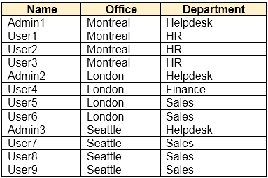

----------------------------------------

## Exam SC-300 topic 3 question 37 discussion

Actual exam question from

Microsoft's
SC-300

Question #: 37
Topic #: 3

[All SC-300 Questions]

Note: This question is part of a series of questions that present the same scenario. Each question in the series contains a unique solution that might meet the stated goals. Some question sets might have more than one correct solution, while others might not have a correct solution.After you answer a question in this section, you will NOT be able to return to it. As a result, these questions will not appear in the review screen.You have an Amazon Web Services (AWS) account, a Google Workspace subscription, and a GitHub account.You deploy an Azure subscription and enable Microsoft 365 Defender.You need to ensure that you can monitor OAuth authentication requests by using Microsoft Defender for Cloud Apps.Solution: From the Microsoft 365 Defender portal, you add the Google Workspace app connector.Does this meet the goal? 
Suggested Answer: B 🗳️ 

A. Yes

B. No

**Answer: B**

**Timestamp: Oct. 4, 2023, 3:36 a.m.**

[View on ExamTopics](https://www.examtopics.com/discussions/microsoft/view/122314-exam-sc-300-topic-3-question-37-discussion/)

----------------------------------------

## Exam SC-300 topic 3 question 38 discussion

Actual exam question from

Microsoft's
SC-300

Question #: 38
Topic #: 3

[All SC-300 Questions]

Note: This question is part of a series of questions that present the same scenario. Each question in the series contains a unique solution that might meet the stated goals. Some question sets might have more than one correct solution, while others might not have a correct solution.After you answer a question in this section, you will NOT be able to return to it. As a result, these questions will not appear in the review screen.You have an Amazon Web Services (AWS) account, a Google Workspace subscription, and a GitHub account.You deploy an Azure subscription and enable Microsoft 365 Defender.You need to ensure that you can monitor OAuth authentication requests by using Microsoft Defender for Cloud Apps.Solution: From the Microsoft 365 Defender portal, you add the Microsoft Azure app connector.Does this meet the goal? 
Suggested Answer: B 🗳️ 

A. Yes

B. No

**Answer: B**

**Timestamp: Oct. 4, 2023, 3:36 a.m.**

[View on ExamTopics](https://www.examtopics.com/discussions/microsoft/view/122313-exam-sc-300-topic-3-question-38-discussion/)

----------------------------------------

## Exam SC-300 topic 3 question 39 discussion

Actual exam question from

Microsoft's
SC-300

Question #: 39
Topic #: 3

[All SC-300 Questions]

Note: This question is part of a series of questions that present the same scenario. Each question in the series contains a unique solution that might meet the stated goals. Some question sets might have more than one correct solution, while others might not have a correct solution.After you answer a question in this section, you will NOT be able to return to it. As a result, these questions will not appear in the review screen.You have an Amazon Web Services (AWS) account, a Google Workspace subscription, and a GitHub account.You deploy an Azure subscription and enable Microsoft 365 Defender.You need to ensure that you can monitor OAuth authentication requests by using Microsoft Defender for Cloud Apps.Solution: From the Microsoft 365 Defender portal, you add the Amazon Web Services app connector.Does this meet the goal? 
Suggested Answer: B 🗳️ 

A. Yes

B. No

**Answer: B**

**Timestamp: Oct. 4, 2023, 3:36 a.m.**

[View on ExamTopics](https://www.examtopics.com/discussions/microsoft/view/122312-exam-sc-300-topic-3-question-39-discussion/)

----------------------------------------

## Exam SC-300 topic 3 question 40 discussion

Actual exam question from

Microsoft's
SC-300

Question #: 40
Topic #: 3

[All SC-300 Questions]

Your company purchases a Microsoft 365 E5 subscription.A user named User1 is assigned the Security Administrator role.You need to ensure that User1 can create Microsoft Defender for Cloud Apps session policies.What should you do first? 
Suggested Answer: B 🗳️ 

A. Create a Conditional Access policy and select Require app protection policy.

B. Create a Conditional Access policy and select Use Conditional Access App Control.

C. Assign the Cloud Application Administrator role to User1.

D. Assign the Cloud App Security Administrator role to User1.

**Answer: B**

**Timestamp: Oct. 10, 2023, 10:45 p.m.**

[View on ExamTopics](https://www.examtopics.com/discussions/microsoft/view/123191-exam-sc-300-topic-3-question-40-discussion/)

----------------------------------------

## Exam SC-300 topic 3 question 41 discussion

Actual exam question from

Microsoft's
SC-300

Question #: 41
Topic #: 3

[All SC-300 Questions]

You have an Azure subscription that contains a user named User1.The App registration settings for the Azure AD tenant are configured as shown in the following exhibit.User1 builds an ASP.NET web app named App1.You need to ensure that User1 can register App1. The solution must use the principle of least privilege.Which role should you assign to User1? 
Suggested Answer: A 🗳️ 

A. Application Developer

B. Cloud App Security Administrator

C. Cloud Application Administrator

D. Application Administrator

**Answer: A**

**Timestamp: Nov. 13, 2023, 2:26 p.m.**

[View on ExamTopics](https://www.examtopics.com/discussions/microsoft/view/125930-exam-sc-300-topic-3-question-41-discussion/)

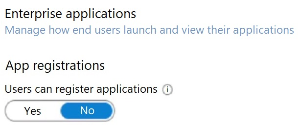

----------------------------------------

## Exam SC-300 topic 3 question 42 discussion

Actual exam question from

Microsoft's
SC-300

Question #: 42
Topic #: 3

[All SC-300 Questions]

HOTSPOT -You have an Azure subscription that contains the resources shown in the following table.The subscription contains the virtual machines shown in the following table.Which identities can be assigned the Owner role for RG1, and to which virtual machines can you assign Managed2? To answer, select the appropriate options in the answer area.NOTE: Each correct selection is worth one point. 
Suggested Answer: 

**Answer: **

**Timestamp: Nov. 13, 2023, 5:11 p.m.**

[View on ExamTopics](https://www.examtopics.com/discussions/microsoft/view/125947-exam-sc-300-topic-3-question-42-discussion/)

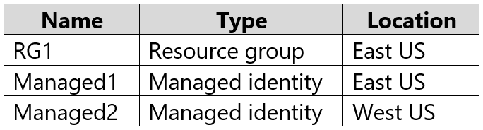
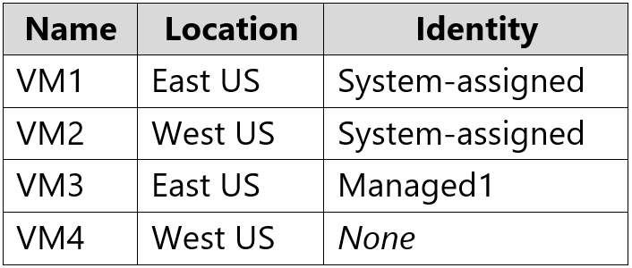
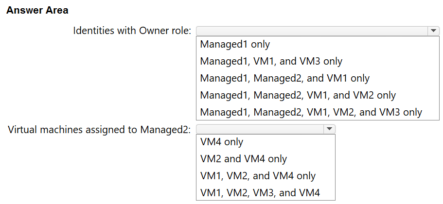
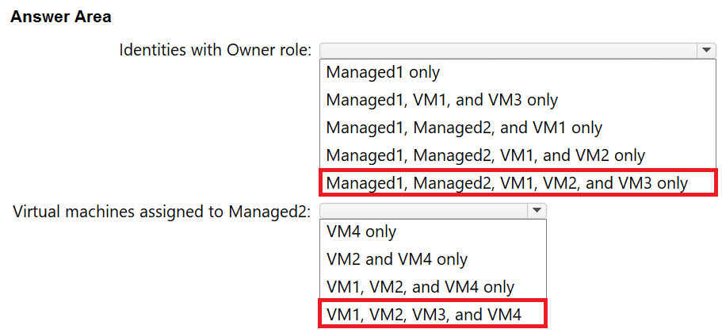

----------------------------------------

## Exam SC-300 topic 3 question 43 discussion

Actual exam question from

Microsoft's
SC-300

Question #: 43
Topic #: 3

[All SC-300 Questions]

You have a Microsoft 365 E5 subscription that uses Microsoft Defender for Cloud Apps.You plan to increase app security for the subscription.You need to identify which apps do NOT require user authentication.What should you do in the Microsoft 365 Defender portal? 
Suggested Answer: A 🗳️ 

A. Review the cloud app catalog.

B. Create an OAuth policy and review alerts.

C. Create a snapshot Cloud Discovery report.

D. Create a discovered app query.

**Answer: A**

**Timestamp: Nov. 6, 2023, 8:38 a.m.**

[View on ExamTopics](https://www.examtopics.com/discussions/microsoft/view/125497-exam-sc-300-topic-3-question-43-discussion/)

----------------------------------------

## Exam SC-300 topic 3 question 44 discussion

Actual exam question from

Microsoft's
SC-300

Question #: 44
Topic #: 3

[All SC-300 Questions]

HOTSPOT -You have a Microsoft Entra tenant that contains multiple storage accounts.You plan to deploy multiple Azure App Service apps that will require access to the storage accounts.You need to recommend an identity solution to provide the apps with access to the storage accounts. The solution must minimize administrative effort.Which type of identity should you recommend, and what should you recommend using to control access to the storage accounts? To answer, select the appropriate options in the answer area. 
Suggested Answer: 

**Answer: **

**Timestamp: Jan. 24, 2024, 9:16 a.m.**

[View on ExamTopics](https://www.examtopics.com/discussions/microsoft/view/131997-exam-sc-300-topic-3-question-44-discussion/)

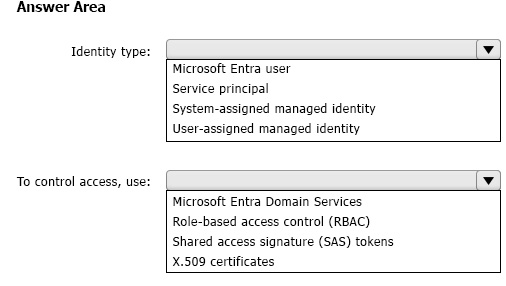
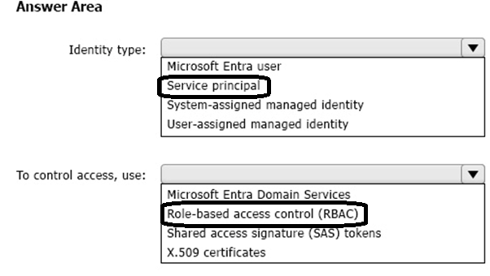

----------------------------------------

## Exam SC-300 topic 3 question 45 discussion

Actual exam question from

Microsoft's
SC-300

Question #: 45
Topic #: 3

[All SC-300 Questions]

You have an Azure subscription named Sub1 that contains a resource group named RG1. RG1 contains an Azure Cosmos DB database named DB1 and an Azure Kubernetes Service (AKS) cluster named AKS1. AKS1 uses a managed identity.You need to ensure that AKS1 can access DB1. The solution must meet the following requirements:• Ensure that AKS1 uses the managed identity to access DB1.• Follow the principle of least privilege.Which role should you assign to the managed identity of AKS1? 
Suggested Answer: B 🗳️ 

A. For Sub1, assign the Owner role.

B. For DB1, assign the Azure Cosmos DB Account Reader Role role.

C. For RG1, assign the Azure Cosmos DB Data Reader Role role.

D. For RG1, assign the Reader role.

**Answer: B**

**Timestamp: Jan. 30, 2024, 8:58 p.m.**

[View on ExamTopics](https://www.examtopics.com/discussions/microsoft/view/132478-exam-sc-300-topic-3-question-45-discussion/)

----------------------------------------

## Exam SC-300 topic 3 question 46 discussion

Actual exam question from

Microsoft's
SC-300

Question #: 46
Topic #: 3

[All SC-300 Questions]

You have an Azure subscription that contains a storage account named storage1 and a web app named WebApp1. WebApp1 uses a system-assigned managed identity.You need to ensure that WebApp1 can read and write files to storage1 by using the system-assigned managed identity.What should you configure for storage1 in the Azure portal? 
Suggested Answer: C 🗳️ 

A. data protection

B. a shared access signature (SAS)

C. the Access control (IAM) settings

D. the File share settings

E. access keys

**Answer: C**

**Timestamp: Feb. 8, 2024, 8:39 a.m.**

[View on ExamTopics](https://www.examtopics.com/discussions/microsoft/view/133347-exam-sc-300-topic-3-question-46-discussion/)

----------------------------------------

## Exam SC-300 topic 3 question 47 discussion

Actual exam question from

Microsoft's
SC-300

Question #: 47
Topic #: 3

[All SC-300 Questions]

HOTSPOT -You have an Azure subscription named Sub1 that contains a storage account named storage1.You need to deploy two apps named App1 and App2 that will have the following configurations:• App1 will be deployed as a registered app in Sub1.• App1 will access storage1 by using Microsoft Entra authentication.• App2 will access storage1 by using a single Microsoft Entra identity.• App2 be hosted on two new virtual machines named VM1 and VM2.The solution must minimize administrative effort.Which type of identity will each app use to access storage1? To answer, select the appropriate options in the answer area.NOTE: Each correct selection is worth one point. 
Suggested Answer: 

**Answer: **

**Timestamp: March 29, 2024, 1:31 p.m.**

[View on ExamTopics](https://www.examtopics.com/discussions/microsoft/view/137482-exam-sc-300-topic-3-question-47-discussion/)

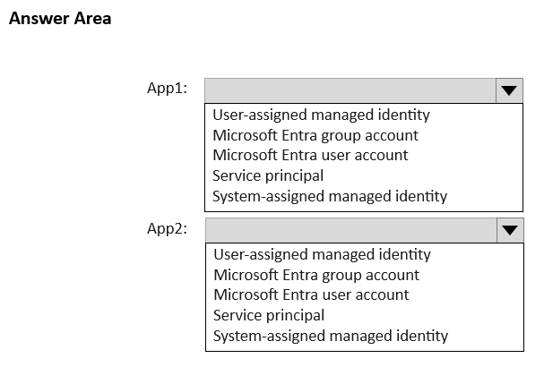
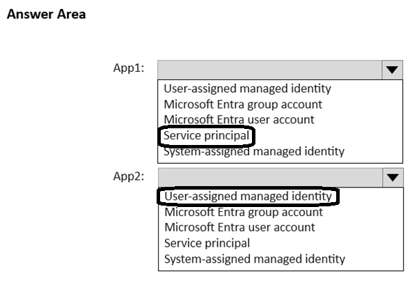

----------------------------------------

## Exam SC-300 topic 3 question 48 discussion

Actual exam question from

Microsoft's
SC-300

Question #: 48
Topic #: 3

[All SC-300 Questions]

HOTSPOT -You have a Microsoft 365 E5 subscription.You need to configure app consent for the subscription. The solution must meet the following requirements:• Disable user consent to apps.• Configure admin consent workflow for apps.Which portal should you use for each requirement? To answer, select the appropriate options in the answer area.NOTE: Each correct selection is worth one point. 
Suggested Answer: 

**Answer: **

**Timestamp: March 29, 2024, 1:34 p.m.**

[View on ExamTopics](https://www.examtopics.com/discussions/microsoft/view/137483-exam-sc-300-topic-3-question-48-discussion/)

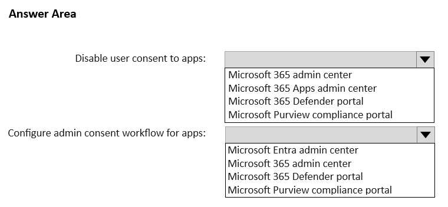
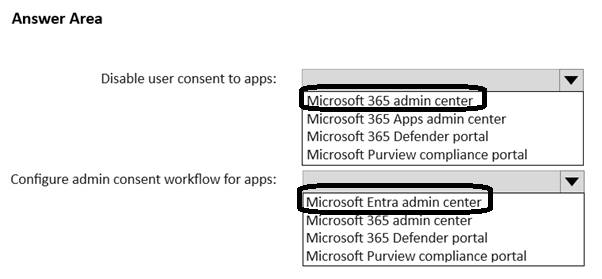

----------------------------------------

## Exam SC-300 topic 3 question 49 discussion

Actual exam question from

Microsoft's
SC-300

Question #: 49
Topic #: 3

[All SC-300 Questions]

You have a Microsoft 365 subscription.You plan to deploy an app named App1 that will have the following configurations:• Will be registered in Microsoft Entra• Will access the signed-in user's Microsoft Outlook calendar by using the Microsoft Graph APIYou need to ensure that App1 can access Microsoft Graph.What should you use? 
Suggested Answer: B 🗳️ 

A. application permissions

B. delegated permissions

C. a custom role-based access control (RBAC) role

D. a built-in role-based access control (RBAC) role

**Answer: B**

**Timestamp: March 29, 2024, 1 p.m.**

[View on ExamTopics](https://www.examtopics.com/discussions/microsoft/view/137480-exam-sc-300-topic-3-question-49-discussion/)

----------------------------------------

## Exam SC-300 topic 3 question 50 discussion

Actual exam question from

Microsoft's
SC-300

Question #: 50
Topic #: 3

[All SC-300 Questions]

HOTSPOT -You have an Azure subscription that contains the resources shown in the following table.You create a Microsoft Entra user named User1.Which identities can you add to VM1 and App1? To answer, select the appropriate options in the answer area.NOTE: Each correct answer is worth one point. 
Suggested Answer: 

**Answer: **

**Timestamp: Jan. 15, 2025, 5:21 a.m.**

[View on ExamTopics](https://www.examtopics.com/discussions/microsoft/view/154531-exam-sc-300-topic-3-question-50-discussion/)

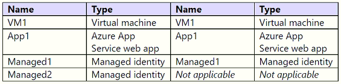
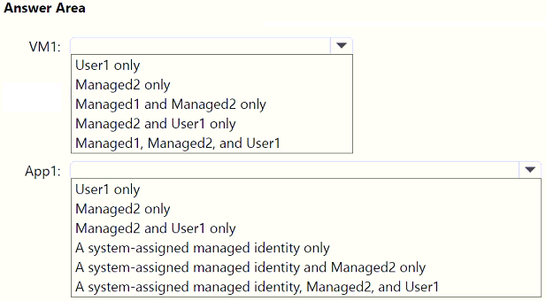
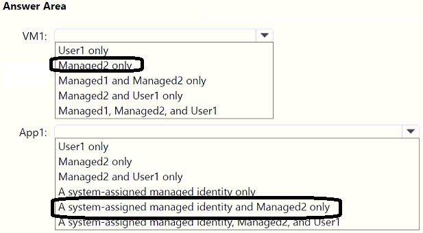

----------------------------------------

## Exam SC-300 topic 3 question 52 discussion

Actual exam question from

Microsoft's
SC-300

Question #: 52
Topic #: 3

[All SC-300 Questions]

SIMULATION -Use the following login credentials as needed:To enter your username, place your cursor in the Sign in box and click on the username below.To enter your password, place your cursor in the Enter password box and click on the password below.Microsoft 365 Username:[email protected]Microsoft 365 Password: =1122334455667788If the Microsoft 365 portal does not load successfully in the browser, press CTRL-K to reload the portal in a new browser tab.The following information is for technical support purposes only:Lab Instance: 99999999 -You need to configure consent for applications that require access to data in the Microsoft 365 subscription. The solution must meet the following requirements:If a user cannot provide consent to an application, the user must be able to request that an administrator review the consents requests.Allan Deyoung must be able to review the consent requests of the users.To complete this task, sign in to the appropriate admin center. 
Suggested Answer: 

**Answer: **

**Timestamp: Aug. 30, 2025, 6:19 a.m.**

[View on ExamTopics](https://www.examtopics.com/discussions/microsoft/view/311553-exam-sc-300-topic-3-question-52-discussion/)

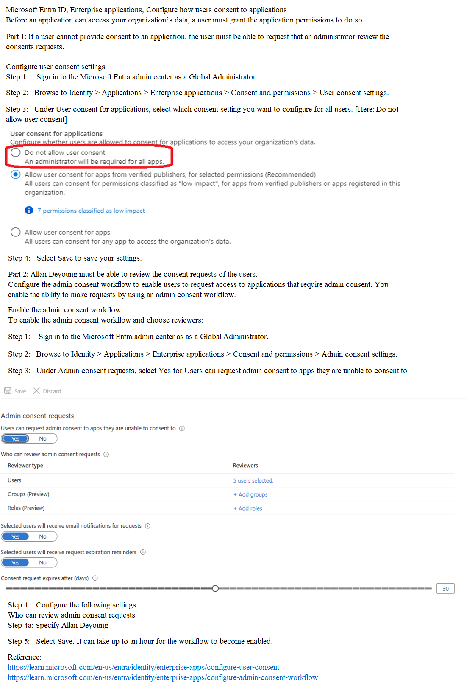

----------------------------------------

## Exam SC-300 topic 3 question 53 discussion

Actual exam question from

Microsoft's
SC-300

Question #: 53
Topic #: 3

[All SC-300 Questions]

SIMULATION -Use the following login credentials as needed:To enter your username, place your cursor in the Sign in box and click on the username below.To enter your password, place your cursor in the Enter password box and click on the password below.Microsoft 365 Username:[email protected]Microsoft 365 Password: =1122334455667788If the Microsoft 365 portal does not load successfully in the browser, press CTRL-K to reload the portal in a new browser tab.The following information is for technical support purposes only:Lab Instance: 99999999 -You need to ensure that all users can consent to apps that require permission to read their user profile. Users must be prevented from consenting to apps that require any other permissions.To complete this task, sign in to the appropriate admin center. 
Suggested Answer: 

**Answer: **

**Timestamp: Nov. 8, 2025, 7:53 p.m.**

[View on ExamTopics](https://www.examtopics.com/discussions/microsoft/view/316036-exam-sc-300-topic-3-question-53-discussion/)

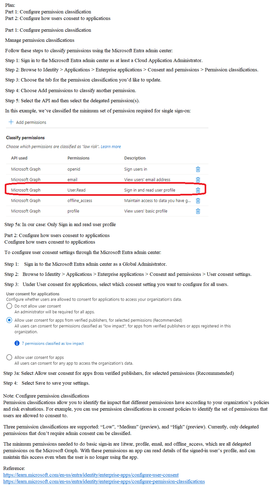

----------------------------------------

## Exam SC-300 topic 3 question 54 discussion

Actual exam question from

Microsoft's
SC-300

Question #: 54
Topic #: 3

[All SC-300 Questions]

SIMULATION -Use the following login credentials as needed:To enter your username, place your cursor in the Sign in box and click on the username below.To enter your password, place your cursor in the Enter password box and click on the password below.Microsoft 365 Username:[email protected]Microsoft 365 Password: =1122334455667788If the Microsoft 365 portal does not load successfully in the browser, press CTRL-K to reload the portal in a new browser tab.The following information is for technical support purposes only:Lab Instance: 99999999 -You need to ensure that when users in the sg-Operations group go to the My Apps portal, a tab named Operations appears that contains only the following applications:• LinkedIn• BoxTo complete this task, sign in to the appropriate admin center. 
Suggested Answer: 

**Answer: **

**Timestamp: Jan. 15, 2025, 5:50 p.m.**

[View on ExamTopics](https://www.examtopics.com/discussions/microsoft/view/154588-exam-sc-300-topic-3-question-54-discussion/)

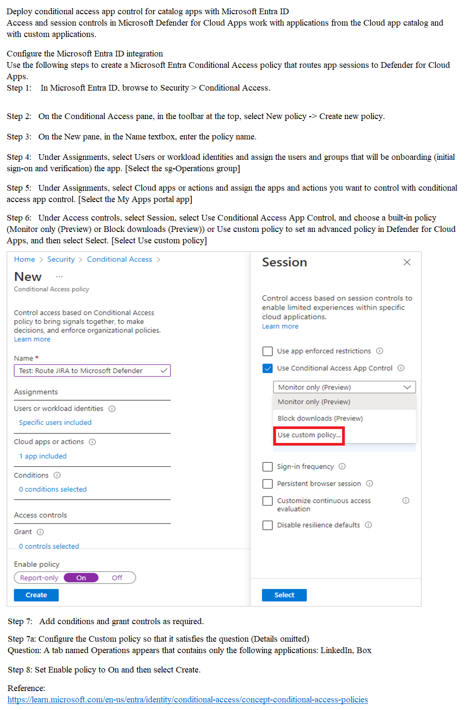

----------------------------------------

## Exam SC-300 topic 3 question 55 discussion

Actual exam question from

Microsoft's
SC-300

Question #: 55
Topic #: 3

[All SC-300 Questions]

HOTSPOT -You have an Azure subscription that contains the resources shown in the following table.You create a Microsoft Entra user named User1.Which identities can you add to VM1 and App1? To answer, select the appropriate options in the answer area.NOTE: Each correct answer is worth one point. 
Suggested Answer: 

**Answer: **

**Timestamp: Jan. 15, 2025, 7:36 p.m.**

[View on ExamTopics](https://www.examtopics.com/discussions/microsoft/view/154599-exam-sc-300-topic-3-question-55-discussion/)

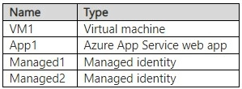
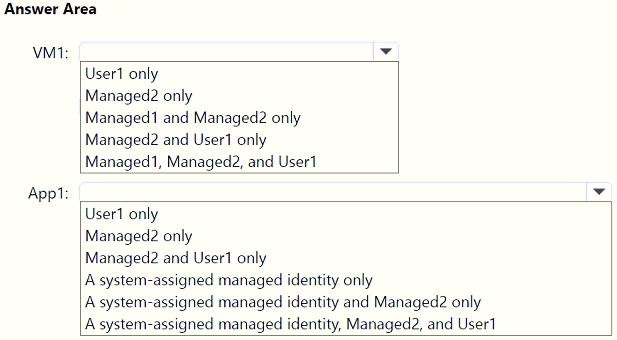
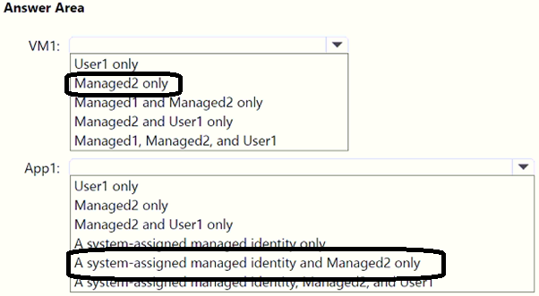

----------------------------------------

## Exam SC-300 topic 3 question 56 discussion

Actual exam question from

Microsoft's
SC-300

Question #: 56
Topic #: 3

[All SC-300 Questions]

You have an Azure subscription that contains the resources shown in the following table.You need to grant permissions to the resources by using attribute-based access control (ABAC).To which resource can you grant permissions? 
Suggested Answer: D 🗳️ 

A. Vault1

B. VM1

C. App1

D. Storage1

**Answer: D**

**Timestamp: Jan. 15, 2025, 7:38 p.m.**

[View on ExamTopics](https://www.examtopics.com/discussions/microsoft/view/154600-exam-sc-300-topic-3-question-56-discussion/)

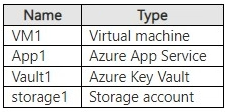

----------------------------------------

## Exam SC-300 topic 3 question 57 discussion

Actual exam question from

Microsoft's
SC-300

Question #: 57
Topic #: 3

[All SC-300 Questions]

You have an Azure subscription that is linked to a Microsoft Entra tenant. The tenant contains a registered app named App1.You have a partner organization that has a Microsoft Entra tenant. The tenant contains a registered app named App2.You need to ensure that App1 can access App2.Which two types of credentials can App1 use? Each correct answer presents a complete solution.NOTE: Each correct selection is worth one point. 
Suggested Answer: AC 🗳️ 

A. certificate

B. managed identity

C. secret

D. user account

E. one-time password

**Answer: A**

**Timestamp: Feb. 15, 2025, 1:03 a.m.**

[View on ExamTopics](https://www.examtopics.com/discussions/microsoft/view/156514-exam-sc-300-topic-3-question-57-discussion/)

----------------------------------------

## Exam SC-300 topic 3 question 58 discussion

Actual exam question from

Microsoft's
SC-300

Question #: 58
Topic #: 3

[All SC-300 Questions]

You have an Azure subscription that contains two virtual machines named VM1 and VM2 and an Azure SQL managed instance named SQL1.You need to ensure that VM1 and VM2 can retrieve data from SQL1.The solution must minimize administrative effort.What should you create first? 
Suggested Answer: C 🗳️ 

A. a certificate

B. a shared access signature (SAS) token

C. a managed identity

D. a Microsoft Entra user account

**Answer: C**

**Timestamp: Feb. 16, 2025, 3:47 p.m.**

[View on ExamTopics](https://www.examtopics.com/discussions/microsoft/view/156601-exam-sc-300-topic-3-question-58-discussion/)

----------------------------------------

## Exam SC-300 topic 3 question 59 discussion

Actual exam question from

Microsoft's
SC-300

Question #: 59
Topic #: 3

[All SC-300 Questions]

You have a Microsoft 365 E5 subscription.You plan to deploy a third-party software as a service (SaaS) app named App1.You need to onboard App1 to Microsoft Defender for Cloud Apps. The solution must ensure that you can implement session control policies.What should you do first? 
Suggested Answer: B 🗳️ 

A. From the Microsoft Defender portal, configure Cloud discovery.

B. From the Microsoft Entra admin center, configure single sign-on (SSO) for App1.

C. From the Microsoft Defender portal, create an OAuth app policy.

D. From the Microsoft Entra admin center, configure a traffic forwarding profile.

**Answer: B**

**Timestamp: Dec. 26, 2024, 10:45 a.m.**

[View on ExamTopics](https://www.examtopics.com/discussions/microsoft/view/153458-exam-sc-300-topic-3-question-59-discussion/)

----------------------------------------

## Exam SC-300 topic 3 question 60 discussion

Actual exam question from

Microsoft's
SC-300

Question #: 60
Topic #: 3

[All SC-300 Questions]

You have a Microsoft 365 E5 subscription that contains a Microsoft SharePoint Online site named Site1.You need to enable Microsoft Defender for Cloud Apps session control for Site1.Which type of policy should you create first? 
Suggested Answer: D 🗳️ 

A. access

B. app governance

C. session

D. Conditional Access

**Answer: D**

**Timestamp: Feb. 16, 2025, 3:59 p.m.**

[View on ExamTopics](https://www.examtopics.com/discussions/microsoft/view/156602-exam-sc-300-topic-3-question-60-discussion/)

----------------------------------------

## Exam SC-300 topic 3 question 62 discussion

Actual exam question from

Microsoft's
SC-300

Question #: 62
Topic #: 3

[All SC-300 Questions]

HOTSPOT -You have an Azure subscription named Sub1 that contains an Azure key vault named Vault1 and an Azure Automation account named Automation1.You need to ensure that Automation1 can access Vault1. The solution must meet the following requirements:• Ensure that if Automation1 is deleted, the permissions granted for Vault1 will be removed automatically.• Ensure that runbooks created in Automation1 can read secret values stored in Vault1.• Follow the principle of least privilege.What should you configure for Automation1, and which built-in role should Automation1 use to access Vault1? To answer, select the appropriate options in the answer area.NOTE: Each correct answer is worth one point. 
Suggested Answer: 

**Answer: **

**Timestamp: July 30, 2025, 7:16 a.m.**

[View on ExamTopics](https://www.examtopics.com/discussions/microsoft/view/307473-exam-sc-300-topic-3-question-62-discussion/)

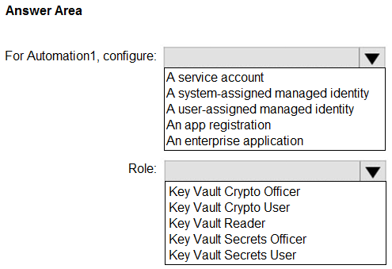
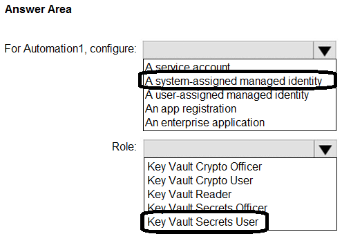

----------------------------------------

## Exam SC-300 topic 3 question 63 discussion

Actual exam question from

Microsoft's
SC-300

Question #: 63
Topic #: 3

[All SC-300 Questions]

You have a Microsoft 365 E5 subscription that contains a Microsoft SharePoint Online site named Site1.You need to be notified if a user downloads more than 50 files in one minute from Site1.Which type of policy should you create in the Microsoft Defender for Cloud Apps? 
Suggested Answer: B 🗳️ 

A. session policy

B. activity policy

C. file policy

D. app discovery policy

**Answer: B**

**Timestamp: June 10, 2025, 6:23 p.m.**

[View on ExamTopics](https://www.examtopics.com/discussions/microsoft/view/304675-exam-sc-300-topic-3-question-63-discussion/)

----------------------------------------

## Exam SC-300 topic 3 question 65 discussion

Actual exam question from

Microsoft's
SC-300

Question #: 65
Topic #: 3

[All SC-300 Questions]

You have a Microsoft Entra tenant that contains the identities shown in the following table.You register an app named App1 in the tenant.To which identities can you assign the Owner role for App1? 
Suggested Answer: C 🗳️ 

A. User1 only

B. User1 and Group1 only

C. User1 and SP1 only

D. User1, Group1, and Group2 only

E. User1, Group1, and SP1 only

F. User1, Groupl, Group2, and SP1

**Answer: C**

**Timestamp: Feb. 5, 2026, 6:50 a.m.**

[View on ExamTopics](https://www.examtopics.com/discussions/microsoft/view/383255-exam-sc-300-topic-3-question-65-discussion/)

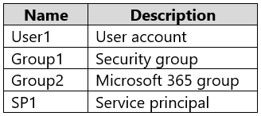

----------------------------------------

## Exam SC-300 topic 4 question 1 discussion

Actual exam question from

Microsoft's
SC-300

Question #: 1
Topic #: 4

[All SC-300 Questions]

HOTSPOT -You have a Microsoft 365 E5 subscription that contains two attribute sets named Set1 and Set2. The subscription contains the users shown in the following table.You have the custom security attributes shown in the following table.You assign User2 the Attribute Definition Administrator role for Set1.For each of the following statements, select Yes if the statement is true. Otherwise, select No.NOTE: Each correct selection is worth one point. 
Suggested Answer: 

**Answer: **

**Timestamp: Jan. 20, 2025, 11:58 a.m.**

[View on ExamTopics](https://www.examtopics.com/discussions/microsoft/view/154980-exam-sc-300-topic-4-question-1-discussion/)

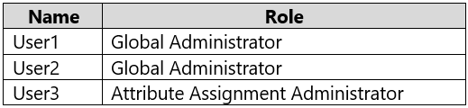
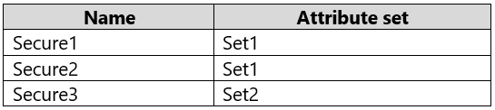
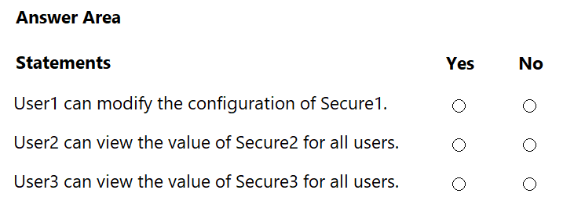
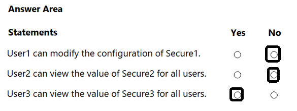

----------------------------------------

## Exam SC-300 topic 4 question 2 discussion

Actual exam question from

Microsoft's
SC-300

Question #: 2
Topic #: 4

[All SC-300 Questions]

You have an Azure Active Directory (Azure AD) tenant that contains the groups shown in the following table.For which groups can you create an access review? 
Suggested Answer: D 🗳️ 

A. Group1 only

B. Group1 and Group4 only

C. Group1 and Group2 only

D. Group1, Group2, Group4, and Group5 only

E. Group1, Group2, Group3, Group4 and Group5

**Answer: D**

**Timestamp: May 16, 2021, 6:20 a.m.**

[View on ExamTopics](https://www.examtopics.com/discussions/microsoft/view/52849-exam-sc-300-topic-4-question-2-discussion/)

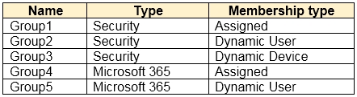

----------------------------------------

## Exam SC-300 topic 4 question 3 discussion

Actual exam question from

Microsoft's
SC-300

Question #: 3
Topic #: 4

[All SC-300 Questions]

You have an Azure Active Directory (Azure AD) tenant that contains the users shown in the following table.User1 is the owner of Group1.You create an access review that has the following settings:✑ Users to review: Members of a group✑ Scope: Everyone✑ Group: Group1✑ Reviewers: Members (self)Which users can perform access reviews for User3? 
Suggested Answer: B 🗳️ 

A. User1, User2, and User3

B. User3 only

C. User1 only

D. User1 and User2 only

**Answer: B**

**Timestamp: May 16, 2021, 6:22 a.m.**

[View on ExamTopics](https://www.examtopics.com/discussions/microsoft/view/52850-exam-sc-300-topic-4-question-3-discussion/)

----------------------------------------

## Exam SC-300 topic 4 question 4 discussion

Actual exam question from

Microsoft's
SC-300

Question #: 4
Topic #: 4

[All SC-300 Questions]

HOTSPOT -You have an Azure Active Directory (Azure AD) tenant that contains Azure AD Privileged Identity Management (PIM) role settings for the User administrator role as shown in the following exhibit.Use the drop-down menus to select the answer choice that completes each statement based on the information presented in the graphic.NOTE: Each correct selection is worth one point.Hot Area: 
Suggested Answer: 

**Answer: **

**Timestamp: May 7, 2021, 12:52 p.m.**

[View on ExamTopics](https://www.examtopics.com/discussions/microsoft/view/52073-exam-sc-300-topic-4-question-4-discussion/)

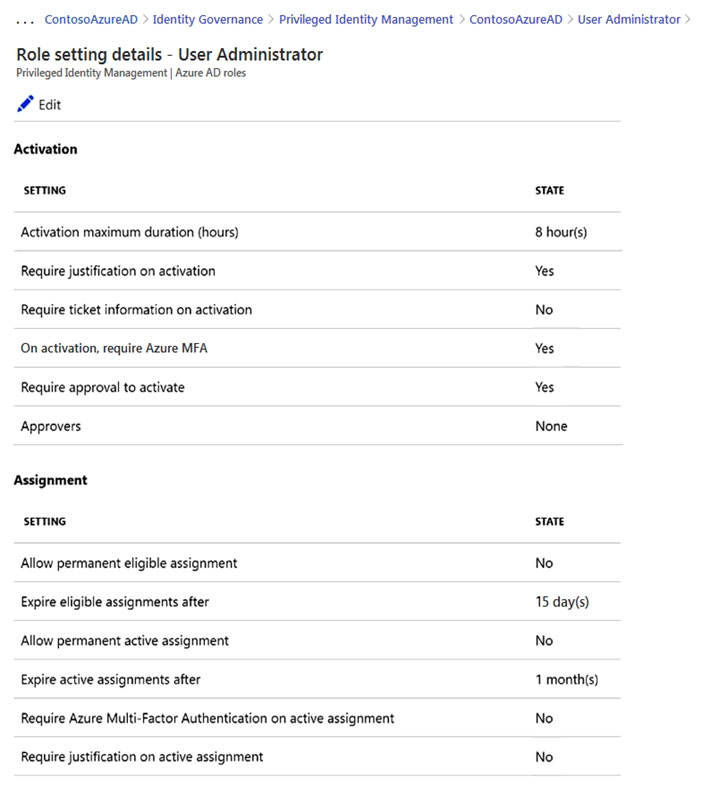
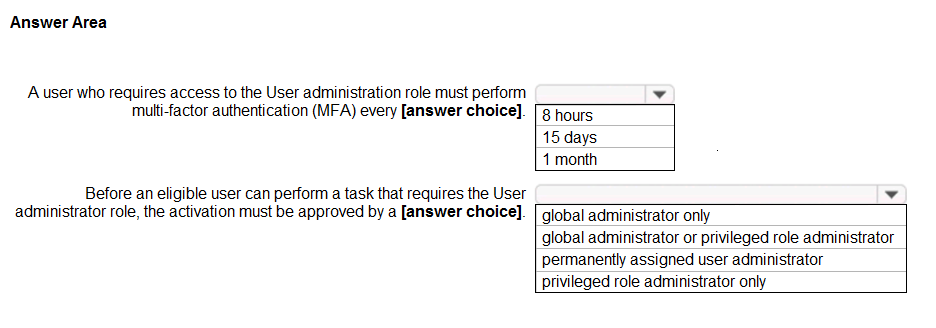
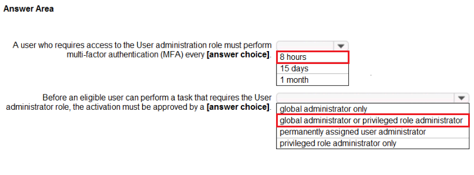

----------------------------------------

## Exam SC-300 topic 4 question 5 discussion

Actual exam question from

Microsoft's
SC-300

Question #: 5
Topic #: 4

[All SC-300 Questions]

HOTSPOT -You have an Azure Active Directory (Azure AD) tenant named contoso.com that contains a user named User1.User1 has the devices shown in the following table.On November 5, 2020, you create and enforce terms of use in contoso.com that has the following settings:✑ Name: Terms1✑ Display name: Contoso terms of use✑ Require users to expand the terms of use: On✑ Require users to consent on every device: On✑ Expire consents: On✑ Expire starting on: December 10, 2020✑ Frequency: MonthlyOn November 15, 2020, User1 accepts Terms1 on Device3.For each of the following statements, select Yes if the statement is true. Otherwise, select No.NOTE: Each correct selection is worth one point.Hot Area: 
Suggested Answer: Box 1: Yes because User1 has not yet accepted the terms on Device1.Box 2: Yes because User1 has not yet accepted the terms on Device2. User1 will be prompted to register the device before the terms can be accepted.Box 3: No because User1 has already accepted the terms on Device3. The terms do not expire until December 10 and then monthly after that. thReference:https://docs.microsoft.com/en-us/azure/active-directory/conditional-access/terms-of-use 

**Answer: **

**Timestamp: May 22, 2021, 6:32 p.m.**

[View on ExamTopics](https://www.examtopics.com/discussions/microsoft/view/53354-exam-sc-300-topic-4-question-5-discussion/)

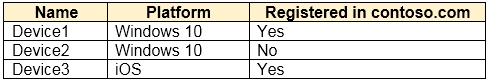
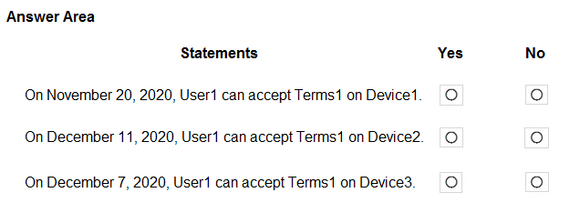
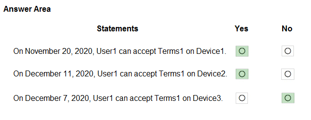

----------------------------------------

## Exam SC-300 topic 4 question 6 discussion

Actual exam question from

Microsoft's
SC-300

Question #: 6
Topic #: 4

[All SC-300 Questions]

Your company recently implemented Azure Active Directory (Azure AD) Privileged Identity Management (PIM).While you review the roles in PIM, you discover that all 15 users in the IT department at the company have permanent security administrator rights.You need to ensure that the IT department users only have access to the Security administrator role when required.What should you configure for the Security administrator role assignment? 
Suggested Answer: D 🗳️ 

A. Expire eligible assignments after from the Role settings details

B. Expire active assignments after from the Role settings details

C. Assignment type to Active

D. Assignment type to Eligible

**Answer: D**

**Timestamp: May 11, 2021, 11:59 a.m.**

[View on ExamTopics](https://www.examtopics.com/discussions/microsoft/view/52404-exam-sc-300-topic-4-question-6-discussion/)

----------------------------------------

## Exam SC-300 topic 4 question 7 discussion

Actual exam question from

Microsoft's
SC-300

Question #: 7
Topic #: 4

[All SC-300 Questions]

You have a Microsoft 365 tenant.The Sign-ins activity report shows that an external contractor signed in to the Exchange admin center.You need to review access to the Exchange admin center at the end of each month and block sign-ins if required.What should you create? 
Suggested Answer: C 🗳️ 

A. an access package that targets users outside your directory

B. an access package that targets users in your directory

C. a group-based access review that targets guest users

D. an application-based access review that targets guest users

**Answer: C**

**Timestamp: May 11, 2021, 12:35 p.m.**

[View on ExamTopics](https://www.examtopics.com/discussions/microsoft/view/52409-exam-sc-300-topic-4-question-7-discussion/)

----------------------------------------

## Exam SC-300 topic 4 question 8 discussion

Actual exam question from

Microsoft's
SC-300

Question #: 8
Topic #: 4

[All SC-300 Questions]

Note: This question is part of a series of questions that present the same scenario. Each question in the series contains a unique solution that might meet the stated goals. Some question sets might have more than one correct solution, while others might not have a correct solution.After you answer a question in this section, you will NOT be able to return to it. As a result, these questions will not appear in the review screen.You have a Microsoft 365 tenant.You have 100 IT administrators who are organized into 10 departments.You create the access review shown in the exhibit. (Click the Exhibit tab.)You discover that all access review requests are received by Megan Bowen.You need to ensure that the manager of each department receives the access reviews of their respective department.Solution: You create a separate access review for each role.Does this meet the goal? 
Suggested Answer: B 🗳️ 

A. Yes

B. No

**Answer: B**

**Timestamp: May 11, 2021, 12:37 p.m.**

[View on ExamTopics](https://www.examtopics.com/discussions/microsoft/view/52410-exam-sc-300-topic-4-question-8-discussion/)

----------------------------------------

## Exam SC-300 topic 4 question 9 discussion

Actual exam question from

Microsoft's
SC-300

Question #: 9
Topic #: 4

[All SC-300 Questions]

Note: This question is part of a series of questions that present the same scenario. Each question in the series contains a unique solution that might meet the stated goals. Some question sets might have more than one correct solution, while others might not have a correct solution.After you answer a question in this section, you will NOT be able to return to it. As a result, these questions will not appear in the review screen.You have a Microsoft 365 tenant.You have 100 IT administrators who are organized into 10 departments.You create the access review shown in the exhibit. (Click the Exhibit tab.)You discover that all access review requests are received by Megan Bowen.You need to ensure that the manager of each department receives the access reviews of their respective department.Solution: You modify the properties of the IT administrator user accounts.Does this meet the goal? 
Suggested Answer: A 🗳️ 

A. Yes

B. No

**Answer: A**

**Timestamp: May 11, 2021, 12:37 p.m.**

[View on ExamTopics](https://www.examtopics.com/discussions/microsoft/view/52411-exam-sc-300-topic-4-question-9-discussion/)

----------------------------------------

## Exam SC-300 topic 4 question 10 discussion

Actual exam question from

Microsoft's
SC-300

Question #: 10
Topic #: 4

[All SC-300 Questions]

Note: This question is part of a series of questions that present the same scenario. Each question in the series contains a unique solution that might meet the stated goals. Some question sets might have more than one correct solution, while others might not have a correct solution.After you answer a question in this section, you will NOT be able to return to it. As a result, these questions will not appear in the review screen.You have a Microsoft 365 tenant.You have 100 IT administrators who are organized into 10 departments.You create the access review shown in the exhibit. (Click the Exhibit tab.)You discover that all access review requests are received by Megan Bowen.You need to ensure that the manager of each department receives the access reviews of their respective department.Solution: You set Reviewers to Member (self).Does this meet the goal? 
Suggested Answer: B 🗳️ 

A. Yes

B. No

**Answer: B**

**Timestamp: May 11, 2021, 12:37 p.m.**

[View on ExamTopics](https://www.examtopics.com/discussions/microsoft/view/52412-exam-sc-300-topic-4-question-10-discussion/)

----------------------------------------

## Exam SC-300 topic 4 question 11 discussion

Actual exam question from

Microsoft's
SC-300

Question #: 11
Topic #: 4

[All SC-300 Questions]

You have a Microsoft 365 tenant.The Azure Active Directory (Azure AD) tenant syncs to an on-premises Active Directory domain.You plan to create an emergency-access administrative account named Emergency1. Emergency1 will be assigned the Global administrator role in Azure AD.Emergency1 will be used in the event of Azure AD functionality failures and on-premises infrastructure failures.You need to reduce the likelihood that Emergency1 will be prevented from signing in during an emergency.What should you do? 
Suggested Answer: A 🗳️ 

A. Configure Azure Monitor to generate an alert if Emergency1 is modified or signs in.

B. Require Azure AD Privileged Identity Management (PIM) activation of the Global administrator role for Emergency1.

C. Configure a conditional access policy to restrict sign-in locations for Emergency1 to only the corporate network.

D. Configure a conditional access policy to require multi-factor authentication (MFA) for Emergency1.

**Answer: A**

**Timestamp: May 16, 2021, 6:06 a.m.**

[View on ExamTopics](https://www.examtopics.com/discussions/microsoft/view/52848-exam-sc-300-topic-4-question-11-discussion/)

----------------------------------------

## Exam SC-300 topic 4 question 12 discussion

Actual exam question from

Microsoft's
SC-300

Question #: 12
Topic #: 4

[All SC-300 Questions]

You have an Azure Active Directory (Azure AD) tenant named contoso.com.You implement entitlement management to provide resource access to users at a company named Fabrikam, Inc. Fabrikam uses a domain named fabrikam.com.Fabrikam users must be removed automatically from the tenant when access is no longer required.You need to configure the following settings:✑ Block external user from signing in to this directory: No✑ Remove external user: Yes✑ Number of days before removing external user from this directory: 90What should you configure on the Identity Governance blade? 
Suggested Answer: B 🗳️ 

A. Access packages

B. Entitlement management settings

C. Terms of use

D. Access reviews settings

**Answer: B**

**Timestamp: May 16, 2022, 2:10 p.m.**

[View on ExamTopics](https://www.examtopics.com/discussions/microsoft/view/75688-exam-sc-300-topic-4-question-12-discussion/)

----------------------------------------

## Exam SC-300 topic 4 question 13 discussion

Actual exam question from

Microsoft's
SC-300

Question #: 13
Topic #: 4

[All SC-300 Questions]

You have an Azure Active Directory (Azure AD) P1 tenant.You need to review the Azure AD sign-in logs to investigate sign-ins that occurred in the past.For how long does Azure AD store events in the sign-in logs? 
Suggested Answer: B 🗳️ 

A. 14 days

B. 30 days

C. 90 days

D. 365 days

**Answer: B**

**Timestamp: June 3, 2021, 8:33 p.m.**

[View on ExamTopics](https://www.examtopics.com/discussions/microsoft/view/54442-exam-sc-300-topic-4-question-13-discussion/)

----------------------------------------

## Exam SC-300 topic 4 question 14 discussion

Actual exam question from

Microsoft's
SC-300

Question #: 14
Topic #: 4

[All SC-300 Questions]

You have an Azure subscription that contains the resources shown in the following table.For which resources can you create an access review? 
Suggested Answer: C 🗳️ 

A. Group1, Role1, and Contributor only

B. Group1 only

C. Group1, App1, Contributor, and Role1

D. Role1 and Contributor only

**Answer: C**

**Timestamp: June 13, 2021, 10:04 a.m.**

[View on ExamTopics](https://www.examtopics.com/discussions/microsoft/view/55229-exam-sc-300-topic-4-question-14-discussion/)

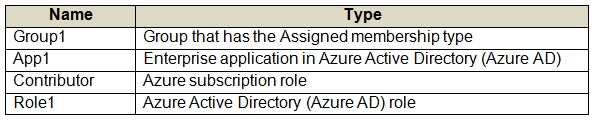

----------------------------------------

## Exam SC-300 topic 4 question 15 discussion

Actual exam question from

Microsoft's
SC-300

Question #: 15
Topic #: 4

[All SC-300 Questions]

You have an Azure Active Directory (Azure AD) tenant that uses conditional access policies.You plan to use third-party security information and event management (SIEM) to analyze conditional access usage.You need to download the Azure AD log by using the administrative portal. The log file must contain changes to conditional access policies.What should you export from Azure AD? 
Suggested Answer: C 🗳️ 

A. audit logs in CSV format

B. sign-ins in CSV format

C. audit logs in JSON format

D. sign-ins in JSON format

**Answer: C**

**Timestamp: June 3, 2021, 8:35 p.m.**

[View on ExamTopics](https://www.examtopics.com/discussions/microsoft/view/54443-exam-sc-300-topic-4-question-15-discussion/)

----------------------------------------

## Exam SC-300 topic 4 question 16 discussion

Actual exam question from

Microsoft's
SC-300

Question #: 16
Topic #: 4

[All SC-300 Questions]

Note: This question is part of a series of questions that present the same scenario. Each question in the series contains a unique solution that might meet the stated goals. Some question sets might have more than one correct solution, while others might not have a correct solution.After you answer a question in this section, you will NOT be able to return to it. As a result, these questions will not appear in the review screen.You have a Microsoft 365 tenant.You have 100 IT administrators who are organized into 10 departments.You create the access review shown in the exhibit. (Click the Exhibit tab.)You discover that all access review requests are received by Megan Bowen.You need to ensure that the manager of each department receives the access reviews of their respective department.Solution: You add each manager as a fallback reviewer.Does this meet the goal? 
Suggested Answer: B 🗳️ 

A. Yes

B. No

**Answer: B**

**Timestamp: June 9, 2021, 11:25 a.m.**

[View on ExamTopics](https://www.examtopics.com/discussions/microsoft/view/54960-exam-sc-300-topic-4-question-16-discussion/)

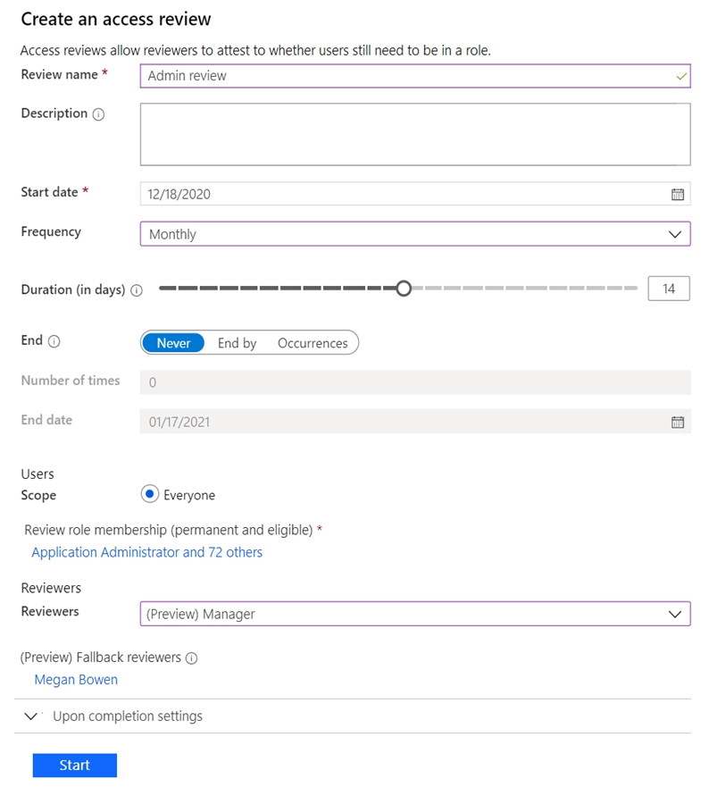

----------------------------------------

## Exam SC-300 topic 4 question 17 discussion

Actual exam question from

Microsoft's
SC-300

Question #: 17
Topic #: 4

[All SC-300 Questions]

You have an Azure Active Directory (Azure AD) tenant that contains the objects shown in the following table.Which objects can you add as eligible in Azure AD Privileged Identity Management (PIM) for an Azure AD role? 
Suggested Answer: B 🗳️ 

A. User1, Guest1, and Identity1

B. User1 and Guest1 only

C. User1 only

D. User1 and Identity1 only

**Answer: B**

**Timestamp: Sept. 23, 2021, 2:32 a.m.**

[View on ExamTopics](https://www.examtopics.com/discussions/microsoft/view/62583-exam-sc-300-topic-4-question-17-discussion/)

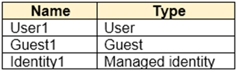

----------------------------------------

## Exam SC-300 topic 4 question 18 discussion

Actual exam question from

Microsoft's
SC-300

Question #: 18
Topic #: 4

[All SC-300 Questions]

HOTSPOT -You have an Azure Active Directory (Azure AD) tenant that contains the following group:✑ Name: Group1✑ Members: User1, User2✑ Owner: User3On January 15, 2021, you create an access review as shown in the exhibit. (Click the Exhibit tab.)Users answer the Review1 question as shown in the following table.For each of the following statements, select Yes if the statement is true. Otherwise, select No.NOTE: Each correct selection is worth one point.Hot Area: 
Suggested Answer: 

**Answer: **

**Timestamp: Sept. 7, 2021, 11:21 a.m.**

[View on ExamTopics](https://www.examtopics.com/discussions/microsoft/view/61662-exam-sc-300-topic-4-question-18-discussion/)

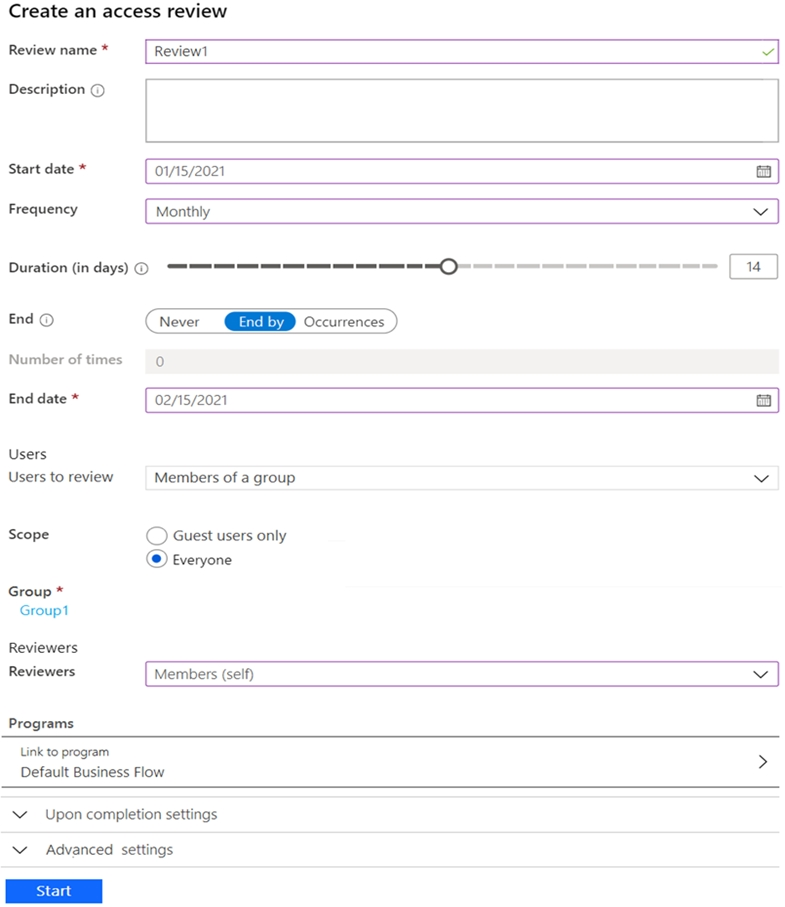
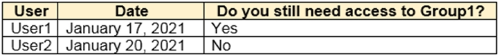
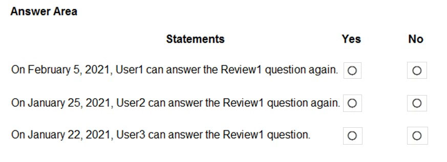
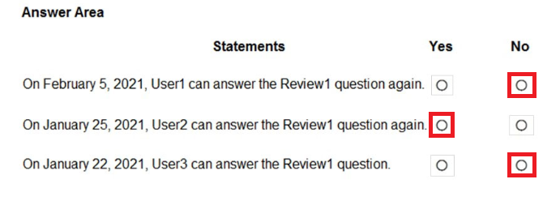

----------------------------------------

## Exam SC-300 topic 4 question 19 discussion

Actual exam question from

Microsoft's
SC-300

Question #: 19
Topic #: 4

[All SC-300 Questions]

HOTSPOT -Your company has an Azure Active Directory (Azure AD) tenant named contoso.com. The company has a business partner named Fabrikam, Inc.Fabrikam uses Azure AD and has two verified domain names of fabrikam.com and litwareinc.com. Both domain names are used for Fabrikam email addresses.You plan to create an access package named package1 that will be accessible only to the users at Fabrikam.You create a connected organization for Fabrikam.You need to ensure that the package1 will be accessible only to users who have fabrikam.com email addresses.What should you do? To answer, select the appropriate options in the answer area.NOTE: Each correct selection is worth one point.Hot Area: 
Suggested Answer: Reference:https://docs.microsoft.com/en-us/azure/active-directory/governance/entitlement-management-access-package-request-policy https://docs.microsoft.com/en-us/azure/active-directory/governance/entitlement-management-access-package-create 

**Answer: **

**Timestamp: Jan. 6, 2022, 6:30 a.m.**

[View on ExamTopics](https://www.examtopics.com/discussions/microsoft/view/69565-exam-sc-300-topic-4-question-19-discussion/)

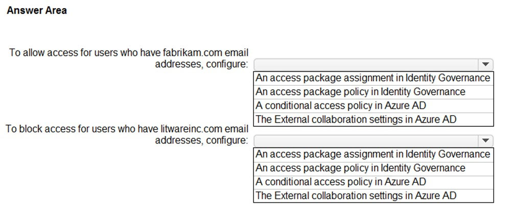
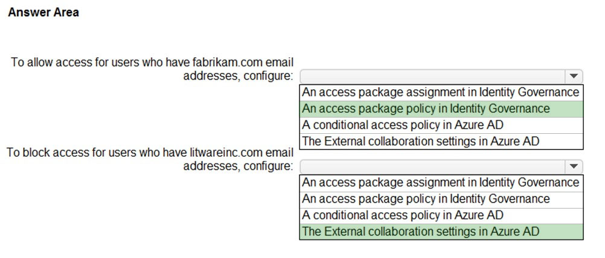

----------------------------------------

## Exam SC-300 topic 4 question 20 discussion

Actual exam question from

Microsoft's
SC-300

Question #: 20
Topic #: 4

[All SC-300 Questions]

You have an Azure Active Directory (Azure AD) tenant named contoso.com that has Azure AD Identity Protection policies enforced.You create an Azure Sentinel instance and configure the Azure Active Directory connector.You need to ensure that Azure Sentinel can generate incidents based on the risk alerts raised by Azure AD Identity Protection.What should you do first? 
Suggested Answer: A 🗳️ 

A. Add a Microsoft Sentinel data connector.

B. Configure the Notify settings in Azure AD Identity Protection.

C. Create a Microsoft Sentinel playbook.

D. Modify the Diagnostics settings in Azure AD.

**Answer: A**

**Timestamp: Sept. 12, 2022, 8:04 p.m.**

[View on ExamTopics](https://www.examtopics.com/discussions/microsoft/view/81866-exam-sc-300-topic-4-question-20-discussion/)

----------------------------------------

## Exam SC-300 topic 4 question 21 discussion

Actual exam question from

Microsoft's
SC-300

Question #: 21
Topic #: 4

[All SC-300 Questions]

Note: This question is part of a series of questions that present the same scenario. Each question in the series contains a unique solution that might meet the stated goals. Some question sets might have more than one correct solution, while others might not have a correct solution.After you answer a question in this section, you will NOT be able to return to it. As a result, these questions will not appear in the review screen.You use Azure Monitor to analyze Azure Active Directory (Azure AD) activity logs.You receive more than 100 email alerts each day for failed Azure AD user sign-in attempts.You need to ensure that a new security administrator receives the alerts instead of you.Solution: From Azure AD, you create an assignment for the Insights administrator role.Does this meet the goal? 
Suggested Answer: B 🗳️ 

A. Yes

B. No

**Answer: B**

**Timestamp: Aug. 28, 2022, 8:26 p.m.**

[View on ExamTopics](https://www.examtopics.com/discussions/microsoft/view/78311-exam-sc-300-topic-4-question-21-discussion/)

----------------------------------------

## Exam SC-300 topic 4 question 22 discussion

Actual exam question from

Microsoft's
SC-300

Question #: 22
Topic #: 4

[All SC-300 Questions]

Note: This question is part of a series of questions that present the same scenario. Each question in the series contains a unique solution that might meet the stated goals. Some question sets might have more than one correct solution, while others might not have a correct solution.After you answer a question in this section, you will NOT be able to return to it. As a result, these questions will not appear in the review screen.You use Azure Monitor to analyze Azure Active Directory (Azure AD) activity logs.You receive more than 100 email alerts each day for failed Azure AD user sign-in attempts.You need to ensure that a new security administrator receives the alerts instead of you.Solution: From Azure AD, you modify the Diagnostics settings.Does this meet the goal? 
Suggested Answer: B 🗳️ 

A. Yes

B. No

**Answer: B**

**Timestamp: June 9, 2022, 2:46 a.m.**

[View on ExamTopics](https://www.examtopics.com/discussions/microsoft/view/76673-exam-sc-300-topic-4-question-22-discussion/)

----------------------------------------

## Exam SC-300 topic 4 question 23 discussion

Actual exam question from

Microsoft's
SC-300

Question #: 23
Topic #: 4

[All SC-300 Questions]

Note: This question is part of a series of questions that present the same scenario. Each question in the series contains a unique solution that might meet the stated goals. Some question sets might have more than one correct solution, while others might not have a correct solution.After you answer a question in this section, you will NOT be able to return to it. As a result, these questions will not appear in the review screen.You use Azure Monitor to analyze Azure Active Directory (Azure AD) activity logs.You receive more than 100 email alerts each day for failed Azure AD user sign-in attempts.You need to ensure that a new security administrator receives the alerts instead of you.Solution: From Azure Monitor, you create a data collection rule.Does this meet the goal? 
Suggested Answer: B 🗳️ 

A. Yes

B. No

**Answer: B**

**Timestamp: Sept. 27, 2022, 9:54 a.m.**

[View on ExamTopics](https://www.examtopics.com/discussions/microsoft/view/83760-exam-sc-300-topic-4-question-23-discussion/)

----------------------------------------

## Exam SC-300 topic 4 question 24 discussion

Actual exam question from

Microsoft's
SC-300

Question #: 24
Topic #: 4

[All SC-300 Questions]

You have an Azure Active Directory Premium P2 tenant.You create a Log Analytics workspace.You need to ensure that you can view Azure Active Directory (Azure AD) audit log information by using Azure Monitor.What should you do first? 
Suggested Answer: C 🗳️ 

A. Run the Set-AzureADTenantDetail cmdlet.

B. Create an Azure AD workbook.

C. Modify the Diagnostics settings for Azure AD.

D. Run the Get-AzureADAuditDirectoryLogs cmdlet.

**Answer: C**

**Timestamp: May 15, 2022, 7:22 a.m.**

[View on ExamTopics](https://www.examtopics.com/discussions/microsoft/view/75641-exam-sc-300-topic-4-question-24-discussion/)

----------------------------------------

## Exam SC-300 topic 4 question 25 discussion

Actual exam question from

Microsoft's
SC-300

Question #: 25
Topic #: 4

[All SC-300 Questions]

HOTSPOT -You have an Azure Active Directory (Azure AD) tenant contains the users shown in the following table.In Azure AD Privileged Identity Management (PIM), you configure the Global administrator role as shown in the following exhibit.User1 is eligible for the Global administrator role.For each of the following statements, select Yes if the statement is true. Otherwise, select No.NOTE: Each correct selection is worth one point.Hot Area: 
Suggested Answer: Box 1: Yes -MFA is required on activation -Box 2: No -The Privileged Authentication Administrator can set or reset any authentication method for any user, including Global Administrators.The Privileged Role Administrator can manage role assignments, including the Global Administrator role, in Azure Active Directory, as well as within Azure ADPrivileged Identity Management. In addition, this role allows management of all aspects of Privileged Identity Management and administrative units.Box 3: No -The Privileged Authentication Administrator can set or reset any authentication method for any user, including Global Administrators.The Privileged Role Administrator can manage role assignments, including the Global Administrator role, in Azure Active Directory, as well as within Azure ADPrivileged Identity Management. In addition, this role allows management of all aspects of Privileged Identity Management and administrative units. 

**Answer: **

**Timestamp: Sept. 14, 2022, 8:18 a.m.**

[View on ExamTopics](https://www.examtopics.com/discussions/microsoft/view/82092-exam-sc-300-topic-4-question-25-discussion/)

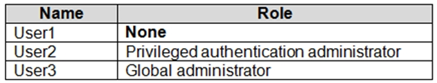
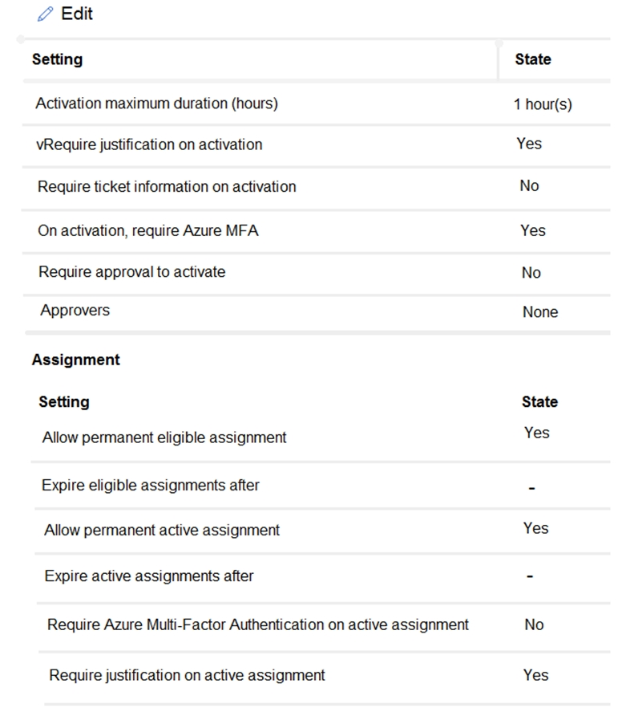
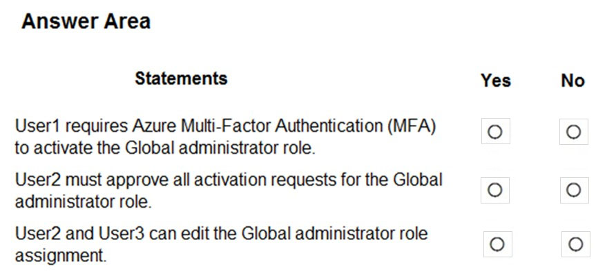
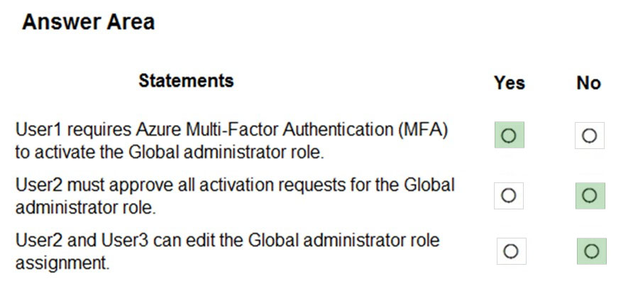

----------------------------------------

## Exam SC-300 topic 4 question 26 discussion

Actual exam question from

Microsoft's
SC-300

Question #: 26
Topic #: 4

[All SC-300 Questions]

You have a Microsoft 365 subscription that contains the following:✑ An Azure Active Directory (Azure AD) tenant that has an Azure Active Directory Premium P2 license✑ A Microsoft SharePoint Online site named Site1✑ A Microsoft Teams team named Team1You need to create an entitlement management workflow to manage Site1 and Team1.What should you do first? 
Suggested Answer: D 🗳️ 

A. Configure an app registration.

B. Create an Administrative unit.

C. Create an access package.

D. Create a catalog.

**Answer: D**

**Timestamp: Sept. 1, 2022, 6:31 a.m.**

[View on ExamTopics](https://www.examtopics.com/discussions/microsoft/view/78902-exam-sc-300-topic-4-question-26-discussion/)

----------------------------------------

## Exam SC-300 topic 4 question 27 discussion

Actual exam question from

Microsoft's
SC-300

Question #: 27
Topic #: 4

[All SC-300 Questions]

Note: This question is part of a series of questions that present the same scenario. Each question in the series contains a unique solution that might meet the stated goals. Some question sets might have more than one correct solution, while others might not have a correct solution.After you answer a question in this section, you will NOT be able to return to it. As a result, these questions will not appear in the review screen.You use Azure Monitor to analyze Azure Active Directory (Azure AD) activity logs.You receive more than 100 email alerts each day for failed Azure AD user sign-in attempts.You need to ensure that a new security administrator receives the alerts instead of you.Solution: From Azure Monitor, you modify the action group.Does this meet the goal? 
Suggested Answer: A 🗳️ 

A. Yes

B. No

**Answer: A**

**Timestamp: Sept. 2, 2022, 1:41 p.m.**

[View on ExamTopics](https://www.examtopics.com/discussions/microsoft/view/79385-exam-sc-300-topic-4-question-27-discussion/)

----------------------------------------

## Exam SC-300 topic 4 question 28 discussion

Actual exam question from

Microsoft's
SC-300

Question #: 28
Topic #: 4

[All SC-300 Questions]

HOTSPOT -Your network contains an on-premises Active Directory domain that syncs to an Azure Active Directory (Azure AD) tenant.The tenant contains the groups shown in the following table.The tenant contains the users shown in the following table.You create an access review as shown in the following table.For each of the following statements, select Yes if the statement is true. Otherwise, select No.NOTE: Each correct selection is worth one point.Hot Area: 
Suggested Answer: 

**Answer: **

**Timestamp: Sept. 12, 2022, 4:49 p.m.**

[View on ExamTopics](https://www.examtopics.com/discussions/microsoft/view/81830-exam-sc-300-topic-4-question-28-discussion/)

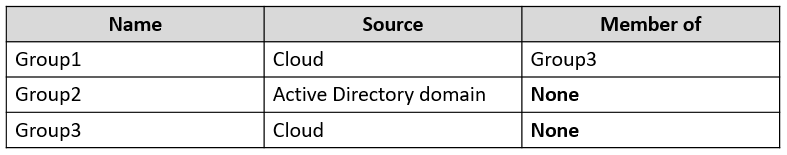
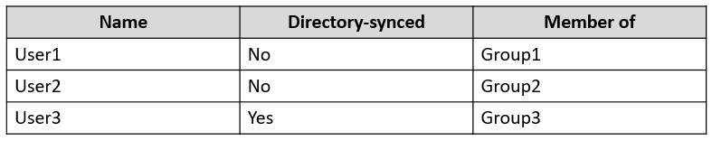
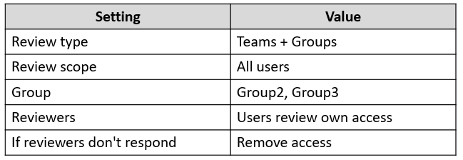
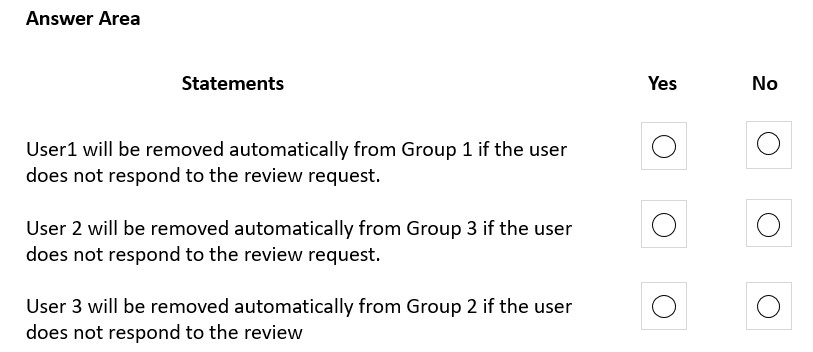
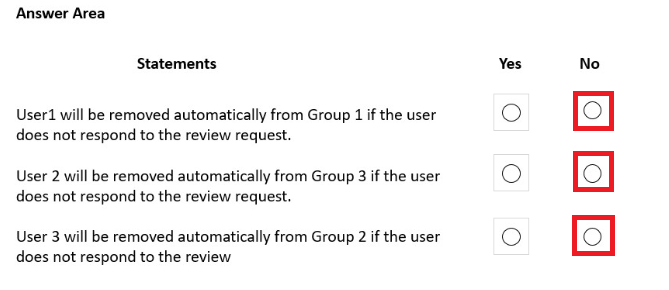

----------------------------------------

## Exam SC-300 topic 4 question 29 discussion

Actual exam question from

Microsoft's
SC-300

Question #: 29
Topic #: 4

[All SC-300 Questions]

You have a Microsoft 365 E5 subscription that contains a web app named App1.Guest users are regularly granted access to App1.You need to ensure that the guest users that have NOT accessed App1 during the past 30 days have their access removed. The solution must minimize administrative effort.What should you configure? 
Suggested Answer: D 🗳️ 

A. a Conditional Access policy

B. a compliance policy

C. a guest access review

D. an access review for application access

**Answer: D**

**Timestamp: Sept. 29, 2022, 2:32 p.m.**

[View on ExamTopics](https://www.examtopics.com/discussions/microsoft/view/84023-exam-sc-300-topic-4-question-29-discussion/)

----------------------------------------

## Exam SC-300 topic 4 question 30 discussion

Actual exam question from

Microsoft's
SC-300

Question #: 30
Topic #: 4

[All SC-300 Questions]

HOTSPOT -You have an Azure Active Directory (Azure AD) ten-ant: that contains the groups shown in the following table.You create an access review for Group1 as shown in the following table.You create an access review for Group2 as shown in the following table.What is the minimum member of Azure Active Directory Premium P2 licenses required for each group? To answer, select the appropriate, options in the answer area.NOTE: Each correct selection is worth one point.Hot Area: 
Suggested Answer: Box 1: 525 -For Group1:Review scope: All Users, Reviewers: Users review own accessNote: How many licenses must you have?Your directory needs at least as many Azure AD Premium P2 licenses as the number of employees who will be performing the following tasks:Member users who are assigned as reviewersMember users who perform a self-reviewMember users as group owners who perform an access reviewMember users as application owners who perform an access reviewFor guest users, licensing needs will depend on the licensing model you're using. However, the below guest users' activities are considered Azure AD PremiumP2 usage:Guest users who are assigned as reviewersGuest users who perform a self-reviewGuest users as group owners who perform an access reviewGuest users as application owners who perform an access reviewBox 2: 1 -For Group2:Review scope: Guest users only. Reviewers: Group Owner.Reference:https://docs.microsoft.com/en-us/azure/active-directory/governance/access-reviews-overview#license-requirements 

**Answer: **

**Timestamp: Oct. 12, 2022, 3:47 p.m.**

[View on ExamTopics](https://www.examtopics.com/discussions/microsoft/view/85295-exam-sc-300-topic-4-question-30-discussion/)

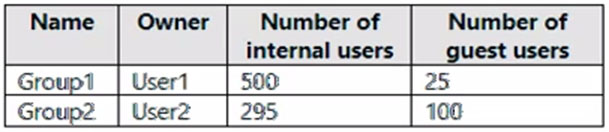
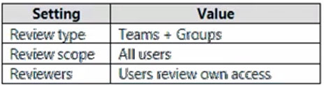
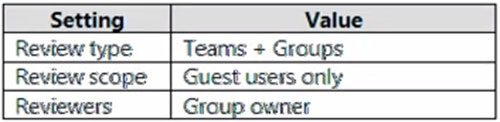
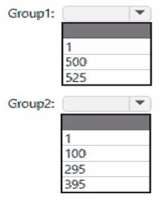
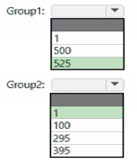

----------------------------------------

## Exam SC-300 topic 4 question 31 discussion

Actual exam question from

Microsoft's
SC-300

Question #: 31
Topic #: 4

[All SC-300 Questions]

HOTSPOT -You have an Azure Active Directory (Azure AD) tenant named contoso.com that contains a group named All Company and has the following Identity Governance settings:✑ Block external users from signing in to this directory: Yes✑ Remove external user. Yes✑ Number of days before removing external user from this directory: 30On March 11, 2.022, you create an access package named Package1 that has the following settings:✑ Resource rales1. Name: All Company2. Type: Group and Team3. Role: Member✑ Lifecycle1. Access package assignment expire: On date2. Assignment expiration date: April 1, 2022On March 1, 2022, you assign Package1 to the guest users shown in the following table.On March 2, 2022, you assign the Reports reader role to Guest1.On April 1, 2022, you invite a guest user named Guest3 to contoso.com.On April 4, 2022, you add Guest3 to the All Company group.For each of the following statements, select Yes if the statement is true. Otherwise, select No.NOTE: Each correct selection is worth one point.Hot Area: 
Suggested Answer: Box 1: No -On March 2, 2022, you assign the Reports reader role to Guest1.On April 1 the access package assignment expires. After another 30 days, well before May 5, the guest user account is removed.Box 2: No -On April 1 the access package assignment expires. After another 30 days, well before May 5, the guest user account is removed.Box 3: Yes -Note: Lifecycle -On the Lifecycle tab, you specify when a user's assignment to the access package expires. You can also specify whether users can extend their assignments.In the Expiration section, set Access package assignments expires to On date, Number of days, Number of hours, or Never.For On date, select an expiration date in the future.For Number of days, specify a number between 0 and 3660 days.For Number of hours, specify a number of hours.Based on your selection, a user's assignment to the access package expires on a certain date, a certain number of days after they are approved, or never.Note 2: By default, when an external user no longer has any access package assignments, they are blocked from signing in to your directory. After 30 days, their guest user account is removed from your directory.Reference:https://docs.microsoft.com/en-us/azure/active-directory/governance/entitlement-management-access-package-lifecycle-policy https://docs.microsoft.com/en-us/azure/active-directory/governance/entitlement-management-external-users 

**Answer: **

**Timestamp: Sept. 7, 2022, 3:37 p.m.**

[View on ExamTopics](https://www.examtopics.com/discussions/microsoft/view/80923-exam-sc-300-topic-4-question-31-discussion/)

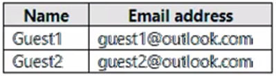
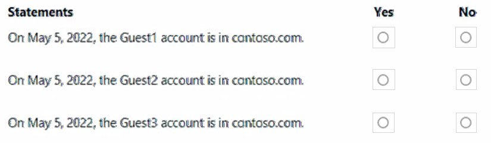
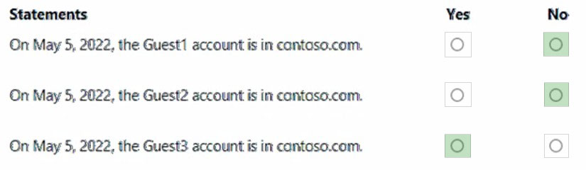

----------------------------------------

## Exam SC-300 topic 4 question 32 discussion

Actual exam question from

Microsoft's
SC-300

Question #: 32
Topic #: 4

[All SC-300 Questions]

You have an Azure Active Directory (Azure AD) tenant named Contoso that contains a terms of use (Toll) named Terms1 and an access package. Contoso users collaborate with an external organization named Fabrikam. Fabrikam users must accept Terms1 before being allowed to use the access package.You need to identify which users accepted or declined Terms1.What should you use? 
Suggested Answer: D 🗳️ 

A. sign-in logs

B. the Usage and Insights report

C. provisioning logs

D. audit logs

**Answer: D**

**Timestamp: Oct. 6, 2022, 1:48 p.m.**

[View on ExamTopics](https://www.examtopics.com/discussions/microsoft/view/84487-exam-sc-300-topic-4-question-32-discussion/)

----------------------------------------

## Exam SC-300 topic 4 question 33 discussion

Actual exam question from

Microsoft's
SC-300

Question #: 33
Topic #: 4

[All SC-300 Questions]

You have an Azure Active Directory (Azure AD) tenant that contains the users shown in the following table.User1 is the owner of Group1.You create an access review that has the following settings:✑ What to review: Teams + Groups✑ Scope: All users✑ Group: Group1✑ Reviewers: Users review their own accessWhich users can perform access reviews for User3? 
Suggested Answer: B 🗳️ 

A. User1 only

B. User3 only

C. User1 and User2 only

D. User1, User2, and User3

**Answer: B**

**Timestamp: Sept. 4, 2022, 2:55 p.m.**

[View on ExamTopics](https://www.examtopics.com/discussions/microsoft/view/80085-exam-sc-300-topic-4-question-33-discussion/)

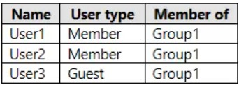

----------------------------------------

## Exam SC-300 topic 4 question 34 discussion

Actual exam question from

Microsoft's
SC-300

Question #: 34
Topic #: 4

[All SC-300 Questions]

HOTSPOT -You have an Azure Active Directory (Azure AD) tenant that contains three users named User1, User2, and User3.You create a group named Group1. You add User2 and User3 to Group1.You configure a role in Azure AD Privileged Identity Management (PIM) as shown in the Application Administrator exhibit. (Click the Application Administrator tab.)Group1 is configured as the approver for the Application administrator role.You configure User2 to be eligible for the Application administrator role.For User1 you add an assignment to the Application administrator role as shown in the Assignment exhibit. (Click the Assignment tab.)For each of the following statements, select Yes if the statement is true. Otherwise, select No.NOTE: Each correct selection is worth one point.Hot Area: 
Suggested Answer: 

**Answer: **

**Timestamp: Sept. 1, 2022, 6:35 a.m.**

[View on ExamTopics](https://www.examtopics.com/discussions/microsoft/view/78904-exam-sc-300-topic-4-question-34-discussion/)

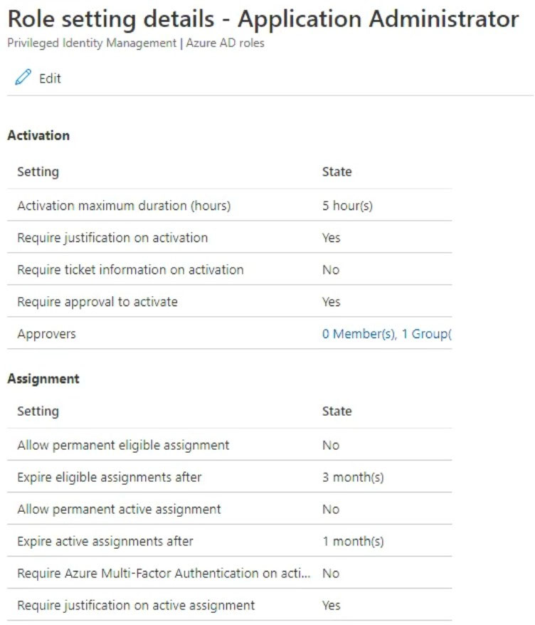
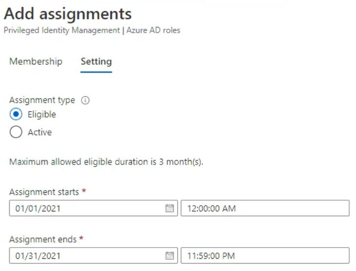
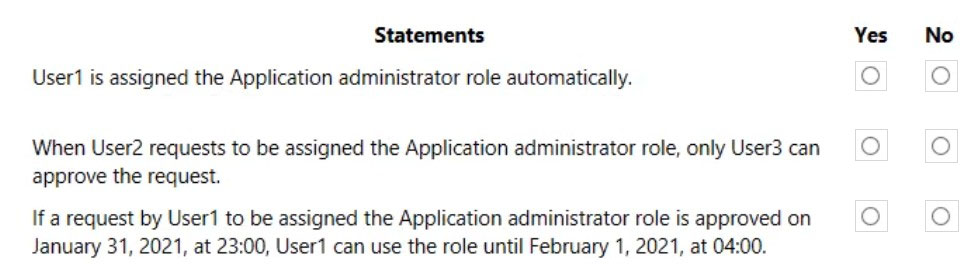
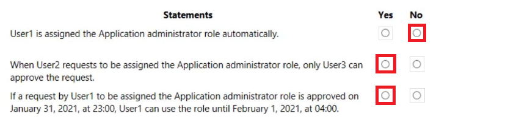

----------------------------------------

## Exam SC-300 topic 4 question 35 discussion

Actual exam question from

Microsoft's
SC-300

Question #: 35
Topic #: 4

[All SC-300 Questions]

HOTSPOT -You have a Microsoft 365 E5 subscription.You create an access review for Azure Active Directory (Azure AD) roles.You need to ensure that users who do not respond to review requests are removed automatically from the roles. The solution must minimize administrative effort.Which two settings should you modify? To answer, select the settings in the answer area.NOTE: Each correct selection is worth one point.Hot Area: 
Suggested Answer: Box 1: Reviewers, Members (self)Reviewers for guest users can be:Specified reviewers: Certain users within your organizationGroup owners: Office 365 Group owners that also includes TeamsSelf-review: Guest users can review access on their ownBox 2: If reviewers don't respond, No ChangeIf reviewers don't respond (within the configured review period):No change: Leave user's access unchangedRemove access: Remove user's accessApprove access: Approve user's accessTake recommendations: Take the system's recommendation on denying or approving the user's continued accessReference:https://blog.quadrotech-it.com/blog/how-to-manage-guest-access-in-azure-active-directory-pt-1/ 

**Answer: **

**Timestamp: Sept. 1, 2022, 6:38 a.m.**

[View on ExamTopics](https://www.examtopics.com/discussions/microsoft/view/78905-exam-sc-300-topic-4-question-35-discussion/)

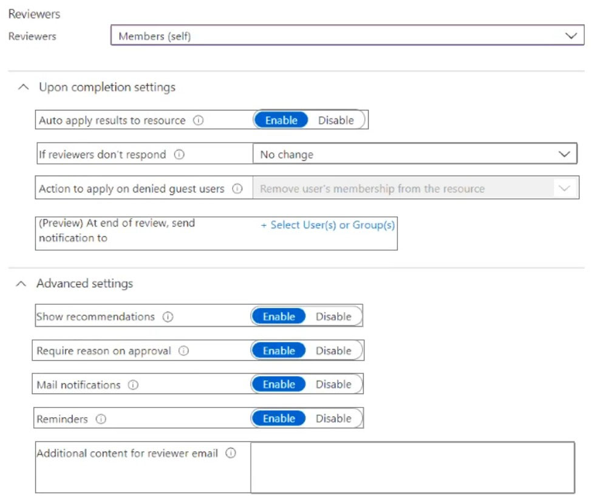
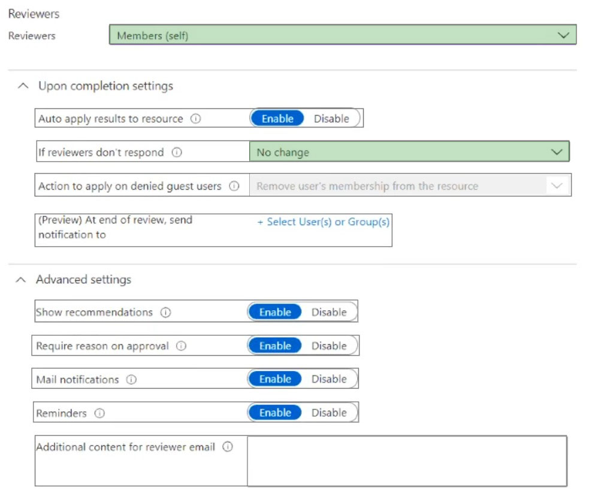

----------------------------------------

## Exam SC-300 topic 4 question 36 discussion

Actual exam question from

Microsoft's
SC-300

Question #: 36
Topic #: 4

[All SC-300 Questions]

HOTSPOT -You have an Azure Active Directory (Azure AD) tenant that contains a user named User1.An administrator deletes User1.You need to identify the following:• How many days after the account of User1 is deleted can you restore the account?• Which is the least privileged role that can be used to restore User1?What should you identify? To answer, select the appropriate options in the answer area.NOTE: Each correct selection is worth one point. 
Suggested Answer: 

**Answer: **

**Timestamp: Jan. 19, 2023, 2:40 p.m.**

[View on ExamTopics](https://www.examtopics.com/discussions/microsoft/view/96000-exam-sc-300-topic-4-question-36-discussion/)

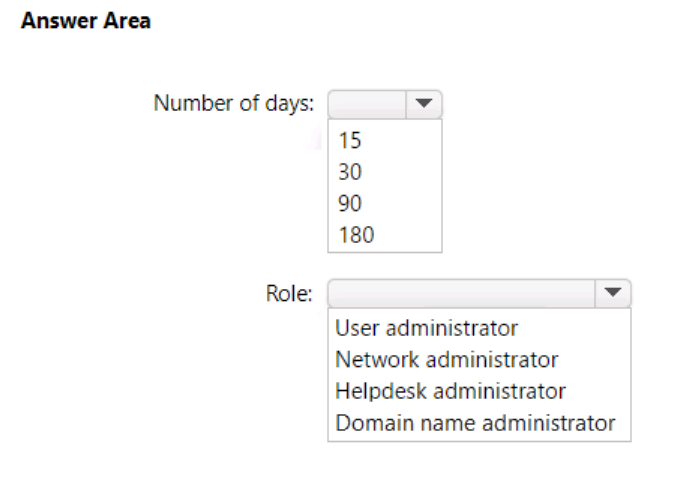
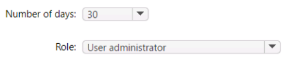

----------------------------------------

## Exam SC-300 topic 4 question 37 discussion

Actual exam question from

Microsoft's
SC-300

Question #: 37
Topic #: 4

[All SC-300 Questions]

HOTSPOT -You have an Azure AD tenant that contains the groups shown in the following exhibit.Use the drop-down menus to select the answer choice that completes each statement based on the information presented in the graphic.NOTE: Each correct selection is worth one point. 
Suggested Answer: 

**Answer: **

**Timestamp: Jan. 19, 2023, 2:47 p.m.**

[View on ExamTopics](https://www.examtopics.com/discussions/microsoft/view/96001-exam-sc-300-topic-4-question-37-discussion/)

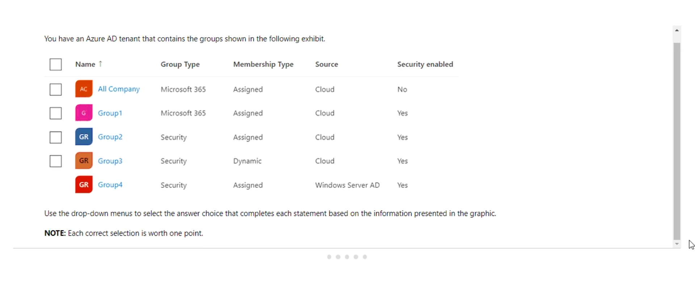
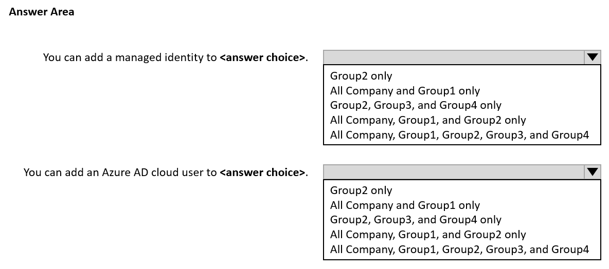
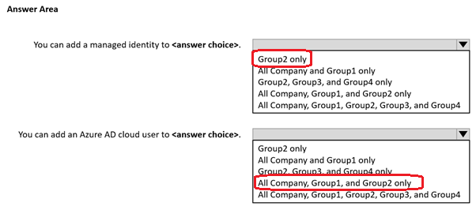

----------------------------------------

## Exam SC-300 topic 4 question 38 discussion

Actual exam question from

Microsoft's
SC-300

Question #: 38
Topic #: 4

[All SC-300 Questions]

You have an Azure AD tenant that contains two users named User1 and User2.You plan to perform the following actions:• Create a group named Group1.• Add User1 and User2 to Group1.• Assign Azure AD roles to Group1.You need to create Group1.Which two settings can you use? Each correct answer presents a complete solution.NOTE: Each correct selection is worth one point. 
Suggested Answer: AB 🗳️ 

A. Group type: Microsoft 365 -Membership type: Assigned

B. Group type: Security -Membership type: Assigned

C. Group type: Security -Membership type: Dynamic User

D. Group type: Microsoft 365 -Membership type: Dynamic User

E. Group type: Security -Membership type: Dynamic Device

**Answer: A**

**Timestamp: Jan. 19, 2023, 2:54 p.m.**

[View on ExamTopics](https://www.examtopics.com/discussions/microsoft/view/96003-exam-sc-300-topic-4-question-38-discussion/)

----------------------------------------

## Exam SC-300 topic 4 question 39 discussion

Actual exam question from

Microsoft's
SC-300

Question #: 39
Topic #: 4

[All SC-300 Questions]

DRAG DROP -You have a Microsoft 365 E5 subscription.You need to perform the following tasks:• Identify the locations and IP addresses used by Azure AD users to sign in.• Review the Azure AD security settings and identify improvement recommendations.• Identify changes to Azure AD users or service principals.What should you use for each task? To answer, drag the appropriate resources to the correct requirements. Each resource may be used once, more than once, or not at all. You may need to drag the split bar between panes or scroll to view content.NOTE: Each correct selection is worth one point. 
Suggested Answer: 

**Answer: **

**Timestamp: Jan. 19, 2023, 3:03 p.m.**

[View on ExamTopics](https://www.examtopics.com/discussions/microsoft/view/96005-exam-sc-300-topic-4-question-39-discussion/)

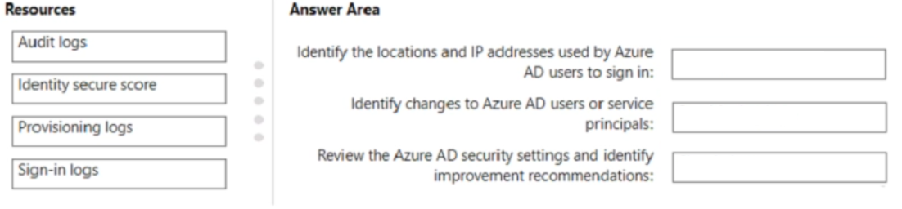
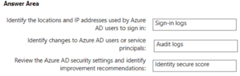

----------------------------------------

## Exam SC-300 topic 4 question 40 discussion

Actual exam question from

Microsoft's
SC-300

Question #: 40
Topic #: 4

[All SC-300 Questions]

Case Study -Overview -ADatum Corporation is a consulting company in Montreal.ADatum recently acquired a Vancouver-based company named Litware, Inc.Existing Environment. ADatum EnvironmentThe on-premises network of ADatum contains an Active Directory Domain Services (AD DS) forest named adatum.com.ADatum has a Microsoft 365 E5 subscription. The subscription contains a verified domain that syncs with the adatum.com AD DS domain by using Azure AD Connect.ADatum has an Azure Active Directory (Azure AD) tenant named adatum.com. The tenant has Security defaults disabled.The tenant contains the users shown in the following table.The tenant contains the groups shown in the following table.Existing Environment. Litware EnvironmentLitware has an AD DS forest named litware.comExisting Environment. Problem StatementsADatum identifies the following issues:• Multiple users in the sales department have up to five devices. The sales department users report that sometimes they must contact the support department to join their devices to the Azure AD tenant because they have reached their device limit.• A recent security incident reveals that several users leaked their credentials, a suspicious browser was used for a sign-in, and resources were accessed from an anonymous IP address.• When you attempt to assign the Device Administrators role to IT_Group1, the group does NOT appear in the selection list.• Anyone in the organization can invite guest users, including other guests and non-administrators.• The helpdesk spends too much time resetting user passwords.• Users currently use only passwords for authentication.Requirements. Planned Changes -ADatum plans to implement the following changes:• Configure self-service password reset (SSPR).• Configure multi-factor authentication (MFA) for all users.• Configure an access review for an access package named Package1.• Require admin approval for application access to organizational data.• Sync the AD DS users and groups of litware.com with the Azure AD tenant.• Ensure that only users that are assigned specific admin roles can invite guest users.• Increase the maximum number of devices that can be joined or registered to Azure AD to 10.Requirements. Technical RequirementsADatum identifies the following technical requirements:• Users assigned the User administrator role must be able to request permission to use the role when needed for up to one year.• Users must be prompted to register for MFA and provided with an option to bypass the registration for a grace period.• Users must provide one authentication method to reset their password by using SSPR. Available methods must include:- Email- Phone- Security questions- The Microsoft Authenticator app• Trust relationships must NOT be established between the adatum.com and litware.com AD DS domains.• The principle of least privilege must be used.You need to implement the planned changes for Package1.Which users can create and manage the access review? 
Suggested Answer: C 🗳️ 

A. User3 only

B. User4 only

C. User5 only

D. User3 and User4

E. User3 and User5

F. User4 and User5

**Answer: C**

**Timestamp: July 21, 2023, 3:59 p.m.**

[View on ExamTopics](https://www.examtopics.com/discussions/microsoft/view/115995-exam-sc-300-topic-4-question-40-discussion/)

----------------------------------------

## Exam SC-300 topic 4 question 41 discussion

Actual exam question from

Microsoft's
SC-300

Question #: 41
Topic #: 4

[All SC-300 Questions]

Case Study -Overview -ADatum Corporation is a consulting company in Montreal.ADatum recently acquired a Vancouver-based company named Litware, Inc.Existing Environment. ADatum EnvironmentThe on-premises network of ADatum contains an Active Directory Domain Services (AD DS) forest named adatum.com.ADatum has a Microsoft 365 E5 subscription. The subscription contains a verified domain that syncs with the adatum.com AD DS domain by using Azure AD Connect.ADatum has an Azure Active Directory (Azure AD) tenant named adatum.com. The tenant has Security defaults disabled.The tenant contains the users shown in the following table.The tenant contains the groups shown in the following table.Existing Environment. Litware EnvironmentLitware has an AD DS forest named litware.comExisting Environment. Problem StatementsADatum identifies the following issues:• Multiple users in the sales department have up to five devices. The sales department users report that sometimes they must contact the support department to join their devices to the Azure AD tenant because they have reached their device limit.• A recent security incident reveals that several users leaked their credentials, a suspicious browser was used for a sign-in, and resources were accessed from an anonymous IP address.• When you attempt to assign the Device Administrators role to IT_Group1, the group does NOT appear in the selection list.• Anyone in the organization can invite guest users, including other guests and non-administrators.• The helpdesk spends too much time resetting user passwords.• Users currently use only passwords for authentication.Requirements. Planned Changes -ADatum plans to implement the following changes:• Configure self-service password reset (SSPR).• Configure multi-factor authentication (MFA) for all users.• Configure an access review for an access package named Package1.• Require admin approval for application access to organizational data.• Sync the AD DS users and groups of litware.com with the Azure AD tenant.• Ensure that only users that are assigned specific admin roles can invite guest users.• Increase the maximum number of devices that can be joined or registered to Azure AD to 10.Requirements. Technical RequirementsADatum identifies the following technical requirements:• Users assigned the User administrator role must be able to request permission to use the role when needed for up to one year.• Users must be prompted to register for MFA and provided with an option to bypass the registration for a grace period.• Users must provide one authentication method to reset their password by using SSPR. Available methods must include:- Email- Phone- Security questions- The Microsoft Authenticator app• Trust relationships must NOT be established between the adatum.com and litware.com AD DS domains.• The principle of least privilege must be used.You need to resolve the issue of the guest user invitations.What should you do for the Azure AD tenant? 
Suggested Answer: C 🗳️ 

A. Configure the Continuous access evaluation settings.

B. Configure a Conditional Access policy.

C. Modify the External collaboration settings.

D. Configure the Access reviews settings.

**Answer: C**

**Timestamp: July 21, 2023, 4 p.m.**

[View on ExamTopics](https://www.examtopics.com/discussions/microsoft/view/115996-exam-sc-300-topic-4-question-41-discussion/)

----------------------------------------

## Exam SC-300 topic 4 question 42 discussion

Actual exam question from

Microsoft's
SC-300

Question #: 42
Topic #: 4

[All SC-300 Questions]

Case Study -Overview -ADatum Corporation is a consulting company in Montreal.ADatum recently acquired a Vancouver-based company named Litware, Inc.Existing Environment. ADatum EnvironmentThe on-premises network of ADatum contains an Active Directory Domain Services (AD DS) forest named adatum.com.ADatum has a Microsoft 365 E5 subscription. The subscription contains a verified domain that syncs with the adatum.com AD DS domain by using Azure AD Connect.ADatum has an Azure Active Directory (Azure AD) tenant named adatum.com. The tenant has Security defaults disabled.The tenant contains the users shown in the following table.The tenant contains the groups shown in the following table.Existing Environment. Litware EnvironmentLitware has an AD DS forest named litware.comExisting Environment. Problem StatementsADatum identifies the following issues:• Multiple users in the sales department have up to five devices. The sales department users report that sometimes they must contact the support department to join their devices to the Azure AD tenant because they have reached their device limit.• A recent security incident reveals that several users leaked their credentials, a suspicious browser was used for a sign-in, and resources were accessed from an anonymous IP address.• When you attempt to assign the Device Administrators role to IT_Group1, the group does NOT appear in the selection list.• Anyone in the organization can invite guest users, including other guests and non-administrators.• The helpdesk spends too much time resetting user passwords.• Users currently use only passwords for authentication.Requirements. Planned Changes -ADatum plans to implement the following changes:• Configure self-service password reset (SSPR).• Configure multi-factor authentication (MFA) for all users.• Configure an access review for an access package named Package1.• Require admin approval for application access to organizational data.• Sync the AD DS users and groups of litware.com with the Azure AD tenant.• Ensure that only users that are assigned specific admin roles can invite guest users.• Increase the maximum number of devices that can be joined or registered to Azure AD to 10.Requirements. Technical RequirementsADatum identifies the following technical requirements:• Users assigned the User administrator role must be able to request permission to use the role when needed for up to one year.• Users must be prompted to register for MFA and provided with an option to bypass the registration for a grace period.• Users must provide one authentication method to reset their password by using SSPR. Available methods must include:- Email- Phone- Security questions- The Microsoft Authenticator app• Trust relationships must NOT be established between the adatum.com and litware.com AD DS domains.• The principle of least privilege must be used.You need to modify the settings of the User administrator role to meet the technical requirements.Which two actions should you perform for the role? Each correct answer presents part of the solution.NOTE: Each correct selection is worth one point. 
Suggested Answer: CD 🗳️ 

A. Select Require justification on activation.

B. Select Require ticket information on activation.

C. Modify the Expire eligible assignments after setting.

D. Set all assignments to Eligible.

E. Set all assignments to Active.

**Answer: C**

**Timestamp: July 26, 2023, 4:38 a.m.**

[View on ExamTopics](https://www.examtopics.com/discussions/microsoft/view/116455-exam-sc-300-topic-4-question-42-discussion/)

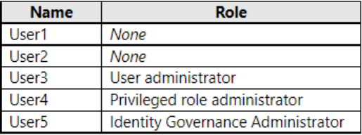

----------------------------------------

## Exam SC-300 topic 4 question 43 discussion

Actual exam question from

Microsoft's
SC-300

Question #: 43
Topic #: 4

[All SC-300 Questions]

You have a Microsoft 365 E5 subscription that contains a user named User1.You need to ensure that User1 can create access reviews for Azure AD roles. The solution must use the principle of least privilege.Which role should you assign to User1? 
Suggested Answer: A 🗳️ 

A. Privileged role administrator

B. Identity Governance Administrator

C. User administrator

D. User Access Administrator

**Answer: A**

**Timestamp: Aug. 3, 2023, 3:48 a.m.**

[View on ExamTopics](https://www.examtopics.com/discussions/microsoft/view/117178-exam-sc-300-topic-4-question-43-discussion/)

----------------------------------------

## Exam SC-300 topic 4 question 44 discussion

Actual exam question from

Microsoft's
SC-300

Question #: 44
Topic #: 4

[All SC-300 Questions]

HOTSPOT -You have a Microsoft 365 E5 subscription that contains three users named User1, User2, and User3.You have two Azure AD roles that have the Activation settings shown in the following table.The Azure AD roles have the Assignment settings shown in the following table.The Azure AD roles have the eligible users shown in the following table.For each of the following statements, select Yes if the statement is true. Otherwise, select No.NOTE: Each correct selection is worth one point. 
Suggested Answer: 

**Answer: **

**Timestamp: Aug. 14, 2023, 9:43 p.m.**

[View on ExamTopics](https://www.examtopics.com/discussions/microsoft/view/118111-exam-sc-300-topic-4-question-44-discussion/)

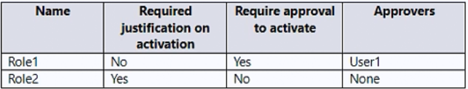
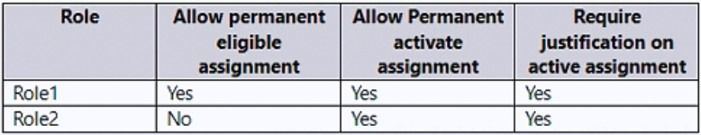
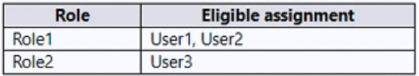
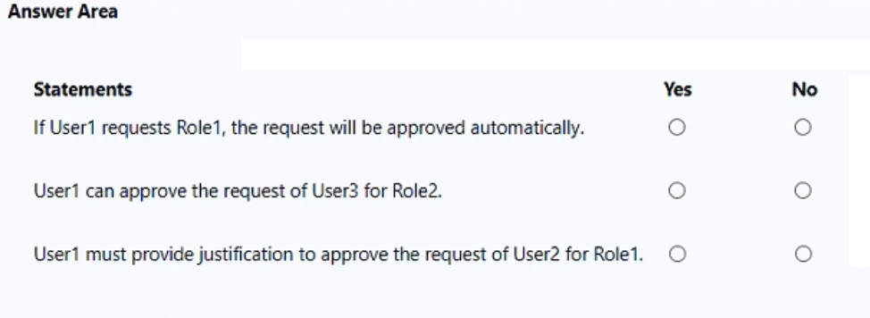
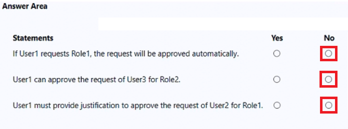

----------------------------------------

## Exam SC-300 topic 4 question 45 discussion

Actual exam question from

Microsoft's
SC-300

Question #: 45
Topic #: 4

[All SC-300 Questions]

HOTSPOT -You have a hybrid Microsoft 365 subscription that contains the users shown in the following table.You plan to deploy an on-premises app named App1. App1 will be registered in Azure AD and will use Azure AD Application Proxy.You need to delegate the installation of the Application Proxy connector and ensure that User1 can register App1 in Azure AD. The solution must use the principle of least privilege.Which user should perform the installation, and which role should you assign to User1? To answer, select the appropriate options in the answer area.NOTE: Each correct selection is worth one point. 
Suggested Answer: 

**Answer: **

**Timestamp: Aug. 20, 2023, 5:22 a.m.**

[View on ExamTopics](https://www.examtopics.com/discussions/microsoft/view/118517-exam-sc-300-topic-4-question-45-discussion/)

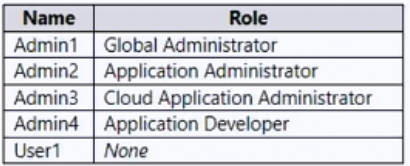
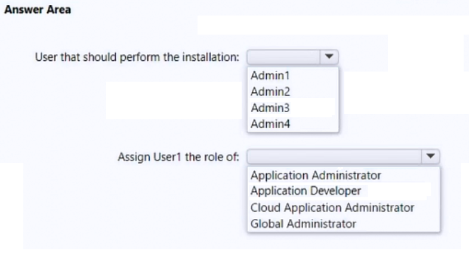
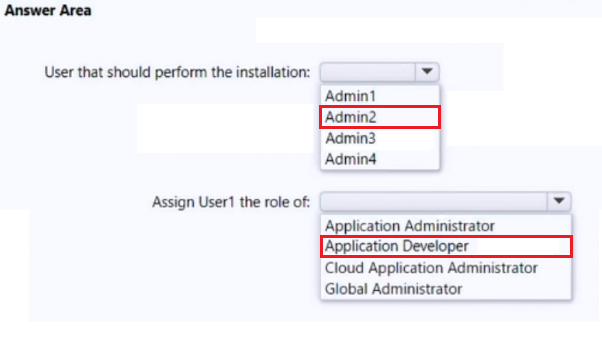

----------------------------------------

## Exam SC-300 topic 4 question 46 discussion

Actual exam question from

Microsoft's
SC-300

Question #: 46
Topic #: 4

[All SC-300 Questions]

HOTSPOT -You have a Microsoft 365 E5 subscription that contains the users shown in the following table.The users are assigned the roles shown in the following table.For which users can User1 and User4 reset passwords? To answer, select the appropriate options in the answer area.NOTE: Each correct selection is worth one point. 
Suggested Answer: 

**Answer: **

**Timestamp: Aug. 3, 2023, 7:01 a.m.**

[View on ExamTopics](https://www.examtopics.com/discussions/microsoft/view/117183-exam-sc-300-topic-4-question-46-discussion/)

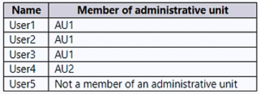
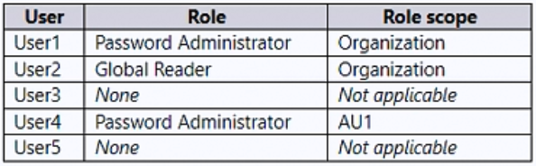
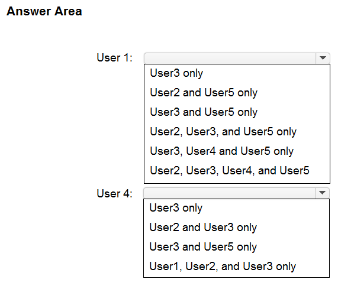
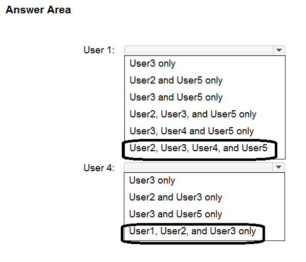

----------------------------------------

## Exam SC-300 topic 4 question 47 discussion

Actual exam question from

Microsoft's
SC-300

Question #: 47
Topic #: 4

[All SC-300 Questions]

You have a Microsoft 365 E5 subscription that contains a user named User1. User is eligible for the Application administrator role.User1 needs to configure a new connector group for an application proxy.What should you use to activate the role for User1? 
Suggested Answer: C 🗳️ 

A. the Microsoft Defender for Cloud Apps portal

B. the Microsoft 365 admin center

C. the Azure Active Directory admin center

D. the Microsoft 365 Defender portal

**Answer: C**

**Timestamp: Aug. 15, 2023, 1:14 p.m.**

[View on ExamTopics](https://www.examtopics.com/discussions/microsoft/view/118160-exam-sc-300-topic-4-question-47-discussion/)

----------------------------------------

## Exam SC-300 topic 4 question 48 discussion

Actual exam question from

Microsoft's
SC-300

Question #: 48
Topic #: 4

[All SC-300 Questions]

You have an Azure subscription that contains a registered app named App1.You need to review the sign-in activity for App1. The solution must meet the following requirements:• Identify the number of failed sign-ins.• Identify the success rate of sign-ins.• Minimize administrative effort.What should you use? 
Suggested Answer: D 🗳️ 

A. Sign-in logs

B. Access reviews

C. Audit logs

D. Usage & insights

**Answer: D**

**Timestamp: Aug. 2, 2023, 10:44 a.m.**

[View on ExamTopics](https://www.examtopics.com/discussions/microsoft/view/117077-exam-sc-300-topic-4-question-48-discussion/)

----------------------------------------

## Exam SC-300 topic 4 question 49 discussion

Actual exam question from

Microsoft's
SC-300

Question #: 49
Topic #: 4

[All SC-300 Questions]

Your company has an Azure AD tenant that contains a user named User1.The company has two departments named marketing and finance.You need to grant permissions to User1 to manage only the users in the marketing department. The solution must ensure that User1 does NOT have permissions to manage the users in the finance department.What should you create first? 
Suggested Answer: B 🗳️ 

A. a management group

B. an administrative unit

C. a resource group

D. a Microsoft 365 group

**Answer: B**

**Timestamp: Aug. 15, 2023, 1:17 p.m.**

[View on ExamTopics](https://www.examtopics.com/discussions/microsoft/view/118161-exam-sc-300-topic-4-question-49-discussion/)

----------------------------------------

## Exam SC-300 topic 4 question 50 discussion

Actual exam question from

Microsoft's
SC-300

Question #: 50
Topic #: 4

[All SC-300 Questions]

You have an Azure AD tenant that contains an access package named Package1 and a user named User1. Package1 is configured as shown in the following exhibit.You need to ensure that User1 can modify the review frequency of Package1. The solution must use the principle of least privilege.Which role should you assign to User1? 
Suggested Answer: D 🗳️ 

A. Security administrator

B. Privileged role administrator

C. External Identity Provider administrator

D. User administrator

**Answer: D**

**Timestamp: Aug. 3, 2023, 7:12 a.m.**

[View on ExamTopics](https://www.examtopics.com/discussions/microsoft/view/117184-exam-sc-300-topic-4-question-50-discussion/)

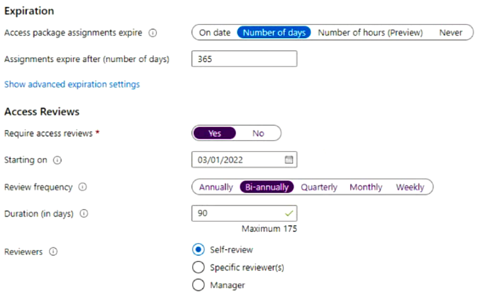

----------------------------------------

## Exam SC-300 topic 4 question 51 discussion

Actual exam question from

Microsoft's
SC-300

Question #: 51
Topic #: 4

[All SC-300 Questions]

HOTSPOT -You have an Azure subscription.Azure AD logs are sent to a Log Analytics workspace.You need to query the logs and graphically display the number of sign-ins per user.How should you complete the query? To answer, select the appropriate options in the answer area,NOTE: Each correct selection is worth one point. 
Suggested Answer: 

**Answer: **

**Timestamp: Aug. 3, 2023, 7:18 a.m.**

[View on ExamTopics](https://www.examtopics.com/discussions/microsoft/view/117185-exam-sc-300-topic-4-question-51-discussion/)

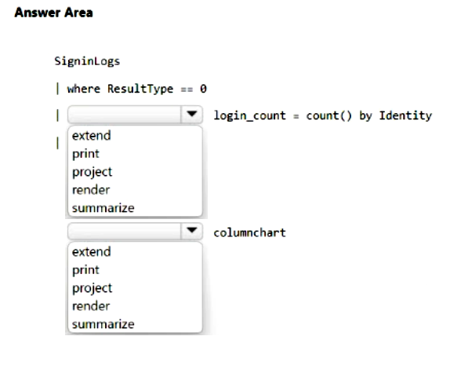
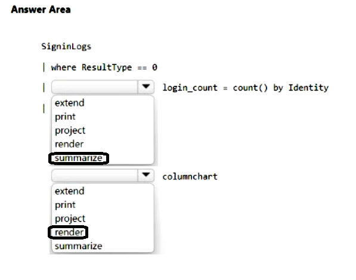

----------------------------------------

## Exam SC-300 topic 4 question 52 discussion

Actual exam question from

Microsoft's
SC-300

Question #: 52
Topic #: 4

[All SC-300 Questions]

You have a Microsoft 365 E5 subscription that uses Microsoft Defender for Cloud Apps.You need to identify which users access Facebook from their devices and browsers. The solution must minimize administrative effort.What should you do first? 
Suggested Answer: D 🗳️ 

A. Create a Conditional Access policy.

B. Create a Defender for Cloud Apps access policy.

C. Create an app configuration policy in Microsoft Endpoint Manager.

D. From the Microsoft Defender for Cloud Apps portal, unsanction Facebook.

**Answer: D**

**Timestamp: Aug. 3, 2023, 7:22 a.m.**

[View on ExamTopics](https://www.examtopics.com/discussions/microsoft/view/117186-exam-sc-300-topic-4-question-52-discussion/)

----------------------------------------

## Exam SC-300 topic 4 question 53 discussion

Actual exam question from

Microsoft's
SC-300

Question #: 53
Topic #: 4

[All SC-300 Questions]

You have an Azure subscription that uses Azure AD Privileged Identity Management (PIM).You need to identify users that are eligible for the Cloud Application Administrator role.Which blade in the Privileged Identity Management settings should you use? 
Suggested Answer: D 🗳️ 

A. Azure resources

B. Privileged access groups

C. Review access

D. Azure AD roles

**Answer: D**

**Timestamp: Aug. 2, 2023, 11:26 a.m.**

[View on ExamTopics](https://www.examtopics.com/discussions/microsoft/view/117088-exam-sc-300-topic-4-question-53-discussion/)

----------------------------------------

## Exam SC-300 topic 4 question 54 discussion

Actual exam question from

Microsoft's
SC-300

Question #: 54
Topic #: 4

[All SC-300 Questions]

HOTSPOT -You have a Microsoft 365 E5 subscription.You need to create a dynamic user group that will include all the users that do NOT have a department defined in their user profile.How should you complete the membership rule? To answer, select the appropriate options in the answer area.NOTE: Each correct selection is worth one point. 
Suggested Answer: 

**Answer: **

**Timestamp: Aug. 3, 2023, 7:30 a.m.**

[View on ExamTopics](https://www.examtopics.com/discussions/microsoft/view/117187-exam-sc-300-topic-4-question-54-discussion/)

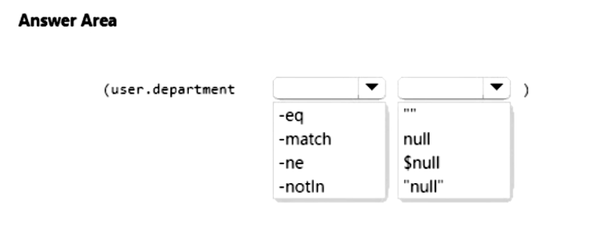
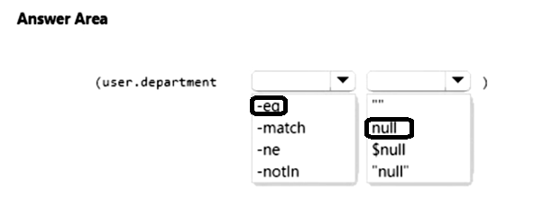

----------------------------------------

## Exam SC-300 topic 4 question 55 discussion

Actual exam question from

Microsoft's
SC-300

Question #: 55
Topic #: 4

[All SC-300 Questions]

You have an Azure AD Premium P2 tenant.You create a Log Analytics workspace.You need to ensure that you can view Azure AD audit log information by using Azure Monitor.What should you do first? 
Suggested Answer: A 🗳️ 

A. Modify the Diagnostics settings for Azure AD.

B. Run the Update-MgOrganization cmdlet.

C. Run the Update-MgDomain cmdlet.

D. Create an Azure AD workbook.

**Answer: A**

**Timestamp: Oct. 7, 2023, 4:39 a.m.**

[View on ExamTopics](https://www.examtopics.com/discussions/microsoft/view/122733-exam-sc-300-topic-4-question-55-discussion/)

----------------------------------------

## Exam SC-300 topic 4 question 56 discussion

Actual exam question from

Microsoft's
SC-300

Question #: 56
Topic #: 4

[All SC-300 Questions]

HOTSPOT -You have an Azure subscription named Sub1 that contains two storage accounts named storage1 and storage2 and the blob containers shown in the following table.Sub1 contains the users shown in the following table.Condition1 has the following definition:NOTE: Each correct selection is worth one point. 
Suggested Answer: 

**Answer: **

**Timestamp: Feb. 17, 2025, 10:17 p.m.**

[View on ExamTopics](https://www.examtopics.com/discussions/microsoft/view/156740-exam-sc-300-topic-4-question-56-discussion/)

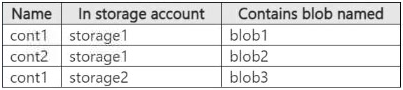
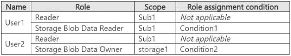
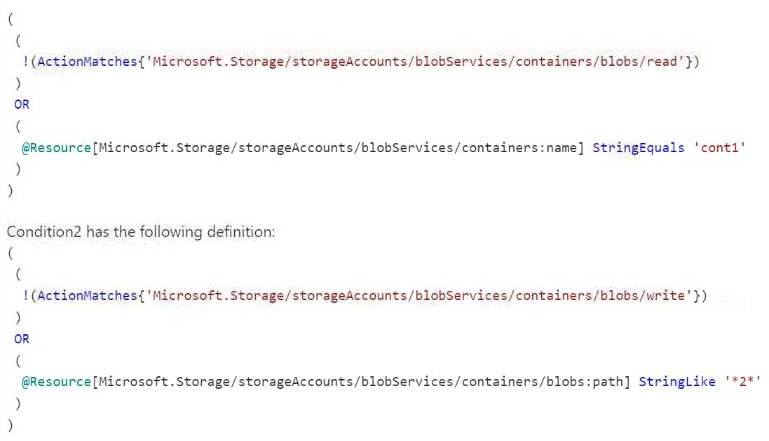
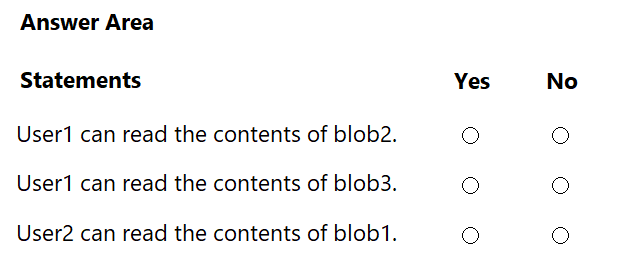
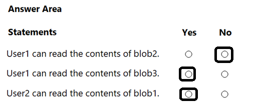

----------------------------------------

## Exam SC-300 topic 4 question 57 discussion

Actual exam question from

Microsoft's
SC-300

Question #: 57
Topic #: 4

[All SC-300 Questions]

You have a Microsoft 365 subscription that contains the users shown in the following table.From the tenant, you configure a naming policy for groups.Which users are affected by the naming policy? 
Suggested Answer: D 🗳️ 

A. User2 only

B. User3only

C. User2 and User3 only

D. User3 and User4 only

E. User1, User2, and User3 only

F. User1, User2, User3, and User4

**Answer: D**

**Timestamp: Oct. 3, 2023, 11:53 a.m.**

[View on ExamTopics](https://www.examtopics.com/discussions/microsoft/view/122233-exam-sc-300-topic-4-question-57-discussion/)

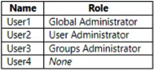

----------------------------------------

## Exam SC-300 topic 4 question 58 discussion

Actual exam question from

Microsoft's
SC-300

Question #: 58
Topic #: 4

[All SC-300 Questions]

You have an Azure subscription that contains the users shown in the following table.You need to implement Azure AD Privileged Identity Management (PIM).Which users can use PIM to activate their role permissions? 
Suggested Answer: C 🗳️ 

A. Admin1 only

B. Admin2 only

C. Admin3 only

D. Admin1 and Admin2 only

E. Admin2 and Admin3 only

F. Admin1, Admin2, and Admin3

**Answer: C**

**Timestamp: Nov. 14, 2023, 10:51 a.m.**

[View on ExamTopics](https://www.examtopics.com/discussions/microsoft/view/126069-exam-sc-300-topic-4-question-58-discussion/)

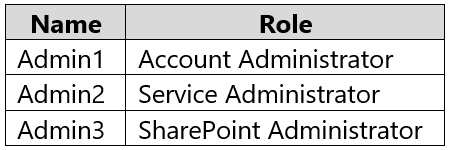

----------------------------------------

## Exam SC-300 topic 4 question 59 discussion

Actual exam question from

Microsoft's
SC-300

Question #: 59
Topic #: 4

[All SC-300 Questions]

HOTSPOT -You have an Azure AD tenant.You perform the tasks shown in the following table.On April 5, an administrator deletes App1, App2, App3, and App4.You need to restore the apps and the settings.Which apps can you restore on April 16, and which settings can you restore for App4 on April 16? To answer, select the appropriate options in the answer area.NOTE: Each correct selection is worth one point. 
Suggested Answer: 

**Answer: **

**Timestamp: Nov. 14, 2023, 3:28 p.m.**

[View on ExamTopics](https://www.examtopics.com/discussions/microsoft/view/126108-exam-sc-300-topic-4-question-59-discussion/)

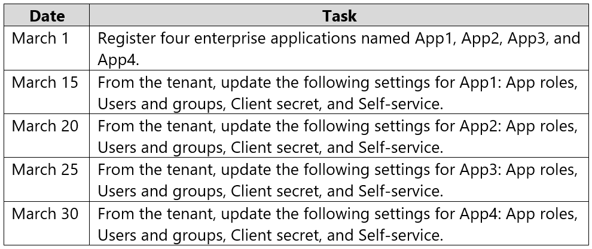
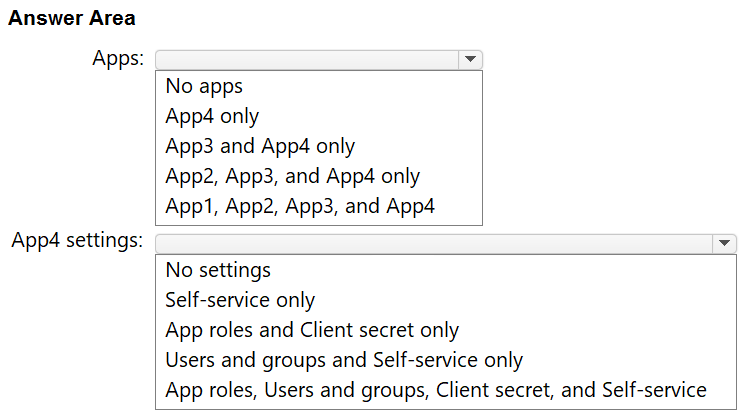
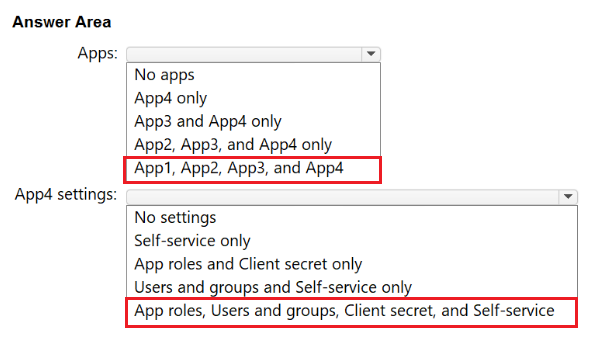

----------------------------------------

## Exam SC-300 topic 4 question 60 discussion

Actual exam question from

Microsoft's
SC-300

Question #: 60
Topic #: 4

[All SC-300 Questions]

Note: This question is part of a series of questions that present the same scenario. Each question in the series contains a unique solution that might meet the stated goals. Some question sets might have more than one correct solution, while others might not have a correct solution.After you answer a question in this section, you will NOT be able to return to it. As a result, these questions will not appear in the review screen.You have an Amazon Web Services (AWS) account, a Google Workspace subscription, and a GitHub account.You deploy an Azure subscription and enable Microsoft 365 Defender.You need to ensure that you can monitor OAuth authentication requests by using Microsoft Defender for Cloud Apps.Solution: From the Microsoft 365 Defender portal, you add the GitHub app connector.Does this meet the goal? 
Suggested Answer: B 🗳️ 

A. Yes

B. No

**Answer: B**

**Timestamp: Nov. 6, 2023, 6:45 p.m.**

[View on ExamTopics](https://www.examtopics.com/discussions/microsoft/view/125526-exam-sc-300-topic-4-question-60-discussion/)

----------------------------------------

## Exam SC-300 topic 4 question 61 discussion

Actual exam question from

Microsoft's
SC-300

Question #: 61
Topic #: 4

[All SC-300 Questions]

You have an Azure AD tenant.You plan to implement Azure AD Privileged Identity Management (PIM).Which roles can you manage by using PIM? 
Suggested Answer: B 🗳️ 

A. Global Administrator only

B. Global Administrator and Security Administrator only

C. Global Administrator, Security Administrator, and Security Contributor only

D. Account Administrator, Global Administrator, Security Administrator, and Security Contributor only

**Answer: B**

**Timestamp: Nov. 6, 2023, 6:49 p.m.**

[View on ExamTopics](https://www.examtopics.com/discussions/microsoft/view/125527-exam-sc-300-topic-4-question-61-discussion/)

----------------------------------------

## Exam SC-300 topic 4 question 62 discussion

Actual exam question from

Microsoft's
SC-300

Question #: 62
Topic #: 4

[All SC-300 Questions]

You have a Microsoft 365 tenant.In Microsoft Entra ID, you configure the terms of use.You need to ensure that only users who accept the terms of use can access the resources in the tenant. Other users must be denied access.What should you configure? 
Suggested Answer: C 🗳️ 

A. Terms and conditions in Microsoft Intune

B. an access policy in Microsoft Defender for Cloud Apps

C. a conditional access policy in Microsoft Entra ID

D. a compliance policy in Microsoft Intune

**Answer: C**

**Timestamp: Feb. 18, 2024, 8:35 p.m.**

[View on ExamTopics](https://www.examtopics.com/discussions/microsoft/view/134157-exam-sc-300-topic-4-question-62-discussion/)

----------------------------------------

## Exam SC-300 topic 4 question 63 discussion

Actual exam question from

Microsoft's
SC-300

Question #: 63
Topic #: 4

[All SC-300 Questions]

You have a Microsoft 365 E5 subscription that contains a user named User1. User1 is eligible for the Application Administrator role.User1 needs to configure a new connector group for an application proxy.What should you use to activate the role for User1? 
Suggested Answer: D 🗳️ 

A. the Microsoft 365 Defender portal

B. the Microsoft 365 admin center

C. the Microsoft Intune admin center

D. the Azure Active Directory admin center

**Answer: D**

**Timestamp: Feb. 18, 2024, 8:38 p.m.**

[View on ExamTopics](https://www.examtopics.com/discussions/microsoft/view/134158-exam-sc-300-topic-4-question-63-discussion/)

----------------------------------------

## Exam SC-300 topic 4 question 64 discussion

Actual exam question from

Microsoft's
SC-300

Question #: 64
Topic #: 4

[All SC-300 Questions]

Your on-premises network contains an Active Directory Domain Services (AD DS) domain and a certification authority (CA) named CA1.You have an Azure AD tenant.You need to implement certificate-based authentication in Azure AD. The solution must ensure that users can sign in by using certificates issued by CA1. What should you do first? 
Suggested Answer: B 🗳️ 

A. Deploy an Azure key vault.

B. Add CA1 as a Certificate Authority to the Microsoft Entra ID tenant.

C. Enable auto-enrollment for CA1.

D. Deploy Windows Hello for Business.

**Answer: B**

**Timestamp: Jan. 26, 2024, 2:37 a.m.**

[View on ExamTopics](https://www.examtopics.com/discussions/microsoft/view/132192-exam-sc-300-topic-4-question-64-discussion/)

----------------------------------------

## Exam SC-300 topic 4 question 65 discussion

Actual exam question from

Microsoft's
SC-300

Question #: 65
Topic #: 4

[All SC-300 Questions]

You have accounts for the following cloud platforms:• Azure• Alibaba Cloud• Amazon Web Services (AWS)• Google Cloud Platform (GCP)You configure an Azure subscription to use Microsoft Entra Permissions Management to manage the permissions in Azure only.Which additional cloud platforms can be managed by using Permissions Management? 
Suggested Answer: D 🗳️ 

A. AWS only

B. Alibaba Cloud and AWS only

C. Alibaba Cloud and GCP only

D. AWS and GCP only

E. Alibaba Cloud, AWS, and GCP

**Answer: D**

**Timestamp: Jan. 24, 2024, 9:36 a.m.**

[View on ExamTopics](https://www.examtopics.com/discussions/microsoft/view/131998-exam-sc-300-topic-4-question-65-discussion/)

----------------------------------------

## Exam SC-300 topic 4 question 66 discussion

Actual exam question from

Microsoft's
SC-300

Question #: 66
Topic #: 4

[All SC-300 Questions]

You have three Azure subscriptions that are linked to a single Microsoft Entra tenant.You need to evaluate and remediate the risks associated with highly privileged accounts. The solution must minimize administrative effort.What should you use? 
Suggested Answer: B 🗳️ 

A. Global Secure Access

B. Privileged Identity Management (PIM)

C. Microsoft Entra Permissions Management

D. Microsoft Entra Verified ID

**Answer: B**

**Timestamp: Jan. 30, 2024, 10:15 p.m.**

[View on ExamTopics](https://www.examtopics.com/discussions/microsoft/view/132482-exam-sc-300-topic-4-question-66-discussion/)

----------------------------------------

## Exam SC-300 topic 4 question 67 discussion

Actual exam question from

Microsoft's
SC-300

Question #: 67
Topic #: 4

[All SC-300 Questions]

You have an Azure subscription named Sub1 that uses Microsoft Entra Permissions Management. Sub1 contains a user named User1. User1 is granted multiple permissions across Sub1.You need to replace all the permissions granted to User1 with read-only permissions. The solution must minimize administrative effort.What should you do on the Remediation tab in Permissions Management? 
Suggested Answer: D 🗳️ 

A. From the Role/Policy Template subtab, create a template.

B. From the My Requests subtab, create a new request.

C. From the Roles/Policies subtab, create a role.

D. From the Permissions subtab, use a quick action.

**Answer: D**

**Timestamp: Jan. 30, 2024, 10:22 p.m.**

[View on ExamTopics](https://www.examtopics.com/discussions/microsoft/view/132483-exam-sc-300-topic-4-question-67-discussion/)

----------------------------------------

## Exam SC-300 topic 4 question 68 discussion

Actual exam question from

Microsoft's
SC-300

Question #: 68
Topic #: 4

[All SC-300 Questions]

You have an Azure subscription that contains a user named User1. The subscription is onboarded to Microsoft Entra Permissions Management.You need to provide User1 with access to Permissions Management. The solution must meet the following requirements:• Follow the principle of least privilege.• Minimize administrative effort.What should you do first? 
Suggested Answer: B 🗳️ 

A. From the Role/Policy Template subtab of Permissions Management, create a template.

B. From the Microsoft Entra admin center, create a security group.

C. From the My Requests subtab of Permissions Management, create a new request.

D. From the Microsoft Entra admin center, assign a role to User1.

**Answer: B**

**Timestamp: Jan. 30, 2024, 10:33 p.m.**

[View on ExamTopics](https://www.examtopics.com/discussions/microsoft/view/132485-exam-sc-300-topic-4-question-68-discussion/)

----------------------------------------

## Exam SC-300 topic 4 question 69 discussion

Actual exam question from

Microsoft's
SC-300

Question #: 69
Topic #: 4

[All SC-300 Questions]

DRAG DROP -You have an Azure subscription that contains the resources shown in the following table.The subscription uses Privileged Identity Management (PIM).You need to configure the following access controls by using PIM:• Ensure that User1 can read and update Secret1.• Ensure that User2 can read the contents of the secrets stored in Vault2.The solution must follow the principle of least privilege.Which authorization method should you use for each user? To answer, drag the appropriate authorization methods to the correct users. Each authorization method may be used once, more than once, or not at all. You may need to drag the split bar between panes or scroll to view content.NOTE: Each correct selection is worth one point. 
Suggested Answer: 

**Answer: **

**Timestamp: Jan. 30, 2024, 10:37 p.m.**

[View on ExamTopics](https://www.examtopics.com/discussions/microsoft/view/132486-exam-sc-300-topic-4-question-69-discussion/)

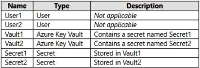
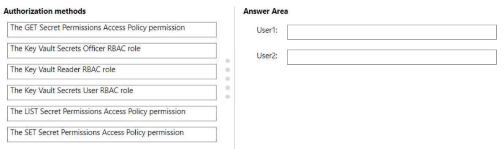
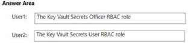

----------------------------------------

## Exam SC-300 topic 4 question 70 discussion

Actual exam question from

Microsoft's
SC-300

Question #: 70
Topic #: 4

[All SC-300 Questions]

HOTSPOT -You have two Azure subscriptions named Sub1 and Sub2 that are linked to a Microsoft Entra tenant. The tenant contains three groups named Group1, Group2, and Group3.The subscriptions contain the resources shown in the following table.The tenant contains the users shown in the following table.You manage the subscriptions by using Microsoft Entra Permissions Management. Permissions Management is configured as shown in the following table.For each of the following statements, select Yes if the statement is true. Otherwise, select No.NOTE: Each correct selection is worth one point. 
Suggested Answer: 

**Answer: **

**Timestamp: Jan. 25, 2024, 12:12 p.m.**

[View on ExamTopics](https://www.examtopics.com/discussions/microsoft/view/132126-exam-sc-300-topic-4-question-70-discussion/)

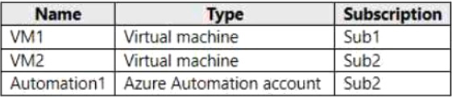
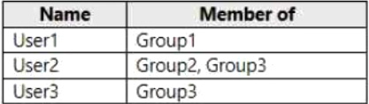
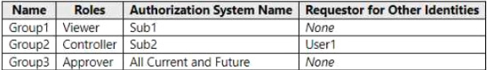
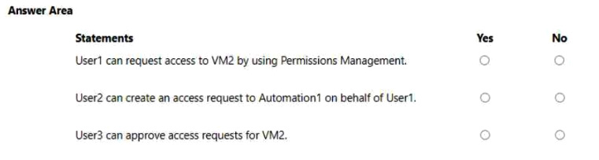
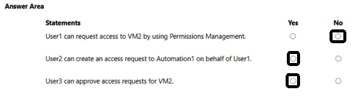

----------------------------------------

## Exam SC-300 topic 4 question 71 discussion

Actual exam question from

Microsoft's
SC-300

Question #: 71
Topic #: 4

[All SC-300 Questions]

HOTSPOT -You have an Azure subscription that contains a user named User1.You onboard Microsoft Entra Permissions Management.You need to perform the following tasks:• Identify all the accounts that are assigned the Global Administrator role permanently.• Review the Permission Creep Index (PCI) of User1.Which tab in Permissions Management should you use for each task? To answer, select the appropriate options in the answer area. 
Suggested Answer: 

**Answer: **

**Timestamp: Jan. 30, 2024, 10:50 p.m.**

[View on ExamTopics](https://www.examtopics.com/discussions/microsoft/view/132489-exam-sc-300-topic-4-question-71-discussion/)

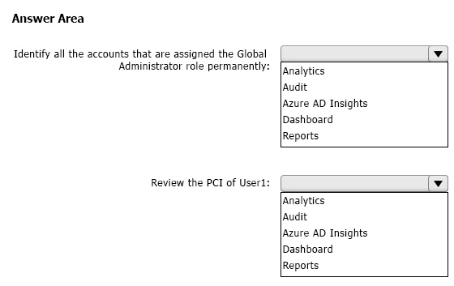
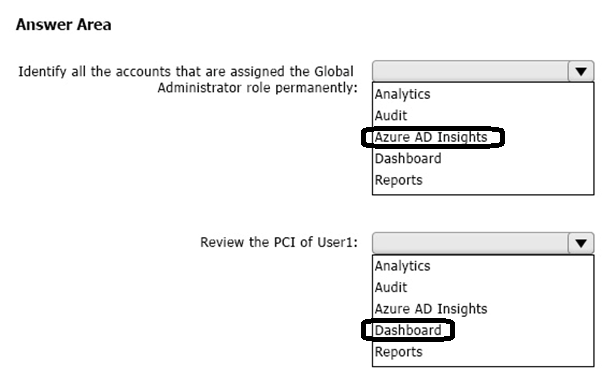

----------------------------------------

## Exam SC-300 topic 4 question 72 discussion

Actual exam question from

Microsoft's
SC-300

Question #: 72
Topic #: 4

[All SC-300 Questions]

You have an Azure subscription.You need to use Microsoft Entra Permissions Management to automatically monitor permissions and create and implement right-size roles. The solution must follow the principle of least privilege.Which role should you assign to the service principal of Permissions Management? 
Suggested Answer: A 🗳️ 

A. User Access Administrator

B. Contributor

C. Reader

D. Owner

**Answer: A**

**Timestamp: March 29, 2024, 2:19 p.m.**

[View on ExamTopics](https://www.examtopics.com/discussions/microsoft/view/137484-exam-sc-300-topic-4-question-72-discussion/)

----------------------------------------

## Exam SC-300 topic 4 question 73 discussion

Actual exam question from

Microsoft's
SC-300

Question #: 73
Topic #: 4

[All SC-300 Questions]

HOTSPOT -You have an Azure subscription named Sub1.You plan to onboard Microsoft Entra Permissions Management.You need to ensure that Permissions Management users can manage role assignments for Sub1. The solution must follow the principle of least privilege.Which role should you assign and to which identity should you assign the role? To answer, select the appropriate options in the answer area.NOTE: Each correct selection is worth one point. 
Suggested Answer: 

**Answer: **

**Timestamp: March 29, 2024, 2:23 p.m.**

[View on ExamTopics](https://www.examtopics.com/discussions/microsoft/view/137485-exam-sc-300-topic-4-question-73-discussion/)

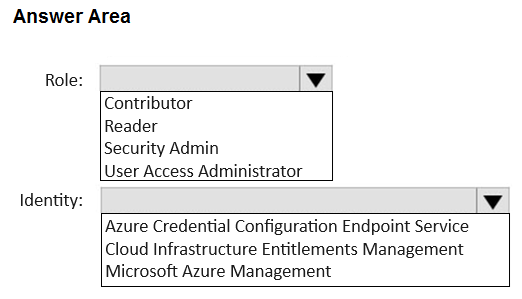
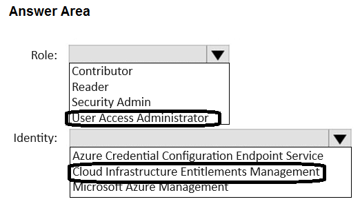

----------------------------------------

## Exam SC-300 topic 4 question 74 discussion

Actual exam question from

Microsoft's
SC-300

Question #: 74
Topic #: 4

[All SC-300 Questions]

You have an Azure subscription, a Google Cloud Platform (GCP) account, and an Amazon Web Services (AWS) account.You need to recommend a solution to assess the risks associated with privilege assignments across all the platforms. The solution must minimize administrative effort.What should you include in the recommendation? 
Suggested Answer: D 🗳️ 

A. Microsoft Sentinel

B. Microsoft Entra ID Protection

C. Microsoft Defender for Cloud Apps

D. Microsoft Entra Permissions Management

**Answer: D**

**Timestamp: March 29, 2024, 2:23 p.m.**

[View on ExamTopics](https://www.examtopics.com/discussions/microsoft/view/137486-exam-sc-300-topic-4-question-74-discussion/)

----------------------------------------

## Exam SC-300 topic 4 question 75 discussion

Actual exam question from

Microsoft's
SC-300

Question #: 75
Topic #: 4

[All SC-300 Questions]

You have a Microsoft Entra tenant.You need to configure continuous access evaluation for app sign-ins and assign the configuration to users that are assigned the Application Administrator role.What should you configure? 
Suggested Answer: C 🗳️ 

A. a sign-in risk policy

B. an access review

C. a Conditional Access policy

D. the Admin consent settings

**Answer: C**

**Timestamp: March 29, 2024, 2:24 p.m.**

[View on ExamTopics](https://www.examtopics.com/discussions/microsoft/view/137487-exam-sc-300-topic-4-question-75-discussion/)

----------------------------------------

## Exam SC-300 topic 4 question 76 discussion

Actual exam question from

Microsoft's
SC-300

Question #: 76
Topic #: 4

[All SC-300 Questions]

HOTSPOT -You have an Azure subscription named Sub1.You plan to deploy Microsoft Entra Permissions Management.You need to ensure that Permission Management can onboard Sub1. The solution must follow the principle of least privilege.How should you complete the PowerShell command? To answer, select the appropriate options in the answer area.NOTE: Each correct selection is worth one point. 
Suggested Answer: 

**Answer: **

**Timestamp: Jan. 16, 2025, 5:23 a.m.**

[View on ExamTopics](https://www.examtopics.com/discussions/microsoft/view/154628-exam-sc-300-topic-4-question-76-discussion/)

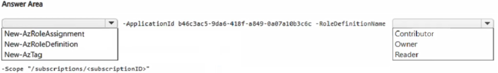
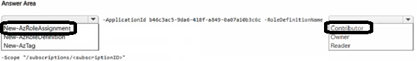

----------------------------------------

## Exam SC-300 topic 4 question 77 discussion

Actual exam question from

Microsoft's
SC-300

Question #: 77
Topic #: 4

[All SC-300 Questions]

Your company has a Microsoft Entra tenant that contains a user named User1.The company has two departments named marketing and finance.You need to grant permissions to User1 to manage only the users in the marketing department.What should you create first? 
Suggested Answer: B 🗳️ 

A. a Microsoft 365 group

B. an administrative unit

C. a management group

D. a resource group

**Answer: B**

**Timestamp: Oct. 20, 2025, 9:41 a.m.**

[View on ExamTopics](https://www.examtopics.com/discussions/microsoft/view/314682-exam-sc-300-topic-4-question-77-discussion/)

----------------------------------------

## Exam SC-300 topic 4 question 78 discussion

Actual exam question from

Microsoft's
SC-300

Question #: 78
Topic #: 4

[All SC-300 Questions]

SIMULATION -Use the following login credentials as needed:To enter your username, place your cursor in the Sign in box and click on the username below.To enter your password, place your cursor in the Enter password box and click on the password below.Microsoft 365 Username:[email protected]Microsoft 365 Password: =1122334455667788If the Microsoft 365 portal does not load successfully in the browser, press CTRL-K to reload the portal in a new browser tab.The following information is for technical support purposes only:Lab Instance: 99999999 -You need to configure the Group Administrator role to meet the following requirements:• Ensure that Allan Deyoung can approve and reject requests to activate the role.• Ensure that Christie Cline can request activation of the role.• Use the principle of least privilege.To complete this task, sign in to the appropriate admin center. 
Suggested Answer: 

**Answer: **

**Timestamp: Jan. 23, 2025, 11:40 a.m.**

[View on ExamTopics](https://www.examtopics.com/discussions/microsoft/view/155283-exam-sc-300-topic-4-question-78-discussion/)

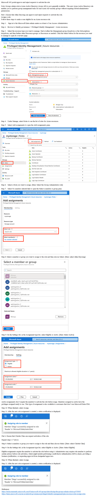

----------------------------------------

## Exam SC-300 topic 4 question 80 discussion

Actual exam question from

Microsoft's
SC-300

Question #: 80
Topic #: 4

[All SC-300 Questions]

HOTSPOT -You have a Microsoft Entra tenant that contains the users shown in the following table.You add the following assignment for the User Administrator role:• Scope type: Directory• Selected members: Group1• Assignment type: Active• Assignments starts: August 15, 2022• Assignment ends: December 15, 2022You add the following assignment for the Exchange Administrator role:• Scope type: Directory• Selected members: Group2• Assignment type: Eligible• Assignments starts: October 15, 2022• Assignment ends: January 15, 2023For each of the following statements, select Yes if the statement is true. Otherwise, select No.NOTE: Each correct selection is worth one point. 
Suggested Answer: 

**Answer: **

**Timestamp: March 15, 2025, 9:41 p.m.**

[View on ExamTopics](https://www.examtopics.com/discussions/microsoft/view/169123-exam-sc-300-topic-4-question-80-discussion/)

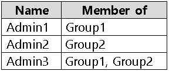
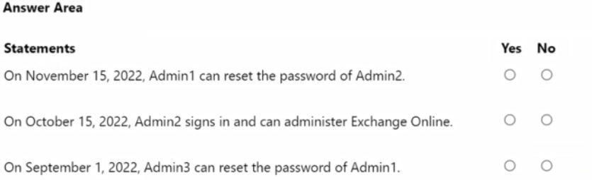
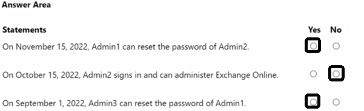

----------------------------------------

## Exam SC-300 topic 4 question 81 discussion

Actual exam question from

Microsoft's
SC-300

Question #: 81
Topic #: 4

[All SC-300 Questions]

HOTSPOT -You have an Azure subscription that uses Microsoft Entra Permissions Management.You have an Amazon Web Services (AWS) account.You plan to connect Permissions Management to AWS.You need to create a Permissions Management app in Azure.How should you complete the PowerShell command? To answer, select the appropriate options in the answer area.NOTE: Each correct selection is worth one point. 
Suggested Answer: 

**Answer: **

**Timestamp: March 18, 2025, 1:48 a.m.**

[View on ExamTopics](https://www.examtopics.com/discussions/microsoft/view/169267-exam-sc-300-topic-4-question-81-discussion/)

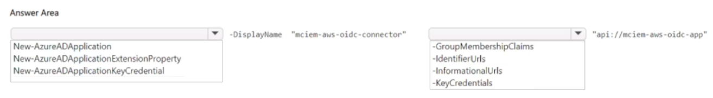
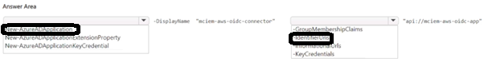

----------------------------------------

## Exam SC-300 topic 4 question 82 discussion

Actual exam question from

Microsoft's
SC-300

Question #: 82
Topic #: 4

[All SC-300 Questions]

You have a Microsoft Entra tenant that uses Microsoft Entra ID Premium licenses.You plan to configure a terms of use (ToU) for the tenant.You need to upload the ToU document.Which format should you use for the document? 
Suggested Answer: C 🗳️ 

A. HTML

B. RTF

C. PDF

D. DOCX

**Answer: C**

**Timestamp: Dec. 21, 2024, 12:04 a.m.**

[View on ExamTopics](https://www.examtopics.com/discussions/microsoft/view/153248-exam-sc-300-topic-4-question-82-discussion/)

----------------------------------------

## Exam SC-300 topic 4 question 83 discussion

Actual exam question from

Microsoft's
SC-300

Question #: 83
Topic #: 4

[All SC-300 Questions]

You have a Microsoft 365 E5 subscription.You need to ensure that users are prompted to accept a custom terms of use (ToU) agreement when they sign in to the subscription.What should you configure? 
Suggested Answer: B 🗳️ 

A. an access package

B. a Conditional Access policy

C. a lifecycle workflow

D. an authentication method

**Answer: B**

**Timestamp: Dec. 27, 2024, 5:30 a.m.**

[View on ExamTopics](https://www.examtopics.com/discussions/microsoft/view/153492-exam-sc-300-topic-4-question-83-discussion/)

----------------------------------------

## Exam SC-300 topic 4 question 84 discussion

Actual exam question from

Microsoft's
SC-300

Question #: 84
Topic #: 4

[All SC-300 Questions]

You have a Microsoft 365 E5 subscription.You have an Azure subscription that is linked to a Microsoft Entra tenant. The tenant contains a user named User1.You plan to deploy Microsoft Entra Permissions Management.You need to ensure that User1 can onboard the Azure subscription to Permissions Management. The solution must follow the principle of least principle.Which Microsoft Entra role should you assign to User1? 
Suggested Answer: A 🗳️ 

A. Permissions Management Administrator

B. Global Administrator

C. Security Administrator

D. Application Administrator

**Answer: A**

**Timestamp: Dec. 27, 2024, 5:41 a.m.**

[View on ExamTopics](https://www.examtopics.com/discussions/microsoft/view/153493-exam-sc-300-topic-4-question-84-discussion/)

----------------------------------------

## Exam SC-300 topic 4 question 86 discussion

Actual exam question from

Microsoft's
SC-300

Question #: 86
Topic #: 4

[All SC-300 Questions]

HOTSPOT -You have a Microsoft Entra tenant that contains two groups named Group1 and Group2 and the users shown in the following table.Group2 is a member of Group1.You configure an access review that has the following settings:• Name: Review1• Select what to review: Teams + Groups• Review scope: Select Teams + groups• Group: Group1• Scope: Guest users only• Select reviewers: Group owners(s)For each of the following statements, select Yes if the statement is true. Otherwise, select No.NOTE: Each correct selection is worth one point. 
Suggested Answer: 

**Answer: **

**Timestamp: Jan. 23, 2025, 5:55 p.m.**

[View on ExamTopics](https://www.examtopics.com/discussions/microsoft/view/155303-exam-sc-300-topic-4-question-86-discussion/)

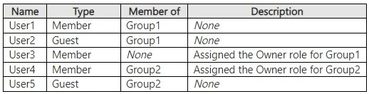
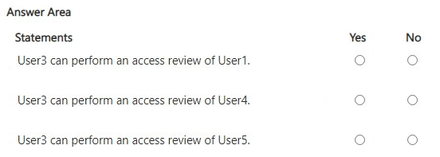
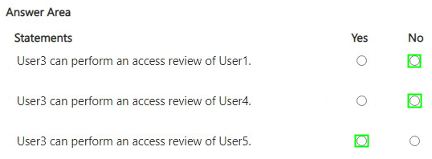

----------------------------------------

## Exam SC-300 topic 4 question 88 discussion

Actual exam question from

Microsoft's
SC-300

Question #: 88
Topic #: 4

[All SC-300 Questions]

HOTSPOT -You have a Microsoft Entra tenant that contains the identities shown in the following table.Group1 has the following configurations:• Owners: User1, User4• Members: User1, Managed2, Group2You create an access review that has the following settings:• Name: Review1• Review scope: Select Teams + Groups• Group: Group1• Scope: All users• Select reviewers: Group owner(s)The Fallback reviewers setting is NOT configured.For each of the following statements, select Yes if the statement is true. Otherwise, select No.NOTE: Each correct selection is worth one point. 
Suggested Answer: 

**Answer: **

**Timestamp: Feb. 11, 2025, 4:10 p.m.**

[View on ExamTopics](https://www.examtopics.com/discussions/microsoft/view/156362-exam-sc-300-topic-4-question-88-discussion/)

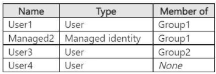
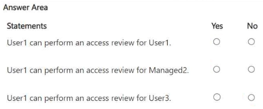
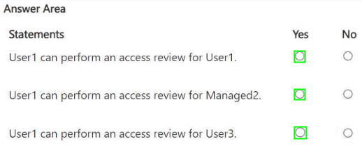

----------------------------------------

## Exam SC-300 topic 4 question 89 discussion

Actual exam question from

Microsoft's
SC-300

Question #: 89
Topic #: 4

[All SC-300 Questions]

HOTSPOT -You have a Microsoft Entra tenant that contains a user named User1.You have an Azure subscription named Sub1. User1 is assigned the Owner role for Sub1.You need to ensure that User1 can onboard Sub1 to Permissions Management. The solution must follow the principle of least privilege.Which role should you assign for Sub1, and which role should you assign to User1 for the tenant? To answer, select the appropriate options in the answer area.NOTE: Each correct selection is worth one point. 
Suggested Answer: 

**Answer: **

**Timestamp: Feb. 23, 2025, 9:34 p.m.**

[View on ExamTopics](https://www.examtopics.com/discussions/microsoft/view/157041-exam-sc-300-topic-4-question-89-discussion/)

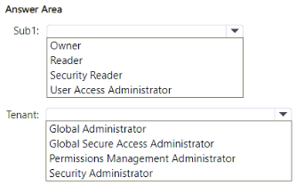
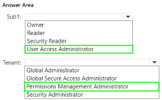

----------------------------------------

## Exam SC-300 topic 4 question 90 discussion

Actual exam question from

Microsoft's
SC-300

Question #: 90
Topic #: 4

[All SC-300 Questions]

You have 2,500 users who are assigned Microsoft Office 365 Enterprise E3 licenses. The licenses are assigned to individual users.From the Groups blade in the Microsoft Entra admin center, you assign Microsoft Office 365 Enterprise E5 licenses to a group that includes all users.You need to remove the Office 365 Enterprise E3 licenses from the users by using the least amount of administrative effort.What should you use? 
Suggested Answer: A 🗳️ 

A. the Licenses blade in the Microsoft Entra admin center

B. the Set-WindowsProductKey cmdlet

C. the Identity Governance blade in the Microsoft Entra admin center

D. the Update-MgUser cmdlet

**Answer: A**

**Timestamp: Feb. 11, 2025, 4:21 p.m.**

[View on ExamTopics](https://www.examtopics.com/discussions/microsoft/view/156364-exam-sc-300-topic-4-question-90-discussion/)

----------------------------------------

## Exam SC-300 topic 4 question 91 discussion

Actual exam question from

Microsoft's
SC-300

Question #: 91
Topic #: 4

[All SC-300 Questions]

HOTSPOT -You have an Azure subscription that is onboarded to Microsoft Entra Permissions Management.You need to perform the following actions:• Identify billable Azure resources.• Create a rule to remove permissions for unused resources.Which two options should you use in the Entra Permissions Management portal? To answer, select the appropriate options in the answer area.NOTE: Each correct selection is worth one point. 
Suggested Answer: 

**Answer: **

**Timestamp: Jan. 23, 2025, 11:33 p.m.**

[View on ExamTopics](https://www.examtopics.com/discussions/microsoft/view/155329-exam-sc-300-topic-4-question-91-discussion/)

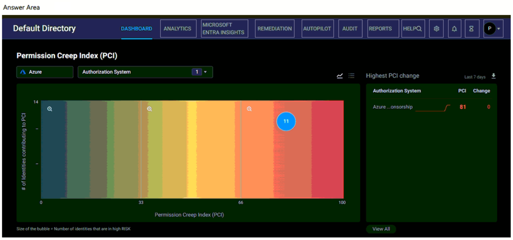
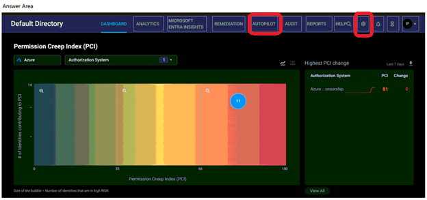

----------------------------------------

## Exam SC-300 topic 4 question 92 discussion

Actual exam question from

Microsoft's
SC-300

Question #: 92
Topic #: 4

[All SC-300 Questions]

HOTSPOT -You have an Azure subscription that is linked to a Microsoft Entra tenant. The tenant contains the identities shown in the following table.The tenant is onboarded to Permissions Management.You create the Azure resources shown in the following table.From Microsoft Entra Insights, which identity will be included in Accounts assigned to highly privileged roles, and which identity will be included in Service principals with privileged role assignments? 
Suggested Answer: 

**Answer: **

**Timestamp: Jan. 20, 2025, 2:10 p.m.**

[View on ExamTopics](https://www.examtopics.com/discussions/microsoft/view/154985-exam-sc-300-topic-4-question-92-discussion/)

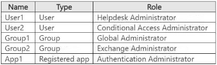
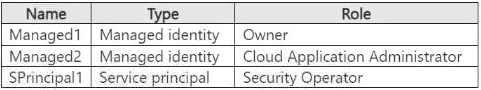
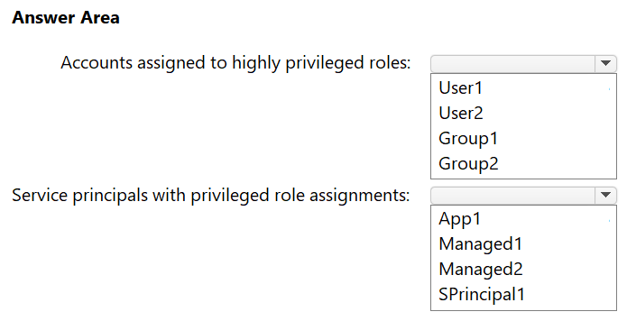
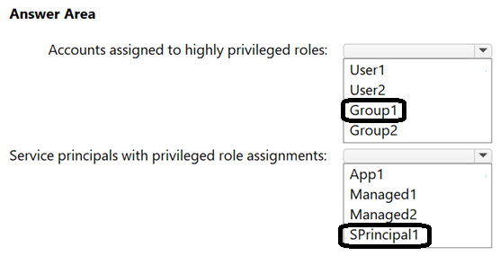

----------------------------------------

## Exam SC-300 topic 4 question 93 discussion

Actual exam question from

Microsoft's
SC-300

Question #: 93
Topic #: 4

[All SC-300 Questions]

You have a Microsoft Entra tenant that contains an access package named Package1 and a user named User1. Package1 is configured as shown in the following exhibit.You need to ensure that User1 can modify the review frequency of Package1. The solution must use the principle of least privilege.Which role should you assign to User1? 
Suggested Answer: C 🗳️ 

A. Privileged Role Administrator

B. External Identity Provider Administrator

C. Identity Governance Administrator

D. Security Administrator

**Answer: C**

**Timestamp: March 20, 2025, 12:21 a.m.**

[View on ExamTopics](https://www.examtopics.com/discussions/microsoft/view/169413-exam-sc-300-topic-4-question-93-discussion/)

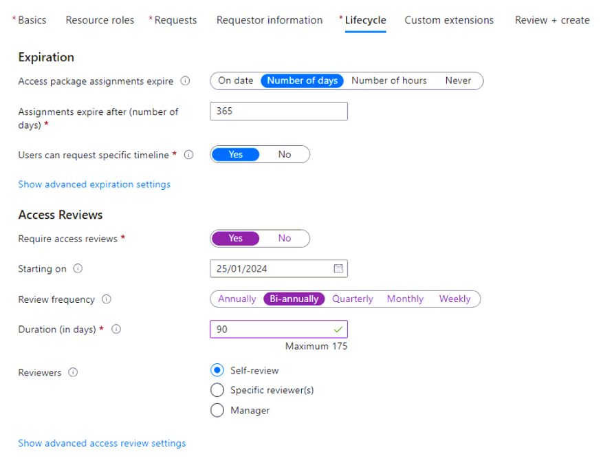

----------------------------------------

## Exam SC-300 topic 4 question 94 discussion

Actual exam question from

Microsoft's
SC-300

Question #: 94
Topic #: 4

[All SC-300 Questions]

You have a Microsoft 365 subscription that is onboarded to Microsoft Entra Permissions Management.You need to identify managed identities that are assigned permissions and remove any permissions that have been unused for 90 days. The solution must minimize administrative effort.What should you do in the Entra Permissions Management portal? 
Suggested Answer: A 🗳️ 

A. Configure an Autopilot rule.

B. Schedule a Permissions analytics report.

C. From Microsoft Entra Insights, review Service principals with privileged role assignments.

D. Run an audit query.

**Answer: A**

**Timestamp: Feb. 20, 2025, 1:28 a.m.**

[View on ExamTopics](https://www.examtopics.com/discussions/microsoft/view/156829-exam-sc-300-topic-4-question-94-discussion/)

----------------------------------------

## Exam SC-300 topic 4 question 96 discussion

Actual exam question from

Microsoft's
SC-300

Question #: 96
Topic #: 4

[All SC-300 Questions]

You have an Azure subscription that is linked to a Microsoft Entra tenant. The tenant contains the groups shown in the following table.Which groups can you manage by using Privileged Identity Management (PIM)? 
Suggested Answer: A 🗳️ 

A. Group2 only

B. Group1 and Group2 only

C. Group2 and Group4 only

D. Group1, Group2, and Group3 only

E. Group1, Group2, Group3, and Group4

**Answer: A**

**Timestamp: Feb. 23, 2025, 9:53 p.m.**

[View on ExamTopics](https://www.examtopics.com/discussions/microsoft/view/157042-exam-sc-300-topic-4-question-96-discussion/)

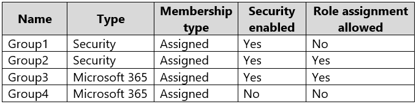

----------------------------------------

## Exam SC-300 topic 4 question 97 discussion

Actual exam question from

Microsoft's
SC-300

Question #: 97
Topic #: 4

[All SC-300 Questions]

HOTSPOT -You have a Microsoft Entra tenant that contains the users shown in the following table.The tenant contains the Microsoft 365 groups shown in the following table.You create an access review named Access1 that has the following settings:• Select what to review: Teams + Groups• Review scope: All Microsoft groups with guest users• Scope: Guest users only• Select reviewers: Users review their own accessFor each of the following statements, select Yes if the statement is true. Otherwise, select No.NOTE: Each correct selection is worth one point. 
Suggested Answer: 

**Answer: **

**Timestamp: June 14, 2025, 11:37 a.m.**

[View on ExamTopics](https://www.examtopics.com/discussions/microsoft/view/304852-exam-sc-300-topic-4-question-97-discussion/)

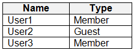
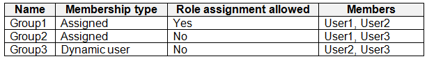
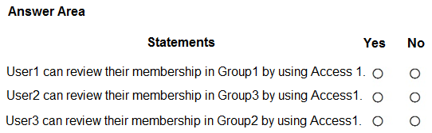
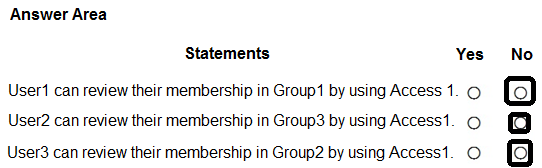

----------------------------------------

## Exam SC-300 topic 5 question 1 discussion

Actual exam question from

Microsoft's
SC-300

Question #: 1
Topic #: 5

[All SC-300 Questions]

You need to allocate licenses to the new users from ADatum. The solution must meet the technical requirements.Which type of object should you create? 
Suggested Answer: A 🗳️ 

A. a Dynamic User security group

B. a distribution group

C. an OU

D. an administrative unit

**Answer: A**

**Timestamp: Sept. 1, 2022, 6:39 a.m.**

[View on ExamTopics](https://www.examtopics.com/discussions/microsoft/view/78907-exam-sc-300-topic-5-question-1-discussion/)

----------------------------------------

## Exam SC-300 topic 5 question 2 discussion

Actual exam question from

Microsoft's
SC-300

Question #: 2
Topic #: 5

[All SC-300 Questions]

You need to sync the ADatum users. The solution must meet the technical requirements.What should you do? 
Suggested Answer: A 🗳️ 

A. From the Microsoft Azure Active Directory Connect wizard, select Customize synchronization options.

B. From PowerShell, run Set-ADSyncScheduler.

C. From PowerShell, run Start-ADSyncSyncCycle.

D. From the Microsoft Azure Active Directory Connect wizard, select Change user sign-in.

**Answer: A**

**Timestamp: Sept. 1, 2022, 6:40 a.m.**

[View on ExamTopics](https://www.examtopics.com/discussions/microsoft/view/78908-exam-sc-300-topic-5-question-2-discussion/)

----------------------------------------

## Exam SC-300 topic 5 question 3 discussion

Actual exam question from

Microsoft's
SC-300

Question #: 3
Topic #: 5

[All SC-300 Questions]

HOTSPOT -You need to meet the technical requirements for license management by the helpdesk administrators.What should you create first, and which tool should you use? To answer, select the appropriate options in the answer area.NOTE: Each correct selection is worth one point.Hot Area: 
Suggested Answer: Reference:https://docs.microsoft.com/en-us/azure/active-directory/roles/administrative-units https://docs.microsoft.com/en-us/azure/active-directory/roles/admin-units-manage 

**Answer: **

**Timestamp: Sept. 1, 2022, 6:41 a.m.**

[View on ExamTopics](https://www.examtopics.com/discussions/microsoft/view/78909-exam-sc-300-topic-5-question-3-discussion/)

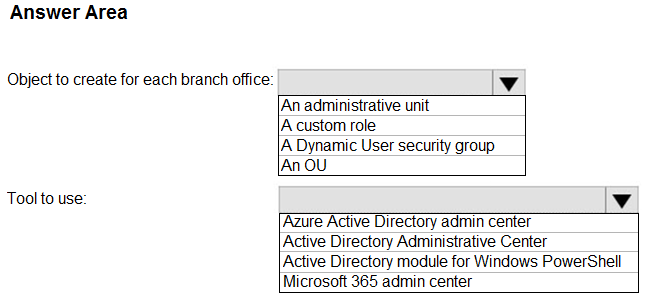
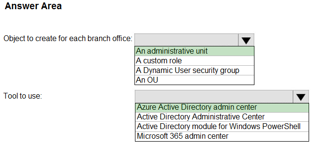

----------------------------------------

## Exam SC-300 topic 5 question 4 discussion

Actual exam question from

Microsoft's
SC-300

Question #: 4
Topic #: 5

[All SC-300 Questions]

You need to resolve the issue of the sales department users.What should you configure for the Azure AD tenant? 
Suggested Answer: A 🗳️ 

A. the Device settings

B. the Access reviews settings

C. the User settings

D. Security defaults

**Answer: A**

**Timestamp: Sept. 25, 2022, 3:41 p.m.**

[View on ExamTopics](https://www.examtopics.com/discussions/microsoft/view/83545-exam-sc-300-topic-5-question-4-discussion/)

----------------------------------------

## Exam SC-300 topic 6 question 1 discussion

Actual exam question from

Microsoft's
SC-300

Question #: 1
Topic #: 6

[All SC-300 Questions]

HOTSPOT -You need to configure the assignment of Azure AD licenses to the Litware users. The solution must meet the licensing requirements.What should you do? To answer, select the appropriate options in the answer area.NOTE: Each correct selection is worth one point.Hot Area: 
Suggested Answer: Litware recently added a custom user attribute named LWLicenses to the litware.com Active Directory forest. Litware wants to manage the assignment of AzureAD licenses by modifying the value of the LWLicenses attribute. Users who have the appropriate value for LWLicenses must be added automatically to aMicrosoft 365 group that has the appropriate licenses assigned. 

**Answer: **

**Timestamp: May 10, 2021, 7:19 a.m.**

[View on ExamTopics](https://www.examtopics.com/discussions/microsoft/view/52253-exam-sc-300-topic-6-question-1-discussion/)

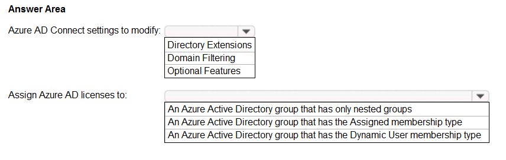
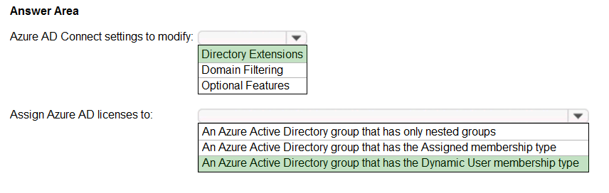

----------------------------------------

## Exam SC-300 topic 6 question 2 discussion

Actual exam question from

Microsoft's
SC-300

Question #: 2
Topic #: 6

[All SC-300 Questions]

You need to meet the authentication requirements for leaked credentials.What should you do? 
Suggested Answer: A 🗳️ 

A. Enable password hash synchronization in Azure AD Connect.

B. Configure Azure AD Password Protection.

C. Configure an authentication method policy in Azure AD.

D. Enable federation with PingFederate in Azure AD Connect.

**Answer: A**

**Timestamp: May 10, 2021, 6:47 a.m.**

[View on ExamTopics](https://www.examtopics.com/discussions/microsoft/view/52252-exam-sc-300-topic-6-question-2-discussion/)

----------------------------------------

## Exam SC-300 topic 6 question 3 discussion

Actual exam question from

Microsoft's
SC-300

Question #: 3
Topic #: 6

[All SC-300 Questions]

HOTSPOT -You need to identify which roles to use for managing role assignments. The solution must meet the delegation requirements.What should you do? To answer, select the appropriate options in the answer area.NOTE: Each correct selection is worth one point.Hot Area: 
Suggested Answer: Reference:https://docs.microsoft.com/en-us/azure/role-based-access-control/role-assignments-portal https://docs.microsoft.com/en-us/azure/active-directory/roles/permissions-reference 

**Answer: **

**Timestamp: June 4, 2021, 1:02 p.m.**

[View on ExamTopics](https://www.examtopics.com/discussions/microsoft/view/54521-exam-sc-300-topic-6-question-3-discussion/)

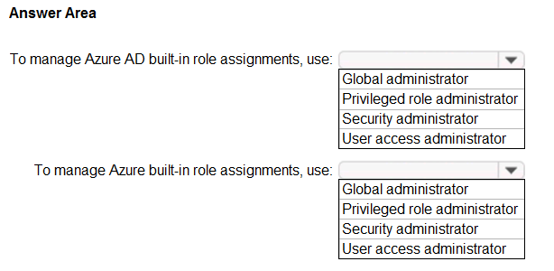
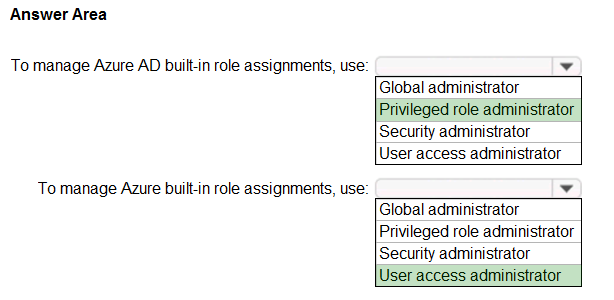

----------------------------------------

## Exam SC-300 topic 6 question 4 discussion

Actual exam question from

Microsoft's
SC-300

Question #: 4
Topic #: 6

[All SC-300 Questions]

HOTSPOT -You need to create the LWGroup1 group to meet the management requirements.How should you complete the dynamic membership rule? To answer, select the appropriate options in the answer area.NOTE: Each correct selection is worth one point.Hot Area: 
Suggested Answer: 

**Answer: **

**Timestamp: June 5, 2021, 5:25 p.m.**

[View on ExamTopics](https://www.examtopics.com/discussions/microsoft/view/54651-exam-sc-300-topic-6-question-4-discussion/)

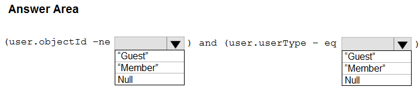
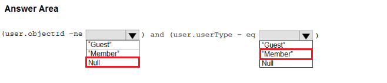

----------------------------------------

## Exam SC-300 topic 7 question 1 discussion

Actual exam question from

Microsoft's
SC-300

Question #: 1
Topic #: 7

[All SC-300 Questions]

HOTSPOT -You need to meet the technical requirements for the probability that user identities were compromised.What should the users do first, and what should you configure? To answer, select the appropriate options in the answer area.NOTE: Each correct selection is worth one point.Hot Area: 
Suggested Answer: Reference:https://docs.microsoft.com/en-us/azure/active-directory/identity-protection/concept-identity-protection-policies 

**Answer: **

**Timestamp: May 16, 2021, 9:37 p.m.**

[View on ExamTopics](https://www.examtopics.com/discussions/microsoft/view/52906-exam-sc-300-topic-7-question-1-discussion/)

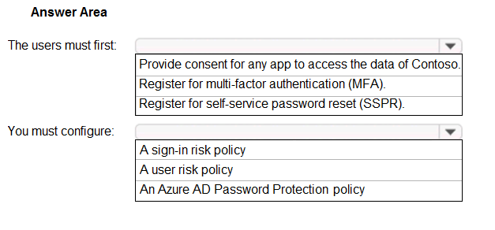
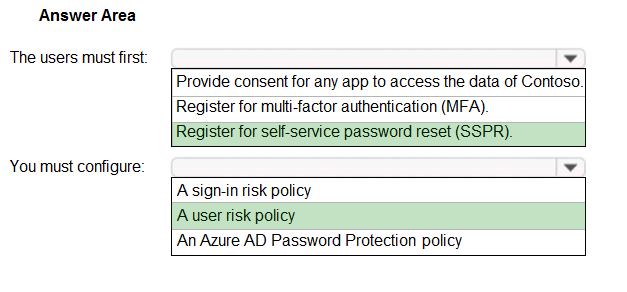

----------------------------------------

## Exam SC-300 topic 8 question 1 discussion

Actual exam question from

Microsoft's
SC-300

Question #: 1
Topic #: 8

[All SC-300 Questions]

You need to configure the MFA settings for users who connect from the Boston office. The solution must meet the authentication requirements and the access requirements.What should you include in the configuration? 
Suggested Answer: B 🗳️ 

A. named locations that have a private IP address range

B. named locations that have a public IP address range

C. trusted IPs that have a public IP address range

D. trusted IPs that have a private IP address range

**Answer: B**

**Timestamp: June 22, 2021, 1:39 a.m.**

[View on ExamTopics](https://www.examtopics.com/discussions/microsoft/view/55797-exam-sc-300-topic-8-question-1-discussion/)

----------------------------------------

## Exam SC-300 topic 8 question 2 discussion

Actual exam question from

Microsoft's
SC-300

Question #: 2
Topic #: 8

[All SC-300 Questions]

HOTSPOT -You need to support the planned changes and meet the technical requirements for MFA.Which feature should you use, and how long before the users must complete the registration? To answer, select the appropriate options in the answer area.NOTE: Each correct selection is worth one point.Hot Area: 
Suggested Answer: 

**Answer: **

**Timestamp: Sept. 2, 2022, 8:43 p.m.**

[View on ExamTopics](https://www.examtopics.com/discussions/microsoft/view/79542-exam-sc-300-topic-8-question-2-discussion/)

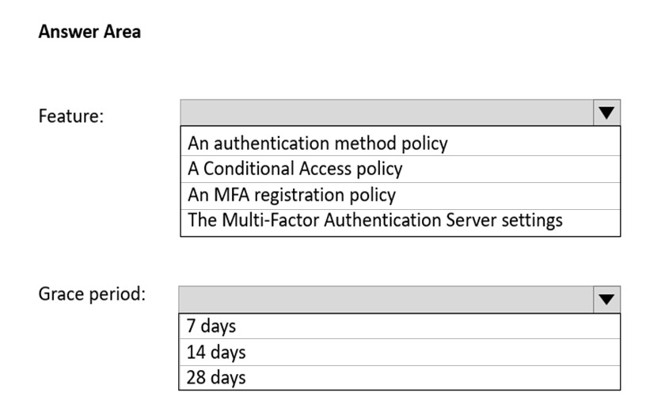
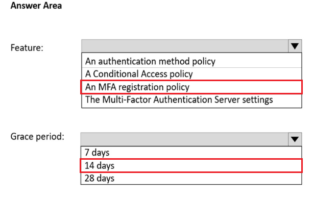

----------------------------------------

## Exam SC-300 topic 10 question 1 discussion

Actual exam question from

Microsoft's
SC-300

Question #: 1
Topic #: 10

[All SC-300 Questions]

HOTSPOT -You need to implement on-premises application and SharePoint Online restrictions to meet the authentication requirements and the access requirements.What should you do? To answer, select the appropriate options in the answer area.NOTE: Each correct selection is worth one point.Hot Area: 
Suggested Answer: Reference:https://docs.microsoft.com/en-us/sharepoint/app-enforced-restrictions https://docs.microsoft.com/en-us/azure/active-directory/conditional-access/concept-conditional-access-session 

**Answer: **

**Timestamp: July 9, 2021, 2:35 p.m.**

[View on ExamTopics](https://www.examtopics.com/discussions/microsoft/view/57535-exam-sc-300-topic-10-question-1-discussion/)

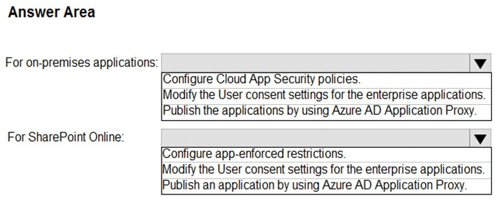
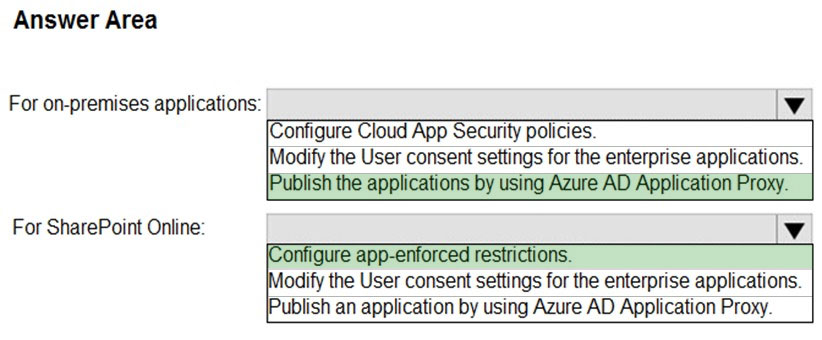

----------------------------------------

## Exam SC-300 topic 10 question 2 discussion

Actual exam question from

Microsoft's
SC-300

Question #: 2
Topic #: 10

[All SC-300 Questions]

HOTSPOT -You need to configure app registration in Azure AD to meet the delegation requirements.What should you do? To answer, select the appropriate options in the answer area.NOTE: Each correct selection is worth one point.Hot Area: 
Suggested Answer: Reference:https://docs.microsoft.com/en-us/azure/active-directory/roles/delegate-app-roles 

**Answer: **

**Timestamp: June 27, 2021, 9:35 a.m.**

[View on ExamTopics](https://www.examtopics.com/discussions/microsoft/view/56154-exam-sc-300-topic-10-question-2-discussion/)

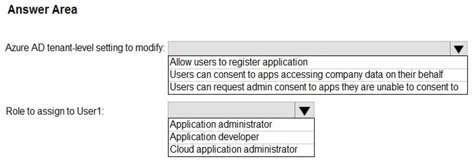
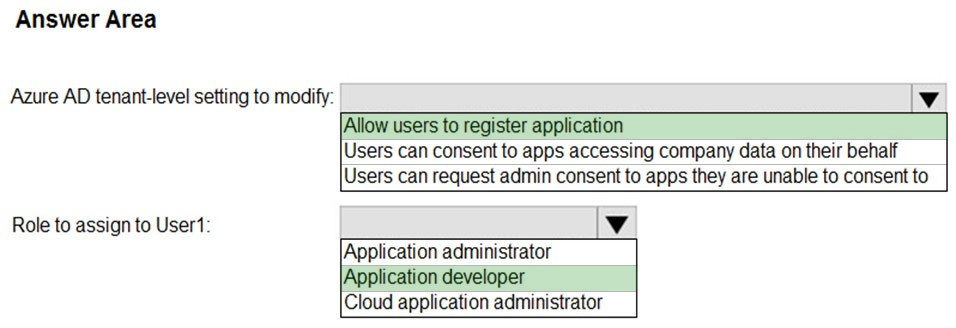

----------------------------------------

## Exam SC-300 topic 10 question 3 discussion

Actual exam question from

Microsoft's
SC-300

Question #: 3
Topic #: 10

[All SC-300 Questions]

HOTSPOT -How should the access be setup to the on-premises applications?Hot Area: 
Suggested Answer: Box 1: Server2 -Incorrect:Not Server 1: If you've deployed Azure AD Password Protection Proxy, do not install Azure AD Application Proxy and Azure AD Password Protection Proxy together on the same machine. Azure AD Application Proxy and Azure AD Password Protection Proxy install different versions of the Azure AD Connect AgentUpdater service. These different versions are incompatible when installed together on the same machine.Server1 runs the Azure AD application Proxy connector.To use Application Proxy, you need a Windows server running Windows Server 2012 R2 or later. You'll install the Application Proxy connector on the server. This connector server needs to connect to the Application Proxy services in Azure, and the on-premises applications that you plan to publish.Scenario:Requirements. Authentication Requirements include:Enforce MFA when accessing on-premises applications.Existing Environment. On-premises EnvironmentThe on-premises network contains the servers shown in the following table.Existing Environment. Identity EnvironmentThe network contains an Active Directory forest named litware.com that is linked to an Azure Active Directory (Azure AD) tenant named litware.com. Azure ADConnect uses pass-through authentication and has password hash synchronization disabled.Litware.com contains a user named User1 who oversees all application development.Box 2: DC1 -The Azure AD Password Protection proxy service is typically on a member server in your on-premises AD DS environment. Once installed, the Azure ADPassword Protection proxy service communicates with Azure AD to maintain a copy of the global and customer banned password lists for your Azure AD tenant.Reference:https://docs.microsoft.com/en-us/azure/active-directory/authentication/howto-password-ban-bad-on-premises-deploy https://docs.microsoft.com/en-us/azure/active-directory/app-proxy/application-proxy-add-on-premises-application 

**Answer: **

**Timestamp: Sept. 26, 2022, 8:41 a.m.**

[View on ExamTopics](https://www.examtopics.com/discussions/microsoft/view/83658-exam-sc-300-topic-10-question-3-discussion/)

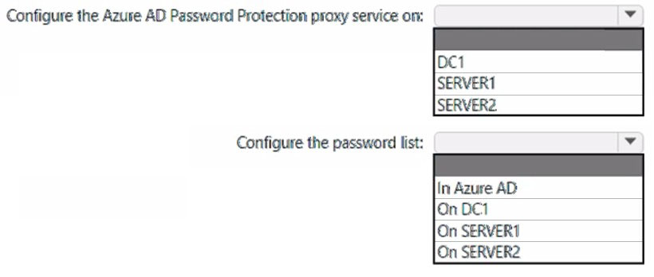
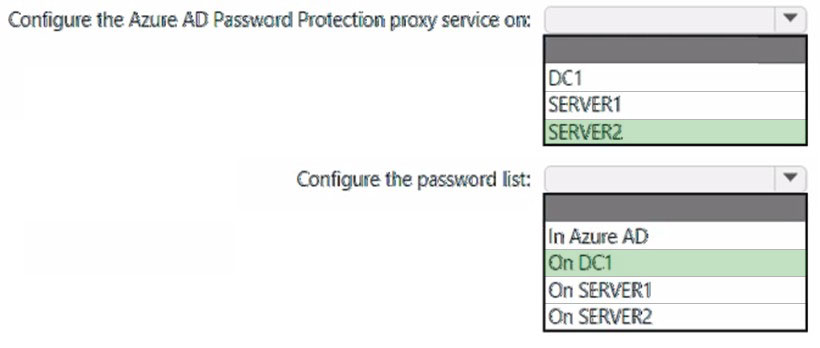
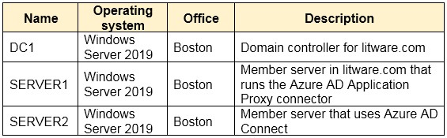

----------------------------------------

## Exam SC-300 topic 11 question 1 discussion

Actual exam question from

Microsoft's
SC-300

Question #: 1
Topic #: 11

[All SC-300 Questions]

You create a Log Analytics workspace.You need to implement the technical requirements for auditing.What should you configure in Azure AD? 
Suggested Answer: B 🗳️ 

A. Company branding

B. Diagnostics settings

C. External Identities

D. App registrations

**Answer: B**

**Timestamp: May 18, 2021, 10:12 p.m.**

[View on ExamTopics](https://www.examtopics.com/discussions/microsoft/view/53058-exam-sc-300-topic-11-question-1-discussion/)

----------------------------------------

## Exam SC-300 topic 11 question 2 discussion

Actual exam question from

Microsoft's
SC-300

Question #: 2
Topic #: 11

[All SC-300 Questions]

HOTSPOT -You need to implement the planned changes and technical requirements for the marketing department.What should you do? To answer, select the appropriate options in the answer area.NOTE: Each correct selection is worth one point.Hot Area: 
Suggested Answer: Reference:https://docs.microsoft.com/en-us/azure/active-directory/governance/entitlement-management-organization 

**Answer: **

**Timestamp: May 18, 2021, 10:13 p.m.**

[View on ExamTopics](https://www.examtopics.com/discussions/microsoft/view/53059-exam-sc-300-topic-11-question-2-discussion/)

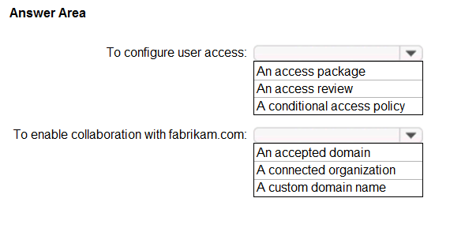
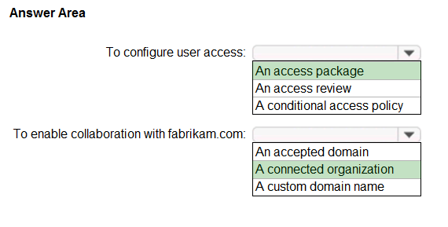

----------------------------------------

## Exam SC-300 topic 11 question 3 discussion

Actual exam question from

Microsoft's
SC-300

Question #: 3
Topic #: 11

[All SC-300 Questions]

You need to meet the planned changes for the User administrator role.What should you do? 
Suggested Answer: D 🗳️ 

A. Create an access review.

B. Create an administrative unit.

C. Modify Active assignments.

D. Modify Role settings.

**Answer: D**

**Timestamp: June 10, 2021, 8:37 a.m.**

[View on ExamTopics](https://www.examtopics.com/discussions/microsoft/view/55041-exam-sc-300-topic-11-question-3-discussion/)

----------------------------------------

## Exam SC-300 topic 11 question 4 discussion

Actual exam question from

Microsoft's
SC-300

Question #: 4
Topic #: 11

[All SC-300 Questions]

You need to modify the settings of the User administrator role to meet the technical requirements.Which two actions should you perform for the role? Each correct answer presents part of the solution.NOTE: Each correct selection is worth one point. 
Suggested Answer: AD 🗳️ 

A. Select Require justification on activation.

B. Select Require ticket information on activation.

C. Modify the Expire eligible assignments after setting.

D. Set all assignments to Eligible.

E. Set all assignments to Active.

**Answer: A**

**Timestamp: Sept. 16, 2022, 8:10 a.m.**

[View on ExamTopics](https://www.examtopics.com/discussions/microsoft/view/82384-exam-sc-300-topic-11-question-4-discussion/)

----------------------------------------

## Exam SC-300 topic 11 question 5 discussion

Actual exam question from

Microsoft's
SC-300

Question #: 5
Topic #: 11

[All SC-300 Questions]

You need to resolve the issue of the guest user invitations.What should you do for the Azure AD tenant? 
Suggested Answer: D 🗳️ 

A. Configure the Continuous access evaluation settings.

B. Configure a Conditional Access policy.

C. Configure the Access reviews settings.

D. Modify the External collaboration settings.

**Answer: D**

**Timestamp: Sept. 16, 2022, 1:46 a.m.**

[View on ExamTopics](https://www.examtopics.com/discussions/microsoft/view/82365-exam-sc-300-topic-11-question-5-discussion/)

----------------------------------------

## Exam SC-300 topic 11 question 6 discussion

Actual exam question from

Microsoft's
SC-300

Question #: 6
Topic #: 11

[All SC-300 Questions]

You need to sync the ADatum users. The solution must meet the technical requirements.What should you do? 
Suggested Answer: A 🗳️ 

A. From the Microsoft Azure Active Directory Connect wizard, select Customize synchronization options.

B. From PowerShell, run Set-ADSyncScheduler.

C. From PowerShell, run Start-ADSyncSyncCycle.

D. From the Microsoft Azure Active Directory Connect wizard, select Change user sign-in.

**Answer: A**

**Timestamp: Oct. 8, 2022, 12:12 p.m.**

[View on ExamTopics](https://www.examtopics.com/discussions/microsoft/view/84692-exam-sc-300-topic-11-question-6-discussion/)

----------------------------------------

## Exam SC-300 topic 12 question 1 discussion

Actual exam question from

Microsoft's
SC-300

Question #: 1
Topic #: 12

[All SC-300 Questions]

You need to configure the detection of multi-staged attacks to meet the monitoring requirements.What should you do? 
Suggested Answer: A 🗳️ 

A. Customize the Microsoft Sentinel rule logic.

B. Create a workbook.

C. Add Microsoft Sentinel data connectors.

D. Add an Microsoft Sentinel playbook.

**Answer: A**

**Timestamp: Sept. 26, 2022, 5:35 p.m.**

[View on ExamTopics](https://www.examtopics.com/discussions/microsoft/view/83696-exam-sc-300-topic-12-question-1-discussion/)

----------------------------------------

## Exam SC-300 topic 12 question 2 discussion

Actual exam question from

Microsoft's
SC-300

Question #: 2
Topic #: 12

[All SC-300 Questions]

You need to track application access assignments by using Identity Governance. The solution must meet the delegation requirements.What should you do first? 
Suggested Answer: C 🗳️ 

A. Modify the User consent settings for the enterprise applications.

B. Create a catalog.

C. Create a program.

D. Modify the Admin consent requests settings for the enterprise applications.

**Answer: C**

**Timestamp: Sept. 8, 2021, 1:47 p.m.**

[View on ExamTopics](https://www.examtopics.com/discussions/microsoft/view/61709-exam-sc-300-topic-12-question-2-discussion/)

----------------------------------------

